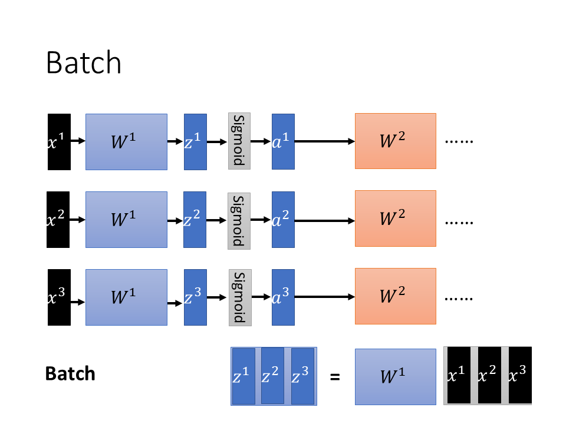
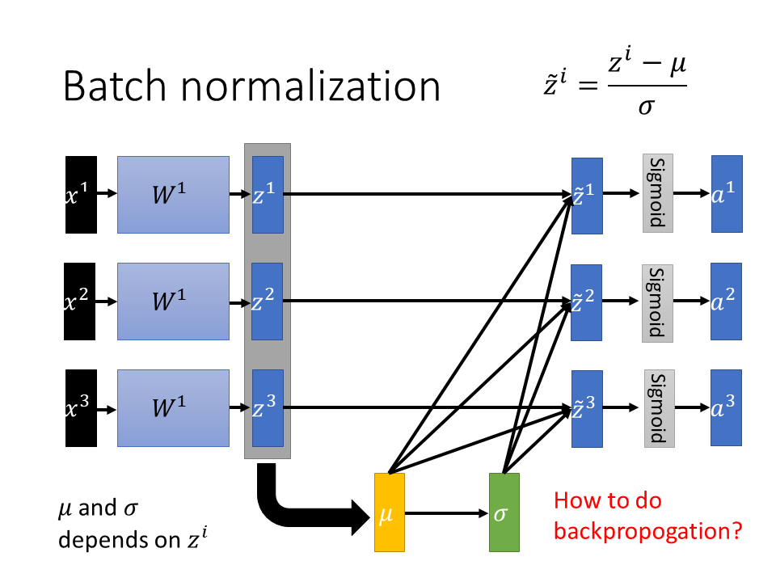
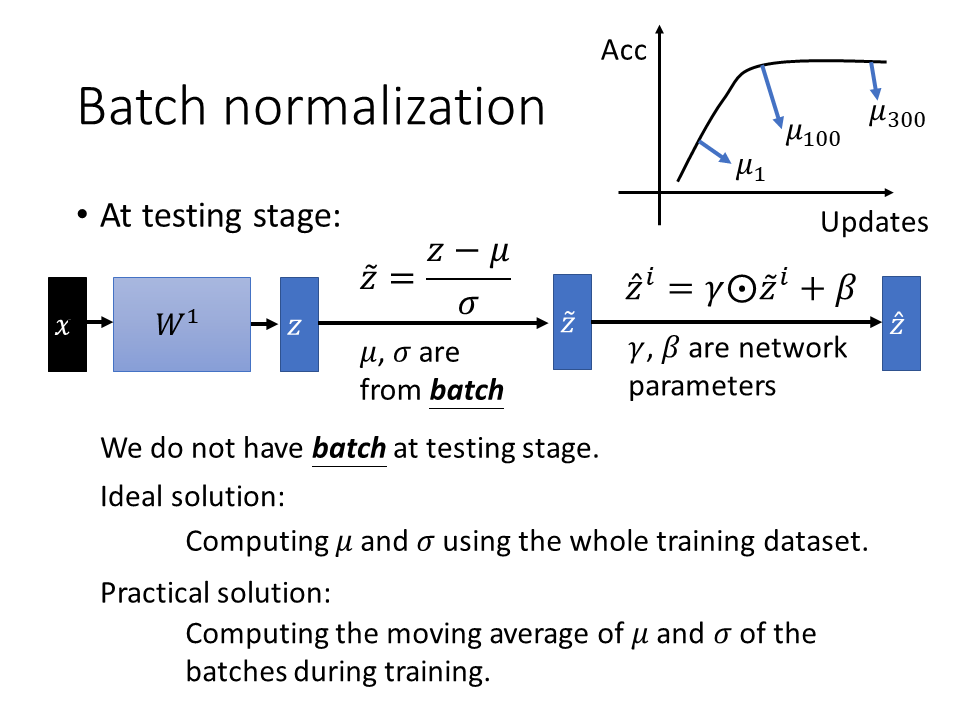
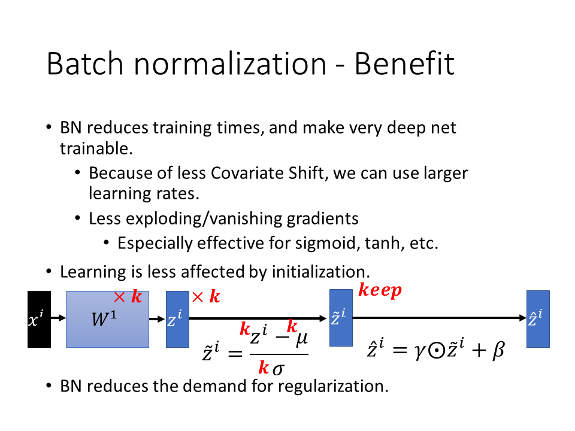

# 深度学习基础知识

## Batch Normalization

这篇是一篇可以参考的很好的知乎文章：[详解深度学习中的Normalization，不只是BN](https://zhuanlan.zhihu.com/p/33173246)

​	深度神经网络的拟合能力很强，很多人担心会很容易产生过拟合的问题。实际上，深度神经网络并不是容易过拟合，而是很难拟合，换句话说，就是很难训练，loss很难降低。所以需要很多的训练技巧来解决难训练的问题，今天这里主要讲Batch normalization(BN)来解决训练难的问题。

​	首先要讲的是Batch Normalizaiton。在讲BN之前，首先讲一下特征标准化。不管是传统的机器学习还是深度学习，我们都会对输入做特征的标准化。特征的标准化是针对每个特征来做的，分别计算特征的均值和标准差，然后通过标准化公式可以计算出标准化后的值。

​	那么，为什么要对输入做标准化呢？举个例子，如果输入的不同特征的尺度差别很大，比如$x_1$是1,2...，但是$x_2$是100,200...，如果不对它们做标准化，很可能导致损失函数曲面的等高线是一个长椭圆形状的，像一艘船。这种情况下，用梯度下降来优化损失函数的话可能会走弯路，收敛速度变慢，如下左图。相反，如果做了特征的标准化，那么损失函数曲面的等高线会变得更圆，这时候用梯度下降方法来训练，走的路更直，因此收敛速度会变快。总之，对输入做标准化是有利于训练的。

​	对于神经网络来说，还有很多中间的层，中间的层会作为下一层的输入。既然我们对网络的输入需要做标准化，一个很自然的疑问就是，是否要对中间的层也做标准化呢？假设不做标准化，如下图，在训练过程中，layer1的参数变化，会导致layer1的输出发生变化，相对应的，layer2的输入的分布也就发生变化，换句话说ayer2的输入分布是取决于layer1的。这导致layer2的参数更新需要根据layer1的输出分布进行调整，这会不利于参数的更新，导致训练变得很困难。我们把这个问题称为internal covariate shift。

​	论文还通过sigmoid的例子来解释这个问题：

> 假设网络激活层采用sigmoid激活函数，z = g(wu + b), 其中，u是网络层输入，w和b是要学习的网络参数，g(x) = 1/(1 + exp(-x))。可以看出，当|x|增加时，g的导函数g'趋向于0。这意味着对于所有的变量值x=wu+b,当|x|值很大时，对应输入值u的梯度将会消失，降低了收敛速度，使得训练过程变慢。而由于x的值受w、b以及之前层的参数的影响，训练过程中这些参数不断改变，导致x的值落入饱和区域（即导数为0），从而降低了收敛速度。这种现象随着网络层数变多变得更加严重。这个问题，可以通过使用ReLU=max(x,0)替代sigmoid激活函数、合理设定初始化值以及使用较小的学习率来解决。然而，如果我们能够保证在训练过程中，网络层输入的分布是稳定的，表面输入值落入饱和区域，那么就能有效加速训练过程。

​	这个问题可以通过设置更小的学习率来缓解，但是相应的训练速度就变慢了。那有没有更好的办法来解决呢？那就是对每一层都做batch normalization。

​	那么怎么做BN呢，实际上很简单，就是对Z(Z=WX)做标准化。注意，BN不能用在batch很小的情况下。考虑一个极端的例子，如果batch size=1，那么均值和标准差都是0了，这样就没有意义。但是，对于图像而言，图像做标准化通常是对三个通道来做的，那么这时候即使图像batch=1，也是可以做标准化的，注意这里的区别。

​	另外，需要注意的是，做bn可能导致改变层的表达能力，比如说，对于sigmoid激活来说，做完BN再送入sigmoid，可能导致变成线性激活（因为sigmoid在输入很小的时候是接近线性的）。为了解决这个问题，又做了一个线性映射，即将bn的结果乘以γ再加上β。其中γ和β是网络要学的参数。实际上，我们发现如果γ学成了σ，β学成了μ，这个时候就相当于没有做BN，因为已经还原了，所以不用担心BN会带来其他的影响，因为大不了就学成没有做BN的样子。注意，在实际的操作中，我们对γ初始化为1，对β初始化为0，也就是说，如果需要γ和β发挥作用的话那么它们就可以更新，如果不发生作用的话，那么它们实际上就不用更新。

​	以上都是说训练阶段，那么测试阶段要怎么做？测试的时候可能只有一个样本，这个时候怎么算batch的均值和标准差？很简单，在训练的时候记录下每个batch的均值和标准差，然后最终求个均值就好了。当然，这里不是简单的这么做，还加了一个衰减参数，也就是说之前batch的均值和标准差会没有那么重要一点，因为一开始网络训练的时候，网络参数还距离最优的参数有一定的距离，这时候算出来的均值和标准差不是那么好的。因此他们的权重就会比较小一点，这个也很符合直觉。

总结一下，BN带来了什么好处呢？有几点。

1. 使收敛速度变快了，使深度网络训练变得更加容易。

2. 梯度消失和爆炸的问题得到更好的解决。对sigmod，tanh激活函数来说尤其如此。

3. 可以更加随意的设置学习率，设大一点影响也没那么大。

4. 网络训练队初始化的依赖更小了。因此你对参数乘以一个倍数，它都会被标准化消除。

5. 额外的，BN还带来了正则化的一些效果。

   ​

   

   

   ​

