# 深度学习优化方法

参考：

1. [An overview of gradient descent optimization algorithms ](http://ruder.io/optimizing-gradient-descent/)
2. [梯度下降优化算法综述（1的翻译版本）](https://blog.csdn.net/google19890102/article/details/69942970)
3. [深度学习最全优化方法总结比较（SGD，Adagrad，Adadelta，Adam，Adamax，Nadam）](https://zhuanlan.zhihu.com/p/22252270)
4. [Adam那么棒，为什么还对SGD念念不忘系列文章](https://zhuanlan.zhihu.com/p/32230623)
5. [Coursera吴恩达《优化深度神经网络》课程笔记（2）-- 优化算法](https://blog.csdn.net/red_stone1/article/details/78348753)

## 一、基础概念：滑动平均

### 1. 概念

​	以下的很多优化方法都需要用到滑动平均（moving average）的方法。所以先在这里介绍一下这个滑动平均的概念。

​	滑动平均又可以叫做指数加权平均（exponentially weighted averages），它是一种求平均的方法。为了更好地理解这个概念，我们先来举个例子。

​	假设我们现在知道了伦敦一年来每天的温度记录，如下图。看上去，温度数据似乎有noise，而且抖动较大。如果我们希望看到半年内气温的整体变化趋势，可以通过移动平均（moving average）的方法来对每天气温进行平滑处理。

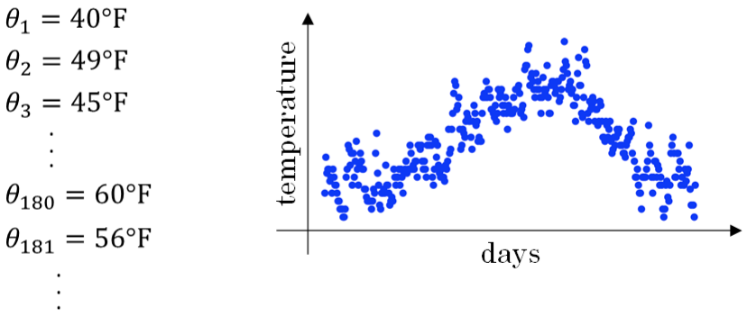

​	

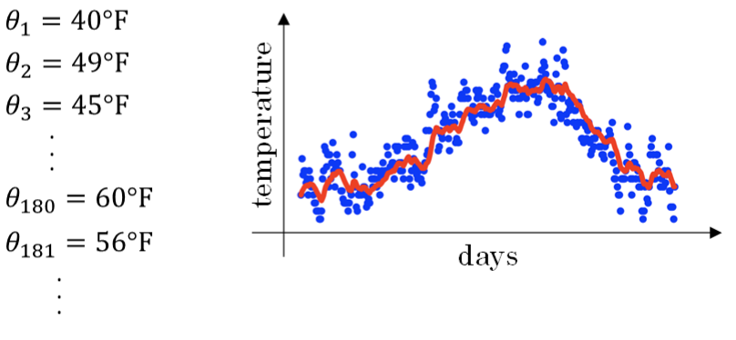

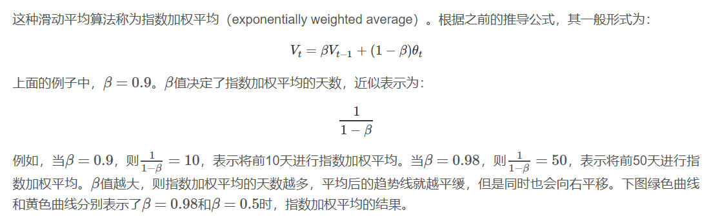

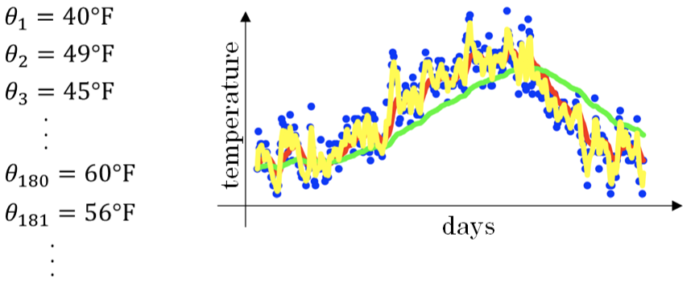

我们发现，更大的beta值得到的曲线会更为平坦，出现延迟延迟的效果。这很容易理解，因为更大的beta平均了更多过去的值。而beta值越小，考虑过去的值越少，因此曲线会变得很noise。

### 2. 理解exponentially weighted averages

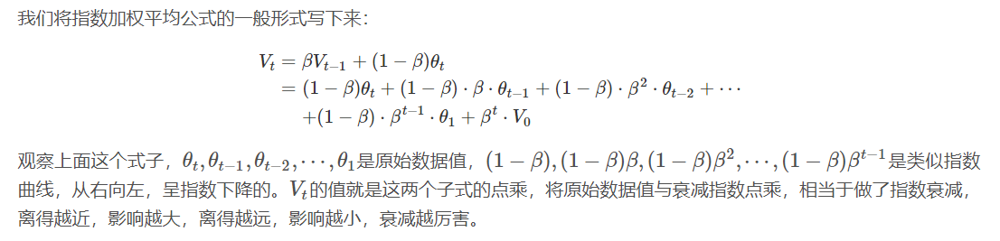

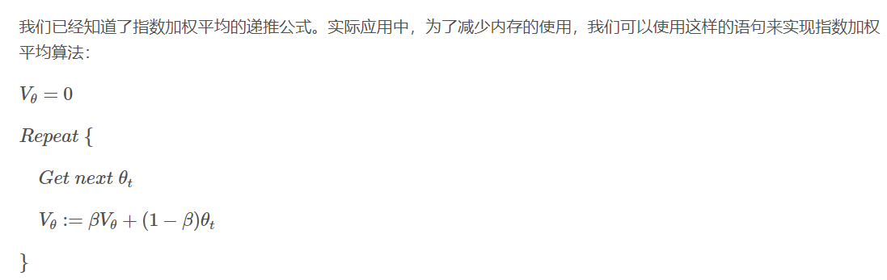

### 3. 偏差校正（Bias correction）

上文中提到当$β=0.98$时，指数加权平均结果如下图绿色曲线所示。但是实际上，真实曲线如紫色曲线所示。

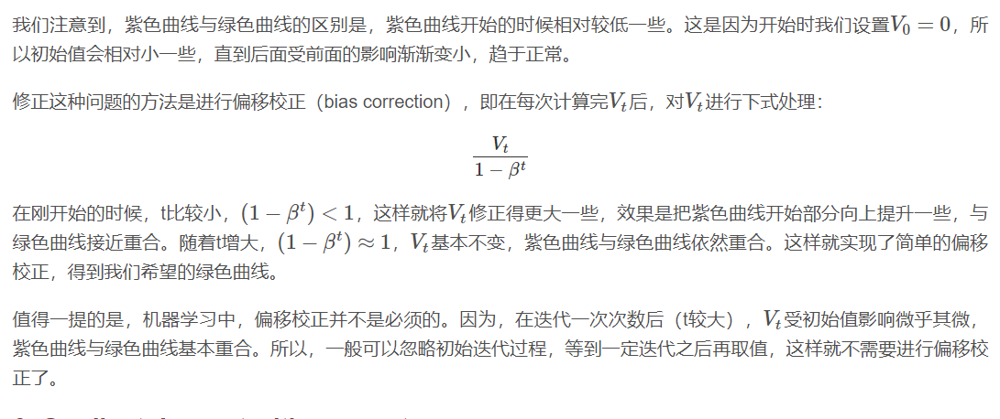

## 二、基础的gradient descent方法

### 1. Batch gradient descent

​	批量梯度下降没什么好说的了，是最基础的优化方法。直接看下面的算法就好了。

> 注意：量指的是全部样本，而不是部分。部分的话就是mini-batch了。

优点：因为计算了算有样本，因此梯度是很稳定的。

缺点：需要计算全部样本构成的损失函数的梯度，计算量实在太大了，现实中在大样本量的情况下是很难做到的。

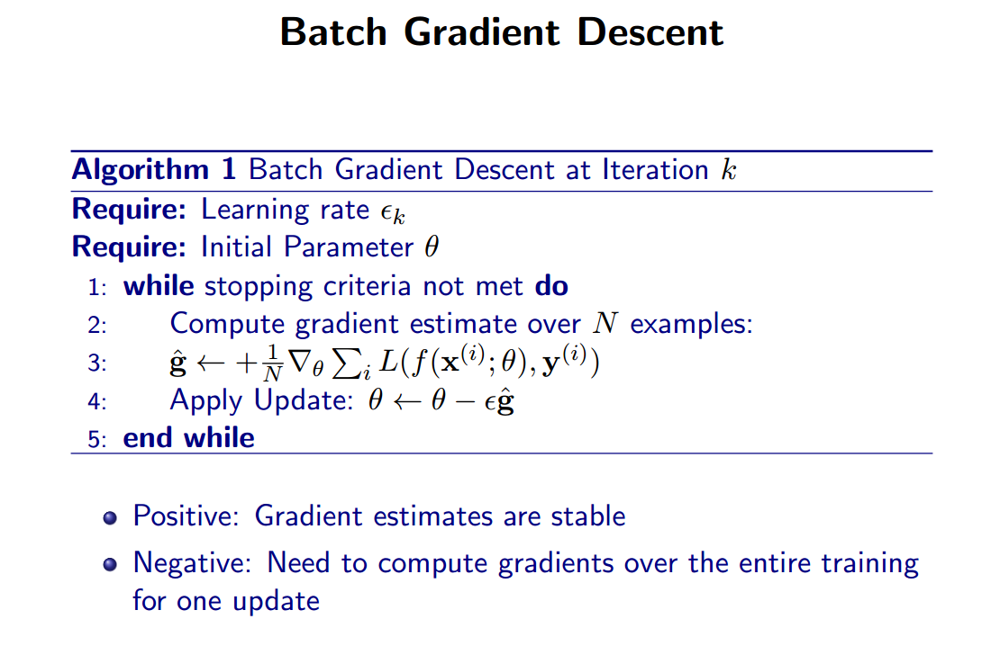

批量梯度下降的图解如下：

### 2. Mini-batch gradient descent

​	既然批量梯度下降方法用到了全部样本训练非常耗时和耗内存，那么可以考虑小批量随机下降。使用Mini-batch gradient descent，随着在不同的mini-batch上迭代训练，其cost不是单调下降，而是受类似noise的影响，出现振荡。但整体的趋势是下降的，最终也能得到较低的cost值。

​	之所以出现细微振荡的原因是不同的mini-batch之间是有差异的，出现细微振荡是正常的。

优点：计算代价小。在参数设置合理的情况下是可以收敛的。

缺点：梯度值可能会很多噪声，也就是梯度会不稳定。可以通过增大batch size来缓解。

### 3. Stochastic gradient descent

​	小批量梯度下降用到了小批量的样本，那能不能更加极端一点只用一个样本能，答案是可以的，那就是随机梯度下降。我们来比较一下Batch gradient descent和Stachastic gradient descent的梯度下降曲线。如下图所示，蓝色的线代表Batch gradient descent，紫色的线代表Stachastic gradient descent。Batch gradient descent会比较平稳地接近全局最小值，但是因为使用了所有m个样本，每次前进的速度有些慢。Stachastic gradient descent每次前进速度很快，但是路线曲折，有较大的振荡，最终会在最小值附近来回波动，难以真正达到最小值处。而且在数值处理上就不能使用向量化的方法来提高运算速度。

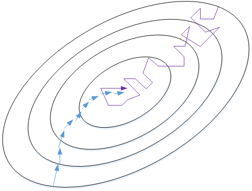

​	实际使用中，mini-batch size不能设置得太大（Batch gradient descent），也不能设置得太小（Stachastic gradient descent）。这样，相当于结合了Batch gradient descent和Stachastic gradient descent各自的优点，既能使用向量化优化算法，又能叫快速地找到最小值。mini-batch gradient descent的梯度下降曲线如下图绿色所示，每次前进速度较快，且振荡较小，基本能接近全局最小值。

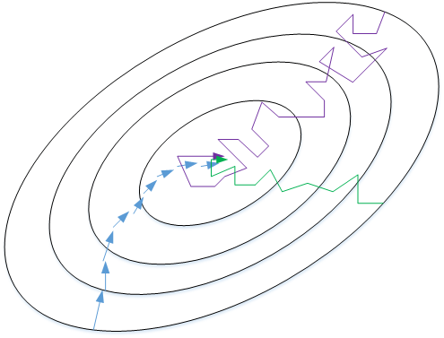

​	一般来说，如果总体样本数量m不太大时，例如m≤2000m≤2000，建议直接使用Batch gradient descent。如果总体样本数量m很大时，建议将样本分成许多mini-batches。推荐常用的mini-batch size为64,128,256,512。这些都是2的幂。之所以这样设置的原因是计算机存储数据一般是2的幂，这样设置可以提高运算速度。

### 总结

mini-batch 梯度下降方法，不能总是确保收敛。

1. 选择一个大小合适的学习率非常困难。太小的学习率收敛速度太慢，但是太大的学习率可能致使损失越过最小值，从而导致不收敛。
2. 对所有的参数都采用相同的学习率进行更新。**如果数据是稀疏的或者特征有不同的出现频率**(这个暂时不理解)，我们或许并不想对参数进行相同学习率的更新。
3. 在神经网络的优化中容易陷入局部最小值。不过有研究认为神将网络并不容易出现局部最小值（所有的参数的梯度同时为0在概率上出现的机会不大），而是容易出现鞍点。鞍点附近各参数的梯度都接近0，这使得SGD很难逃离鞍点。

为了解决以上问题，有很多优化方法出现。

## 三、基于动量的优化方法

### 4. Momentum

​	momentum是一种可以加速SGD的方法。该部分将介绍动量梯度下降算法，其速度要比传统的梯度下降算法快很多。做法是在每次训练时，对梯度进行指数加权平均处理，然后用得到的梯度值更新权重。

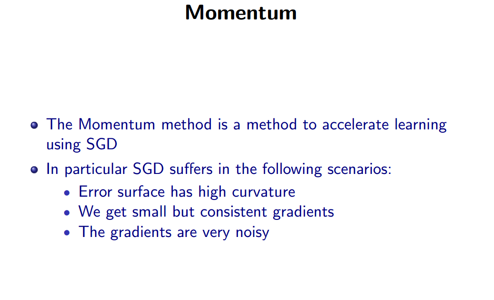

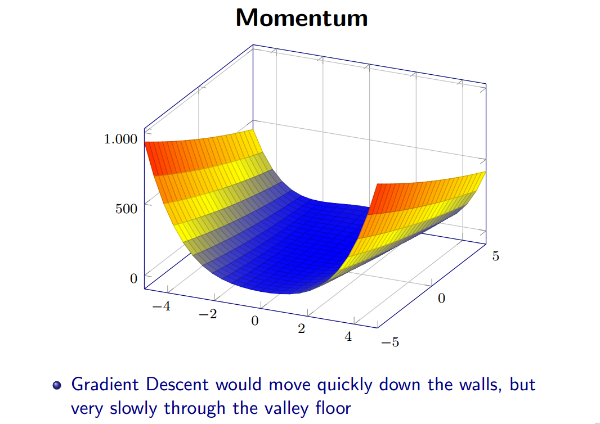

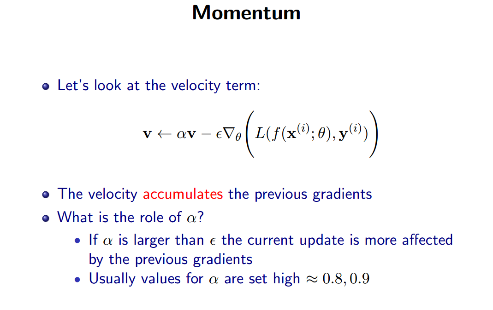

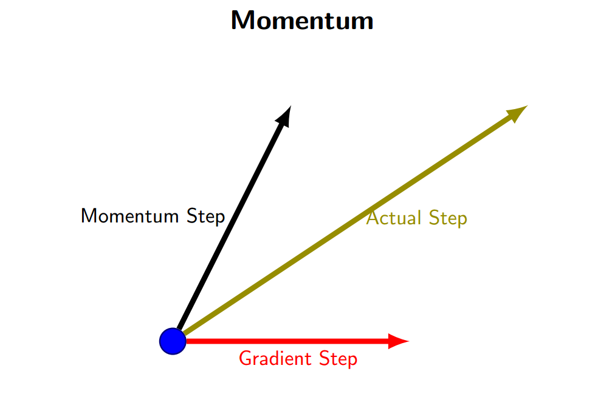

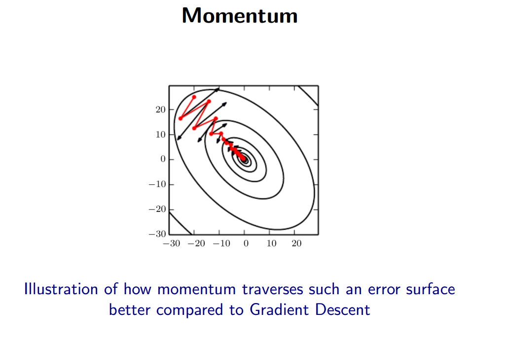

参考：[路遥知马力——Momentum](https://zhuanlan.zhihu.com/p/21486826)

​	考虑一个这样的问题，如图，如果目标函数的等高线是下面船一样的形状，那么，在x和y方向上的梯度是差别很大的，x方向上梯度小，y方向上梯度大。在这种各维度的梯度大小差距比较大的情况下，如果使用SGD方法，那么很可能导致下降方向是震荡的。为什么？因为x方向梯度小，那么这个方向的步子就迈得很小，但是y方向上的梯度很大，那么步子迈得就很大，综合起来就是一个震荡的下降路径。

$$
没有动量
$$

$$
有动量
$$
​	震荡导致下降的速度变得很慢。那有什么办法解决这个问题呢？通过动量的方法。动量方法的思想很简单，就是将之前的梯度（这里还乘以了一个衰减因子γ来削弱之前的梯度的作用）都保存下来，加到当前的梯度。

通常，这个γ值会设置为0.9或者更小的值。

​	用一个形象的例子来解释动量方法的作用。假设现在把球推下山。球在下山时积聚动量，在途中变得越来越快，球最终会因为空气阻力停下来（空气阻力，即γ＜1）。参数更新也类似：对于梯度方向一致的维度，动量会逐渐累积，对于梯度改变方向的维度，梯度会减少。最终，可以更快收敛并且减少振荡。如图所示，每一次的下降只会在以下三个方向进行：

- 沿-x方向滑行
- 沿+y方向滑行
- 沿-y方向滑行

我们可以想象到，当使用了动量后，实际上沿-y和+y方向的两个力可以相互抵消，而-x方向的力则会一直加强，这样会在y方向打转，但是y方向的力量会越来越小，但是他在-x方向的速度会比之前快不少！

**特点：**

- 下降初期时，使用上一次参数更新，下降方向一致，乘上较大的$γ$能够进行很好的加速 。

- 下降中后期时，在局部最小值来回震荡的时候，$gradient\to0$，累积的动量跳有望帮助跳出陷阱 。

- 在梯度改变方向的时候，能够减少更新。

  总而言之，momentum项能够在相关方向加速SGD，抑制振荡，从而加快收敛。

### 5. Nesterov  

nesterov项在梯度更新时做一个校正，避免前进太快，同时提高灵敏度。所以，加上nesterov项后，梯度在大的跳跃后，进行计算对当前梯度进行校正。如下图：

​	momentum首先计算一个梯度(短的蓝色向量)，然后在加速更新梯度的方向进行一个大的跳跃(长的蓝色向量)，nesterov项首先在之前加速的梯度方向进行一个大的跳跃(棕色向量)，计算梯度然后进行校正(绿色梯向量) 

​	

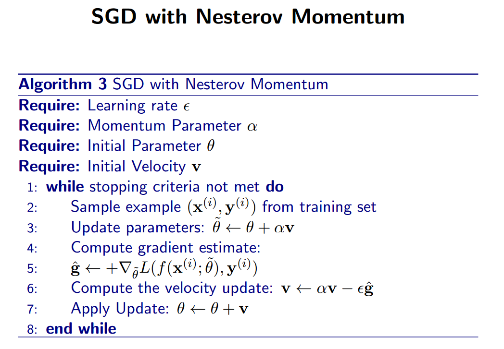

##四、自适应学习率的方法

​	其实，momentum项和nesterov项都是为了使梯度更新更加灵活，对不同情况有针对性。但是，人工设置一些学习率总还是有些生硬，接下来介绍几种自适应学习率的方法 。

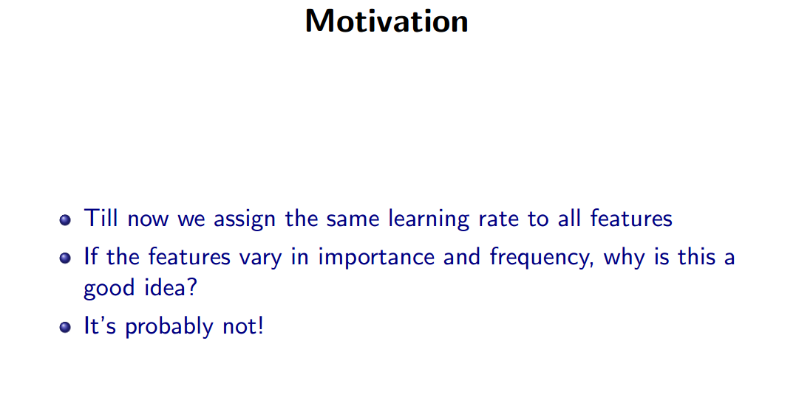

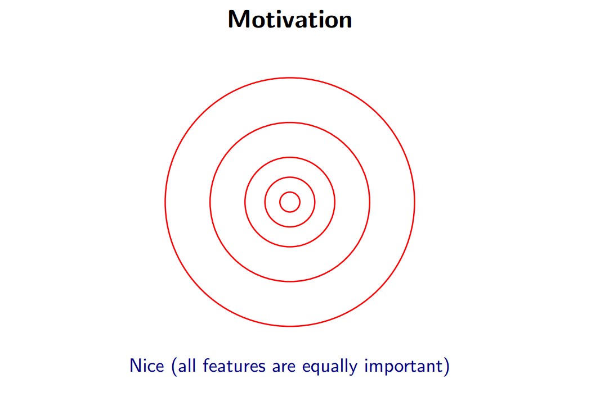

### 6.Adagrad

参考：[Deep Learning 最优化方法之AdaGrad](https://zhuanlan.zhihu.com/p/29920135)

首先我们来看一下AdaGrad算法：

​	我们可以看出该优化算法与普通的sgd算法差别就在于标黄的哪部分，采取了累积平方梯度。简单来讲，设置全局学习率之后，每次通过逐参数的全局学习率除以历史梯度平方和的平方根，使得每个参数的学习率不同。

**作用**

​	起到的效果是在参数梯度平缓的方向，迈的步子会更大（因为平缓，所以历史梯度平方和较小，对应学习率较小），而参数梯度陡峭的方向学习率会变小。这样会加快训练速度？

**例子**

​	下面通过例子讲解一下。假设我们现在采用的优化算法是最普通的梯度下降法mini-batch。它的移动方向如下面蓝色所示：

​	假设我们现在就只有两个参数$w,b$，我们从图中可以看到在$b$方向走的比较陡峭，而我们采取AdaGrad算法之后，我们在算法中使用了累积平方梯度$r=:r + g.g$。从上图可以看出在b方向上的梯度g要大于在w方向上的梯度。那么在下次计算更新的时候，$r$是作为分母出现的，越大的反而更新越小，越小的值反而更新越大，那么后面的更新则会像下面绿色线更新一样，明显就会好于蓝色更新曲线。

**这就是AdaGrad优化算法的直观好处。**

特点：

**特点：**

- 前期$g_t$较小的时候， 能够放大梯度 
- 后期$g_t$较大的时候，能够约束梯度 
- 适合处理稀疏梯度(这个不理解)

缺点：

- 由公式可以看出，仍依赖于人工设置一个全局学习率 
- 学习率设置过大的话，对梯度的调节太大 
- 中后期，分母上梯度平方的累加将会越来越大，使$gradient\to0$，使得训练提前结束 

### 7.RMSProp

AdaGrad的问题就是，后期梯度可能趋向于0，因为梯度是不断累加的。所以一个很自然的想法就是添加梯度的衰减。

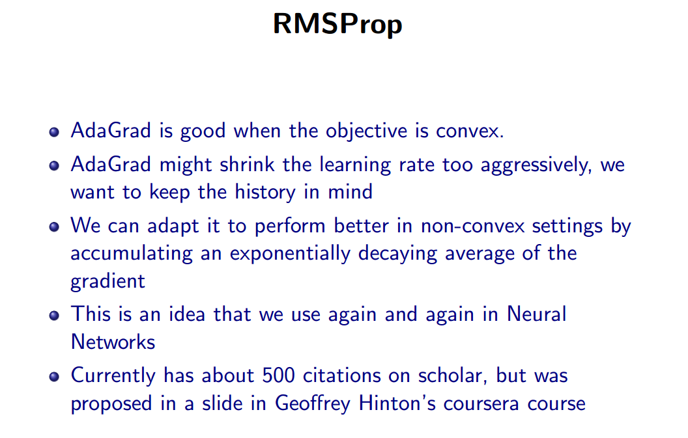

- 其实RMSprop依然依赖于全局学习率 
- RMSprop算是Adagrad的一种发展，和Adadelta的变体，效果趋于二者之间
- 适合处理非平稳目标- 对于RNN效果很好 

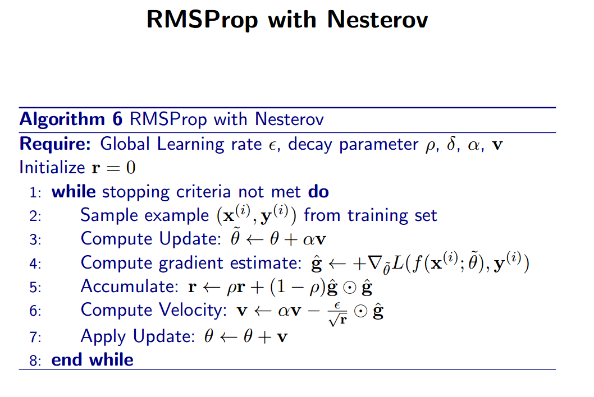

## 五、综合momentum和自适应学习率的方法

### 8.Adam

Adam（Adaptive Moment Estimation）算法结合了momentum梯度下降算法和RMSprop算法。

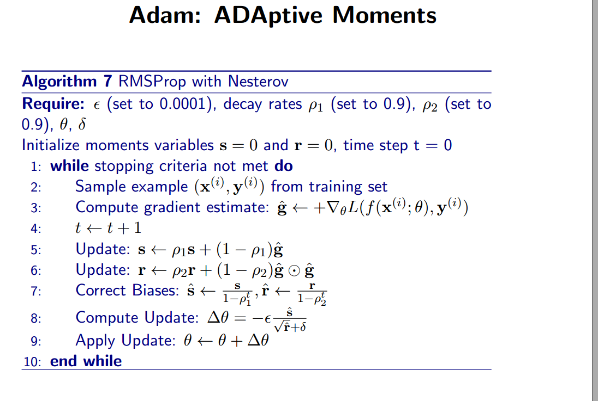

特点：

- 结合了Adagrad善于处理稀疏梯度和RMSprop善于处理非平稳目标的优点 
- 对内存需求较小 
- 为不同的参数计算不同的自适应学习率 
- 也适用于大多非凸优化- 适用于大数据集和高维空间 

## 五、选择使用哪种优化算法？

​	那么，我们应该选择使用哪种优化算法呢？如果输入数据是稀疏的，选择任一自适应学习率算法可能会得到最好的结果。选用这类算法的另一个好处是无需调整学习率，选用默认值就可能达到最好的结果。

​	总的来说，RMSprop是Adagrad的扩展形式，用于处理在Adagrad中急速递减的学习率。RMSprop与Adadelta相同，所不同的是Adadelta在更新规则中使用参数的均方根进行更新。最后，Adam是将偏差校正和动量加入到RMSprop中。在这样的情况下，RMSprop、Adadelta和Adam是很相似的算法并且在相似的环境中性能都不错。Kingma等人[9]指出在优化后期由于梯度变得越来越稀疏，偏差校正能够帮助Adam微弱地胜过RMSprop。综合看来，Adam可能是最佳的选择。

​	有趣的是，最近许多论文中采用不带动量的SGD和一种简单的学习率的退火策略。已表明，通常SGD能够找到最小值点，但是比其他优化的SGD花费更多的时间，与其他算法相比，SGD更加依赖鲁棒的初始化和退火策略，同时，SGD可能会陷入鞍点，而不是局部极小值点。因此，如果你关心的是快速收敛和训练一个深层的或者复杂的神经网络，你应该选择一个自适应学习率的方法。

## 六、总结

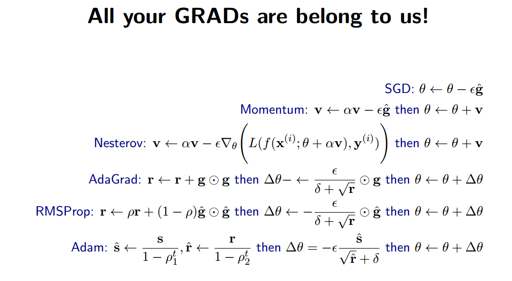

- 对于稀疏数据，尽量使用学习率可自适应的优化方法，不用手动调节，而且最好采用默认值  
- SGD通常训练时间更长，但是在好的初始化和学习率调度方案的情况下，结果更可靠  
- 如果在意更快的收敛，并且需要训练较深较复杂的网络时，推荐使用学习率自适应的优化方法。  
- Adadelta，RMSprop，Adam是比较相近的算法，在相似的情况下表现差不多。 
- 在想使用带动量的RMSprop，或者Adam的地方，大多可以使用Nadam取得更好的效果

