# 史上最通俗易懂的GAN入门

[TOC]

主要从两个部分来讲GAN，第一部分，直觉，从直觉上建立起对GAN的认识。再以此切入第二部分：GAN背后的数学原理。

## I. 直觉

### 一、Basic Idea of GAN

#### 1. Generation

首先了解Generation(生成)的含义。Generation就是模型通过学习一些数据，然后生成类似的数据。比如图像生成，语句生成。

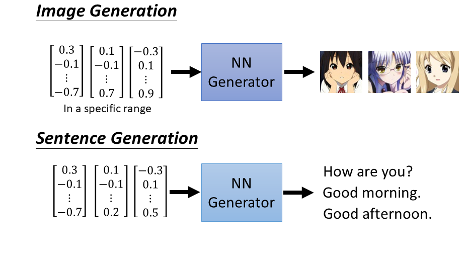

GAN中用于Generation的部分称为Generator。Generator（生成器）实际上是一个函数，目前用得比较多的是神经网络。我们给Generator喂入一些随机向量，它就可以产生我们想要的结果。

而且，随机输入的向量中，每一个维度都可能代表了某种意义或者特征，比如说画红框的维度实际上就分别代表了头发长短，头发颜色和嘴巴张开状态等特征。改变这些维度的数值会改变相应的特征。

#### 2. Discriminator

GAN中除了Generator之外，还有一个重要的组成部分叫做Discriminator(判别器)。Discriminator也是一个函数（神经网络是用得比较多的函数），它会对给定的输入，输出一个实数值，这个值越大，代表这个输入越真实，越小则越不真实。注：这个输出实数值一般会通过sigmoid压缩到0-1之间。

#### 3. 结合Generator和Discriminator

GAN中的Generator和Discriminator是相互不断进化的。如下图，第一代的Generator会比较弱，此时第一代的Discriminator可以比较好的辨别Generator生成的图片是真的假的。但是第二代的Generator会进化，生成更加真实的照片，以骗过第一代的Discriminator，此时Discriminator也不甘示弱，它也会进化得更强，用以辨别第二代Generator产生图片的真假。这个过程一直持续，直至Generator产生越来越真实的图片，而Discriminator的辨别能力也越来越强。

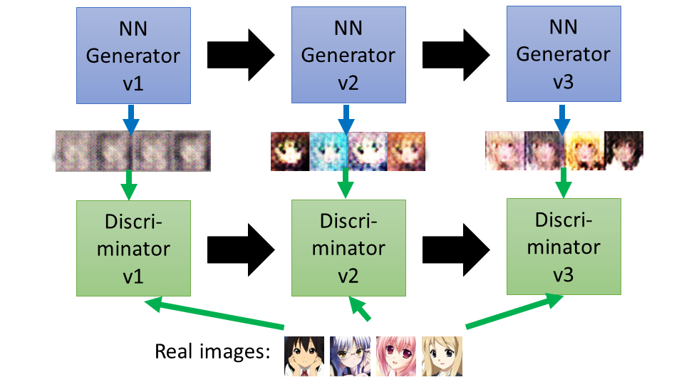

#### 4. 算法

现在将Generator和Discriminator相互进化的过程形式化为算法。

- 首先，初始化一个Generator和一个Discriminator。

- step1：在每次迭代中，先固定Generator，更新Discriminator。Discriminator会给Generator生成的图片一个很低的分数，而给真实的图片一个比较高的分数。

​

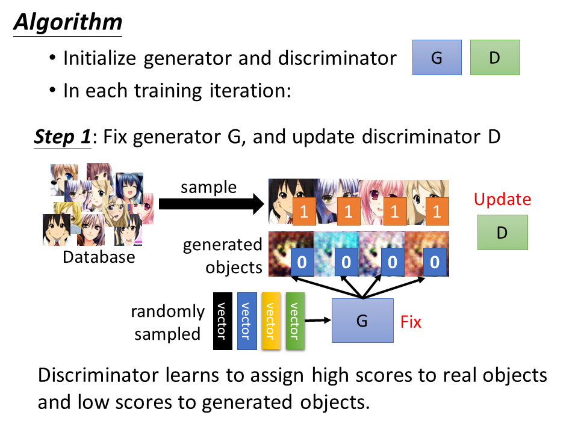

- step2：固定Discriminator，更新Generator。通过更新Generator的参数，Discriminator会给Generator一个很高的得分值。这样最终的Generator就可以骗过Discriminator。

伪代码如下（注意D(x)值一般为sigmoid输出，在0-1之间），已经解释得非常详细，就不多加解释了。

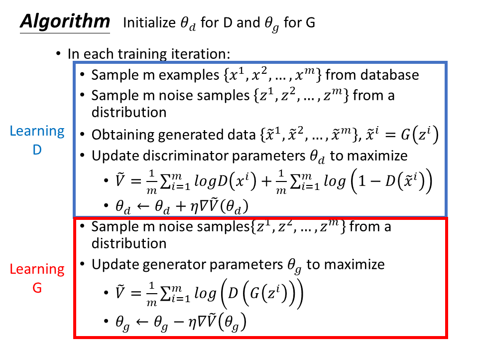

#### 5. 一个实例

二次元图像生成。我们可以看到，随着训练迭代次数的增多，生成的图片会越来越真实。

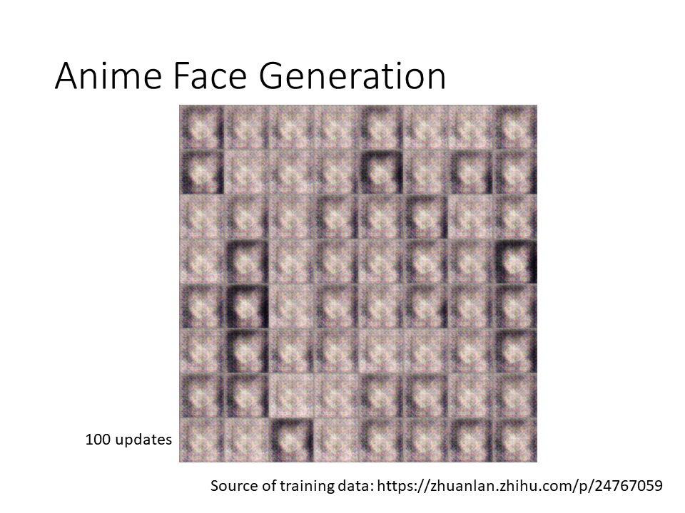

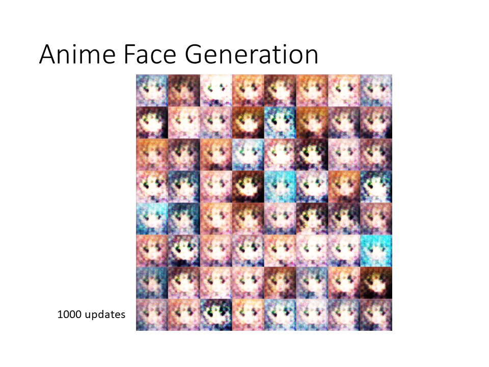

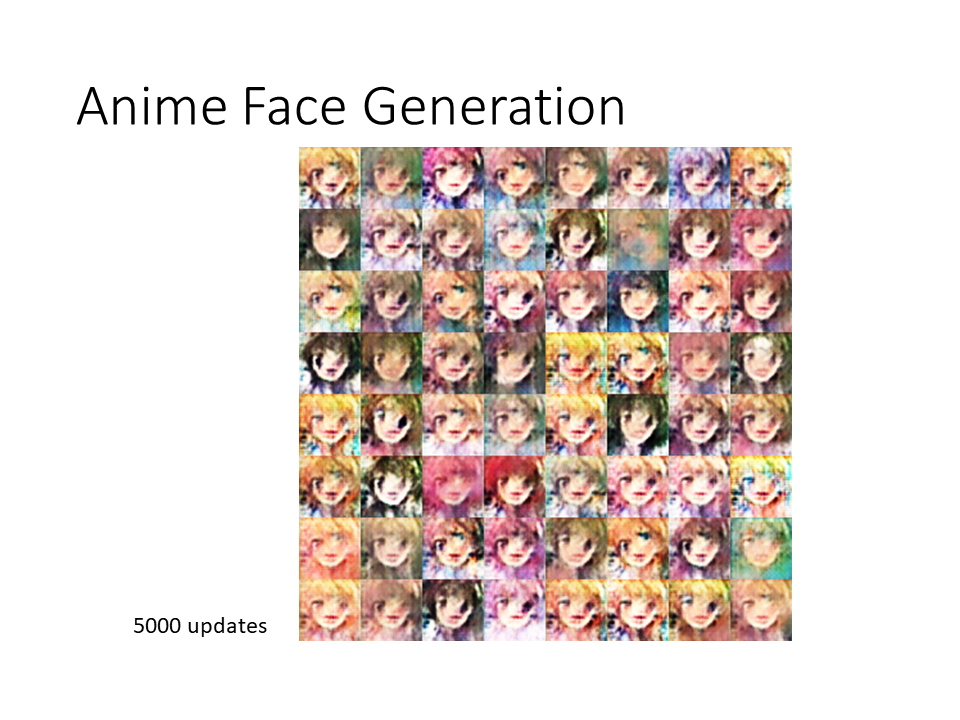

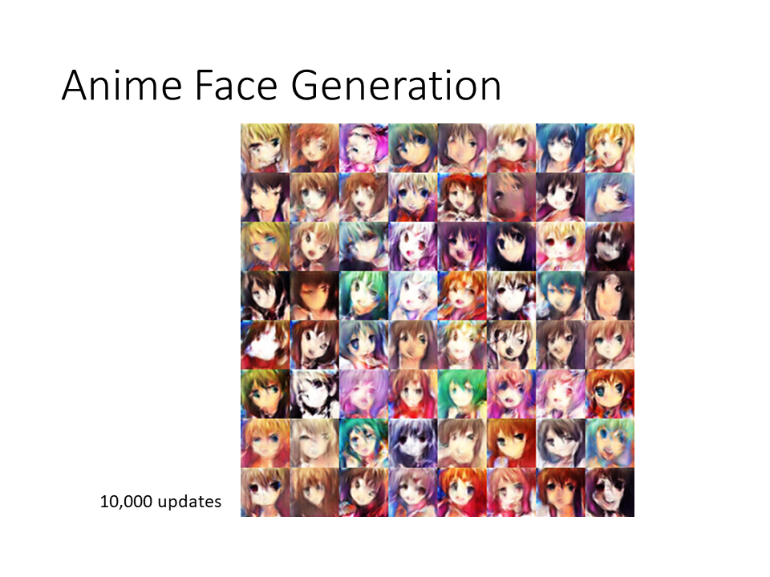

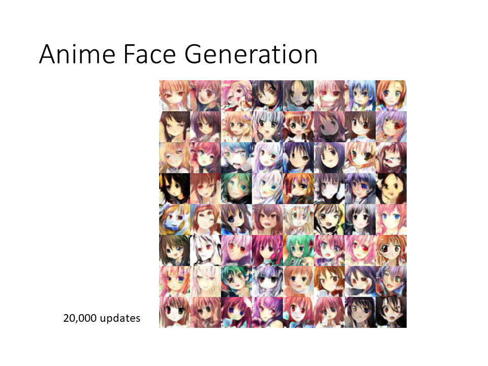

### 二、Can Generator Learn  by Itself

通过以上讲解，我们已经知道，GAN通过Generator和Discriminator相互竞争，可以生成很逼真的图片。我们现在想知道一个问题，就是如果没有Discriminator的话，Generator还可以生成图片吗？以下就对这个疑问进行解释。

#### 1. 固定输入向量的Generator

实际上我们只用一个Generator就可以进行生成图片。并不需要Discriminator。可以这么做：假设我们从database中采样了m张图片，我们给每张图片都对应上一个向量。这样就构成了<向量，图片>对。这时候我们可以通过传统的监督学习得到一个Generator，对于每个输入向量，都对应着图片输出。这种和图像分类是相反的。

但是，这样的Generator有一个问题，输入的向量，也就是code要怎么来？我们可以随机产生这些向量。但是这样有一个问题，比如我们想生成两个数字1，理论上输入的code应该比较相像（比如对于同样是数字1的图片，code的第一维都是0.1），但是由于这些code是随机生成的，因此很难控制它们相像。

这个时候可以考虑使用autoencoder中的encoder来产生这个code。

#### 2. AutoEncoder中的decoder作为Generator

我们可以考虑使用autoencoder中的encoder来产生这个code。给Encoder输入一张图片，encoder将其编码到低维空间：

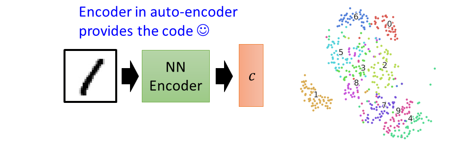

 而AutoEncoder的Decoder部分会将code解码为原始输入。Encoder和Decoder没办法分开train，但可以将Encoder和Decoder联合起来，进行end-to-end的训练。

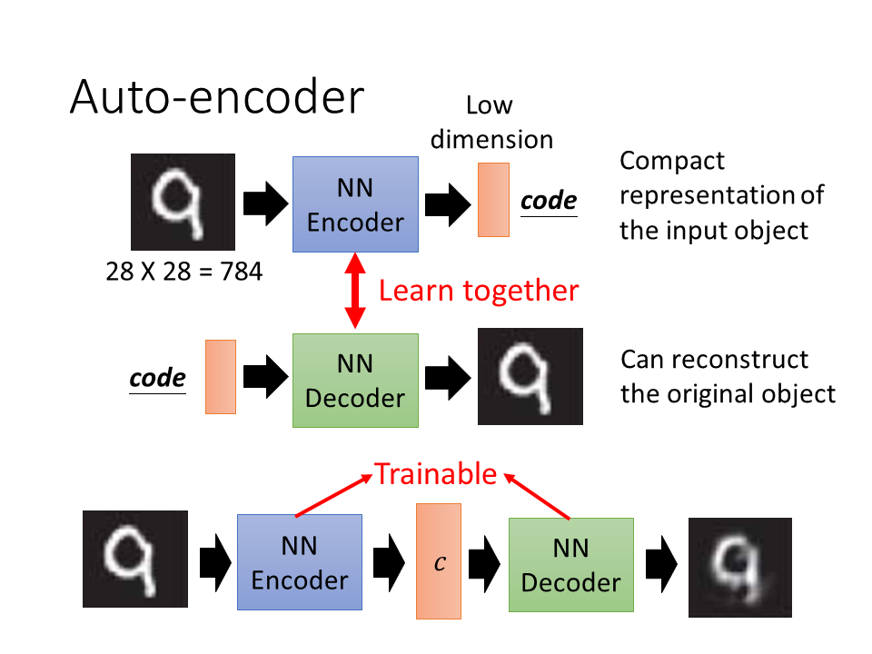

训练好了AutoEncoder之后，就可以将Decoder拿出来作为一种Generator。

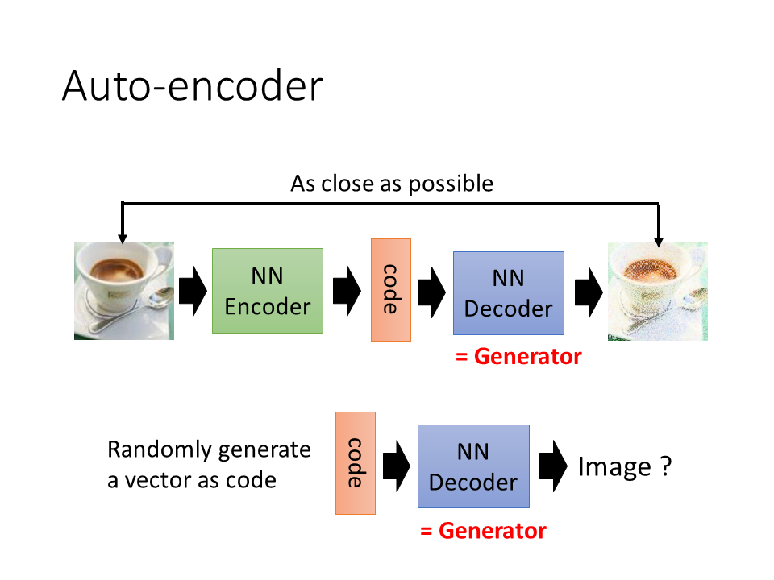

举个数字生成的例子：在code空间中，通过随机输入一些向量，就可以生成相应的图片。

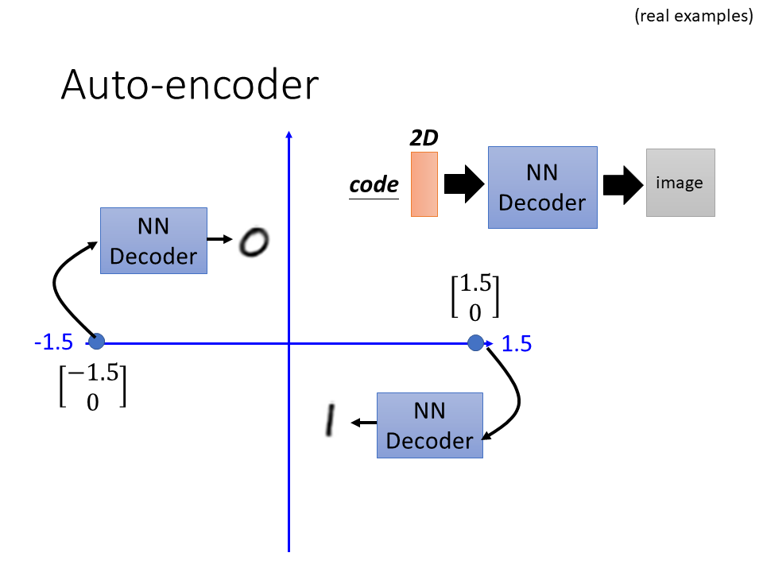

但是AutoEncoder存在一个问题，就是code之间存在一个gap。gap之间的code，比如$0.5a+0.5b$可能就可能产生噪声，而不是正的数字1）。在code空间中，训练数据没有cover到的区域，很难生成一个好的图片。

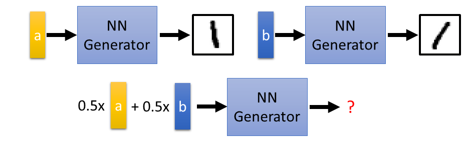

#### 3. 变分自编码的Decoder作为Generator

Autoencoder作为生成器有它的缺点，这个时候需要用到variational AutoEncoder。变分自编码通过给code加上噪声，可以使训练数据cover到更多的code空间。其中噪声是网络Encoder输出的一个向量与高斯噪声产生的向量的积。为了不让Encoder输出的向量被训练为0，这时候还需要对其添加一个限制，如黄色框所示。

但是variational antoEncoder也会存在一个问题，就是它不能学习到全局信息。因为它是通过最小化输出与输出之间的差距作为优化目标的，因此它的关注点只是让输入输出差距最小，而不是使原始图像完美复原。比如下图的上方两张图，输入输出只有一个pixel的差距，那么这个时候对于VAE来说，它的损失函数值会很小，这个时候对于VAE来说已经学习得很好，但是对于人类来说，这种图片实际上是很糟糕的。而对于下图的下方两张图来说，有6个pixel的差距，这个时候对于VAE来说，它的损失函数值会比较大，因此可以说它学习得不好，但是这种情况对于人类来说，是很合理的。

### 三、Can Discriminator Generate

以上讲了单独的Generator也是可以进行生成的，那么单独的Discriminator能否也用来生成呢？答案是可以的！下面就进行详细介绍。

Discriminator实际上也是一个function。对于输入x，会输出一个scalar来判断这个x真不真。越真分值越高，越假分数越低。

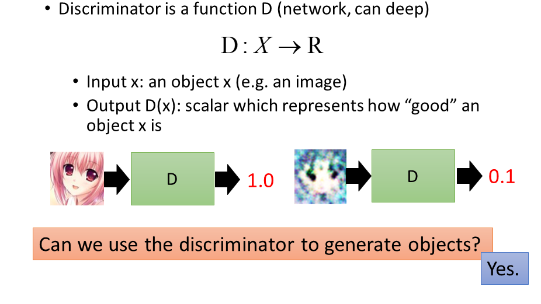

那Discriminator怎么用做生成呢？在之前我们讲到，Variational Autoencoder的生成器是不容易捕捉特征之间的相关性的，因此生成的图片经常不太真实。但是，如果用Discriminator用作Generator的话，可以很好解决这个问题，因为假设Discriminator是CNN架构的话，它很容易学习到图片的特征。

假设我们手中已经有了一个训练好的Discriminator，如果我们想生成一张好的照片，我们只要去做这个操作：$\hat x=argmaxD(x)$就可以得到一张评分很高的照片。这里假设我们可以解这个argmax的问题。不过，现在的问题是，怎么得到这个Discriminator？

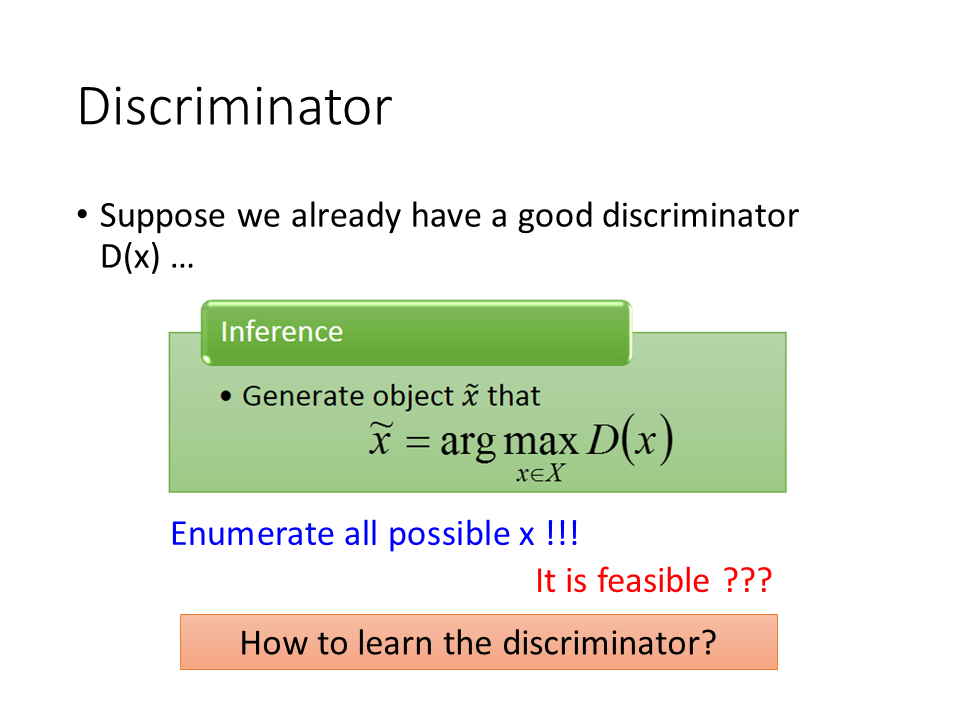

我们现在手头上实际只有真实样本，如果只通过正样本训练，Discriminator只会学会让输出为1。这样不能满足我们的要求。因此，我们需要有负样本来进行训练。

所以我们现在需要负样本来训练Discriminator。但是从哪里找负样本很关键。如果负样本只是随机给的负样本，这样训练出来的Discriminator对相对于噪声真实的图片可能会给一个比价高的分数。这个不是我们希望的。我们希望对于那些比较真实的假图片给很低的分数。

那么现在的问题是要怎样得到非常真实的负样本？可以通过迭代训练的方法来完成。

我们可以这么做：

1. 在开始训练的时候，我们随机生成一些负样本。
2. 在每次迭代过程中：
   - 首先通过正负样本来训练一个Discriminator。

   - 然后从Discriminator中进行argmax采样，将得到的样本作为负样本。

不断地迭代循环，最终就训练好一个Discriminator，然后用argmax来对Discriminator进行采样。

以下用图形的形式解释这个过程：

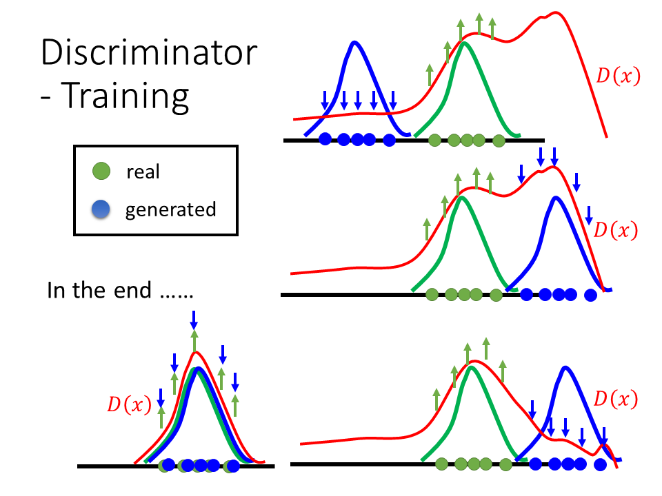

这种方法实际上在很多算法中都有应用。

### 四、总结Generator和Discriminator

Generator：

优点：很容易生成。

缺点：没有考虑component和component之间的相关性，没有大局观。

Discriminator：

优点：有大局观。

缺点：不好做生成，argmax问题通常很难解。

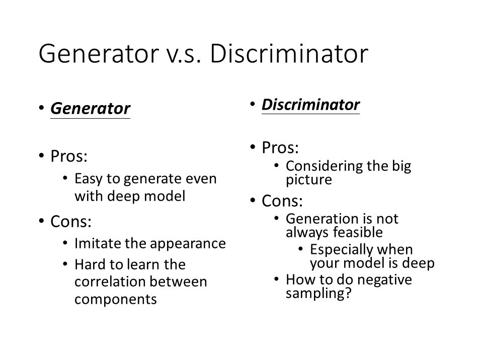

现在，将Generator和Discriminator结合起来，Generator可以产生data，取代“直接解决Discriminator的argmax问题”，实际上，Generator是学会了如果解决argmax的问题。

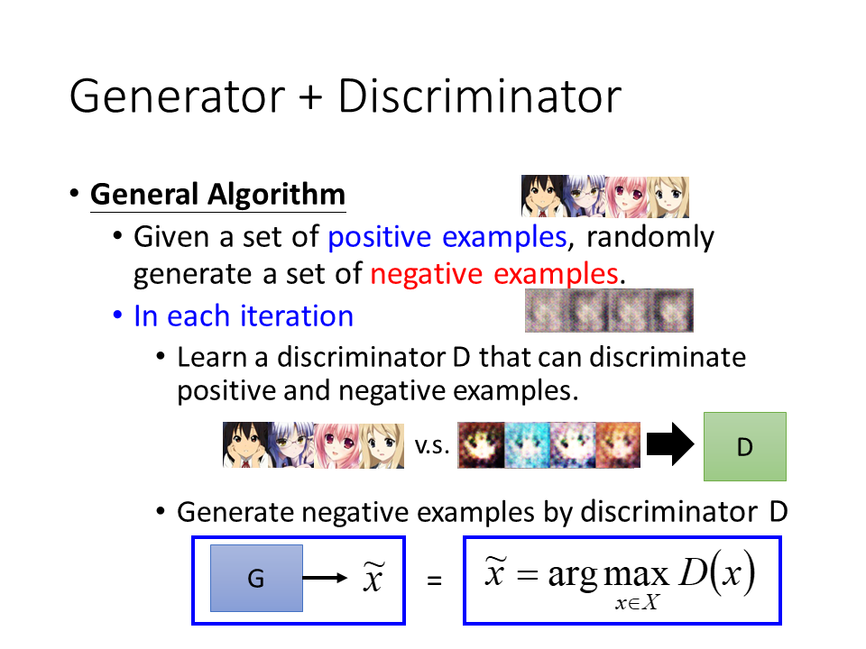

将generator和Discriminator结合起来有非常大的好处。

从Discriminator的角度来说，解argmax问题可以由generator来做，解决了“argmax问题很难解”的问题。Generator不是Autoencoder那种通过L2 loss来进行学习的方式，而是通过Discriminator的带领来学会全局观。

从Generator的角度来说，不再是Autoencoder那种通过L2 loss来进行学习的方式，而是通过Discriminator的带领来学会全局观。

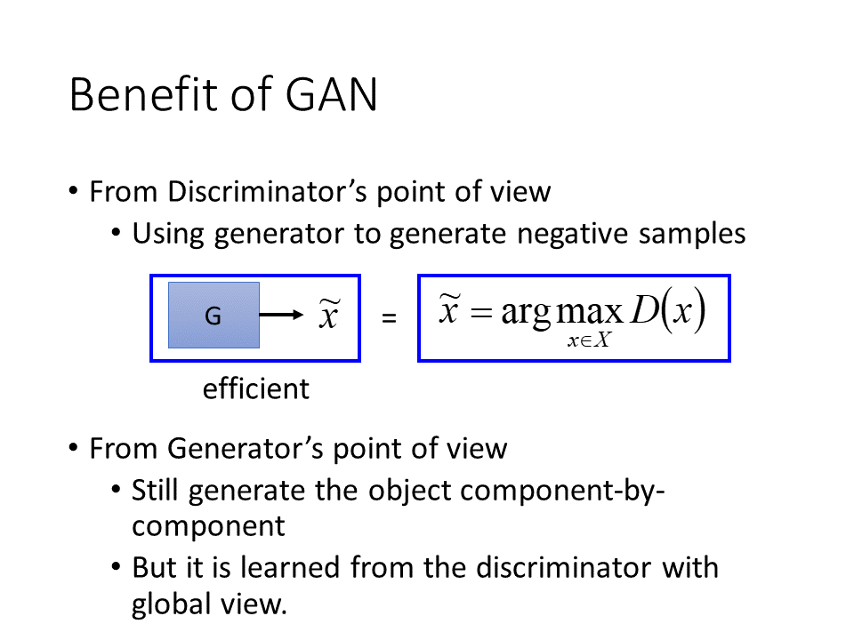

以下是由VAE和GAN生成的图片的对比。

## II. 理论

### 1.MLE

首先从MLE讲起。假设我们现在有一个$P_{data}(x)$的分布，其中$x$可以看成是image。如果现在要根据这个分布去产生一张图片的话要怎么做？我们可以去寻找一个分布$P_G(x;\theta)$（这个分布受控于参数$\theta$），使它和$P_{data}(x)$很像。这个$P_G(x;\theta)$中的G(Generator)可以是多种形式，比如可以是Gaussian mixture model，也可以是神经网络，等等。接着我们可以从$P_{data}(x)$中去采样出m个sample：$\{x_1,...x_m\}$，分别去计算相应的$P_G(x^i;\theta)$，再将它们相乘得到likelihood。最后最大化likelihood就可以解得参数$\theta$，从而得到$P_{G}(x;\theta)$。利用$P_{G}(x)$就可以进行随机采样产生图片。

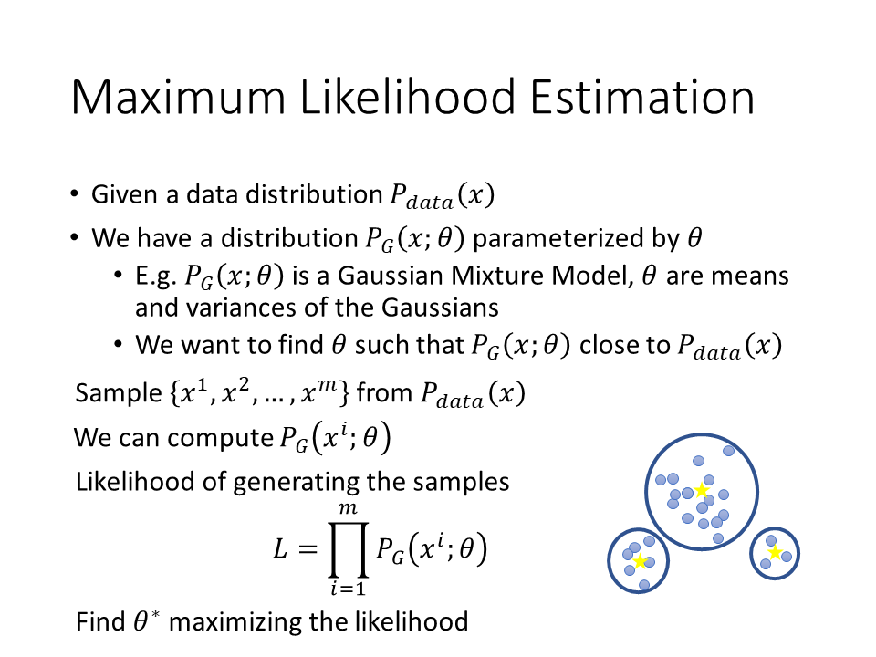

实际上，我们发现，MLE实际上就是最小化$P_G(x;\theta)$和$P_{data}(x)$的KL divergence。也就是说，MLE做的事情就是让$P_{data}(x)$和$P_G(x;\theta)$这两个分布更接近。

实际上，如果假设$P_G(x;\theta)$的G为gaussian mixture model的话，通过MLE方法计算出的$P_G(x;\theta)$进行生成图像的话通常会非常模糊，原因就是gaussian mixture model和$P_{data}(x)$通常会离得比较远。但是，如果我们把$P_G(x;\theta)$的G设置为神经网络的话，由于神经网络有强大的拟合能力，它可以较好地近似$P_{data}(x)$。

NN作为Generator的方式很简单，给NN输入一个概率分布的采样值（这个概率分布可以是Gaussian distribution也可以是normal distribution，由于NN有强大的拟合能力，不用担心它不会拟合出$P_{data}(x)$），NN就可以产生相应的x。我们要做的就是寻找NN的参数$\theta$，使NN输出的x的分布与$P_{data}(x)$越接近越好。

​	可是现在Generator产生的distribution写成式子是什么样子的？可写成：$P_G(x)=\int_zP_{prior}(z)I_{[G(x)=x]}dz$。对于Gaussian mixture model给一个x，可以很容易算它的出现的概率，但是，对于NN的话，即使知道了$P_{prior}(z)$的概率，由于G的形式很复杂，很难算出x出现的概率，因此就很难通过MLE的方式求得而GAN最大的贡献就是解决了这个问题。

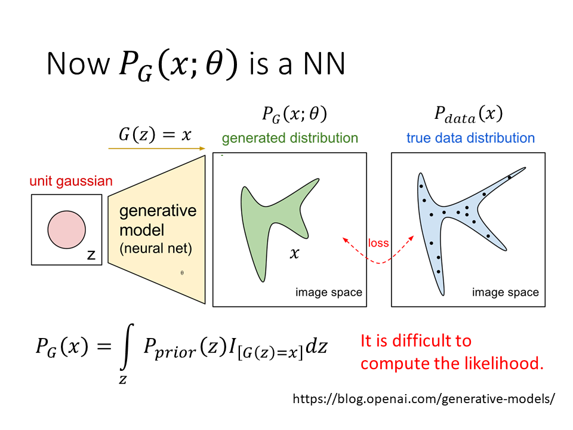

现在重新来形式化我们的问题。

首先看Generator的形式，输入是$z$，输出是$x$。现在给定一个先验分布$P_{prior}(z)$，我们要得到一个概率分布$P_G(x)$，但是现在的问题是不知道怎么计算这个G。

所以这个时候要去定义一个Discriminator。它的输入是$x$，输出是实数。它做的事情就是衡量$P_{data}(x)$和$P_G(x)$有多相近。这个Discriminator实际上就是取代了MLE的作用。只不过MLE算的是KL divergence，而D算的是另外一种divergence（后面会详细讲到）。

那么要怎样才能让D去算出两种分布的divergence呢？这个时候需要去解这个问题：
$argmin_{G}max_DV(G,D)$

首先需要定义一个function $V(G,D)$，它吃$G,D$，output一个scalar。然后$max_DV(G,D)$,最后$argmin_{G}max_DV(G,D)$。

下面先看$max_DV(G,D)$。它的意思是，给定$G$，求出使$V(G,D)$最大的$D$。现在我们先假定$G$的个数只有3个（实际上是连续的，有无穷多个），分别为$G_1,G_2,G_3$，现在我们要做的事情就是在$G_1,G_2,G_3$中分别找到使$V$最大时所对应的$D^*$，即图中红点处。接着，再看$argmin_{G}max_DV(G,D)$，它做的事情就是在刚才找的最大值中找出最小值对应的$G^\star$。

现在的问题是，怎么去定义这个V呢？假设我们现在直接定义V为（先不管怎么来的）：

这样定义之后有什么好处呢？实际上$max_DV(G,D)$就是评估了$P_G$和$P_{data}$的差异性，也就是上图中红点的高度。现在我们想找一个$G^{\star}$让这个高度最小，也就是让$P_G$和$P_{data}$最相似。

下面就解释为什么会这样。下面进行证明：

===============================证明开始===============================

首先的问题就是，给定G，什么样的D能够$max_DV(G,D)$ ？步骤如下：

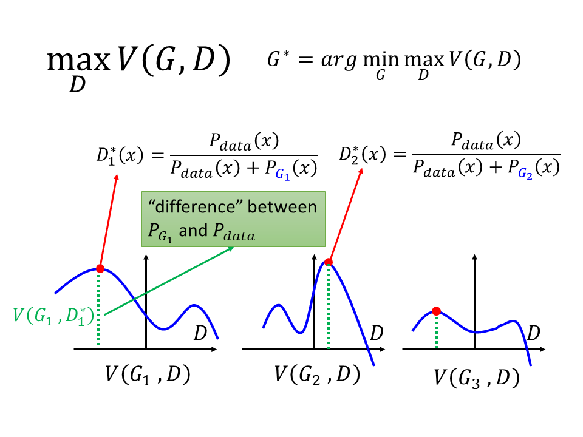

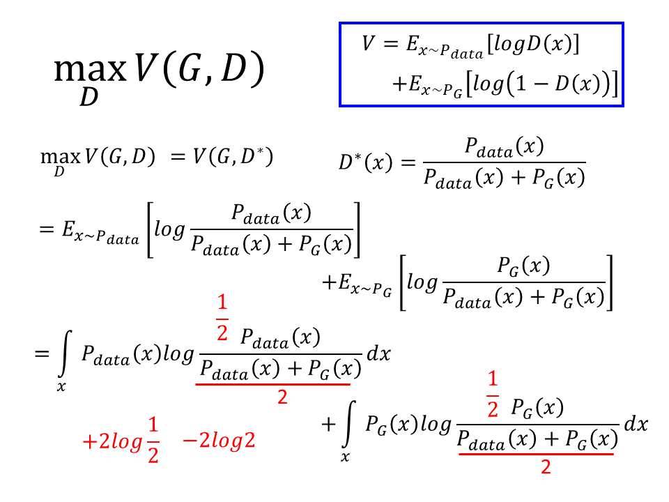

最终我们得到最优的$G^\star$, 它使$P_G(x)$和$P_{data}(x)$最相近。

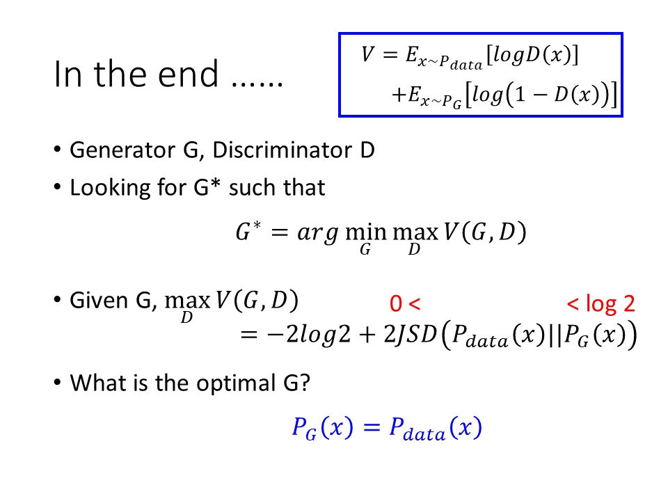

================================证明结束=====================================

那么怎么去寻找最佳的$G^\star$呢？实际上，就是最小化Generator的Loss function。

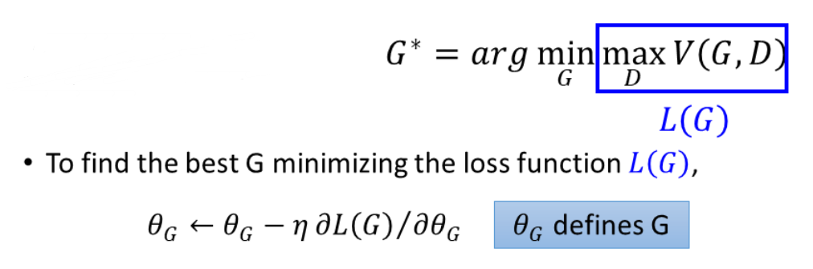

但是，$L(G)$中有max操作，能够进行最小化吗？实际上是可以的。假设只有三个D。这个地方没懂。。。/QQ_5.png?lastModify=1526800316)

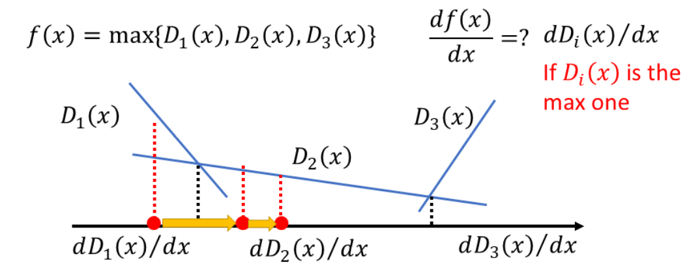

我们可以先给定一个$G_0$，寻找一个$D^\star_0$使$V(G_0,D)最大化。这时候去更新$$\theta_G$使得JS divergence最小，得到了$G_1$。然后按照这个步骤重复，最终就可以得到最佳解。

会有一个问题：

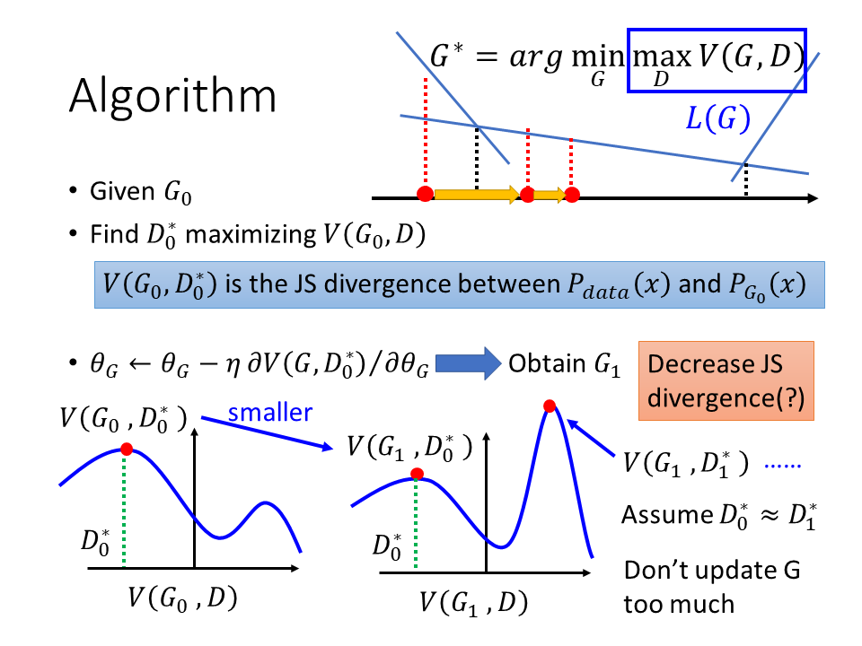

实践中：1. 期望不能做积分，就通过sample。

这个实际上就是cross entropy。

如果D的loss很大，就说明p_data和p_G的js divergence很大，反之很小。下面少一个参数。

learning D: 固定G，那么表现为从G中进行sample。

learning G: 固定D，那么意味着和第一项没有关系。

注意：G不能update太多，否则可能导致JS divergence太小。但是ian goodfelloe，learning D只要一次。

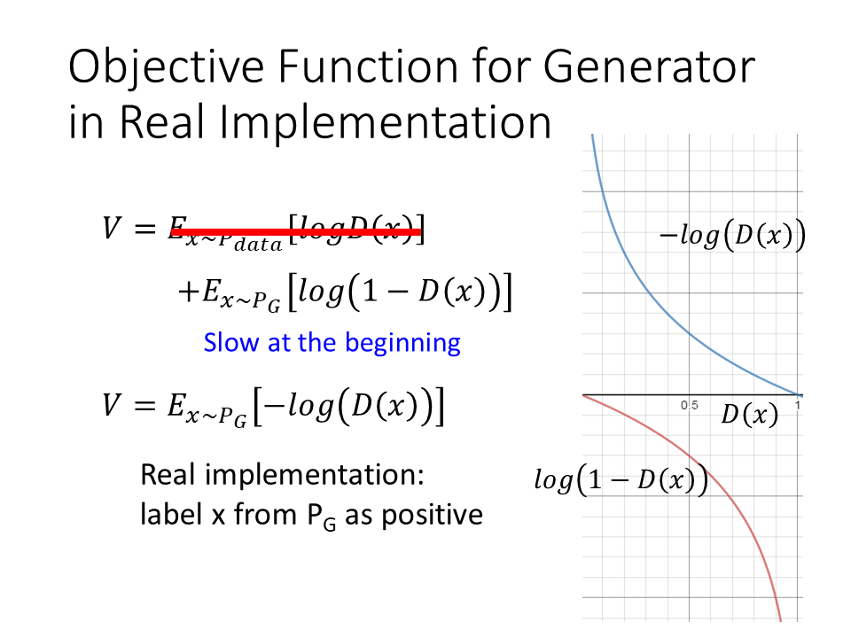

training的时候的问题。D