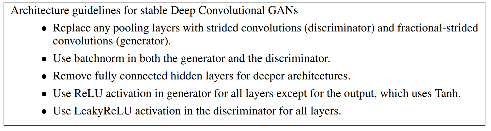
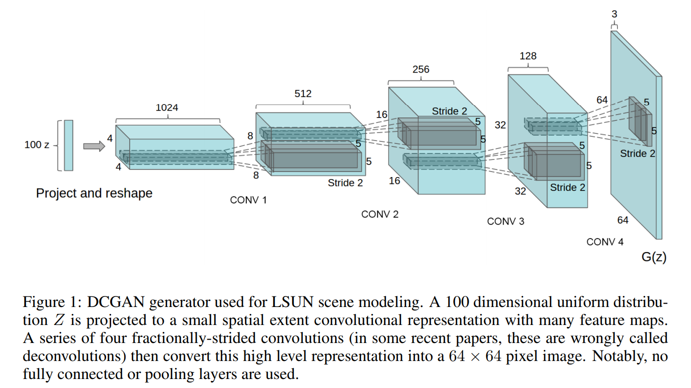

typora-copy-images-to: pics

# CycleGAN

## 背景

Image-to-image translation（图像翻译，比如grayscale to color，image to semantic labels, edge-map to photograph）是计算机视觉中的一个难题，它需要学习输入图片和输出图片之间的映射，其中输入图片和输出图片之间通常都是对齐的图片对。但是在实际的任务中，图片对比较难以获得。所以这篇文章就提出一种方法，这种方法可以将图片从source domain到target domain之间做一个转换，但不需要图片对。

简单来说，学习一个映射G：X→Y，使G(X)生成的图片分布和Y的分布不可区分，这个可以使用对抗损失来做到。同时，考虑到这个映射是缺少限制的，所以又增加了一个反向的映射，F：Y→X，并且引入一个cycle consistency loss，使F(G(x))≈X。

各种实验结果表明了这种方法的有效性。

## 思想

对于图像翻译的任务，最直接的想法就是去学习一个映射学习一个映射G：X→Y，它能使domain X映射到domain Y。理论上，这个目标能使y^满足经验分布pdata(y)（一般来说，这个要求G是随机的？）。但是，这样的一个转换并不能保证输入x和输出y图片对的结果有意义，因为有无穷个G能y^的分布与Y分布一致。而且，在实践中，作者发现，很难独立地优化对抗目标：标准的训练过程很容易导致一个问题就是mode collapse，即所有的图片都映射到同样的输出图像，然后优化就不能再进行。

> Mode colaapse参考：https://blog.csdn.net/sparkkkk/article/details/72598041

对于这个问题，作者提出在目标上增加一个结构来解决。形式上，所以又增加了一个反向的映射，F：Y→X，并且引入一个cycle consistency loss，使F(G(x))≈X。

## Blog

https://hardikbansal.github.io/CycleGANBlog/

# WGAN

传统的GAN是用JS divergence来衡量PG和Pdata之间的相似性，但是JS存在一个非常严重的问题。这个问题的根源是：生成数据和真实数据不存在重叠。

为什么不重叠呢？主要原因有两个：

1. 图片通常是在高维空间中的低维流形，所以基本上没有重叠。

> 为什么这样就没有重叠？
>
> 比较严谨的答案是：当P_r与P_g的支撑集（support）是高维空间中的低维流形（manifold）时，P_r与P_g重叠部分测度（measure）为0的概率为1。
>
> 不用被奇怪的术语吓得关掉页面，虽然论文给出的是严格的数学表述，但是直观上其实很容易理解。首先简单介绍一下这几个概念：
>
> - 支撑集（support）其实就是函数的非零部分子集，比如ReLU函数的支撑集就是(0, +∞)，一个概率分布的支撑集就是所有概率密度非零部分的集合。
> - 流形（manifold）是高维空间中曲线、曲面概念的拓广，我们可以在低维上直观理解这个概念，比如我们说三维空间中的一个曲面是一个二维流形，因为它的本质维度（intrinsic dimension）只有2，一个点在这个二维流形上移动只有两个方向的自由度。同理，三维空间或者二维空间中的一条曲线都是一个一维流形。
> - 测度（measure）是高维空间中长度、面积、体积概念的拓广，可以理解为“超体积”。
>
> 回过头来看第一句话，“当P_r与P_g的支撑集是高维空间中的低维流形时”，基本上是成立的。原因是GAN中的生成器一般是从某个低维（比如100维）的随机分布中采样出一个编码向量，再经过一个神经网络生成出一个高维样本（比如64x64的图片就有4096维）。当生成器的参数固定时，生成样本的概率分布虽然是定义在4096维的空间上，但它本身所有可能产生的变化已经被那个100维的随机分布限定了，其本质维度就是100，再考虑到神经网络带来的映射降维，最终可能比100还小，所以生成样本分布的支撑集就在4096维空间中构成一个最多100维的低维流形，“撑不满”整个高维空间。
>
> “撑不满”就会导致真实分布与生成分布难以“碰到面”，这很容易在二维空间中理解：一方面，二维平面中随机取两条曲线，它们之间刚好存在重叠线段的概率为0；另一方面，虽然它们很大可能会存在交叉点，但是相比于两条曲线而言，交叉点比曲线低一个维度，长度（测度）为0，可忽略。三维空间中也是类似的，随机取两个曲面，它们之间最多就是比较有可能存在交叉线，但是交叉线比曲面低一个维度，面积（测度）是0，可忽略。从低维空间拓展到高维空间，就有了如下逻辑：因为一开始生成器随机初始化，所以P_g几乎不可能与P_r有什么关联，所以它们的支撑集之间的重叠部分要么不存在，要么就比P_r和P_g的最小维度还要低至少一个维度，故而测度为0。所谓“重叠部分测度为0”，就是上文所言“不重叠或者重叠部分可忽略”的意思。

2. 在两个distribution中进行sampling，由于sampling的数量不多，因此很可能没有重叠。

没有重合（不管重合多少，只要没有重合）情况会导致JS都是log2。因此根本没办法把P_G0更新成P_G1，因为都是log2。

怎么直观地理解这个问题？我们训练一个二分类模型，只要生成数据和真实数据没有重叠，分类模型的loss都是一样的（这是由于sigmod决定的，sigmoid非常平缓），而loss实际上就是衡量JS divergence的，所以这样就导致JS是一样的。

另外一种说明。

sigmoid在两端会很平，因为这些平的地方的梯度接近0的，因此很难将蓝色点往右边移动。

有一个做法就是不要把分类器训练的太好，这样就能保有一定的梯度。但是现在有一个问题就是，怎么样算train得不要太好？这样很难控制。所以GAN的早期很难train的。

后来的做法，把sigmoid换成linear，也就是把分类问题转换成了一个回归问题，目标是1和0，这样就可以保有一定的gradient。

而Wassertein GAN用另外一种衡量概率分布相似性的东西，叫做EM distance，以此来取代JS divergence。

以下是最简单的方式，就只要把相同的土移动一段距离d就好了。

但是实际情况会更复杂，移动的情况会很多，EM distance的意思就是穷举出所有的移土的计划，找最小的那个就是EM distance。

最好的移动策略就是下图：

下面是一个更严格的定义：

一个moving plan可以用一个矩阵来表示，矩阵的每一个元素表示纵坐标的元素移动到横坐标位置上。

注意：EM distance的计算是很麻烦的，因为需要解决一个min问题。

为什么使用Mover‘s Distance？

EM Distance比JS好的地方就是即使pg和pdata没有重叠，但是还可以衡量它们之间的距离。

**WGAN**

现在的问题是，我们想用EM distance评估Pdata和PG之间的距离，那我们要怎么去改变discriminator。

式子就是下面这个，这个需要很多的证明，这里就暂时忽略了。

但是不能光光让它们越大或者越小，还必须满足D是一个1-Lipschitz距离。如果没有限制，且真实数据和generator产生的数据没有重叠，这样没办法收敛。

添加限制：D必须平滑。

那么1-lipschitz是什么？代表的意思是output变化不能大于输入的差距。

1-lipschitz这个限制不好加，那么就用weight clipping进行近似。这个做法限制了w的大小，w不能剧烈变化，因此能比较平滑。但是实际上weight clipping并不能代表1-lipschitz，不过这种方法只是一种怪招，暂时解决问题而已。

在Impoved WGAN则进行改进：

发现情况是等价的：

# DCGAN

## 贡献

提出并评估一组在卷积GAN架构拓扑上的限制，这个可以使训练变得更加稳定。我们把这种架构叫做DCGAN。

使用图像分类任务中训练好的判别器，表现出同其他苏监督算法可竞争的性能。 

可视化了GAN学习到的filters，并且经验上特定的filters学习画出特定的物体。

## 架构的设计

1. 在判别器中用大步长的卷积代替pooling层，fractional-strided卷积(反卷积)用于生成器。
2. 在判别器和生成器中都使用BN。这对于生成器的初始学习是非常重要的，它会阻止生成器从所有样本collapse到某一个点，也就是GAN中经常出现的mode collapse的问题。
3. 移除全连接层。这是一种非常常规的操作了。
4. 在生成器的所有层中使用RELU，但是输出使用Tanh。作者发现使用一个有边界的激活函数对于模型来说更容易饱和，而且能够覆盖到训练分布的颜色空间。使用在判别器中的所有层使用leakyReLU。

简单总结如下：

## 整体架构

## InfoGAN

## 创新点

1. 