typora-copy-images-to: pics

## WGAN

### 李宏毅版本

传统的GAN是用JS divergence来衡量PG和Pdata之间的相似性，但是JS存在一个非常严重的问题。这个问题的根源是：生成数据和真实数据不存在重叠。

为什么不重叠呢？主要原因有两个：

1. 图片通常是在高维空间中的低维流形，所以基本上没有重叠。

> 为什么这样就没有重叠？
>
> 比较严谨的答案是：当P_r与P_g的支撑集（support）是高维空间中的低维流形（manifold）时，P_r与P_g重叠部分测度（measure）为0的概率为1。
>
> 不用被奇怪的术语吓得关掉页面，虽然论文给出的是严格的数学表述，但是直观上其实很容易理解。首先简单介绍一下这几个概念：
>
> - 支撑集（support）其实就是函数的非零部分子集，比如ReLU函数的支撑集就是(0, +∞)，一个概率分布的支撑集就是所有概率密度非零部分的集合。
> - 流形（manifold）是高维空间中曲线、曲面概念的拓广，我们可以在低维上直观理解这个概念，比如我们说三维空间中的一个曲面是一个二维流形，因为它的本质维度（intrinsic dimension）只有2，一个点在这个二维流形上移动只有两个方向的自由度。同理，三维空间或者二维空间中的一条曲线都是一个一维流形。
> - 测度（measure）是高维空间中长度、面积、体积概念的拓广，可以理解为“超体积”。
>
> 回过头来看第一句话，“当P_r与P_g的支撑集是高维空间中的低维流形时”，基本上是成立的。原因是GAN中的生成器一般是从某个低维（比如100维）的随机分布中采样出一个编码向量，再经过一个神经网络生成出一个高维样本（比如64x64的图片就有4096维）。当生成器的参数固定时，生成样本的概率分布虽然是定义在4096维的空间上，但它本身所有可能产生的变化已经被那个100维的随机分布限定了，其本质维度就是100，再考虑到神经网络带来的映射降维，最终可能比100还小，所以生成样本分布的支撑集就在4096维空间中构成一个最多100维的低维流形，“撑不满”整个高维空间。
>
> “撑不满”就会导致真实分布与生成分布难以“碰到面”，这很容易在二维空间中理解：一方面，二维平面中随机取两条曲线，它们之间刚好存在重叠线段的概率为0；另一方面，虽然它们很大可能会存在交叉点，但是相比于两条曲线而言，交叉点比曲线低一个维度，长度（测度）为0，可忽略。三维空间中也是类似的，随机取两个曲面，它们之间最多就是比较有可能存在交叉线，但是交叉线比曲面低一个维度，面积（测度）是0，可忽略。从低维空间拓展到高维空间，就有了如下逻辑：因为一开始生成器随机初始化，所以P_g几乎不可能与P_r有什么关联，所以它们的支撑集之间的重叠部分要么不存在，要么就比P_r和P_g的最小维度还要低至少一个维度，故而测度为0。所谓“重叠部分测度为0”，就是上文所言“不重叠或者重叠部分可忽略”的意思。

2. 在两个distribution中进行sampling，由于sampling的数量不多，因此很可能没有重叠。


没有重合（不管重合多少，只要没有重合）情况会导致JS都是log2。因此根本没办法把P_G0更新成P_G1，因为都是log2。

怎么直观地理解这个问题？我们训练一个二分类模型，只要生成数据和真实数据没有重叠，分类模型的loss都是一样的（这是由于sigmod决定的，sigmoid非常平缓），而loss实际上就是衡量JS divergence的，所以这样就导致JS是一样的。


另外一种说明。

sigmoid在两端会很平，因为这些平的地方的梯度接近0的，因此很难将蓝色点往右边移动。

有一个做法就是不要把分类器训练的太好，这样就能保有一定的梯度。但是现在有一个问题就是，怎么样算train得不要太好？这样很难控制。所以GAN的早期很难train的。

后来的做法，把sigmoid换成linear，也就是把分类问题转换成了一个回归问题，目标是1和0，这样就可以保有一定的gradient。


而Wassertein GAN用另外一种衡量概率分布相似性的东西，叫做EM distance，以此来取代JS divergence。

以下是最简单的方式，就只要把相同的土移动一段距离d就好了。


但是实际情况会更复杂，移动的情况会很多，EM distance的意思就是穷举出所有的移土的计划，找最小的那个就是EM distance。


最好的移动策略就是下图：


下面是一个更严格的定义：

一个moving plan可以用一个矩阵来表示，矩阵的每一个元素表示纵坐标的元素移动到横坐标位置上。

EM distance的计算是很麻烦的，因为需要解决一个min问题。

注意：EM distance的计算是很麻烦的，因为需要解决一个min问题。


为什么使用Mover‘s Distance？

EM Distance比JS好的地方就是即使pg和pdata没有重叠，但是还可以衡量它们之间的距离。


**WGAN**

现在的问题是，我们想用EM distance评估Pdata和PG之间的距离，那我们要怎么去改变discriminator。

式子就是下面这个，这个需要很多的证明，这里就暂时忽略了。

但是不能光光让它们越大或者越小，还必须满足D是一个1-Lipschitz距离。如果没有限制，且真实数据和generator产生的数据没有重叠，这样没办法收敛。

添加限制：D必须平滑。


那么1-lipschitz是什么？代表的意思是output变化不能大于输入的差距。

1-lipschitz这个限制不好加，那么就用weight clipping进行近似。这个做法限制了w的大小，w不能剧烈变化，因此能比较平滑。但是实际上weight clipping并不能代表1-lipschitz，不过这种方法只是一种怪招，暂时解决问题而已。


在Impoved WGAN则进行改进：

发现情况是等价的：


### 郑华滨版本

链接：https://zhuanlan.zhihu.com/p/25071913

要知道自从[2014年Ian Goodfellow提出](http://link.zhihu.com/?target=https%3A//arxiv.org/abs/1406.2661)以来，GAN就存在着训练困难、生成器和判别器的loss无法指示训练进程、生成样本缺乏多样性等问题。从那时起，很多论文都在尝试解决，但是效果不尽人意，比如最有名的一个改进[DCGAN](http://link.zhihu.com/?target=https%3A//arxiv.org/abs/1511.06434)依靠的是对判别器和生成器的架构进行实验枚举，最终找到一组比较好的网络架构设置，但是实际上是治标不治本，没有彻底解决问题。而今天的主角Wasserstein GAN（下面简称WGAN）成功地做到了以下爆炸性的几点：

- 彻底解决GAN训练不稳定的问题，不再需要小心平衡生成器和判别器的训练程度
- 基本解决了collapse mode的问题，确保了生成样本的多样性 
- 训练过程中终于有一个像交叉熵、准确率这样的数值来指示训练的进程，这个数值越小代表GAN训练得越好，代表生成器产生的图像质量越高（如题图所示）
- 以上一切好处不需要精心设计的网络架构，最简单的多层全连接网络就可以做到

那以上好处来自哪里？这就是令人拍案叫绝的部分了——实际上作者整整花了两篇论文，在第一篇《[Towards Principled Methods for Training Generative Adversarial Networks](http://link.zhihu.com/?target=https%3A//arxiv.org/abs/1701.04862)》里面推了一堆公式定理，从理论上分析了原始GAN的问题所在，从而针对性地给出了改进要点；在这第二篇《[Wasserstein GAN](http://link.zhihu.com/?target=https%3A//arxiv.org/abs/1701.07875)》里面，又再从这个改进点出发推了一堆公式定理，最终给出了改进的算法实现流程，**而改进后相比原始GAN的算法实现流程却只改了四点**：

- 判别器最后一层去掉sigmoid
- 生成器和判别器的loss不取log
- 每次更新判别器的参数之后把它们的绝对值截断到不超过一个固定常数c
- 不要用基于动量的优化算法（包括momentum和Adam），推荐RMSProp，SGD也行

算法截图如下：


改动是如此简单，效果却惊人地好，以至于Reddit上不少人在感叹：就这样？没有别的了？ 太简单了吧！这些反应让我想起了一个颇有年头的鸡汤段子，说是一个工程师在电机外壳上用粉笔划了一条线排除了故障，要价一万美元——画一条线，1美元；知道在哪画线，9999美元。上面这四点改进就是作者Martin Arjovsky划的简简单单四条线，对于工程实现便已足够，但是知道在哪划线，背后却是精巧的数学分析，而这也是本文想要整理的内容。

本文内容分为五个部分：

- 原始GAN究竟出了什么问题？（此部分较长）
- WGAN之前的一个过渡解决方案 
- Wasserstein距离的优越性质
- 从Wasserstein距离到WGAN
- 总结

 

*理解原文的很多公式定理需要对测度论、 拓扑学等数学知识有所掌握，本文会从直观的角度对每一个重要公式进行解读，有时通过一些低维的例子帮助读者理解数学背后的思想，所以不免会失于严谨，如有引喻不当之处，欢迎在评论中指出。*

*以下简称《Wassertein GAN》为“WGAN本作”，简称《Towards Principled Methods for Training Generative Adversarial Networks》为“WGAN前作”。*

*WGAN源码实现：martinarjovsky/WassersteinGAN*

#### 第一部分：原始GAN究竟出了什么问题？

回顾一下，原始GAN中判别器要最小化如下损失函数，尽可能把真实样本分为正例，生成样本分为负例：

![-\mathbb{E}_{x\sim P_r}[\log D(x)] - \mathbb{E}_{x\sim P_g}[\log(1-D(x))]](http://www.zhihu.com/equation?tex=-%5Cmathbb%7BE%7D_%7Bx%5Csim+P_r%7D%5B%5Clog+D%28x%29%5D+-+%5Cmathbb%7BE%7D_%7Bx%5Csim+P_g%7D%5B%5Clog%281-D%28x%29%29%5D) （公式1 ）

其中是真实样本分布，是由生成器产生的样本分布。对于生成器，Goodfellow一开始提出来一个损失函数，后来又提出了一个改进的损失函数，分别是

![\mathbb{E}_{x\sim P_g}[\log(1-D(x))]](http://www.zhihu.com/equation?tex=%5Cmathbb%7BE%7D_%7Bx%5Csim+P_g%7D%5B%5Clog%281-D%28x%29%29%5D) （公式2）

![\mathbb{E}_{x\sim P_g}[- \log D(x)]](http://www.zhihu.com/equation?tex=%5Cmathbb%7BE%7D_%7Bx%5Csim+P_g%7D%5B-+%5Clog+D%28x%29%5D) （公式3）

后者在WGAN两篇论文中称为“the - log D alternative”或“the - log D trick”。WGAN前作分别分析了这两种形式的原始GAN各自的问题所在，下面分别说明。

##### 第一种原始GAN形式的问题

**一句话概括：判别器越好，生成器梯度消失越严重。**WGAN前作从两个角度进行了论证，第一个角度是从生成器的等价损失函数切入的。

首先从公式1可以得到，在生成器G固定参数时最优的判别器D应该是什么。对于一个具体的样本，它可能来自真实分布也可能来自生成分布，它对公式1损失函数的贡献是

![- P_r(x) \log D(x) - P_g(x) \log [1 - D(x)]](http://www.zhihu.com/equation?tex=-+P_r%28x%29+%5Clog+D%28x%29+-+P_g%28x%29+%5Clog+%5B1+-+D%28x%29%5D)

> mensaochun注：这实际上就是一个期望了。

令其关于的导数为0，得


化简得最优判别器为：

（公式4）

这个结果从直观上很容易理解，就是看一个样本来自真实分布和生成分布的可能性的相对比例。如果且，最优判别器就应该非常自信地给出概率0；如果，说明该样本是真是假的可能性刚好一半一半，此时最优判别器也应该给出概率0.5。

然而GAN训练有一个trick，就是别把判别器训练得太好，否则在实验中生成器会完全学不动（loss降不下去），为了探究背后的原因，我们就可以看看在极端情况——判别器最优时，生成器的损失函数变成什么。给公式2加上一个不依赖于生成器的项，使之变成

![\mathbb{E}_{x\sim P_r}[\log D(x)] + \mathbb{E}_{x\sim P_g}[\log(1-D(x))]](http://www.zhihu.com/equation?tex=%5Cmathbb%7BE%7D_%7Bx%5Csim+P_r%7D%5B%5Clog+D%28x%29%5D+%2B+%5Cmathbb%7BE%7D_%7Bx%5Csim+P_g%7D%5B%5Clog%281-D%28x%29%29%5D)

> mensaochun注：加入不依赖于生成器的项并不影响目标函数。

注意，最小化这个损失函数等价于最小化公式2，而且它刚好是判别器损失函数的反。代入最优判别器即公式4，再进行简单的变换可以得到

![\mathbb{E}_{x \sim P_r} \log \frac{P_r(x)}{\frac{1}{2}[P_r(x) + P_g(x)]} + \mathbb{E}_{x \sim P_g} \log \frac{P_g(x)}{\frac{1}{2}[P_r(x) + P_g(x)]} - 2\log 2](http://www.zhihu.com/equation?tex=%5Cmathbb%7BE%7D_%7Bx+%5Csim+P_r%7D+%5Clog+%5Cfrac%7BP_r%28x%29%7D%7B%5Cfrac%7B1%7D%7B2%7D%5BP_r%28x%29+%2B+P_g%28x%29%5D%7D+%2B+%5Cmathbb%7BE%7D_%7Bx+%5Csim+P_g%7D+%5Clog+%5Cfrac%7BP_g%28x%29%7D%7B%5Cfrac%7B1%7D%7B2%7D%5BP_r%28x%29+%2B+P_g%28x%29%5D%7D+-+2%5Clog+2)（公式5)

变换成这个样子是为了引入Kullback–Leibler divergence（简称KL散度）和Jensen-Shannon divergence（简称JS散度）这两个重要的相似度衡量指标，后面的主角之一Wasserstein距离，就是要来吊打它们两个的。所以接下来介绍这两个重要的配角——KL散度和JS散度：

（公式6）

（公式7）

于是公式5就可以继续写成

（公式8）

到这里读者可以先喘一口气，看看目前得到了什么结论：**根据原始GAN定义的判别器loss，我们可以得到最优判别器的形式；而在最优判别器的下，我们可以把原始GAN定义的生成器loss等价变换为最小化真实分布与生成分布之间的JS散度。我们越训练判别器，它就越接近最优，最小化生成器的loss也就会越近似于最小化和之间的JS散度。**

问题就出在这个JS散度上。我们会希望如果两个分布之间越接近它们的JS散度越小，我们通过优化JS散度就能将“拉向”，最终以假乱真。这个希望在两个分布有所重叠的时候是成立的，但是如果两个分布完全没有重叠的部分，或者它们重叠的部分可忽略（下面解释什么叫可忽略），它们的JS散度是多少呢？

答案是，因为对于任意一个x只有四种可能：

且

且

且

且

第一种对计算JS散度无贡献，第二种情况由于重叠部分可忽略所以贡献也为0，第三种情况对公式7右边第一个项的贡献是，第四种情况与之类似，所以最终。

换句话说，无论跟是远在天边，还是近在眼前，只要它们俩没有一点重叠或者重叠部分可忽略，JS散度就固定是常数，**而这对于梯度下降方法意味着——梯度为0**！此时对于最优判别器来说，生成器肯定是得不到一丁点梯度信息的；即使对于接近最优的判别器来说，生成器也有很大机会面临梯度消失的问题。

但是与不重叠或重叠部分可忽略的可能性有多大？不严谨的答案是：非常大。比较严谨的答案是：**当与的支撑集（support）是高维空间中的低维流形（manifold）时，与重叠部分测度（measure）为0的概率为1。**

不用被奇怪的术语吓得关掉页面，虽然论文给出的是严格的数学表述，但是直观上其实很容易理解。首先简单介绍一下这几个概念：

- 支撑集（support）其实就是函数的非零部分子集，比如ReLU函数的支撑集就是，一个概率分布的支撑集就是所有概率密度非零部分的集合。
- 流形（manifold）是高维空间中曲线、曲面概念的拓广，我们可以在低维上直观理解这个概念，比如我们说三维空间中的一个曲面是一个二维流形，因为它的本质维度（intrinsic dimension）只有2，一个点在这个二维流形上移动只有两个方向的自由度。同理，三维空间或者二维空间中的一条曲线都是一个一维流形。
- 测度（measure）是高维空间中长度、面积、体积概念的拓广，可以理解为“超体积”。

回过头来看第一句话，“当与的支撑集是高维空间中的低维流形时”，基本上是成立的。原因是GAN中的生成器一般是从某个低维（比如100维）的随机分布中采样出一个编码向量，再经过一个神经网络生成出一个高维样本（比如64x64的图片就有4096维）。当生成器的参数固定时，生成样本的概率分布虽然是定义在4096维的空间上，但它本身所有可能产生的变化已经被那个100维的随机分布限定了，其本质维度就是100，再考虑到神经网络带来的映射降维，最终可能比100还小，所以生成样本分布的支撑集就在4096维空间中构成一个最多100维的低维流形，“撑不满”整个高维空间。

“撑不满”就会导致真实分布与生成分布难以“碰到面”，这很容易在二维空间中理解：一方面，二维平面中随机取两条曲线，它们之间刚好存在重叠线段的概率为0；另一方面，虽然它们很大可能会存在交叉点，但是相比于两条曲线而言，交叉点比曲线低一个维度，长度（测度）为0，可忽略。三维空间中也是类似的，随机取两个曲面，它们之间最多就是比较有可能存在交叉线，但是交叉线比曲面低一个维度，面积（测度）是0，可忽略。从低维空间拓展到高维空间，就有了如下逻辑：因为一开始生成器随机初始化，所以几乎不可能与有什么关联，所以它们的支撑集之间的重叠部分要么不存在，要么就比和的最小维度还要低至少一个维度，故而测度为0。所谓“重叠部分测度为0”，就是上文所言“不重叠或者重叠部分可忽略”的意思。

我们就得到了WGAN前作中关于生成器梯度消失的第一个论证：**在（近似）最优判别器下，最小化生成器的loss等价于最小化与之间的JS散度，而由于与几乎不可能有不可忽略的重叠，所以无论它们相距多远JS散度都是常数，最终导致生成器的梯度（近似）为0，梯度消失。**

接着作者写了很多公式定理从第二个角度进行论证，但是背后的思想也可以直观地解释：

- 首先，与之间几乎不可能有不可忽略的重叠，所以无论它们之间的“缝隙”多狭小，都肯定存在一个最优分割曲面把它们隔开，最多就是在那些可忽略的重叠处隔不开而已。
- 由于判别器作为一个神经网络可以无限拟合这个分隔曲面，所以存在一个最优判别器，对几乎所有真实样本给出概率1，对几乎所有生成样本给出概率0，而那些隔不开的部分就是难以被最优判别器分类的样本，但是它们的测度为0，可忽略。
- 最优判别器在真实分布和生成分布的支撑集上给出的概率都是常数（1和0），导致生成器的loss梯度为0，梯度消失。

有了这些理论分析，原始GAN不稳定的原因就彻底清楚了：判别器训练得太好，生成器梯度消失，生成器loss降不下去；判别器训练得不好，生成器梯度不准，四处乱跑。只有判别器训练得不好不坏才行，但是这个火候又很难把握，甚至在同一轮训练的前后不同阶段这个火候都可能不一样，所以GAN才那么难训练。

实验辅证如下：


> WGAN前作Figure 2。先分别将DCGAN训练1，20，25个epoch，然后固定生成器不动，判别器重新随机初始化从头开始训练，对于第一种形式的生成器loss产生的梯度可以打印出其尺度的变化曲线，可以看到随着判别器的训练，生成器的梯度均迅速衰减。注意y轴是对数坐标轴。

##### 第二种原始GAN形式的问题

**一句话概括：最小化第二种生成器loss函数，会等价于最小化一个不合理的距离衡量，导致两个问题，一是梯度不稳定，二是collapse mode即多样性不足。**WGAN前作又是从两个角度进行了论证，下面只说第一个角度，因为对于第二个角度我难以找到一个直观的解释方式，感兴趣的读者还是去看论文吧（逃）。

如前文所说，Ian Goodfellow提出的“- log D trick”是把生成器loss改成

![\mathbb{E}_{x\sim P_g}[- \log D(x)]](http://www.zhihu.com/equation?tex=%5Cmathbb%7BE%7D_%7Bx%5Csim+P_g%7D%5B-+%5Clog+D%28x%29%5D)（公式3） 

上文推导已经得到在最优判别器下

![\mathbb{E}_{x\sim P_r}[\log D^*(x)] + \mathbb{E}_{x\sim P_g}[\log(1-D^*(x))] = 2JS(P_r || P_g) - 2\log 2](http://www.zhihu.com/equation?tex=%5Cmathbb%7BE%7D_%7Bx%5Csim+P_r%7D%5B%5Clog+D%5E%2A%28x%29%5D+%2B+%5Cmathbb%7BE%7D_%7Bx%5Csim+P_g%7D%5B%5Clog%281-D%5E%2A%28x%29%29%5D+%3D+2JS%28P_r+%7C%7C+P_g%29+-+2%5Clog+2)（公式9）

我们可以把KL散度（注意下面是先g后r）变换成含的形式：

![\begin{align} KL(P_g || P_r) &= \mathbb{E}_{x \sim P_g} [\log \frac{P_g(x)}{P_r(x)}] \\ &= \mathbb{E}_{x \sim P_g} [\log \frac{P_g(x) / (P_r(x) + P_g(x))}{P_r(x) / (P_r(x) + P_g(x))}] \\ &= \mathbb{E}_{x \sim P_g} [\log \frac{1 - D^*(x)}{D^*(x)}] \\ &= \mathbb{E}_{x \sim P_g} \log [1 - D^*(x)] -  \mathbb{E}_{x \sim P_g} \log D^*(x) \end{align} \\](http://www.zhihu.com/equation?tex=%5Cbegin%7Balign%7D%0AKL%28P_g+%7C%7C+P_r%29+%26%3D+%5Cmathbb%7BE%7D_%7Bx+%5Csim+P_g%7D+%5B%5Clog+%5Cfrac%7BP_g%28x%29%7D%7BP_r%28x%29%7D%5D+%5C%5C%0A%26%3D+%5Cmathbb%7BE%7D_%7Bx+%5Csim+P_g%7D+%5B%5Clog+%5Cfrac%7BP_g%28x%29+%2F+%28P_r%28x%29+%2B+P_g%28x%29%29%7D%7BP_r%28x%29+%2F+%28P_r%28x%29+%2B+P_g%28x%29%29%7D%5D+%5C%5C%0A%26%3D+%5Cmathbb%7BE%7D_%7Bx+%5Csim+P_g%7D+%5B%5Clog+%5Cfrac%7B1+-+D%5E%2A%28x%29%7D%7BD%5E%2A%28x%29%7D%5D+%5C%5C%0A%26%3D+%5Cmathbb%7BE%7D_%7Bx+%5Csim+P_g%7D+%5Clog+%5B1+-+D%5E%2A%28x%29%5D+-++%5Cmathbb%7BE%7D_%7Bx+%5Csim+P_g%7D+%5Clog+D%5E%2A%28x%29%0A%5Cend%7Balign%7D+%5C%5C)（公式10）

由公式3，9，10可得最小化目标的等价变形

![\begin{align} \mathbb{E}_{x \sim P_g} [-\log D^*(x)] &=  KL(P_g || P_r) -  \mathbb{E}_{x \sim P_g} \log [1 - D^*(x)] \\ &= KL(P_g || P_r) - 2JS(P_r || P_g) + 2\log 2 + \mathbb{E}_{x\sim P_r}[\log D^*(x)] \end{align}](http://www.zhihu.com/equation?tex=%5Cbegin%7Balign%7D%0A%5Cmathbb%7BE%7D_%7Bx+%5Csim+P_g%7D+%5B-%5Clog+D%5E%2A%28x%29%5D+%26%3D++KL%28P_g+%7C%7C+P_r%29+-++%5Cmathbb%7BE%7D_%7Bx+%5Csim+P_g%7D+%5Clog+%5B1+-+D%5E%2A%28x%29%5D+%5C%5C%0A%26%3D+KL%28P_g+%7C%7C+P_r%29+-+2JS%28P_r+%7C%7C+P_g%29+%2B+2%5Clog+2+%2B+%5Cmathbb%7BE%7D_%7Bx%5Csim+P_r%7D%5B%5Clog+D%5E%2A%28x%29%5D%0A%5Cend%7Balign%7D)

注意上式最后两项不依赖于生成器G，最终得到最小化公式3等价于最小化

（公式11）

这个等价最小化目标存在两个严重的问题。第一是它同时要最小化生成分布与真实分布的KL散度，却又要最大化两者的JS散度，一个要拉近，一个却要推远！这在直观上非常荒谬，在数值上则会导致梯度不稳定，这是后面那个JS散度项的毛病。

第二，即便是前面那个正常的KL散度项也有毛病。因为KL散度不是一个对称的衡量，与是有差别的。以前者为例

- 当而时，，对贡献趋近0
- 当而时，，对贡献趋近正无穷

换言之，对于上面两种错误的惩罚是不一样的，第一种错误对应的是“生成器没能生成真实的样本”，惩罚微小；第二种错误对应的是“生成器生成了不真实的样本” ，惩罚巨大。第一种错误对应的是缺乏多样性，第二种错误对应的是缺乏准确性。**这一放一打之下，生成器宁可多生成一些重复但是很“安全”的样本，也不愿意去生成多样性的样本，因为那样一不小心就会产生第二种错误，得不偿失。这种现象就是大家常说的collapse mode。**

**第一部分小结：在原始GAN的（近似）最优判别器下，第一种生成器loss面临梯度消失问题，第二种生成器loss面临优化目标荒谬、梯度不稳定、对多样性与准确性惩罚不平衡导致mode collapse这几个问题。**

实验辅证如下：


> WGAN前作Figure 3。先分别将DCGAN训练1，20，25个epoch，然后固定生成器不动，判别器重新随机初始化从头开始训练，对于第二种形式的生成器loss产生的梯度可以打印出其尺度的变化曲线，可以看到随着判别器的训练，蓝色和绿色曲线中生成器的梯度迅速增长，说明梯度不稳定，红线对应的是DCGAN相对收敛的状态，梯度才比较稳定。

#### 第二部分：WGAN之前的一个过渡解决方案

原始GAN问题的根源可以归结为两点，一是等价优化的距离衡量（KL散度、JS散度）不合理，二是生成器随机初始化后的生成分布很难与真实分布有不可忽略的重叠。

WGAN前作其实已经针对第二点提出了一个解决方案，就是对生成样本和真实样本加噪声，直观上说，使得原本的两个低维流形“弥散”到整个高维空间，强行让它们产生不可忽略的重叠。而一旦存在重叠，JS散度就能真正发挥作用，此时如果两个分布越靠近，它们“弥散”出来的部分重叠得越多，JS散度也会越小而不会一直是一个常数，于是（在第一种原始GAN形式下）梯度消失的问题就解决了。在训练过程中，我们可以对所加的噪声进行退火（annealing），慢慢减小其方差，到后面两个低维流形“本体”都已经有重叠时，就算把噪声完全拿掉，JS散度也能照样发挥作用，继续产生有意义的梯度把两个低维流形拉近，直到它们接近完全重合。以上是对原文的直观解释。

在这个解决方案下我们可以放心地把判别器训练到接近最优，不必担心梯度消失的问题。而当判别器最优时，对公式9取反可得判别器的最小loss为

![\begin{align} \min L_D(P_{r+\epsilon}, P_{g+\epsilon}) &= - \mathbb{E}_{x\sim P_{r+\epsilon}}[\log D^*(x)] - \mathbb{E}_{x\sim P_{g+\epsilon}}[\log(1-D^*(x))] \\ &= 2\log 2 - 2JS(P_{r+\epsilon} || P_{g+\epsilon}) \end{align}](http://www.zhihu.com/equation?tex=%5Cbegin%7Balign%7D%0A%5Cmin+L_D%28P_%7Br%2B%5Cepsilon%7D%2C+P_%7Bg%2B%5Cepsilon%7D%29+%26%3D+-+%5Cmathbb%7BE%7D_%7Bx%5Csim+P_%7Br%2B%5Cepsilon%7D%7D%5B%5Clog+D%5E%2A%28x%29%5D+-+%5Cmathbb%7BE%7D_%7Bx%5Csim+P_%7Bg%2B%5Cepsilon%7D%7D%5B%5Clog%281-D%5E%2A%28x%29%29%5D+%5C%5C%0A%26%3D+2%5Clog+2+-+2JS%28P_%7Br%2B%5Cepsilon%7D+%7C%7C+P_%7Bg%2B%5Cepsilon%7D%29%0A%5Cend%7Balign%7D)

其中和分别是加噪后的真实分布与生成分布。反过来说，从最优判别器的loss可以反推出当前两个加噪分布的JS散度。两个加噪分布的JS散度可以在某种程度上代表两个原本分布的距离，也就是说可以通过最优判别器的loss反映训练进程！……真的有这样的好事吗？

并没有，因为加噪JS散度的具体数值受到噪声的方差影响，随着噪声的退火，前后的数值就没法比较了，所以它不能成为和距离的本质性衡量。

因为本文的重点是WGAN本身，所以WGAN前作的加噪方案简单介绍到这里，感兴趣的读者可以阅读原文了解更多细节。**加噪方案是针对原始GAN问题的第二点根源提出的，解决了训练不稳定的问题，不需要小心平衡判别器训练的火候，可以放心地把判别器训练到接近最优，但是仍然没能够提供一个衡量训练进程的数值指标。但是WGAN本作就从第一点根源出发，用Wasserstein距离代替JS散度，同时完成了稳定训练和进程指标的问题！**

作者未对此方案进行实验验证。

#### 第三部分：Wasserstein距离的优越性质

Wasserstein距离又叫Earth-Mover（EM）距离，定义如下：

![W(P_r, P_g) = \inf_{\gamma \sim \Pi (P_r, P_g)} \mathbb{E}_{(x, y) \sim \gamma} [||x - y||]](http://www.zhihu.com/equation?tex=W%28P_r%2C+P_g%29+%3D+%5Cinf_%7B%5Cgamma+%5Csim+%5CPi+%28P_r%2C+P_g%29%7D+%5Cmathbb%7BE%7D_%7B%28x%2C+y%29+%5Csim+%5Cgamma%7D+%5B%7C%7Cx+-+y%7C%7C%5D)（公式12）

解释如下：是和组合起来的所有可能的联合分布的集合，反过来说，中每一个分布的边缘分布都是和。对于每一个可能的联合分布而言，可以从中采样得到一个真实样本和一个生成样本，并算出这对样本的距离，所以可以计算该联合分布下样本对距离的期望值![\mathbb{E}_{(x, y) \sim \gamma} [||x - y||]](http://www.zhihu.com/equation?tex=%5Cmathbb%7BE%7D_%7B%28x%2C+y%29+%5Csim+%5Cgamma%7D+%5B%7C%7Cx+-+y%7C%7C%5D)。在所有可能的联合分布中能够对这个期望值取到的下界![\inf_{\gamma \sim \Pi (P_r, P_g)} \mathbb{E}_{(x, y) \sim \gamma} [||x - y||]](http://www.zhihu.com/equation?tex=%5Cinf_%7B%5Cgamma+%5Csim+%5CPi+%28P_r%2C+P_g%29%7D+%5Cmathbb%7BE%7D_%7B%28x%2C+y%29+%5Csim+%5Cgamma%7D+%5B%7C%7Cx+-+y%7C%7C%5D)，就定义为Wasserstein距离。

直观上可以把![\mathbb{E}_{(x, y) \sim \gamma} [||x - y||]](http://www.zhihu.com/equation?tex=%5Cmathbb%7BE%7D_%7B%28x%2C+y%29+%5Csim+%5Cgamma%7D+%5B%7C%7Cx+-+y%7C%7C%5D)理解为在这个“路径规划”下把这堆“沙土”挪到“位置”所需的“消耗”，而就是“最优路径规划”下的“最小消耗”，所以才叫Earth-Mover（推土机）距离。

**Wasserstein距离相比KL散度、JS散度的优越性在于，即便两个分布没有重叠，Wasserstein距离仍然能够反映它们的远近。**WGAN本作通过简单的例子展示了这一点。考虑如下二维空间中的两个分布和，在线段AB上均匀分布，在线段CD上均匀分布，通过控制参数可以控制着两个分布的距离远近。


此时容易得到（读者可自行验证）

（突变）

（突变）

（平滑）

KL散度和JS散度是突变的，要么最大要么最小，**Wasserstein距离却是平滑的**，如果我们要用梯度下降法优化这个参数，前两者根本提供不了梯度，Wasserstein距离却可以。类似地，在高维空间中如果两个分布不重叠或者重叠部分可忽略，则KL和JS既反映不了远近，也提供不了梯度，**但是Wasserstein却可以提供有意义的梯度**。

#### 第四部分：从Wasserstein距离到WGAN

既然Wasserstein距离有如此优越的性质，如果我们能够把它定义为生成器的loss，不就可以产生有意义的梯度来更新生成器，使得生成分布被拉向真实分布吗？

没那么简单，因为Wasserstein距离定义（公式12）中的没法直接求解，不过没关系，作者用了一个已有的定理把它变换为如下形式

![W(P_r, P_g) = \frac{1}{K} \sup_{||f||_L \leq K} \mathbb{E}_{x \sim P_r} [f(x)] - \mathbb{E}_{x \sim P_g} [f(x)]](http://www.zhihu.com/equation?tex=W%28P_r%2C+P_g%29+%3D+%5Cfrac%7B1%7D%7BK%7D+%5Csup_%7B%7C%7Cf%7C%7C_L+%5Cleq+K%7D+%5Cmathbb%7BE%7D_%7Bx+%5Csim+P_r%7D+%5Bf%28x%29%5D+-+%5Cmathbb%7BE%7D_%7Bx+%5Csim+P_g%7D+%5Bf%28x%29%5D)（公式13）

证明过程被作者丢到论文附录中了，我们也姑且不管，先看看上式究竟说了什么。

首先需要介绍一个概念——Lipschitz连续。它其实就是在一个连续函数上面额外施加了一个限制，要求存在一个常数使得定义域内的任意两个元素和都满足


此时称函数的Lipschitz常数为。

简单理解，比如说的定义域是实数集合，那上面的要求就等价于的导函数绝对值不超过。再比如说就不是Lipschitz连续，因为它的导函数没有上界。Lipschitz连续条件限制了一个连续函数的最大局部变动幅度。

公式13的意思就是在要求函数的Lipschitz常数不超过的条件下，对所有可能满足条件的取到![\mathbb{E}_{x \sim P_r} [f(x)] - \mathbb{E}_{x \sim P_g} [f(x)]](http://www.zhihu.com/equation?tex=%5Cmathbb%7BE%7D_%7Bx+%5Csim+P_r%7D+%5Bf%28x%29%5D+-+%5Cmathbb%7BE%7D_%7Bx+%5Csim+P_g%7D+%5Bf%28x%29%5D)的上界，然后再除以。特别地，我们可以用一组参数来定义一系列可能的函数，此时求解公式13可以近似变成求解如下形式

![K \cdot W(P_r, P_g) \approx \max_{w: |f_w|_L \leq K} \mathbb{E}_{x \sim P_r} [f_w(x)] - \mathbb{E}_{x \sim P_g} [f_w(x)]](http://www.zhihu.com/equation?tex=K+%5Ccdot+W%28P_r%2C+P_g%29+%5Capprox+%5Cmax_%7Bw%3A+%7Cf_w%7C_L+%5Cleq+K%7D+%5Cmathbb%7BE%7D_%7Bx+%5Csim+P_r%7D+%5Bf_w%28x%29%5D+-+%5Cmathbb%7BE%7D_%7Bx+%5Csim+P_g%7D+%5Bf_w%28x%29%5D)（公式14）

再用上我们搞深度学习的人最熟悉的那一套，不就可以把用一个带参数的神经网络来表示嘛！由于神经网络的拟合能力足够强大，我们有理由相信，这样定义出来的一系列虽然无法囊括所有可能，但是也足以高度近似公式13要求的那个了。

最后，还不能忘了满足公式14中这个限制。我们其实不关心具体的K是多少，只要它不是正无穷就行，因为它只是会使得梯度变大倍，并不会影响梯度的方向。所以作者采取了一个非常简单的做法，就是限制神经网络的所有参数的不超过某个范围![[-c, c]](http://www.zhihu.com/equation?tex=%5B-c%2C+c%5D)，比如![w_i \in [- 0.01, 0.01]](http://www.zhihu.com/equation?tex=w_i+%5Cin+%5B-+0.01%2C+0.01%5D)，此时关于输入样本的导数也不会超过某个范围，所以一定存在某个不知道的常数使得的局部变动幅度不会超过它，Lipschitz连续条件得以满足。具体在算法实现中，只需要每次更新完后把它clip回这个范围就可以了。

**到此为止，我们可以构造一个含参数、最后一层不是非线性激活层的判别器网络，在限制不超过某个范围的条件下，使得**

![L = \mathbb{E}_{x \sim P_r} [f_w(x)] - \mathbb{E}_{x \sim P_g} [f_w(x)]](http://www.zhihu.com/equation?tex=L+%3D+%5Cmathbb%7BE%7D_%7Bx+%5Csim+P_r%7D+%5Bf_w%28x%29%5D+-+%5Cmathbb%7BE%7D_%7Bx+%5Csim+P_g%7D+%5Bf_w%28x%29%5D)（公式15）

**尽可能取到最大，此时就会近似真实分布与生成分布之间的Wasserstein距离（忽略常数倍数）。注意原始GAN的判别器做的是真假二分类任务，所以最后一层是sigmoid，但是现在WGAN中的判别器做的是近似拟合Wasserstein距离，属于回归任务，所以要把最后一层的sigmoid拿掉。**

**接下来生成器要近似地最小化Wasserstein距离，可以最小化，由于Wasserstein距离的优良性质，我们不需要担心生成器梯度消失的问题。再考虑到的第一项与生成器无关，就得到了WGAN的两个loss。**

![- \mathbb{E}_{x \sim P_g} [f_w(x)]](http://www.zhihu.com/equation?tex=-+%5Cmathbb%7BE%7D_%7Bx+%5Csim+P_g%7D+%5Bf_w%28x%29%5D)（公式16，WGAN生成器loss函数） 

![\mathbb{E}_{x \sim P_g} [f_w(x)]- \mathbb{E}_{x \sim P_r} [f_w(x)]](http://www.zhihu.com/equation?tex=%5Cmathbb%7BE%7D_%7Bx+%5Csim+P_g%7D+%5Bf_w%28x%29%5D-+%5Cmathbb%7BE%7D_%7Bx+%5Csim+P_r%7D+%5Bf_w%28x%29%5D)（公式17，WGAN判别器loss函数）

**公式15是公式17的反，可以指示训练进程，其数值越小，表示真实分布与生成分布的Wasserstein距离越小，GAN训练得越好。**

WGAN完整的算法流程已经贴过了，为了方便读者此处再贴一遍：


上文说过，WGAN与原始GAN第一种形式相比，只改了四点：

- 判别器最后一层去掉sigmoid
- 生成器和判别器的loss不取log
- 每次更新判别器的参数之后把它们的绝对值截断到不超过一个固定常数c
- 不要用基于动量的优化算法（包括momentum和Adam），推荐RMSProp，SGD也行

前三点都是从理论分析中得到的，已经介绍完毕；第四点却是作者从实验中发现的，属于trick，相对比较“玄”。作者发现如果使用Adam，判别器的loss有时候会崩掉，当它崩掉时，Adam给出的更新方向与梯度方向夹角的cos值就变成负数，更新方向与梯度方向南辕北辙，这意味着判别器的loss梯度是不稳定的，所以不适合用Adam这类基于动量的优化算法。作者改用RMSProp之后，问题就解决了，因为RMSProp适合梯度不稳定的情况。

对WGAN作者做了不少实验验证，本文只提比较重要的三点。第一，判别器所近似的Wasserstein距离与生成器的生成图片质量高度相关，如下所示（此即题图）：


第二，WGAN如果用类似DCGAN架构，生成图片的效果与DCGAN差不多：


但是厉害的地方在于WGAN不用DCGAN各种特殊的架构设计也能做到不错的效果，比如如果大家一起拿掉Batch Normalization的话，DCGAN就崩了：


如果WGAN和原始GAN都使用多层全连接网络（MLP），不用CNN，WGAN质量会变差些，但是原始GAN不仅质量变得更差，而且还出现了collapse mode，即多样性不足：


第三，在所有WGAN的实验中未观察到collapse mode，作者也只说应该是解决了，

最后补充一点论文没提到，但是我个人觉得比较微妙的问题。判别器所近似的Wasserstein距离能够用来指示单次训练中的训练进程，这个没错；接着作者又说它可以用于比较多次训练进程，指引调参，我倒是觉得需要小心些。比如说我下次训练时改了判别器的层数、节点数等超参，判别器的拟合能力就必然有所波动，再比如说我下次训练时改了生成器两次迭代之间，判别器的迭代次数，这两种常见的变动都会使得Wasserstein距离的拟合误差就与上次不一样。**那么这个拟合误差的变动究竟有多大，或者说不同的人做实验时判别器的拟合能力或迭代次数相差实在太大，那它们之间还能不能直接比较上述指标，我都是存疑的。**

评论区的知友

[@Minjie Xu](https://www.zhihu.com/people/822cec1d495864da61b8e7ff62aaef23)


对判别器架构超参的改变会直接影响到对应的Lipschitz常数，进而改变近似Wasserstein距离的倍数，前后两轮训练的指标就肯定不能比较了，

#### 第五部分：总结

WGAN前作分析了Ian Goodfellow提出的原始GAN两种形式各自的问题，第一种形式等价在最优判别器下等价于最小化生成分布与真实分布之间的JS散度，由于随机生成分布很难与真实分布有不可忽略的重叠以及JS散度的突变特性，使得生成器面临梯度消失的问题；第二种形式在最优判别器下等价于既要最小化生成分布与真实分布直接的KL散度，又要最大化其JS散度，相互矛盾，导致梯度不稳定，而且KL散度的不对称性使得生成器宁可丧失多样性也不愿丧失准确性，导致collapse mode现象。

WGAN前作针对分布重叠问题提出了一个过渡解决方案，通过对生成样本和真实样本加噪声使得两个分布产生重叠，理论上可以解决训练不稳定的问题，可以放心训练判别器到接近最优，但是未能提供一个指示训练进程的可靠指标，也未做实验验证。

WGAN本作引入了Wasserstein距离，由于它相对KL散度与JS散度具有优越的平滑特性，理论上可以解决梯度消失问题。接着通过数学变换将Wasserstein距离写成可求解的形式，利用一个参数数值范围受限的判别器神经网络来最大化这个形式，就可以近似Wasserstein距离。在此近似最优判别器下优化生成器使得Wasserstein距离缩小，就能有效拉近生成分布与真实分布。WGAN既解决了训练不稳定的问题，也提供了一个可靠的训练进程指标，而且该指标确实与生成样本的质量高度相关。作者对WGAN进行了实验验证。


 

 

 

 

 

## Improved  WGAN

前段时间，Wasserstein  GAN以其精巧的理论分析、简单至极的算法实现、出色的实验效果，在GAN研究圈内掀起了一阵热潮（对WGAN不熟悉的读者，可以参考我之前写的介绍文章：[令人拍案叫绝的Wasserstein GAN - 知乎专栏](https://zhuanlan.zhihu.com/p/25071913)）。但是很多人（包括我们实验室的同学）到了上手跑实验的时候，却发现WGAN实际上没那么完美，反而存在着训练困难、收敛速度慢等问题。其实，[WGAN的作者Martin Arjovsky不久后就在reddit上表示他也意识到了这个问题](https://link.zhihu.com/?target=https%3A//www.reddit.com/r/MachineLearning/comments/5zd4c0/d_survey_whats_the_most_stable_regiment_for/dexfhxu/%3Futm_content%3Dpermalink%26utm_medium%3Dfront%26utm_source%3Dreddit%26utm_name%3DMachineLearning)，认为关键在于原设计中Lipschitz限制的施加方式不对，并在新论文中提出了相应的改进方案：

- 论文：[[1704.00028\] Improved Training of Wasserstein GANs](https://link.zhihu.com/?target=https%3A//arxiv.org/abs/1704.00028)
- Tensorflow实现：[igul222/improved_wgan_training](https://link.zhihu.com/?target=https%3A//github.com/igul222/improved_wgan_training)

**首先回顾一下WGAN的关键部分——Lipschitz限制是什么。**WGAN中，判别器D和生成器G的loss函数分别是：

![L(D) = -\mathbb{E}_{x\sim P_r}[D(x)] + \mathbb{E}_{x\sim P_g}[D(x)]](https://www.zhihu.com/equation?tex=L%28D%29+%3D+-%5Cmathbb%7BE%7D_%7Bx%5Csim+P_r%7D%5BD%28x%29%5D+%2B+%5Cmathbb%7BE%7D_%7Bx%5Csim+P_g%7D%5BD%28x%29%5D) （公式1）

![L(G) = - \mathbb{E}_{x\sim P_g}[D(x)]](https://www.zhihu.com/equation?tex=L%28G%29+%3D+-+%5Cmathbb%7BE%7D_%7Bx%5Csim+P_g%7D%5BD%28x%29%5D)  （公式2）

公式1表示判别器希望尽可能拉高真样本的分数，拉低假样本的分数，公式2表示生成器希望尽可能拉高假样本的分数。

Lipschitz限制则体现为，在整个样本空间   上，要求判别器函数D(x)梯度的Lp-norm不大于一个有限的常数K：

  （公式3）

直观上解释，就是当输入的样本稍微变化后，判别器给出的分数不能发生太过剧烈的变化。在原来的论文中，这个限制具体是通过weight clipping的方式实现的：每当更新完一次判别器的参数之后，就检查判别器的所有参数的绝对值有没有超过一个阈值，比如0.01，有的话就把这些参数clip回 [-0.01, 0.01] 范围内。通过在训练过程中保证判别器的所有参数有界，就保证了判别器不能对两个略微不同的样本给出天差地别的分数值，从而间接实现了Lipschitz限制。

**然而weight clipping的实现方式存在两个严重问题：**

第一，如公式1所言，判别器loss希望尽可能拉大真假样本的分数差，然而weight clipping独立地限制每一个网络参数的取值范围，在这种情况下我们可以想象，最优的策略就是尽可能让所有参数走极端，要么取最大值（如0.01）要么取最小值（如-0.01）！为了验证这一点，作者统计了经过充分训练的判别器中所有网络参数的数值分布，发现真的集中在最大和最小两个极端上：

 


 

这样带来的结果就是，判别器会非常倾向于学习一个简单的映射函数（想想看，几乎所有参数都是正负0.01，都已经可以直接视为一个[二值神经网络](https://link.zhihu.com/?target=http%3A//synchuman.baijia.baidu.com/article/385441)了，太简单了）。而作为一个深层神经网络来说，这实在是对自身强大拟合能力的巨大浪费！判别器没能充分利用自身的模型能力，经过它回传给生成器的梯度也会跟着变差。

在正式介绍gradient penalty之前，我们可以先看看在它的指导下，同样充分训练判别器之后，参数的数值分布就合理得多了，判别器也能够充分利用自身模型的拟合能力：

 


 

第二个问题，weight clipping会导致很容易一不小心就梯度消失或者梯度爆炸。原因是判别器是一个多层网络，如果我们把clipping threshold设得稍微小了一点，每经过一层网络，梯度就变小一点点，多层之后就会指数衰减；反之，如果设得稍微大了一点，每经过一层网络，梯度变大一点点，多层之后就会指数爆炸。只有设得不大不小，才能让生成器获得恰到好处的回传梯度，然而在实际应用中这个平衡区域可能很狭窄，就会给调参工作带来麻烦。相比之下，gradient penalty就可以让梯度在后向传播的过程中保持平稳。论文通过下图体现了这一点，其中横轴代表判别器从低到高第几层，纵轴代表梯度回传到这一层之后的尺度大小（注意纵轴是对数刻度），c是clipping threshold：

 


 

**说了这么多，gradient penalty到底是什么？**

前面提到，Lipschitz限制是要求判别器的梯度不超过K，那我们何不直接设置一个额外的loss项来体现这一点呢？比如说： 

![ReLU[ || \nabla_x D(x) ||_p - K ]](https://www.zhihu.com/equation?tex=ReLU%5B+%7C%7C+%5Cnabla_x+D%28x%29+%7C%7C_p+-+K+%5D)  （公式4）

不过，既然判别器希望尽可能拉大真假样本的分数差距，那自然是希望梯度越大越好，变化幅度越大越好，所以判别器在充分训练之后，其梯度norm其实就会是在K附近。知道了这一点，我们可以把上面的loss改成要求梯度norm离K越近越好，效果是类似的：

![ [ || \nabla_x D(x) ||_p - K ]^2](https://www.zhihu.com/equation?tex=+%5B+%7C%7C+%5Cnabla_x+D%28x%29+%7C%7C_p+-+K+%5D%5E2)  （公式5）

究竟是公式4好还是公式5好，我看不出来，可能需要实验验证，反正论文作者选的是公式5。接着我们简单地把K定为1，再跟WGAN原来的判别器loss加权合并，就得到新的判别器loss：

![L(D) = -\mathbb{E}_{x\sim P_r}[D(x)] + \mathbb{E}_{x\sim P_g}[D(x)] + \lambda \mathbb{E}_{x \sim \mathcal{X}} [ || \nabla_x D(x) ||_p - 1 ]^2](https://www.zhihu.com/equation?tex=L%28D%29+%3D+-%5Cmathbb%7BE%7D_%7Bx%5Csim+P_r%7D%5BD%28x%29%5D+%2B+%5Cmathbb%7BE%7D_%7Bx%5Csim+P_g%7D%5BD%28x%29%5D+%2B+%5Clambda+%5Cmathbb%7BE%7D_%7Bx+%5Csim+%5Cmathcal%7BX%7D%7D+%5B+%7C%7C+%5Cnabla_x+D%28x%29+%7C%7C_p+-+1+%5D%5E2)  （公式6）

这就是所谓的gradient penalty了吗？还没完。公式6有两个问题，首先是loss函数中存在梯度项，那么优化这个loss岂不是要算梯度的梯度？一些读者可能对此存在疑惑，不过这属于实现上的问题，放到后面说。

其次，3个loss项都是期望的形式，落到实现上肯定得变成采样的形式。前面两个期望的采样我们都熟悉，第一个期望是从真样本集里面采，第二个期望是从生成器的噪声输入分布采样后，再由生成器映射到样本空间。可是第三个分布要求我们在整个样本空间  上采样，这完全不科学！由于所谓的维度灾难问题，如果要通过采样的方式在图片或自然语言这样的高维样本空间中估计期望值，所需样本量是指数级的，实际上没法做到。

所以，论文作者就非常机智地提出，我们其实没必要在整个样本空间上施加Lipschitz限制，只要重点抓住生成样本集中区域、真实样本集中区域以及夹在它们中间的区域就行了。具体来说，我们先随机采一对真假样本，还有一个0-1的随机数：

![x_r \sim P_r, x_g \sim P_g, \epsilon \sim Uniform[0, 1]](https://www.zhihu.com/equation?tex=x_r+%5Csim+P_r%2C+x_g+%5Csim+P_g%2C+%5Cepsilon+%5Csim+Uniform%5B0%2C+1%5D) （公式7）

然后在  和  的连线上随机插值采样：

  （公式8）

把按照上述流程采样得到的  所满足的分布记为  ，就得到最终版本的判别器loss：

![L(D) = -\mathbb{E}_{x\sim P_r}[D(x)] + \mathbb{E}_{x\sim P_g}[D(x)] + \lambda \mathbb{E}_{x \sim \mathcal{P_{\hat x}}} [ || \nabla_x D(x) ||_p - 1 ]^2](https://www.zhihu.com/equation?tex=L%28D%29+%3D+-%5Cmathbb%7BE%7D_%7Bx%5Csim+P_r%7D%5BD%28x%29%5D+%2B+%5Cmathbb%7BE%7D_%7Bx%5Csim+P_g%7D%5BD%28x%29%5D+%2B+%5Clambda+%5Cmathbb%7BE%7D_%7Bx+%5Csim+%5Cmathcal%7BP_%7B%5Chat+x%7D%7D%7D+%5B+%7C%7C+%5Cnabla_x+D%28x%29+%7C%7C_p+-+1+%5D%5E2)  （公式9）

**这就是新论文所采用的gradient penalty方法，相应的新WGAN模型简称为WGAN-GP。**我们可以做一个对比：

- weight clipping是对样本空间全局生效，但因为是间接限制判别器的梯度norm，会导致一不小心就梯度消失或者梯度爆炸；
- gradient penalty只对真假样本集中区域、及其中间的过渡地带生效，但因为是直接把判别器的梯度norm限制在1附近，所以梯度可控性非常强，容易调整到合适的尺度大小。

论文还讲了一些使用gradient penalty时需要注意的配套事项，这里只提一点：由于我们是对每个样本独立地施加梯度惩罚，所以判别器的模型架构中不能使用Batch Normalization，因为它会引入同个batch中不同样本的相互依赖关系。如果需要的话，可以选择其他normalization方法，如Layer Normalization、Weight Normalization和Instance Normalization，这些方法就不会引入样本之间的依赖。论文推荐的是Layer Normalization。

实验表明，gradient penalty能够显著提高训练速度，解决了原始WGAN收敛缓慢的问题：

 


 

虽然还是比不过DCGAN，但是因为WGAN不存在平衡判别器与生成器的问题，所以会比DCGAN更稳定，还是很有优势的。不过，作者凭什么能这么说？因为下面的实验体现出，在各种不同的网络架构下，其他GAN变种能不能训练好，可以说是一件相当看人品的事情，但是WGAN-GP全都能够训练好，尤其是最下面一行所对应的101层残差神经网络：

 


 

**剩下的实验结果中，比较厉害的是第一次成功做到了“纯粹的”的文本GAN训练！**我们知道在图像上训练GAN是不需要额外的有监督信息的，但是之前就没有人能够像训练图像GAN一样训练好一个文本GAN，要么依赖于预训练一个语言模型，要么就是利用已有的有监督ground truth提供指导信息。而现在WGAN-GP终于在无需任何有监督信息的情况下，生成出下图所示的英文字符序列：

 


 

它是怎么做到的呢？我认为关键之处是对样本形式的更改。**以前我们一般会把文本这样的离散序列样本表示为sequence of index，但是它把文本表示成sequence of probability vector。**对于生成样本来说，我们可以取网络softmax层输出的词典概率分布向量，作为序列中每一个位置的内容；而对于真实样本来说，每个probability vector实际上就蜕化为我们熟悉的onehot vector。

但是如果按照传统GAN的思路来分析，这不是作死吗？一边是hard onehot vector，另一边是soft probability vector，判别器一下子就能够区分它们，生成器还怎么学习？没关系，对于WGAN来说，真假样本好不好区分并不是问题，WGAN只是拉近两个分布之间的Wasserstein距离，就算是一边是hard onehot另一边是soft probability也可以拉近，在训练过程中，概率向量中的有些项可能会慢慢变成0.8、0.9到接近1，整个向量也会接近onehot，最后我们要真正输出sequence of index形式的样本时，只需要对这些概率向量取argmax得到最大概率的index就行了。

新的样本表示形式+WGAN的分布拉近能力是一个“黄金组合”，但除此之外，还有其他因素帮助论文作者跑出上图的效果，包括：

- 文本粒度为英文字符，而非英文单词，所以字典大小才二三十，大大减小了搜索空间
- 文本长度也才32
- 生成器用的不是常见的LSTM架构，而是多层反卷积网络，输入一个高斯噪声向量，直接一次性转换出所有32个字符

上面第三点非常有趣，因为它让我联想到前段时间挺火的语言学科幻电影《降临》：

 


 

里面的外星人“七肢怪”所使用的语言跟人类不同，人类使用的是线性的、串行的语言，而“七肢怪”使用的是非线性的、并行的语言。“七肢怪”在跟主角交流的时候，都是一次性同时给出所有的语义单元的，所以说它们其实是一些多层反卷积网络进化出来的人工智能生命吗？

 


 


 

开完脑洞，我们回过头看，不得不承认这个实验的setup实在过于简化了，能否扩展到更加实际的复杂场景，也会是一个问题。但是不管怎样，生成出来的结果仍然是突破性的。

**最后说回gradient penalty的实现问题。**loss中本身包含梯度，优化loss就需要求梯度的梯度，这个功能并不是现在所有深度学习框架的标配功能，不过好在Tensorflow就有提供这个接口——tf.gradients。开头链接的GitHub源码中就是这么写的：

```
# interpolates就是随机插值采样得到的图像，gradients就是loss中的梯度惩罚项
gradients = tf.gradients(Discriminator(interpolates), [interpolates])[0]
```

对于我这样的PyTorch党就非常不幸了，高阶梯度的功能还在开发，感兴趣的PyTorch党可以订阅这个GitHub的pull request：[Autograd refactor](https://link.zhihu.com/?target=https%3A//github.com/pytorch/pytorch/pull/1016)，如果它被merged了话就可以在最新版中使用高阶梯度的功能实现gradient penalty了。  但是除了等待我们就没有别的办法了吗？**其实可能是有的，我想到了一种近似方法来实现gradient penalty，只需要把微分换成差分：**

![L(D) = -\mathbb{E}_{x\sim P_r}[D(x)] + \mathbb{E}_{x\sim P_g}[D(x)] + \lambda \mathbb{E}_{x_1 \sim \mathcal{P_{\hat x}}, \ x_2 \sim \mathcal{P_{\hat x}}} [ \frac{|D(x_1) -D(x_2)|}{ || x_1 - x_2 ||_p } - 1]^2](https://www.zhihu.com/equation?tex=L%28D%29+%3D+-%5Cmathbb%7BE%7D_%7Bx%5Csim+P_r%7D%5BD%28x%29%5D+%2B+%5Cmathbb%7BE%7D_%7Bx%5Csim+P_g%7D%5BD%28x%29%5D+%2B+%5Clambda+%5Cmathbb%7BE%7D_%7Bx_1+%5Csim+%5Cmathcal%7BP_%7B%5Chat+x%7D%7D%2C+%5C+x_2+%5Csim+%5Cmathcal%7BP_%7B%5Chat+x%7D%7D%7D+%5B+%5Cfrac%7B%7CD%28x_1%29+-D%28x_2%29%7C%7D%7B+%7C%7C+x_1+-+x_2+%7C%7C_p+%7D+-+1%5D%5E2)  （公式10）

也就是说，我们仍然是在分布  上随机采样，但是一次采两个，然后要求它们的连线斜率要接近1，这样理论上也可以起到跟公式9一样的效果，我自己在MNIST+MLP上简单验证过有作用，PyTorch党甚至Tensorflow党都可以尝试用一下。

## DCGAN

### 贡献

提出并评估一组在卷积GAN架构拓扑上的限制，这个可以使训练变得更加稳定。我们把这种架构叫做DCGAN。

使用图像分类任务中训练好的判别器，表现出同其他苏监督算法可竞争的性能。 

可视化了GAN学习到的filters，并且经验上特定的filters学习画出特定的物体。

### 架构的设计

1. 在判别器中用大步长的卷积代替pooling层，fractional-strided卷积(反卷积)用于生成器。
2. 在判别器和生成器中都使用BN。这对于生成器的初始学习是非常重要的，它会阻止生成器从所有样本collapse到某一个点，也就是GAN中经常出现的mode collapse的问题。
3. 移除全连接层。这是一种非常常规的操作了。
4. 在生成器的所有层中使用RELU，但是输出使用Tanh。作者发现使用一个有边界的激活函数对于模型来说更容易饱和，而且能够覆盖到训练分布的颜色空间。使用在判别器中的所有层使用leakyReLU。

简单总结如下：


### 整体架构


## InfoGAN

**李宏毅版**

我们希望输入的高斯噪声z能够控制输出的结果。常规的GAN是没办法做这个事情的，特定的维度很难说能控制什么。但是INFOGAN就可以每个维度都代表一定的意义。

改变z的某一个维度，但是相应的生成图片并没有太大变化：

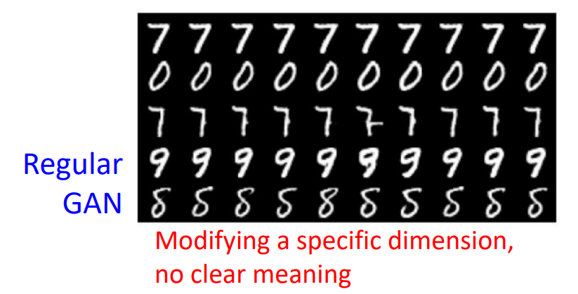

我们期望：

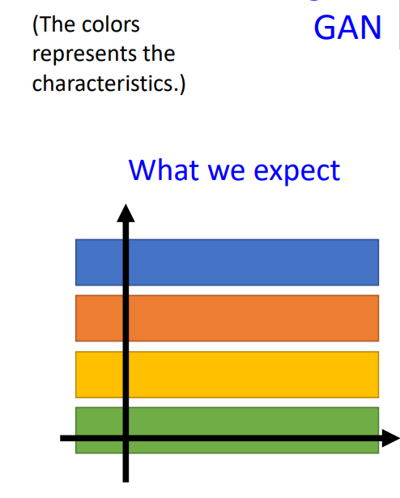

实际上：

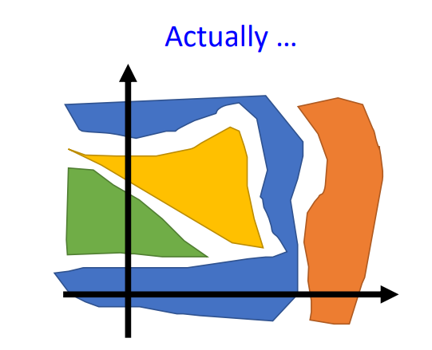

那什么是InfoGan呢，看下面一张图：

输入的z会分成两部分，一部分是高斯噪声z‘，另外一部分是输入一些指定的条件，比如输入1表示黄色头发，2表示黑色头发。然后会在正规GAN的基础上增加一个分类器，这个分类器要能够识别输入的c，这个言下之意就是x一定要和c构成对应的关系。

注意，一定要有一个discriminator，因为如果没有的话，只要将c粘贴到x上，这样就可以很容易识别出x的label了。因此一定要有discriminator来限制这个事情。

classifier和discriminator会共享参数。。。

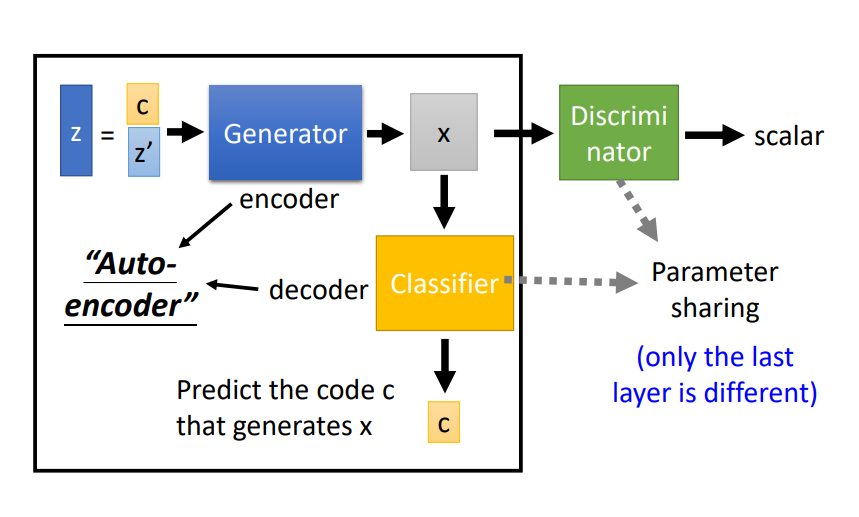

c的维度一定要对x有明确的影响，否则很难让classifier来判断x的类别。

另外注意：这个auto-encoder并不是常规的auto-encoder。而是返回来的autoencoder。

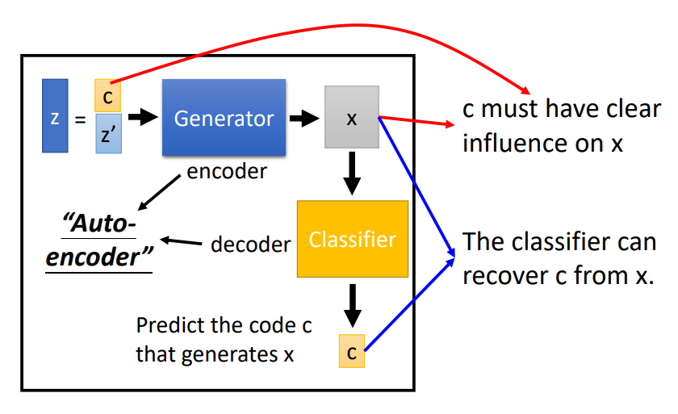

一个实验结果:

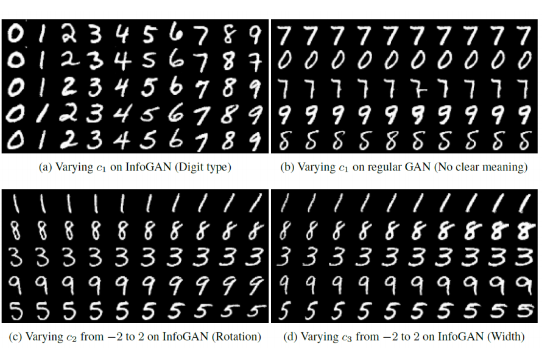

参考：https://medium.com/@jonathan_hui/gan-cgan-infogan-using-labels-to-improve-gan-8ba4de5f9c3d

## Conditional GAN

参考：https://zhuanlan.zhihu.com/p/23648795

本文提出了一种Conditional Generative Adversarial Networks，这是一种带条件约束的生成对抗模型，它在生成模型（G）和判别模型（D）的建模中均引入了条件变量y，这里y可以是label，可以是tags，甚至可以是一张图片，使用这个额外的条件变量，对于生成器对数据的生成具有指导作用，因此，Conditional Generative Adversarial Networks也可以看成是把无监督的GAN变成有监督模型的一种改进，这个改进也被证明是非常有效的，为后续的相关工作提供了指导作用。

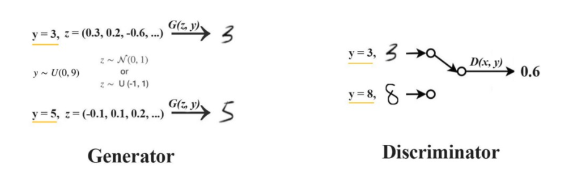

原始的GAN的优化目标为：

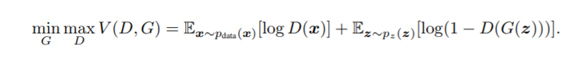

加上条件之后：

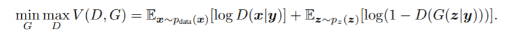

特别需要注意的是：生成器和判别器都需要输入y。

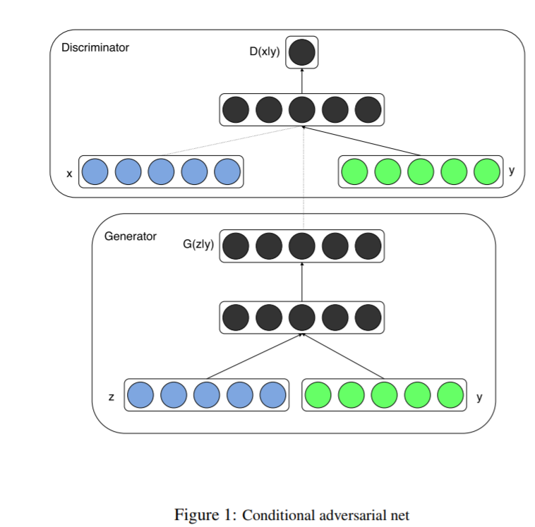

> 问题：生成器和判别器在训练的时候输入的y必须是一样的吗？

整体架构：

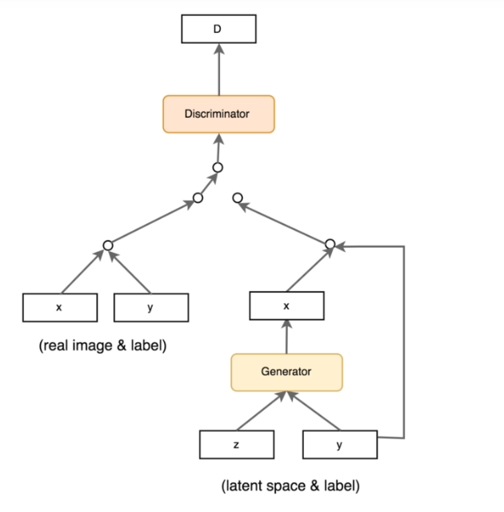

实验结果：

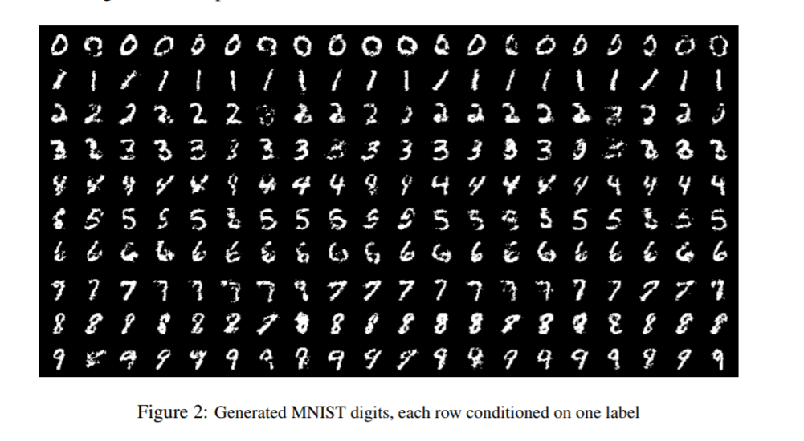

## PIX2PIX

论文地址：https://arxiv.org/abs/1611.07004

### 创新点

将cGAN作为图像到图像翻译问题的一个通用解决方案。

### 方法

GAN和cGAN

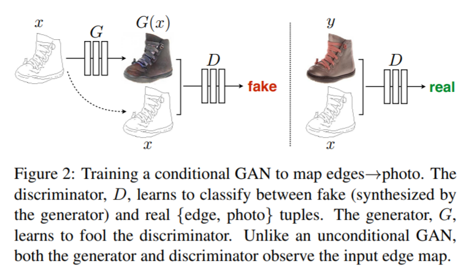

目标函数

cGAN的目标函数

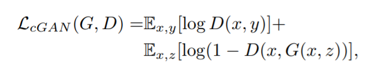

除此之外，还会在判别器中增加一个和gt相比的loss。

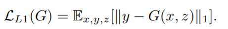

使用L1 loss的原因是可以防止模糊。

最终的目标函数：

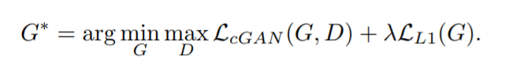

### 网络架构

生成器

图像翻译问题就是将一个高分辨率的输入映射到一个高分辨率的输出，输入输出的表面不太一样，但是都是一个潜在结构渲染。因为输入和输出需要对齐。

使用编码器-解码器的结构在之前是比较好的选择。本文选用U-Net的架构，因为有大量跨层连接，可以使边缘信息得到更好的传递。

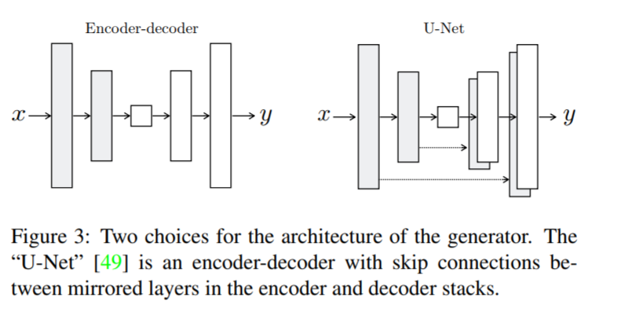

判别器

使用L1损失。
