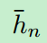
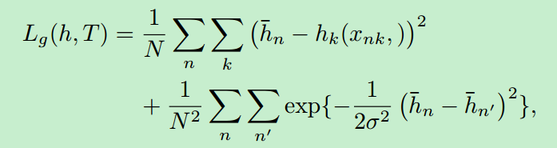
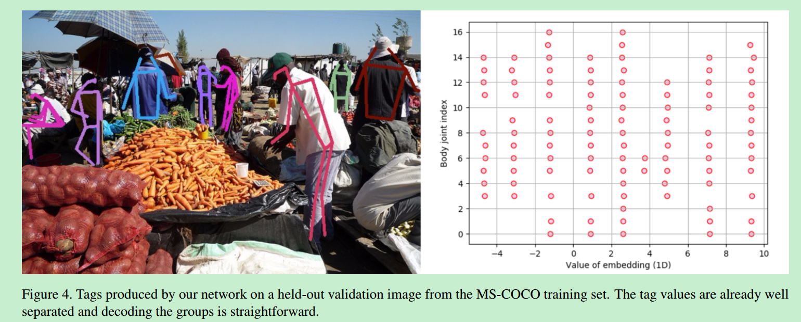

 # Associative Embedding: End-to-End Learning for Joint Detection and Grouping

论文信息

地址： [Associative Embedding: End-to-End Learning for Joint Detection and Grouping](https://arxiv.org/abs/1611.05424)

发表时间：Submitted on 16 Nov 2016 ([v1](https://arxiv.org/abs/1611.05424v1)), last revised 9 Jun 2017 (this version, v2)

## 贡献

1. 本文提出一种叫做associative embeeding的方法，用于做grouping。这种方法可以用于多人姿态估计，实例分割和多目标跟踪。
2. 通常对检测结果进行group需要多个阶段，但是使用了associative embedding方法可以进行end-to-end训练，这种方法可以整合到任何pixel-wise prediction的问题上。
3. 在MPII和MS-COCO多人姿态估计数据集上达到了最好的效果。

## 问题的提出

很多计算机视觉的任务的可以看做是joint detection和grouping。比如，对于多人姿态估计来说，首先把所有人的joint给检测出来，然后再将属于个体的关键点组合起来。实例分割也类似，首先将所有前景的像素给分割出来，然后再将属于个体的像素组合起来。再比如，目标跟踪，也是先检测出所有的物体，然后将相同个体的检测结果合并为tracks。

这些任务目前都需要两个阶段来完成，一个是检测，一个是组合，是非常繁琐的一种方法。因此，这篇文章提出了associative embedding的方法来解决这个问题，使整个网络能够end-to-end的训练。

## 整体架构

检测过程如上图，输入一张包含多个人的图片，经过堆叠的hourglass的架构。hourglass的架构是在人体姿态识别中经常用到的结构，具体参考hourglass笔记。这篇文章中对这个结构有做略微的修改，具体的修改参看原文。

经过hourglass的网络之后，会吐出来heatmap的检测和associative embedding的检测。heatmap的检测和其他多人姿态识别的方法是一样的，对于每个joint，都会有相应的heatmap进行预测。

问题的关键是怎么预测embeddings。

每个joint都会对应一个associative embedding的预测，如上图所示。注意这里的embedding的长度是1，实际上也可以取别的长度，但是作者发现，embedding的长度对实验结果不太影响，因此为了简单就直接使用一维的。我们现在的目标是，属于同一个人的所有joint我们要让它很接近，而不同人的joint我们要让它距离很远。

假设$h_k∈R^{W×H}$表示第k个joint的embedding。$h(x)$表示位置像素位置x对应的embedding值。对于N个人来说，让joint位置为$T=\{(x_{nk})\},n=1,...,N,k=1,...,K$，其中$x_{nk}$表示第n个人，第k个joint的真实像素位置。则表示第n个人的reference embedding。

然后计算grouping loss：

embedding学习的结果：

