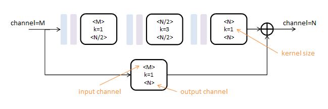
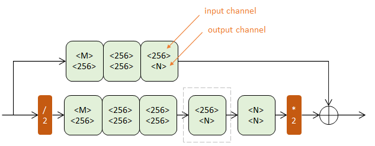
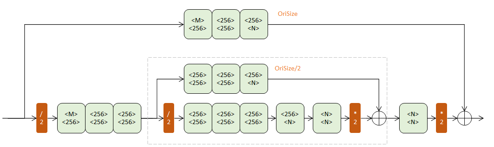
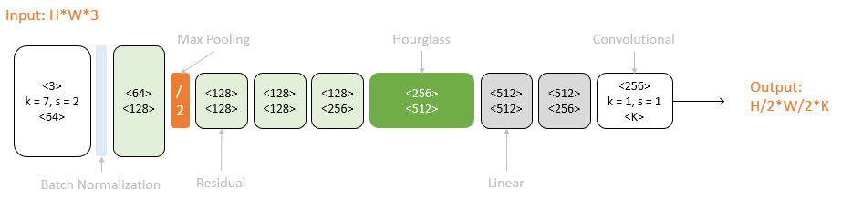
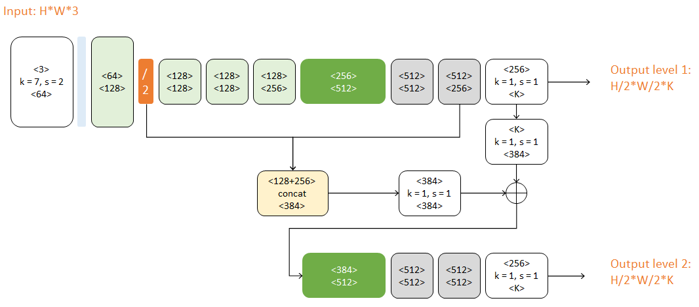
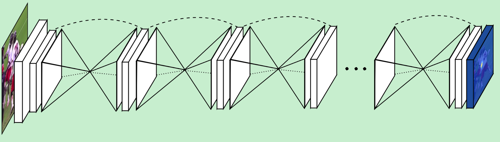

# Stacked Hourglass Networks for Human Pose Estimation

论文地址：[ Stacked Hourglass Networks for Human Pose Estimation](https://arxiv.org/abs/1603.06937)

发表时间：Submitted on 22 Mar 2016 ([v1](https://arxiv.org/abs/1603.06937v1)), last revised 26 Jul 2016 (this version, v2)

## 一、贡献

1. 本文使用全卷积网络解决人体姿态分析问题，截至2016年5月，在[MPII姿态分析竞赛](http://human-pose.mpi-inf.mpg.de/#results)中暂列榜首，PCKh指标达到89.4%。与排名第二的CPM(Convolutiona Pose Machine)[1](https://blog.csdn.net/shenxiaolu1984/article/details/51428392#fn:1)方法相比，**思路更明晰，网络更简洁**。 
2. 作者给出了基于Torch的[代码和模型](http://www-personal.umich.edu/~alnewell/pose/)。单显卡，测试时间约130ms，使用cudnn4的训练时间约3天，比CPM方法有显著优势。

## 二、Residual模块

本文使用的初级模块称为Residual Module，得名于其中的旁路相加结构（在这篇论文中[2](https://blog.csdn.net/shenxiaolu1984/article/details/51428392#fn:2)称为residual learning） 

第一行为卷积路，由三个核尺度不同的卷积层（白色）串联而成，间插有Batch Normalization（浅蓝）和ReLU（浅紫）； 
第二行为跳级路，只包含一个核尺度为1的卷积层；如果跳级路的输入输出通道数相同，则这一路为单位映射。 
所有卷积层的步长为1，pading为1，不改变数据尺寸，只对数据深度（channel）进行变更。 
Residual Module由两个参数控制：输入深度M和输出深度N。可以对任意尺寸图像操作。

> 设计思想：channel大的卷积，kernel要小；kernel大的卷积，channel要小。 
> 其实许多网络已经隐含了模块化的思想，例如AlexNet中重复出现的conv+relu+pool模式。

**作用：Residual模块提取了较高层次的特征（卷积路），同时保留了原有层次的信息（跳级路）。不改变数据尺寸，只改变数据深度。可以把它看做一个保尺寸的高级“卷积”层。**

## 三、Hourglass子网络

Hourglass是本文的核心部件，由Residual模块组成。根据阶数不同，有不同的复杂程度。

### 一阶Hourglass

上下两个半路都包含若干Residual模块（浅绿），逐步提取更深层次特征。但**上半路**在原尺度进行，**下半路**经历了先降采样（红色/2）再升采样（红色*2）的过程。 
降采样使用max pooling，升采样使用最近邻插值。

### 二阶Hourglass

把一阶模块的灰框内部分替换成一个一阶Hourglass（输入通道256，输出通道N），得到二阶Hourglass： 

两个层次的**下半路**组成了一条两次降采样，再两次升采样的过程。两个层次的**下半路**则分别在原始尺寸（OriSize）和1/2原始尺寸，辅助升采样。

### 四阶Hourglass

本文使用的是四阶Hourglass： 

或者如下图：

每次**降采样之前**，分出上半路保留原尺度信息； 
每次**升采样之后**，和上一个尺度的数据相加； 
两次**降采样之间**，使用三个Residual模块提取特征； 
两次**相加之间**，使用一个Residual模块提取特征。

## 四、完整网络结构

### 一级网络

以一个Hourglass（深绿色）为中心，可以从彩色图像预测**K个人体部件**的响应图： 

原始图像经过**一次降采样**（橙色），输入到Hourglass子网络中。Hourglass的输出结果经过两个线性模块（灰色），得到**最终响应图**。期间使用Residual模块（浅绿）和卷积层（白色）逐步提取特征。

### 二级网络

本文使用的完整网络包含两个Hourglass： 

对比上图，二级网络重复了一级网络的后半结构。第二个Hourglass的输入包含三路： 
\- 第一个Hourglass的**输入**数据 
\- 第一个Hourglass的**输出**数据 
\- 第一级**预测**结果 
这三路数据通过串接（concat）和相加进行融合，它们的尺度不同，体现了当下流行的**跳级结构**思想。

## 五、代价函数与训练

对于H×W×3的输入图像，每一个hourglass级都会生成一个H/2×W/2×K的响应图。对于每个响应图，都比较其与真值的误差作为代价。这种做法和[CPM](http://blog.csdn.net/shenxiaolu1984/article/details/51094959)方法类似，都体现了**中继监督**(intermediate supervision)的思想。

## 六、总结

本论文中值得学习的思想如下： 
\- 使用**模块**进行网络设计 
\- 先降采样，再升采样的**全卷积**结构 
- **跳级**结构辅助升采样 
- **中继监督**训练

 