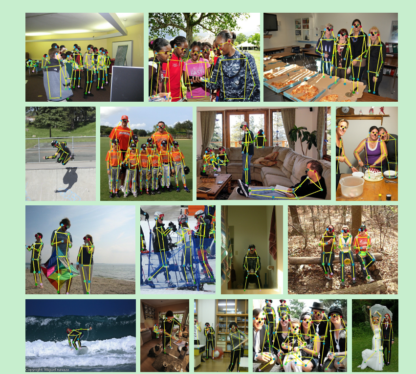
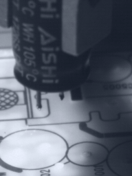
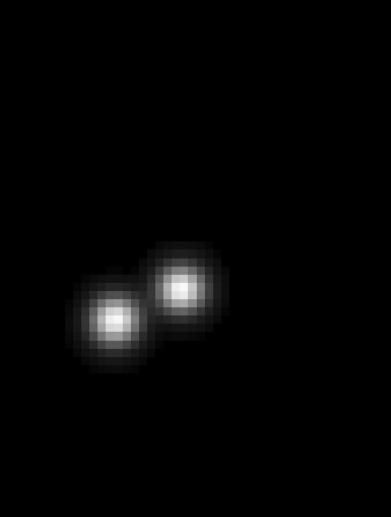
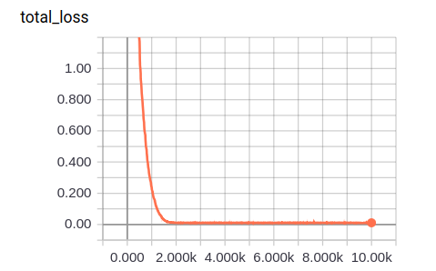
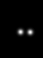
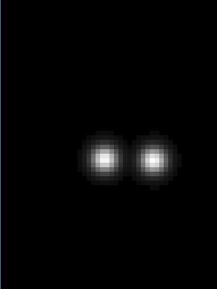

# Cascaded Pyramid Network for Multi-Person Pose Estimation

论文信息

发表日期：(Submitted on 20 Nov 2017 ([v1](https://arxiv.org/abs/1711.07319v1)), last revised 8 Apr 2018 (this version, v2))

face++出品，在COCO keypoint benchmark上达到了最好的结果

## 一、创新点

1. 提出一种全新有效的网络叫做级联金字塔网络（cascaded pyramid network，CPN），整合了全局金字塔网络（global pyramid network，GlobalNet）和基于在线难关键点挖掘（online hard keypoints mining，ohkm）的金字塔微调网络（pyramid refined network，RefineNet）。
2. 探索了各种影响top-dwon方式的多人姿态估计的因素。
3. 该算法在人体关键点检测*2017 challenging COCO multi-person keypoint benchmark*上拿了冠军。

## 二、 介绍

### 1. 什么是多人姿态估计

多人的姿态估计问题，实际上就是识别定位图片中多个人的关键点，如下图，每个人17个关键点，包括关节，眼睛，膝盖等等。多人的姿态估计有很重要的用途，比如人体活动识别，人机交互。

### 2. 多人姿态估计难点

多人姿态估计存在的问题：遮挡的关键点，不可见的关键点和复杂的背景。

已有的关键点检测方法：

- convolutional pose machine。

- Mask RCNN
- 等等...

但这些方法对遮挡的关键点（以下称为难点）不容易检测，因此本篇文章主要集中在解决难点的检测问题。

## 三、思想

本篇文章提出cascaded pyramid network（CPN）来解决多人姿态估计的难点。

具体来说，算法包括两个阶段：GlobalNet和RefineNet。

**GlobalNet**可以学习到金字塔特征，特征金字塔已经被证明是一种很好的多尺度特征表示方式。作者认为，金字塔结构可以提供足够的上下文信息，因此对于遮挡和不可见点具有很好的效果。GlobalNet可以很好地定位到简单的点，比如眼睛和手，但是对遮挡关键点和不可见关键点的精确识别做得还不够。

因此，**RefineNet**就来处理这些难点，它是基于GlobalNet中的特征金字塔，使用一种叫做在线难关键点挖掘（online hard keypoint mining loss）的方法来解决这些难点。

更宏观地说，本文使用了一种top-down的方式来进行多人姿态估计，首先，通过目标检测算法产生一系列关于人的bounding box。然后通过CPN来检测每个bbox中的人的关键点。

## 四、模型

本文提出的方法是一种top-down的方法，即首先通过人体检测器检测出一些列人体bbox。然后通过单人体的网络架构来精确识别定位每个人的关键点。

### 1. 人体检测器

人体检测器使用了FPN。另外也使用了Mask RCNN中的ROIAlign来代替ROIPooling。训练的时候将coco中所有的80类物体都拿来训练，然后用这个检测器检测出所有有人的bbox，用于姿态识别。

需要注意的是：人体检测器输出bbox大小是不一样的，但是CPN的输入大小是固定的，比如高宽256x192。所以会对人体检测器输出的bbox在保持原始图片的长宽比的情况下进行扩大或者缩小，使得最终的高宽为256x192。

### 2. CPN

CPN包括GLobalNet和RefineNet。整体架构如下图：

#### 2.1 GlobalNet

GLobalNet使用ResNet作为骨架网络，使用了FPN架构，与原始FPN不同的是，在上采样的过程中，在进行element-wise sum的前面加了一个1x1卷积。GlobalNet在FPN结构的各个层级的特征上都输出关键点的heat map，resize到指定输出大小，然后计算l2 loss。实际上，只由这个结构就可以进行姿态估计了，但是单单一个GLobalNet还很难去检测人体的一些难点，比如臀部。因此需要RefineNet来进行更深一步的检测。

#### 2.2 RefineNet

RefineNet包括ResNet block，上采样和concate。

由于FPN结构出来的Feature有4个层级，每个层级的分辨率大小是不一样的。小分辨率的特征由于丧失了较多的位置信息，因此会经过更多的ResNet block，如下图：

接着通过上采样和concate整合了金字塔特征，输出heat map并resize到指定输出大小，最后计算L2 loss。

### 3. 在线难关键点挖掘

随着网络的训练，网络会倾向于把注意力放在简单的关键点上，所以必须要去平衡简单点和难点。本文提出在线难关键点挖掘的方法来解决这个问题，这个过程是在RefineNet中做的。下面介绍这种方法。

假设原始图片的输入大小是256× 192 x 3，输出的heatmap大小是原始图片的1/4，则输出的heatmap尺寸为64x48x17，这里的17表示17个关键点，也就是说，输出的每个通道只负责预测一个关键点。我们对64x48x17的17个通道分别计算每个通道的平均loss（即对于每个通道的feature map的64x18个计算平均loss），得到17个关键点的loss。然后根据17个loss，选出最高的k个（比如k=8表示有8个关键点是很难检测的）loss进行相加，就是RefineNet的loss。进行反向传播的时候，其他关键点就不参与梯度更新了，而只有这8个关键点参与梯度更新。这种方式就是在线难关键点挖掘。

## 五、实验效果

以下是CPN的检测效果可视化：

## 六、用于针脚检测

### 1. 复现细节

- 随机Crop原始图片作为训练数据

- 使用有pretrained model的ResNet50作为基础架构

- 与CPN不同的是，我们的case中只有2个关键点，没有必要输出两个通道的heatmap，因此修改为输出单通道的heatmap，在这个heatmap中包括左针脚和右针脚的预测

- 由于只有一个通道，没有做在线难关键点挖掘的操作，因此将其修改在heatmap上做在线难关键点挖掘，或者直接删除在线难关键点挖掘。

  

  

### 2. 实验

#### 2.1 训练

loss:

原图：

gt:

预测

#### 2.2 测试

loss:

原图：

gt：

预测：

