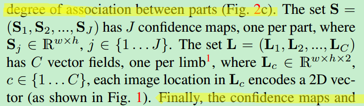

# Realtime multi-person

## 1. 创新点

1. 提出一种高效检测2D图像中多人姿态的的方法。
2. 使用Part Affinity Fields（PAFs）方法来关联个体的部位。
3. 在多人姿态估计数据集MPII上达到了最佳效果。

参考：https://blog.csdn.net/yengjie2200/article/details/68064095

## 2. 介绍

### Pose estimation 的挑战：

1〉图像中人数不确定，可能在任何位置以任意尺度出现。

2〉人与人之间因接触，遮挡而变得复杂。

3〉实时性的要求，图像中人越多，计算复杂度越大。

### 多人姿态识别的两种通用方法

**top-down**

先检测出单个人，再检测单个人的姿态。

问题: 1〉人离得近的时候person detector很容易检测不到

​          2〉计算时间和人数有关，人越多越耗时。

**down-top**

先检测出多人的关键点，再得到单人的关键点组合。

本文使用bottom up 的方法，本文提出Part Affinity Fields (PAFs)方法，PAFs就是指一组2D向量场。每个2D vector field会编码一个limb（肢）的位置和方向。

这些fields（包含部位的连接和方向）和 部位的置信heatmap一起来进行学习和预测。

## 3. 方法

整个流程如下图：

网络的输出：

包括$S$和$L$，分别代表heatmap输出和场输出。

### 3.1. Confidence Maps for Part Detection

每一个身体部位（j）算一个confidence map。所以有多少个part（关节），就有多少个相对应part的confidence map。图像区域中每个点都有一个confidence值，构成confidence map。confidence map中每点的值与真值位置的距离有关，离得越近confidence 越高。用高斯分布来描述，confidence峰值就是真值位置。

假设k个人，图像中每个人都有预测位置的confidence map，将k个人的confidence map的集合合成为一个confidence map时，取该点各个人的confidence的最大值。如下图：

文章里说这里用max而不用average是为了：及时多个peak点离得很近，仍然不受影响。在test阶段，在预测的confidence maps上进行非极大值抑制来获得body part candidates.

### 3.2. Part Affinity Fields for Part Association

有了body parts, 那么在不知道几个人的情况下怎么把这些body parts 组合成full-body pose （哪些parts是同一个人的）？

思路1（最终未使用）：

任意两body parts之间是否相连接需要一个置信度（是否同一个人）的measurement. 

那么，可以在两body parts之间连线的中间取n个点，计算它们的confidence map来作为measurement.

在limb（肢）上n个点的confidence maps中取最大的值合成limb（肢）c的confidence map-Sc。

在test时，confidence score的计算方法：

计算预测的PAF（vector）与candidate limb 方向的alignment (方向是否一致，用点积计算）。

### 3.3. Multi-Person Parsing using PAFs

这部分讲在得到了confidence map 和 part affinity fields后如何进行推理分析，也就是所谓的bottom-up算法。

先定义一些表达：

假设通过对confidence map进行极大值抑制，得到多个body part，每个body part 有多个detection candidate。 (图像中有多人，所以会有多个detection candidate）。

假设是第j个body part 的第m 个detection candidate的location.

下面的z表示连接关系,目的是找到最优的可能连接方式。

找到两两body part 之间最优连接的问题：

就变成了a maximum weight bipartite graph matching 的问题，如图4a。

\----

关于maximum weight bipartite graph matching problem：

可参考<http://www.csie.ntnu.edu.tw/~u91029/Matching.html> 来理解概念，具体求解的方法有很多，本paper使用Hungarian algorithm是链接中的匈牙利演算法。

[另外，paper 上的Refer：D. B. West et al. Introduction to graph theory, volume 2. Prentice hall Upper Saddle River, 2001. 4]

\----

所以，变成graph问题后，可以这样理解：

graph的nodes就是body part detection candidates,

graph的edges就是所有可能的body part之间的connections，

每个edge上的weight就是公式7计算出来的part affinity aggregate.

A matching in a bipartite graph is a subset of the edges chosen in such a way that no two edges share an node.

就是找到权值最大的edge连接方式。

下面是数学表达式。

本paper使用Hungarian algorithm来获得最大匹配。

.

找到multiple persons的full body pose的问题就变成：

在K-partite graph 中求maximum weight cliques partition,如图5a。

（其实paper最终并没有做整个graph的 优化，而是作了简化。下面其实是为了解释简化是有道理的。）

\-----

   ps: 在英文的表达中，maximal clique和maximum 完全不同的。
   团clique（clique）是一个无向图（undirected graph ）的子图，该子图中任意两个顶点之间均存在一条边。
   极大团maximal clique是一个团，该团不能被更大的团所包含，换句话说，再也不存在一个点与该团中的任意顶点之间存在一条边。
   团的大小size是指一个团中包含的顶点数，size=k的团，称为k-团。
   最大团maximum clique是指一个图中size最大的maximal clique。

\--------

 

求解上述的maximum weight cliques partition：This problem is NP hard [39] and many relaxations exist.

\---

ps:关于NP hard可参考<http://blog.csdn.net/bitcarmanlee/article/details/51935400>

用通俗的话来解释，NP问题就是其解的正确性很容易被检验出来，这里的很容易检验指的是存在一个多项式算法。

\----

本文中为优化增加了两个relaxation ：

1.选择最少的edges形成tree skeleton（骨骼）of human pose，而不使用整个的graph

2.把cliques partition problem 分解成一系列的bipartite matching subproblems，然后独立地分析adjacent tree nodes之间的匹配。

然后paper中论述了为什么采用minimal greedy的算法（取每一小步的最优组成最终的最优）也包含着global inference over multiple person,大致意思是因为CNN本身有比较广泛的感受野，所以global的信息也在里面了。

（这里我的理解比较肤浅，其实就将求整体graph最优，简化为了求两两part连接最优。只要单独算出来的每个limb是最优的，组合在一起就是最优的。）

在这两个条件下，优化问题就简化成：

所以，通过公式（8）-（10）我们可以顺序获得每个limb（肢）的正确的correct candidates.

然后把share 同一part的limb集合在一起就得到了full-body pose。

上图是本文的网络结构。

网络分成多个stages，在每个stage结束的时候有intermediate（中间的） supervision（监督）。

在第一个stage，前10层学习到的图像特征F将会被后续的stage使用。

在训练的时候，前10层初始化自VGG-19。

10层之后，网络分成2路，每路在loss之前有5层。

S是confidence map （J个size为h‘*w‘，J是body part type的数量），

L是PAF（C个size为h‘*w‘（*2？此处paper未说，从公式6看应该是w*h*2吧），C是limb type的数量）。

在每个stage之后，S及L都和stage1中的F再汇合，作为下个stage的输入。

loss方程：计算预测和理想值之间的L2 loss。（2个branch都是这么计算）

这里，loss方程有一个空间上的加权weight spatially，是因为有些数据集并没有完全标记所有的人，用其提供的mask说明有些区域可能包含unlabeled的人。

W是binary mask。在没标记的位置W为0。

下面是在第t个stage时的loss方程。 

 

最终的目标函数是将各个stage的loss求和。

# **4. Result**

在2个数据集上测试：1〉MPII   2〉MSCOCO2016

对尺度比较小的人检测效果不如其他算法。

It is the noteworthy that our method has won, but has lower accuracy than the top-down methods on people of smaller scales (APM). The reason is that our method has
to deal with a much larger scale range spanned by all people in the image in one shot. In contrast, top-down methods rescale the patch of each detected area to preferable size independently and thus suffer less from small people. 

### 网络架构

## confidence map

## 使用PAFs进行多人解析

1对heatmap进行NMS，得到离散的part candidate location。对于每个part，可能有多个candidates。