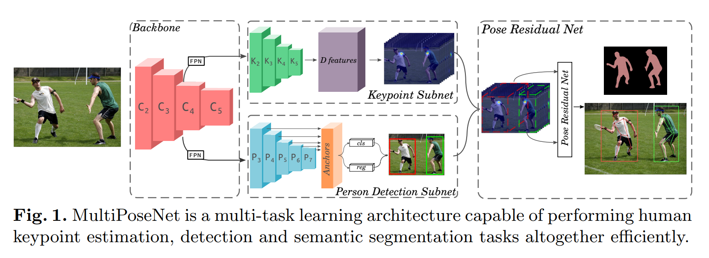
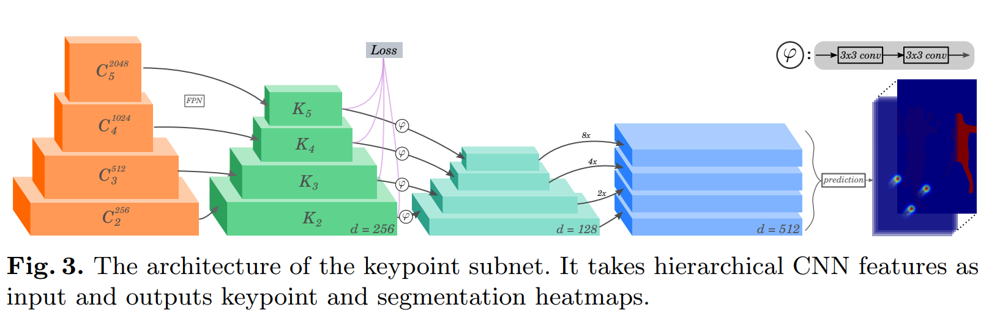
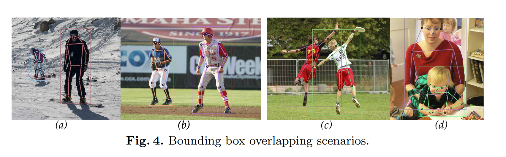
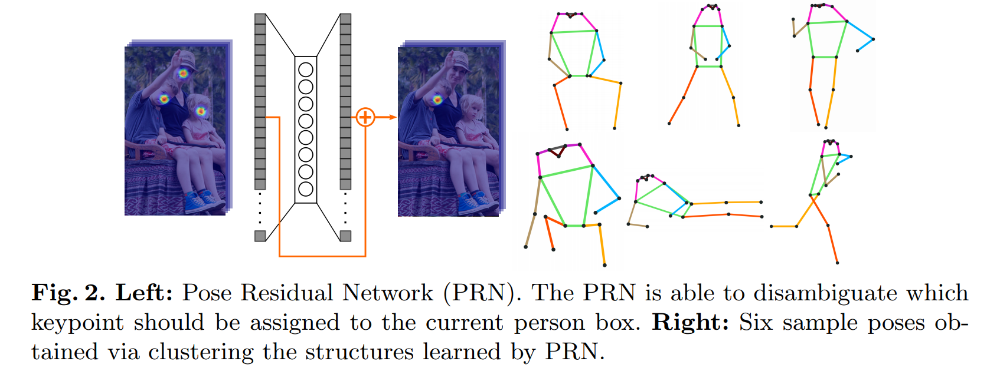

# MultiPoseNet

## 创新点

使用目标检测的bbox作为grouping的手段，对于同个bbox框到其他实例的关键点的情况，采用一个全连接残差网络进行refine。

## 网络结构

目标检测和关键点检测共享一个骨架网络，但是有两个FPN网络来分别做这两个任务。

**关键点检测网络**

FPN结构预测关键点和语义分割。

**人体目标检测网络**

使用refineNet的架构，加上focal loss。

**Pose Residual Network (PRN)**

对与bbox做grouping存在一个问题，就是一个bbox里面可能存在另外一个人体的关键点。为了解决这个问题，这里使用一个叫做Pose Residual Network (PRN)的网络来进行refine。

为什么能这么做的原因？

人体关键点存在某种特定的模式。