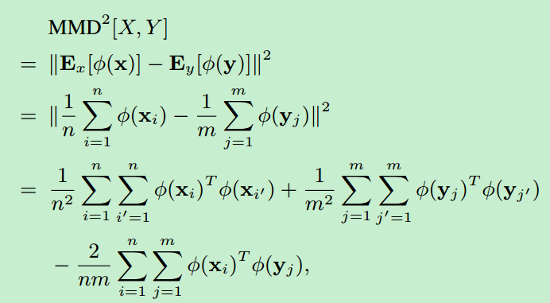
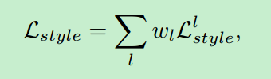
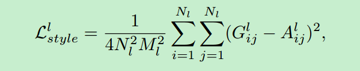
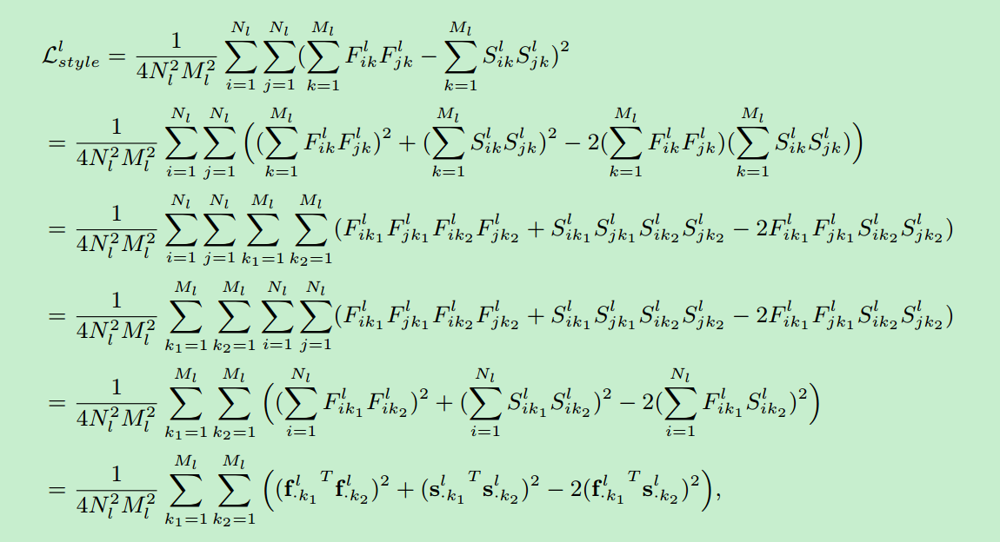
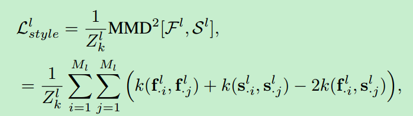
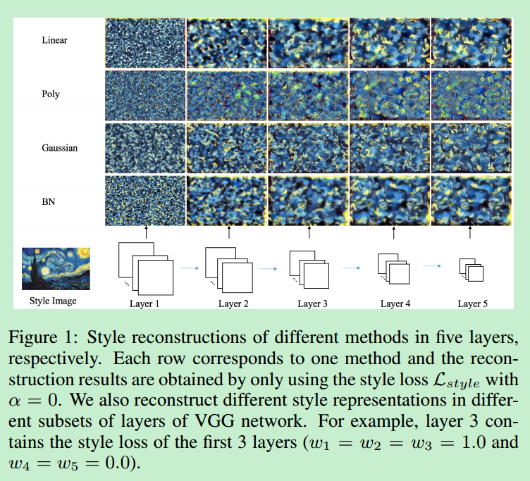
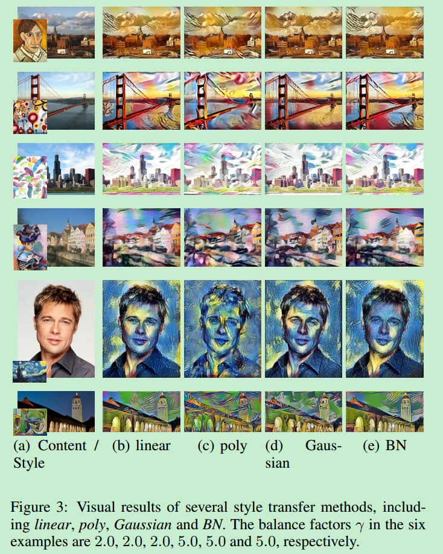

#  Demystifying Neural Style Transfer

## 一、创新点

Neural Style Transfer（NST，神经风格迁移）已经被研究得非常多了，但是仍然存在一些没有被说明白的问题，其中最重要的一个问题就是：为什么Gram矩阵能够表示风格？这篇文章就对这个问题提出了一个全新的解释。

作者把NST问题当做一个**domain adaptation**的问题。具体来说，作者发现Gram矩阵的匹配问题实际上等同于最小化二阶多项式核的Maximum Mean Discrepancy (MMD) ，而MMD是一种分布差异性的度量，因此NST的本质就是匹配风格图像和生成图像的特征分布。

## 二、基本概念解释

### 1. Domain Adaptation

Domain adaptation属于迁移学习的一种。它的目标就是将在source domain学习到的模型迁移到target domain上，而且target domain通常是没有label的。domain adaptaion很重要的一点就是要使source domain和target domain分布的差异性最小。那么问题来了，这个分布的差异性要怎么衡量？一种很常用的差异性度量方法就是Maximum Mean Discrepancy (MMD，最大平均差异)，它在Reproducing Kernel Hilbert空间中衡量了样本均值的差异性。

参考：https://www.sohu.com/a/227995138_642762

### 2.Maximum Mean Discrepancy 

假设我们有两个样本集，分别表示为$X=\{x_i\}_{i=1}^n, Y = \{y_j\}_{j=1}^m$，其中$x_i$和$y_j$分别表示从分布$p$和$q$产生的数据。

那么MMD则定义为：

其中$\phi(·)$ 是一种特征映射函数。如果使用kernel function：$k(x, y) =<φ(x),φ(y)>$，则上式可以表示为：

kernel function隐式地将样本从一个低维特征空间映射到一个更高维的特征空间。

## 三、重新理解NST

### 1. 回顾NST

NST要做的事情就是，给你一个内容图片$x_c$和一个风格$x_s$图片，你去产生一个新的图片$x{^\star}$。它们对应的feature maps的矩阵表示分别为：$P^l∈R^{N_l*M_l},S^l∈R^{N_l*M_l},F^l∈R^{N_l*M_l}$，$N_l$表示$l$层feature maps。$M_l=feature\_map\_width*feature\_map\_height$。

NST就是通过优化以下目标函数来生成合成图像$x^\star$:

其中$\alpha$和$\beta$分别表示内容和风格loss的权重。

其中，内容损失为：

风格损失为：

其中，$w_l$表示为各层loss的权重。注意，风格损失包括多层，每一层的损失为：

其中合成图片的Gram矩阵：

$A_{ij}^l$为风格图片对应的Gram矩阵，定义和Gram矩阵类似。

### 2. 重新形式化风格loss

风格loss：

可以进行转化：

其中$f_{.k}^l$和$s_{.k}^l$分别表示$F^l$和$S^l$的第$k$列。如果使用二阶多项式核：$k(x,y) = (x^Ty)^2$，则上式可以简单地表示为：

其中

和

的分别代表$F^l$和$S^l$的列构成的集合。这样，实际上把feature maps中每一个位置对应的向量当成了一个样本。因此，style loss忽略了特征的位置。

以上的式子表明：

1. 图像的风格本质上可以表示成CNN层的特征分布。
2. 风格迁移可以看成是分布对齐的过程。

~~~yaml
The style transfer can be seen as a distribution alignment process from the content image to the style image
~~~

### 3. 使用不同的adaptation方法做NST

以上的解释表明NST被当做分布对齐问题，这个在domain adaptation中也是很重要的一个问题。如果我们把一张图像在CNN中某一层的风格当做一个domain，风格迁移也能够被当做一个domain adaptation的问题。不过问题的特殊性在于，我们把feature maps上每一个点对应的向量当做了一个数据样本。

由以上讨论已经知道，匹配Gram矩阵实际上可以被当做一个二阶多项式核的MMD过程。如果使用MMD统计测量风格的差异性，style loss可以表示为：

其中$Z_k^l$是一个归一化项。理论上，不同的kernel function隐式第将特征映射到更高维的特征空间，因此，如果使用其他的kernel funciton也可以捕捉不同种类的风格。本篇文章主要采取了三种比较流行的kernel function。

对于多项式核，我们只采用d=2。注意，匹配Gram矩阵就等同于采用了c=0，d=2的多项式核。

对于高斯核，采用MMD的无偏估计，它采样了$M_l$对样本，因此可以达到线性计算复杂度。

### BN Statistics Matching

*Revisiting batch normalization for practical domain adaptation*这篇文章中讲到，BN的统计量（均值和方差）能够表示domain的显著特征，不同domain，这些统计量的差别会很大，因此用BN统计量来表示不同的domain。这种表示可以很好地将两个domain distribution进行很好地对齐。本篇文章受这个启发，加上前文已经说明风格迁移实际上就是一个domain adaptation的问题，作者认为将层的BN统计量来表示表示风格也是完全可以的。

因此，可以通过BN统计量来构建两个feature maps的style loss：

其中，$\mu_{F_l}^i$和$\sigma_{F_l}^i$分别表示生成图像$x^*$的第$l$层，第$i$个通道对应的feature map的均值和方差。

$\mu_{S_l}^i$和$\sigma_{S_l}^i$表示的是风格图像，意思同上。

## 四、实验结果

实验结果主要包括：

1. 实现细节。
2. 将多种风格迁移方法进行融合。

### 1.实现细节

- 使用VGG19网络。

- content loss：$relu4\_2$

- style loss: $relu1\_1, relu2\_1, relu3\_1, relu4\_1, relu5\_1 $

- $w_l$: 都设置为1。

- $x^*$进行随机初始化。

- 两次迭代改变小于0.5%，则停止迭代。最多迭代1000次。

### 2. 不同的风格表示

对风格进行特征重构分析。

由图可知：

1. 不同层捕捉了不同级别的分割：深层纹理相比于浅层有更大的粒度。这个非常合理，因为深层的特征有更大的感受野，因此可以捕捉更加全局的纹理。
2. 不同种风格迁移方法捕捉到的风格是不一样的。

### 3. 平衡因子的影响

### 4.不同迁移方法的比较

### 5.不同风格迁移方法的融合

