# Image Style Transfer Using Convolutional Neural Networks

## 一、什么是图像风格迁移

图像风格迁移就是将**风格图片(style image)**的风格和**内容图片(content image)**的内容结合在一起产生一个新的图片。

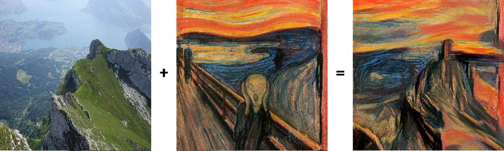

## 二、动机

以不同的风格渲染图像的语义内容在过去是一个非常困难的图像处理任务。传统的方法的一个主要限制因素是：缺乏图像语义信息的一个好的表示，所以很难将图像内容与风格分开。而CNN是很好的图像表示的算法，可以对图像进行分层的特征表示，因此本文利用CNN来对图像的风格和内容进行分离和组合。

## 三、模型

### 1. 深度图像表示（ Deep image representations）

深度图像表示的意思就是用一个深度学习模型的特征来表示图像。在这篇文章中，作者用到了VGG19网络。

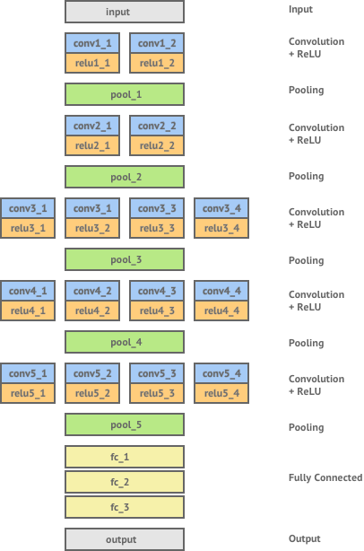

在使用VGG19网络的时候，进行了一些修改，主要有以下几点：

1. 对网络进行标准化，通过缩放网络权重，使得每一个卷积层中每个feature map的均值为1**（暂时不知道这个怎么操作的，以及为什么要进行这个操作，附原文如下）**。

   ~~~yaml
   We used the feature space provided by a normalised version of the 16 convolutional and 5 pooling layers of the 19-layer VGG network.We normalized the network by scaling the weights such that the mean activation of each convolutional filter over images and positions is equal to one. Such re-scaling can be done for the VGG network without changing its output, because it contains only rectifying linear activation functions and no normalization or pooling over feature maps. 
   ~~~

2. 不使用全连接层。 

3. 将MaxPooling用average pooling取代，作者发现经过这个改变，效果更佳。至于为什么，并没有说。

### 2. 内容表示（Content representation）

假设网络的某一层$l$总共有$N_l$个feature map，每个feature map的大小是$M_l, M_l=feature\_map\_width*feature\_map\_height$。将每个feature map拉成一个向量，排列在矩阵$F^l∈R^{N_l*M_l}$的每一行。则$F_{ij}^l$就表示 第$i$个feature map在位置$j$的激活值。

如果分别用$P^l$和$F^l$表示**生成图片$\vec{p}$**和**原始图片$\vec{x}$**在层$l$的特征，那么就可以定义它们之间的均方误差：

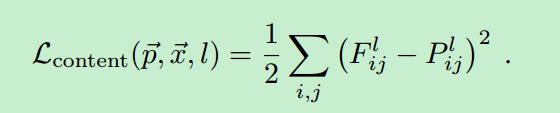

我们知道，CNN网络，层越深，表示的内容越抽象，层越浅，则表示一些细节特征。因此，越深层的特征，更关注图片的内容，而对于精细的特征可能就不是很敏感。如下图所示，图像中表示了不同层特征重构回原始图像的结果（重构方法见论文：understanding Deep Image Representations by Inverting Them）。从图中可以看到，深层的特征捕捉到了高阶的内容，比如图像中有什么物体，以及物体之间的相对排布，但对于像素级别的重构不太关注。相反，来自较低层的重构则简单地再现原始图像的精确像素值。

### 3. 风格表示（Style representation）

为了得到一个输入图像的风格表示，我们使用某个特征空间来捕捉图像的纹理信息，这个特征空间可以是任意一个卷基层特征。特征空间包含了不同filter response（实际上就是feature maps中的feature map）之间的相关性，这些特征相关性可以通过Gram矩阵来表示，Gram矩阵$G^l∈R^{N_l*N_l}$，其中$G_{ij}^l$是通过把第$i$个展开成向量的feature map和第$j$个展开成向量的feature map进行内积得到的。

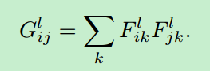

通常会对多个层计算Gram矩阵，得到特征相关性，这实际上就对输入图像进行了多尺度的表示，这种表示捕捉了纹理信息（风格），但是并没有关注global arrangement。同样，也可以通过重构方法进行可视化，如上图。

> 风格重构：给网络喂一个白噪声图片（白噪声图片当做网络可训练参数）和一张原始图片，通过梯度下降方法最小化白噪声图片和原始图片Gram矩阵的均方误差。训练好之后，进行重构就可以了。

第$l$层 ，原始图片和生成图片的Gram矩阵分别表示为：$A^l$和$G^l$，则$l$层的总loss为：

相应地，所有层的风格loss为：

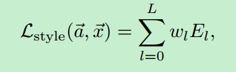

其中，$\vec{a}$表示风格图像，$\vec{x}$表示生成图像。

### 4. 风格转移（style transfer）

将内容表示和风格表示结合起来一起算loss，就可以做风格转移。

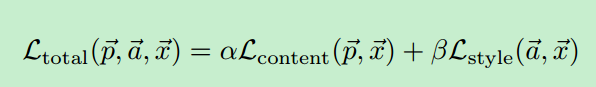

其中$\alpha$和$\beta$分别表示内容和风格loss的权重。

注意点：

1. 文章说用到了L-BFGS的优化方法，作者发现这种方法对于图像生成的效果最好。
2. 将风格图像resize到和内容图像一样的大小。

### 5. 整体架构

## 四、实验结果

内容表示只用到：

> conv4_2

风格表示用到多个层：

> ‘conv11’, ‘conv2 1’, ‘conv3 1’, ‘conv4 1’ and ‘conv5 1’
>
> ($w_l$ = 1/5 in those layers, $w_l$ = 0 in all other layers) . 
>
> The ratio $α/β$ was either 1 × 10−3 (Fig 3 B),  8 × 10−4 (Fig 3 C), 5 × 10−3 (Fig 3 D), or 5 × 10−4 (Fig 3 E, F)

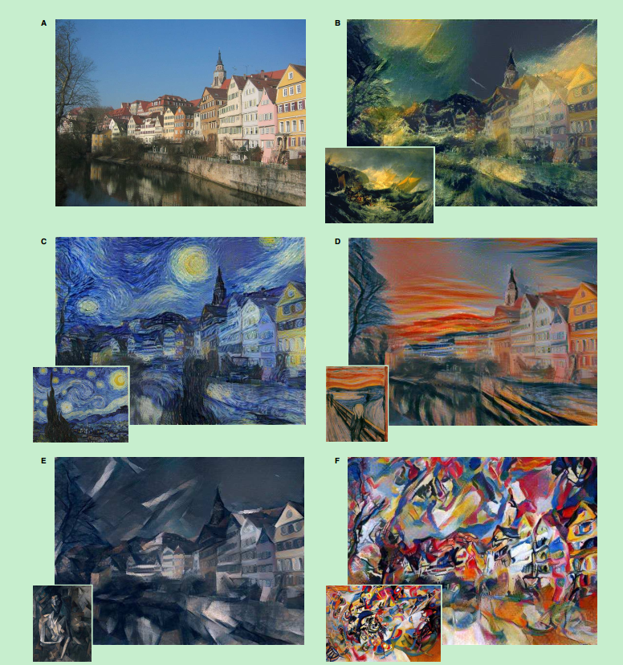

### 1. 内容和风格之间的平衡

内容和风格之间的比重可以通过loss function中的比重系数来进行调节。比重不同，结果也不相同。如下图。

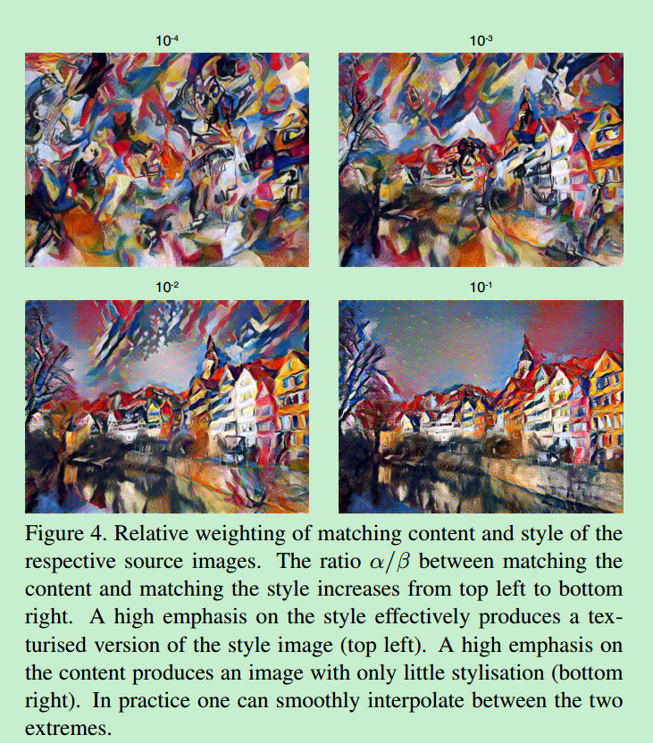

### 2.不同卷基层的效果

使用哪些层来做风格表示和内容表示是影响图像生成的另外一个非常重要的因素。

**风格表示层**

通常情况下，风格表示会用到多个卷基层，也就是说它是一个多尺度的表示方式。

作者发现，利用从低到高的多个层进行风格表示，图像局部结构尺度逐渐变大，变得更加光滑和连续。

**内容表示层**

如果在低层进行内容表示，则生成的图像的细节信息保存的很全面，而风格则不明显。用高层特征表示则反之。下图分别显示了$conv2\_2$和$conv4\_2$两个卷积层上的特征表示的结果。

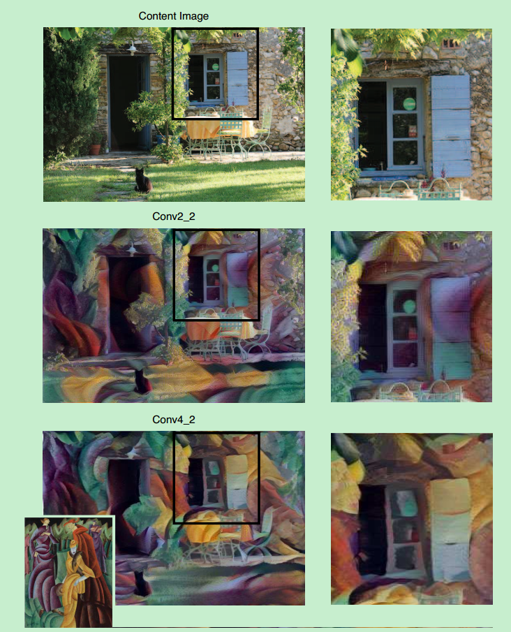

### 初始化

之前讲的都是对生成图片进行白噪声初始化。但实际上还有另外两种初始化方式，一种就是初始化为内容图像，另外一种是初始化为风格图像。但是实验结果并没有显示出这些不同的初始化方式有什么很大的不同。如下图所示：

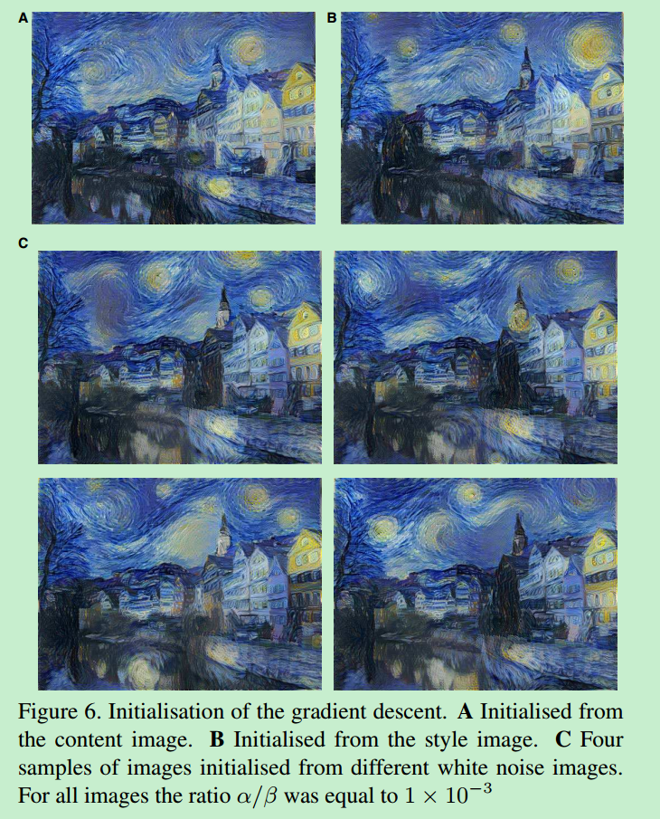

但是，需要注意的是，只有初始化为随机噪声，每次生成的照片才可能不一样，如果初始化为内容图像和风格图像的生成结果都是一样的（因为目标函数完全一致，当然前提是保证目标函数一致优化结果就一致）。

### Photorealistic style transfer

此前讲的都是关于艺术图像风格迁移的，实际上任意两张图片都可以进行风格迁移，比如下面的例子：

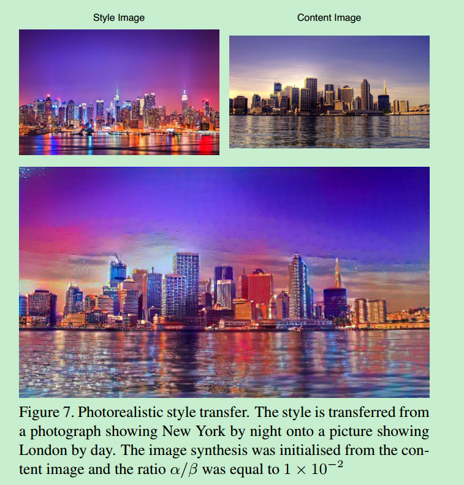

## 五、存在的问题

1. 速度慢。生成一张512x512的图片大约要一个小时，这个导致不能进行实时应用。
2. 合成的图像有的时候存在一些噪声，这对于艺术图像的风格迁移看起来可能没什么问题，但是如果是真实图像之间的风格转移可能问题就会比较大。

