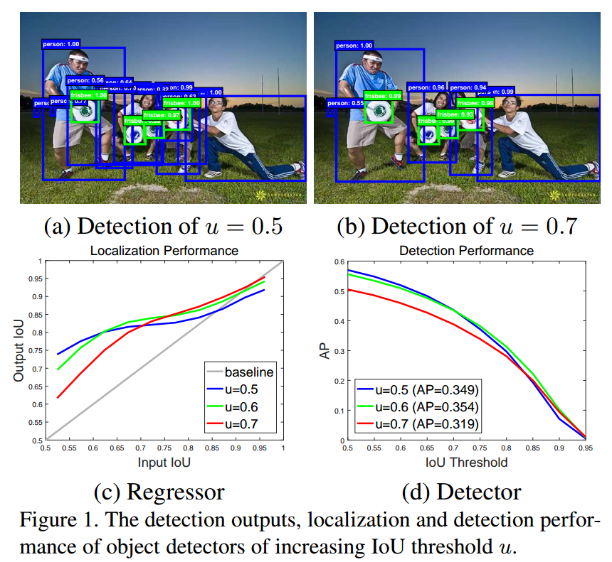
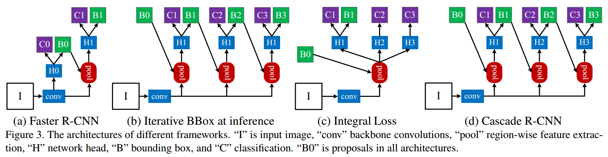
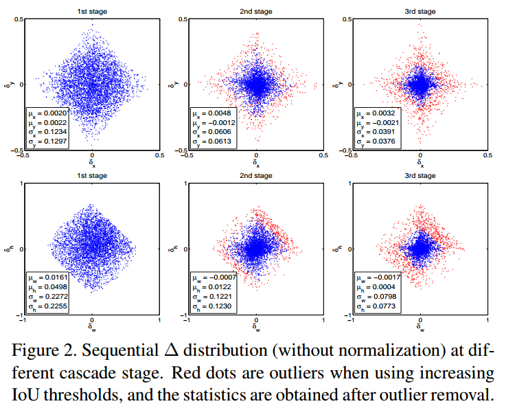
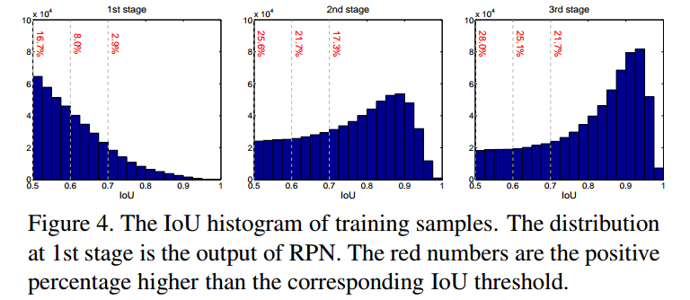
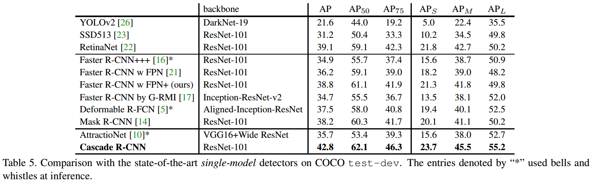
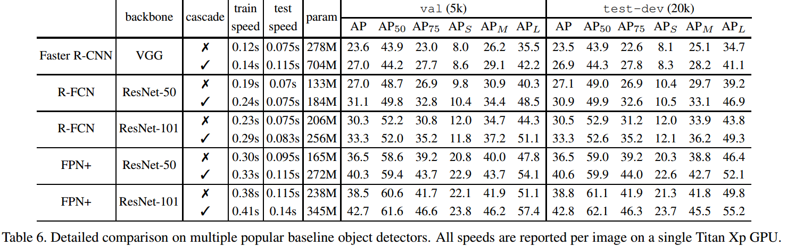

# Cascade R-CNN

论文地址：[Cascade R-CNN: Delving into High Quality Object Detection](https://arxiv.org/abs/1712.00726 )

代码：<https://github.com/zhaoweicai/cascade-rcnn> 

## 1 创新点

​    本文是CVPR2018论文，对两阶段检测器进行了深入分析，是一篇非常值得深入研究的论文。本文主要贡献为：

​    (1) 深入研究了目标检测中的IoU阈值选取问题，并通过大量的实验分析验证了IoU阈值选取对检测器性能的影响

​    (2) 基于上述研究，提出一种迭代bbox回归的级联RCNN网络，可显著提高bbox质量，提供检测精度，效果是非常好的

## 2 核心思想

​    我们知道，在两阶段目标检测器中例如Faster RCNN，RPN输出ROI，然后输入到RCNN层进行分类和回归，在RCNN层中，一般是设置IOU=0.5来进行正负样本划分，对于分类问题，对正负样本都进行softmax Loss计算，而对于bbox回归，是只使用正样本的。可以看出，这个IOU阈值设置是非常关键的。本文就是从IOU着手进行深入分析。

​    首先分析IOU阈值对检测结果的影响，如下图：

如上图所示。先看左图，横轴的是proposal的IoU，纵轴的是经过box reg得到的新的IoU，不同的线条代表不同阈值训练出来的detector。以u=0.5为例，当对RPN输出的ROI使用阈值0.5来切分正负样本，对于那些bbox质量较差(input IOU<0.55),经过RCNN bbox回归后，效果提升明显，IOU可以直接回归到0.75，且随着bbox的质量增加，RCNN回归后的bbox质量也会增加，但是input IOU越大的bbox，回归后提升越来越不明显，虽然精度没有下降。再看u=0.7，对于低质量的bbox，其提升比较少，因为低质量的大量bbox被滤掉了，没有得到训练，但是对于高质量的bbox，提升就比较大了。0.55~0.6的范围内阈值为0.5的detector性能最好，在0.6~0.75阈值为0.6的detector性能最佳，而到了0.75之后就是阈值为0.7的detector了。**只有输入bbox自身的IOU和训练器训练用的阈值IOU较为接近的时候，训练器的性能才最好**，如果两个阈值相距比较远，就是mismatch问题。简单来说就是如果当前RPN输出的bbox质量都一般，大部分是0.5 IOU的边界框，此时就应该用IOU=0.5的阈值进行RCNN训练，这样才会达到最佳效果。

​     再看右图，在IOU=0.5到0.6的时候，检测性能下降比较少，但是一旦IOU=0.7，检测性能就非常差了。这说明不能一味的提高IOU来达到输出高质量bbox的目的。

​     经过上面两幅图，我们可以得到如下结论：(1) 低IOU阈值对质量较差的bbox提高较大，高IOU预测对质量较好的bbox提升较大；(2) 不能一味的提高IOU来达到输出高质量bbox的目的。

​      那么原因是啥呢？其实原因可以归为两点：

​    (1) 高IOU阈值会导致正样本减少，样本减少引发过拟合，后面有实验证明

​    (2) 在train和inference使用不一样的阈值很容易导致mismatch

## 3 网络模型

​     前面分析了，只有输入bbox自身的IOU和训练器训练用的阈值IOU较为接近的时候，训练器的性能才最好，自然而然，我们想到一种迭代bbox回归思路，第一阶段回归的bbox输入给第二阶段，每个阶段的IOU阈值不断提高，这样就解决了mismatch问题。其结构如下：

(a)是标准的Faster RCNN 第二级bbox回归；(b)是前向时候不断迭代bbox回归；(c)是对分类概率进行多次回归，使用了不同的阈值来进行分类，然后融合他们的结果进行分类推理，并没有同时进行Box reg；(d)是作者所提结构，结构上和(b)是完全一样的，只不过本文是在训练阶段。

​    对于(c)这种结构，当IoU提高的时候，proposal的比重下降非常迅速，这种方法没有从根本上克服overfit问题；另外，这种结构使用了多个高阈值的分类器，训练阈值却只能有一个，必然会导致mismatch问题而影响性能

   对于 (b)这种级联结构存在问题，单一阈值0.5是无法对所有proposal取得良好效果的，如前面所示，proposal经过0.5阈值的detector后IoU都在0.75以上，再使用这一阈值并不明智。第二个，detector会改变样本的分布，这时候再使用同一个结构效果也不好，如下图所示：

第一行横纵轴分别是回归目标中的box的x方向和y方向偏移量；第二行横纵轴分别是回归目标中的box的宽、高偏差量。可以看到，从1st stage到2nd stage，proposal的分布其实已经发生很大变化了，因为很多噪声经过box reg实际上也提高了IoU，2nd和3rd中的那些红色点已经属于outliers，如果不提高阈值来去掉它们，就会引入大量噪声干扰，对结果很不利。从这里也可以看出，阈值的重新选取本质上是一个**resample**的过程，它保证了样本的质量。

   但是这里会有另一个问题，通过不断提高IOU阈值，这样子真的不会减少样本数量么？因为样本数量减少，就容易过拟合。作者做了大量实验，结果如下：

可以看出，样本不仅没有减少，而且稍稍有增加。说明本文方法不会减少正样本数量，是有效的。并且可以发现各个阶段那个IOU的bbox分布最多。总结：

- cascaded regression不断改变了proposal的分布，并且通过调整阈值的方式重采样
- cascaded在train和inference时都会使用，并没有偏差问题
- cascaded重采样后的每个检测器，都对重采样后的样本是最优的，没有mismatch问题

## 4 实验结果

​    作者最终确定的结构一共是4个stages: 1个RPN+3个检测器(阈值设定分别为0.5/0.6/0.7)。

可以看出，提升非常明显。

在速度方面，没有下降很多。因为对于目前流行的检测结构来说，特征提取是耗时最多的，因此尽管Cascade R-CNN增加了比较多的参数，但是速度的影响并没有想象中的大。

结论：Detection其实并不是一个很合适的分类问题，没有一个明确的离散的正负样本的定义，而是通过IoU来连续定义的。但是IoU这个指标很难通过gradient descent来优化，虽然之前也有一些IoU loss的工作，但是效果并不理想。Cascade RCNN便是一个在这个方向上很好的尝试。