# CornerNet

论文地址：[CornerNet: Detecting Objects as Paired Keypoints](https://arxiv.org/abs/1808.01244) 

代码：https://github.com/umich-vl/CornerNet

## 1 创新点

​    本文是ECCV2018的oral报告论文，说明是非常优秀的。本文的主要贡献非常明显：抛弃anchor，将目标检测问题转化为关键点估计问题。

​    (1) 由于anchor存在的弊端，作者提出一种不用anchor的目标检测算法，实际上转化为了关键点估计问题

​    (2) 其核心思想来源于人体姿态估计，是一种bottom-up的算法

​    (3) 针对自然界的大部分目标是没有边界框也不会有矩形的顶点的信息，为了突出bbox顶点的信息，提出corner pooling，效果提升明显。

## 2 核心思想

​    主流的目标检测算法都是基于anchor的，但是其存在两个弊端:(1) 提取的anchor boxes数量较多，比如DSSD使用40k， RetinaNet使用100k，anchor boxes众多造成anchor boxes征服样本均衡；(2) anchor boxes需要调整很多超参数，比如anchor boxes数量、尺寸、比率，影响模型的训练和推断速率。而且我觉得有anchor的算法相对来说比较难理解一些。

​    既然存在这些缺点，那么我们就抛弃anchor，然后转化为关键点估计问题，具体来说就是一种bottom-up的多目标关键点估计算法，思想非常简单。

## 3 网络模型

​    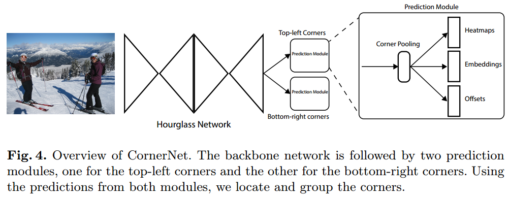

上图为cornerne整个模型。输入是一张图片，经过hourglass网络，得到特征图，然后分成两个网络，分别是Top-left Corners，负责预测bbox的左上顶点，Bottom-right corners，负责预测bbox的右下顶点。每个Corners模块的输出都包括3个部分：关键点热图、相关向量和偏移。下面详细分析

### 3.1 Hourglass网络

​    Hourglass网络是关键点估计经典网络，进行了大量的跳层连接、多尺度融合等。作者对网络进行了修改，总共104层，但是并没有给出模型图，所以这里就不详述了，以下所示为原始Hourglass网络结构图：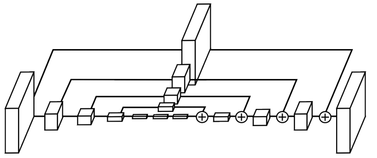

### 3.2 热图输出

​    对于任何一个目标，本文是检测两个关键点: 左上顶点和右下顶点，网络也分为两个分支。对于任何一个分支，输出热图的维度是(w',h',类别数)即每个类别都输出一张热图，而每张热图只预测该类别的其中一个顶点而已。如下图所示：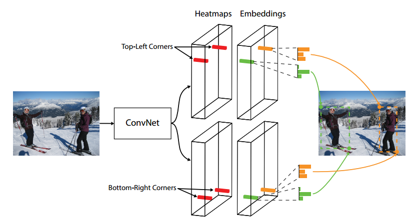

​    下面开始讨论热图分支的loss计算规则，如下图所示：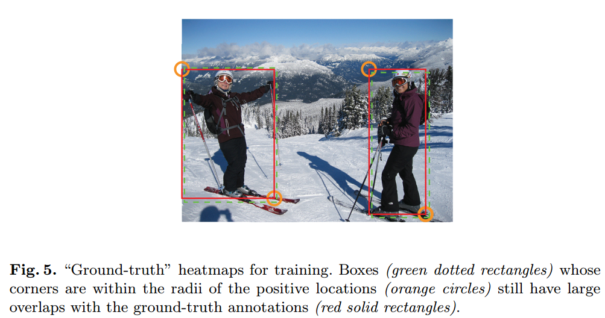

红色实线框是GT，但是其实绿色虚线框的IOU也是很大的。作者指出在关键点回归中，对于任何一个顶点的GT值，其只有一个正样本，其他所有像素点处的值都是负样本(注意：在其他关键点估计问题中，例如CPN，其采用的loss函数是L2，可以认为是热图预测是回归问题，而本文是分类问题，有点像分割问题)，那么可以看出正负样本是极端不平衡的，直接进行Loss计算性能肯定不行。正好，Focal Loss就解决了这个问题，其定义如下：

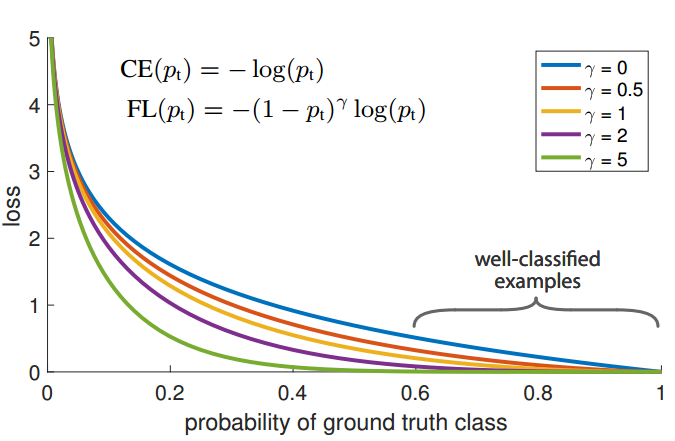

可以看出，其就是在交叉熵loss函数前面加了一个自适应系数，该系数的作用是把易学习样本的loss变的很小，这样网络就可以突出难学习样本，从而克服正负样本不平衡和易学习样本主导梯度的问题。那么本文自然而然也可以使用focal loss了。

​    但是，通过上面的图，我们发现，其实在橘色的半径内所形成的bbox的IOU是很大的，虽然我们认为他是负样本，但是它和GT靠的很近，那么就要区别对待。具体做法就是把这部分和GT靠的很近的负样本的loss权重变小，相当于减少了一部分比较模糊定义的负样本，让正负样本区分更明显(个人理解而已)，具体公式如下：

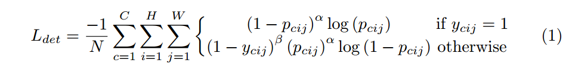

其中，$y_{cij}$表示第c个类别的第i，j位置处的值，如果有顶点的位置，置为1。但是对于没有顶点的位置要特殊处理，对于某个顶点的半径r范围外的点，$y_{cij}=0$，对于范围内的点，$y_{cij}$的值来自高斯值，公式如下：

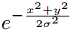

x和y是距离该顶点的偏移坐标，方差为1/3的半径，可以看出，在半径范围内，越是远离顶点中心，其值越小。而其高斯半径的确定方法是：在半径内的所有点，都满足IOU大于0.7,通过这种方式就可以确定高斯半径。$p_{cij}$是预测值，仔细观察，如果把$(1-y_{cij})^\beta $去掉，那么就是标准的focal loss，现在在靠近GT的负样本半径处给予其一个较小的loss，就可以实现上述功能。$y_{cij}$就是提供的热图label。可以看出，不同物体的半径是不固定的，可以自适应物体size。作者指出通过这种方式，效果提升非常明显。

### 3.3 联系嵌入输出

​    由于本文属于bottom-up算法，得到所有关键点后，需要进行配对，做法也是参考以前的。联系嵌入本质是一个向量，本文是一个数，这个数要表征同一组的两个顶点的联系嵌入要小，而不同组的两个顶点的联系嵌入要大。公式如下：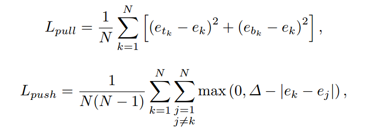

$e_{t_{k}}$表示第k个物体的左上角顶点的联系嵌入值，$e_{b_{k}}$表示第k个物体的右下角顶点的联系嵌入值，$e_k$是左上角和右下角的联系嵌入平均值。pull loss表示同一组的两个顶点的联系嵌入要尽可能小，但是光有这个是不够的，因为可能会出现两组的$e_k$相等，故还需要一个push loss来将不同组之间的联系嵌入值变大，三角符号值为1.

### 3.4 偏移输出

​    大部分网络都会进行stride，导致输出特征图比原始图片小，本文也不例外，但是这样就会出现一个精度丢失问题了，假设一个顶点在原图是200的位置，那么经过除6后，就不是整数了，即给的label是有精度丢失的，所以本文就预测一个偏移，来克服这个问题，具体公式如下：

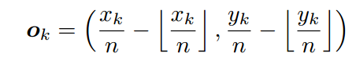

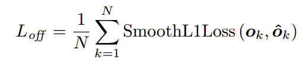

n是原图除以特征图比例。

### 3.5 corner pooling

​    首先看下图：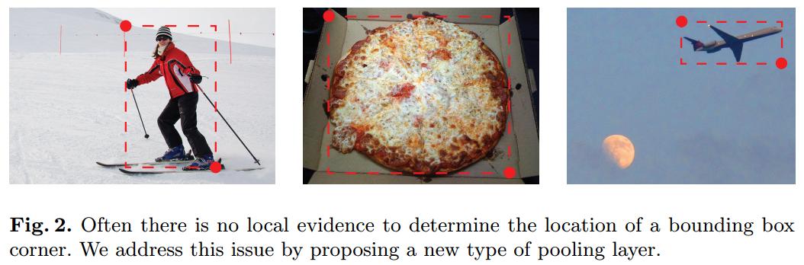

我们要预测左上角和右上角的热图，但是我们可以发现，这两个点的位置其实不在物体表面上，也就是说并没有一个很明确的信号表明顶点在这里，这会给网络训练带来难度。故为了解决这个问题，作者提出corner pooling层，其示意图如下：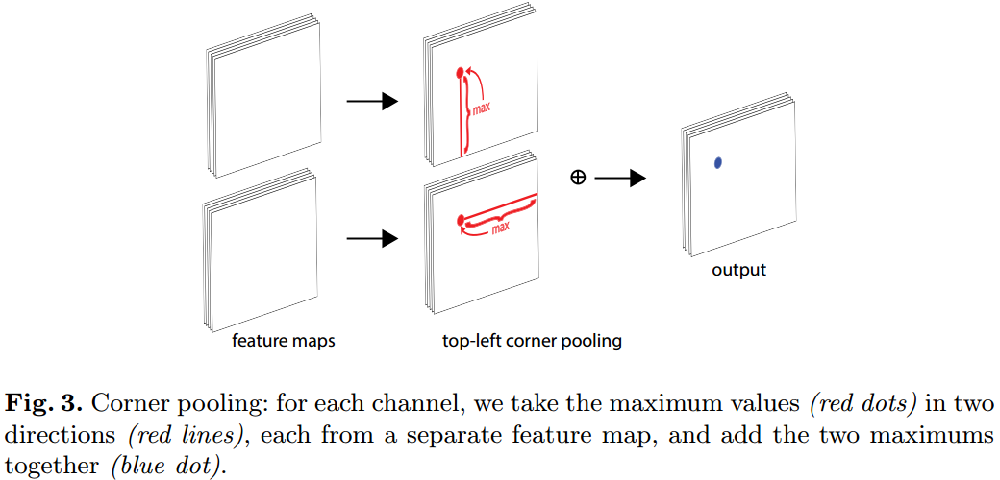

具体就是：对于任何一个顶点，都会输出两幅特征图，第一幅特征图对列进行max操作，第二副特征图对行进行max操作，然后两幅特征图的对应点值进行sum操作即可，这样相当于突出了bbox角落。作者指出这是模拟人来找点的思路，先左右看看，再上下看看。

​    作者认为corner pooling之所以有效，是因为(1) 目标定位框的中心难以确定，和边界框的4条边相关，但是每个顶点只与边界框的两条边相关，所以corner 更容易提取。(2) 顶点更有效提供离散的边界空间，使用O(wh)顶点可以表示$O(w^2h^2) $anchor boxes。下图是具体实现：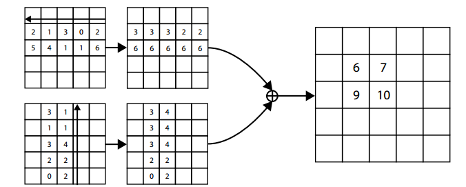

整个网络的预测部分结构如下：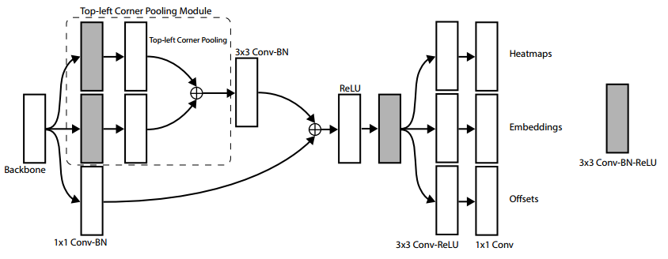

​    整个代码采用pytorch写，输入图片大小是511x511，输出热图是128x128，训练过程中采用了大量数据增加操作：随机水平翻转；随机缩放；随机裁剪；随机颜色抖动，包括亮度、饱和度，并对每张图片进行PCA处理。整个loss为：

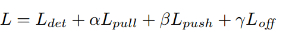

其中$\alpha=0.1;\beta=0.1;\gamma =1$,batch是49,10块GPU，master GPU的batch是4，其他每个GPU的batch是5.

​    测试过程：对每张输出热图进行3x3的max pooling操作，这一步骤类似于nms；然后挑选前100个左上角坐标点和前100个右下角坐标点；然后使用offset对值进行调整；然后使用L1距离来对顶点进行配对，当距离大于0.5或者不是同一类时候排除；左上角和右下角顶点的平均概率值作为检测分值。

​    测试时候，输出的图片进行比例不失真的resize操作，具体是pad 0处理，并且喂入原图和翻转后的图片，对每张图片的结果经过上述处理后，结果合并，并进行soft-nms过滤冗余值。每张图片在Titan X (PASCAL) GPU上平均测试时间是244ms，即4fps，是非常慢的，主要原因是hourglass是104层，大部分时间都是花费在这里，后续可能会有改进。

## 4 结果

​     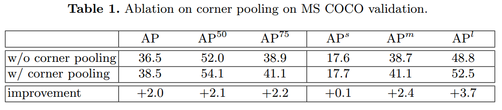

从上图可以看出，所提的corner pooling是非常重要的，提出了大概2个点(在coco上提升1个点都是非常难的)，并且对于大物体提升越明显。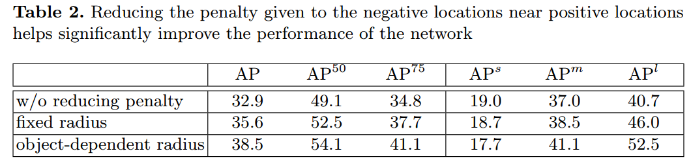

从上图可以看出，GT附近像素点的loss进行自适应衰减作用非常明显，说明这种操作的重要性。

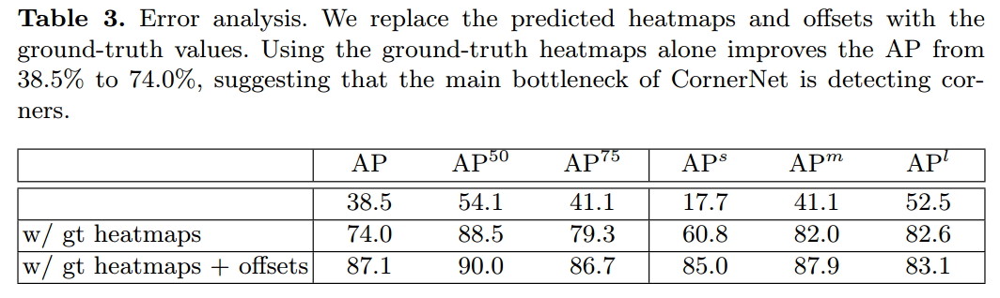

上图是为了验证3个输出的值，到底哪个预测输出对最终结果影响最大。具体做法是把输出的热图替换成GT热图，第一行是网络预测结果，第二行是使用gt热图结果，第三行是加了offset结果，可以看出一旦使用了GT热图，mAP就大幅提升，说明本文的三个分支中，热图预测分支对结果影响最大，后续改进也应该是考虑这个。

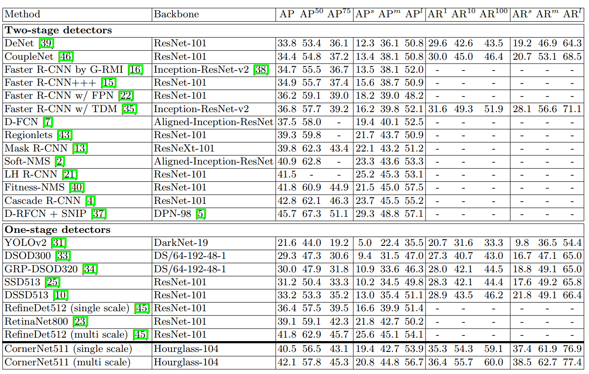

上图是最终测试结果，可以看出，性能是超越了一阶段的，同时具备2阶段算法的精度，但是速度没有啥优势。

