# IOU-net

论文地址：[Acquisition of Localization Confidence for Accurate Object Detection](https://arxiv.org/abs/1807.11590)

## 1 创新点

​    本文为旷视ECCV2018 oral报告论文，思想比较新颖，理论分析较多，是一篇值得研究的论文。本文创新点主要为：

​    (1) 引入IOU指标作为目标检测算法定位置信度，可以有效解决分类置信度和定位置信度不对齐问题，并且可以显性知道当前预测物体的定位精度

​    (2 ) 基于所提IOU指标，联合精确ROI池化层( Precise RoI Pooling)，提出一种基于优化的边界框迭代优化算法，可以显著提高bbox预测精度

​    (3) 所提IOU-net可以非常方便的集成到目前两阶段目标检测算法中，从而提升性能，而且训练方式是端到端的联合训练，使用非常友好。

## 2 核心思想

​    当前two-stage的目标检测任务流程为： 

1. RPN找出一系列候选框，区分前景背景 
2. 对前景框进行分类和回归，得到每个框的分类置信度及回归坐标 
3. 通过NMS，以分类置信度排序，过滤掉IoU大于一定阈值的框，得到最终的结果

但是可以看出上面的做法有问题，丢失了定位置信度。这样就会出现问题，如下所示：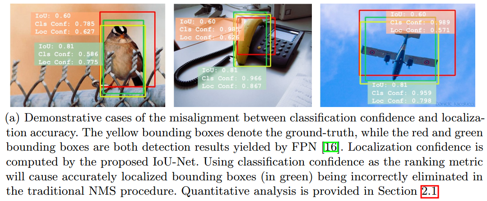

黄色是gt，红色和绿色是同一个gt所对应的两个预测bbox，如果以cls conf作为排序条件进行nms那么绿色的bbox会被滤掉，但是实际上绿色的bbox的iou更大，其实更应该保留。这就出现问题了，也就是分类置信度和定位置信度不对齐问题。可以想象，如果在nms过程中，以IOU作为排序指标，那就可以避免这个问题。

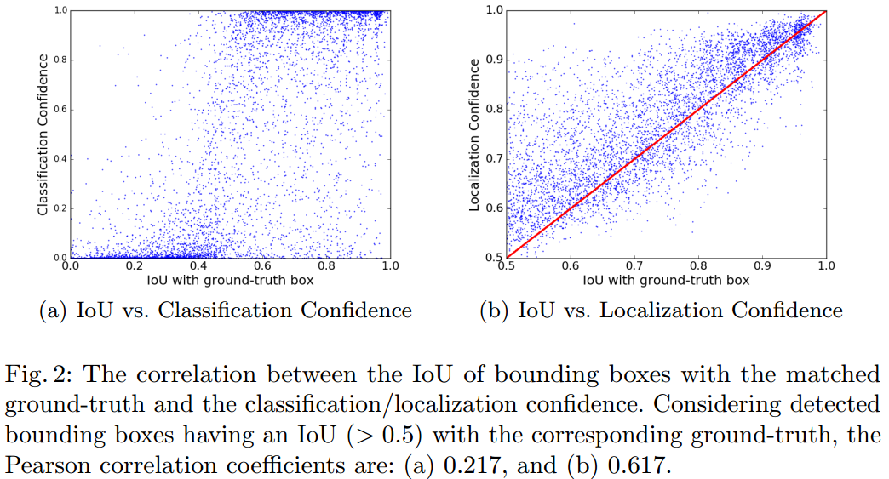

​    先看左图，横坐标是预测的bbox和GT的IOU值，纵坐标是分类置信度，可以看出，两张并不是正相关，会出现上述问题。  看右图，如果我们预测一个定位置信度，那么就可以达到几乎正相关的效果，就可以避免了。

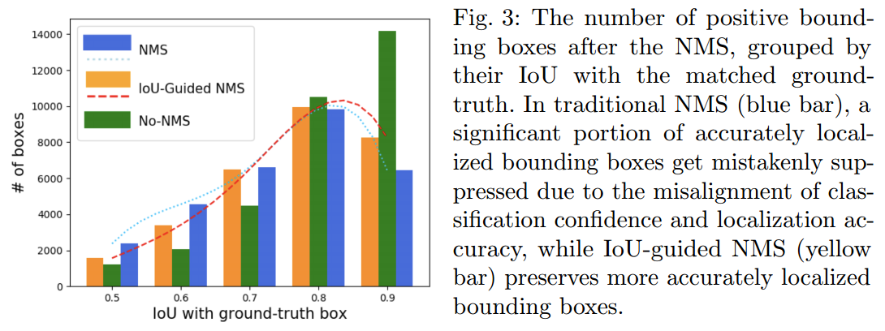

从上图也可以看出类似情形。NMS是常规的NMS，IOU-Guided NMS是本文所提算法，可以看出，当IOU=0.9时候，NMS会滤掉很大更准确的bbox，而本文所提算法有所改善，会保留定位精度更高的bbox。

   以上是第一个问题。多级bbox回归应该可以进一步改善bbox性能，那么是不是加的级数越多就会越好？CVPR2018的Cascade R-CNN网络给出了答案，如下：

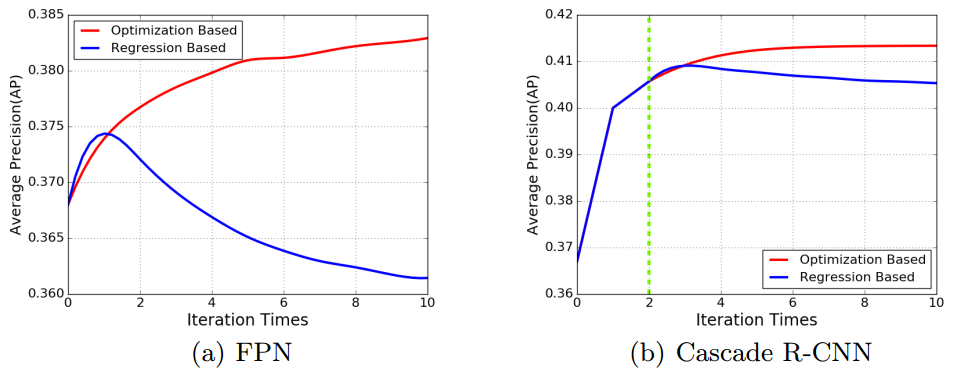

(a)为FPN网络测试结果，可以看出基于回归的方法多次迭代，刚开始性能会提高，但是在增加迭代次数就会下降，(b)所提的cascade R-CNN一定程度上解决了上述问题，其采用2级级联。红色线是本文所提的基于优化的算法，可以看出，随着迭代步骤增加，性能是一直提升的，明显本文所提方法优点明显。下面是对比图：

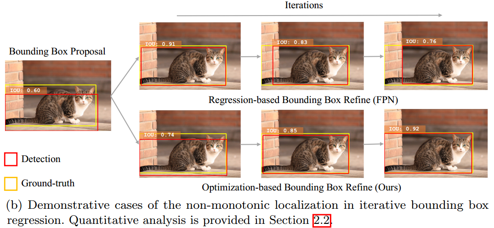

可以看出，基于优化的方法，不断迭代，IOU值会一直增加。

​    总结如下:

​    (1) 提出一种IOU引导的NMS算法，可以有效解决更精确的bbox被滤掉的问题

​    (2) 提出一种基于迭代优化的bbox优化算法，可以不断提高bbox精度

## 3 IOU-net网络

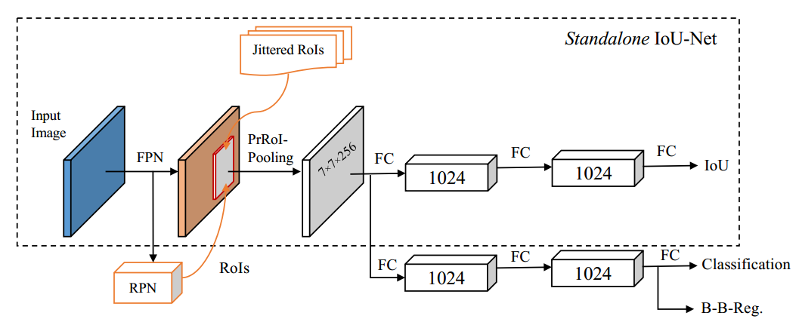

​    虚线框是在两阶段算法例如faster rcnn基础上新增了一个IOU分支。可以看出和faster rcnn和FPN的区别是

​    (1)多了一条预测定位置信度的分支；

​    (2)将原始的ROI Pooling层或者ROI Align层改为RrROI pooling层，主要目的是可进行连续求导即梯度在整个ROI内都是连续的。

   注意Jittered ROIS意思是该分支的训练样本不是来自RPN输出的ROI，而是基于GT值随机抖动后生成的ROI，过滤掉与GT的IoU<0.5的框，剩下的作为输入，然后用这些ROI进行训练IOU分支。

### 3.1 IoU-guided NMS    

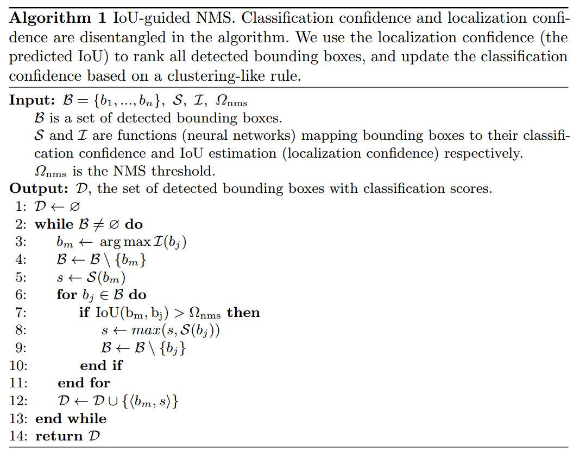

原理如上图。B是一系列预测输出的bbox，S是对应的bbox的分类置信度，I是预测的对应IOU，上面的流程和标准的NMS是一样的，区别是两个地方：(1) bbox的排序标准不再是分类置信度而是定位置信度；(2) 注意第8行，如果$b_m$的bbox IOU大于$b_j$的bbox IOU，那么说明$b_m$会抑制$b_j$,此时该bbox的分类置信度是取最大的那个。也就是说预测的bbox的分类置信度不一定是原始的那个，而是所以预测的bbox的分类置信度中最大的那个。作者说这是一个类似聚类的策略，这样的好处是bbox的定位置信度和分类置信度一定是对齐的。

### 3.2 optimization Bounding box  

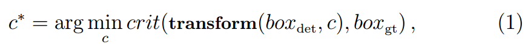

上式是一个通式。$box_{det}$表示检测边界框，可以认为是anchor或者RPN输出的坐标；c是变换系数，是faster rcnn的bbox预测分支的输出；$box_{gt}$是真实的bbox坐标；transform是变换函数；crit是优化函数，对于faster rcnn而已，那就是smooth-L1；有些论文用了 − ln(IoU)表征。

​    对于faster rcnn而言，其本质是使用一个神经网络回归来直接学习出变换系数C，而级联RCNN方式是使用多次迭代方式不断让loss最小。以上两种都是基于回归方式估计c∗，但是缺点是得到的结果受输入分布影响大，而且如Cascade RCNN指出，回归次数增加，效果会越来越差。所以作者提出一种优化的办法：

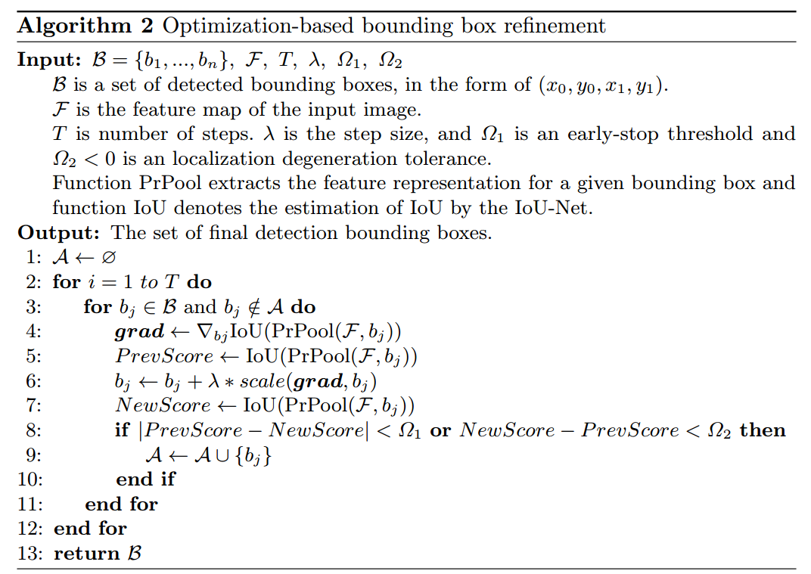

B是一些优秀的bbox，即已经经过了IOU导向NMS处理后所得；F是特征图；T是迭代步数；lamda是学习率；PrPool是论文所提精确ROI Pooling层，后面会细说，IOU函数是IOU分支。整个过程是离线的，后处理算法。即给定一些预测框，通过基于优化的算法可以不断优化这些bbox，优化目的不再是上面那个，而是直接使用输出IOU作为优化目标，其目的是最大化，故优化算法是梯度上升法。

​    从上述流程图可以看出，前向阶段，bbox的4个参数才是优化对象(在训练阶段，IOU分支的优化对象的w，b)，通过不断求出IOU分支的梯度，然后应用梯度上升法即可，整个思路非常简单，实现也非常简单。   注意scale的作用是为了**实现(x/w，y/h，logw，logh)的上升效果**。 是为了和训练阶段变换系数变化一样的效果。

​    现在问题是：这么简单的梯度上升思想为啥以前没有人提出，其原因在ROI Pooling层和ROI Align层上面。这两种思想其实不是连续可导的，也就是说如果直接应用IOU梯度上升法，那么是无法优化的，因为梯度可能不能算。为了说明为啥不可导，需要说明下：

​    (1) ROI Pooling层的前向步骤是对RPN提出的ROI坐标直接取整，然后在每个bin内部取最大值；反向传播时候，如果取了哪个bin内的最大值，那么就通过索引把loss反向传播回去；

   (2) ROI Align层的前向步骤是对RPN提出的ROI坐标保留浮点坐标，但是在每个bin内部是采样4个点，然后对这4个点取均值；反向传播时候就比较麻烦了，因为坐标是浮点数，无法找到某个索引，具体做法是将4个采样点附件小于1的点都进行loss反向传播，loss的值平分为1/4。

上述操作如果不熟悉，请查看对应论文的前向和反向部分。从(1)(2)可以看出，其反向传播是在特定点位置处(真实或者浮点)计算导数的，无法实现任意浮点数计算导数。但是我们上面的IOU优化函数，在优化bbox时候是可能出现任何浮点数的，那么就会出现问题。

​    基于此，作者不再采用以前的Pooling方式，而是提出一种新的精确ROI池化层：PrRoI Pooling，精确的意思是在bin内部的所有点都计算均值，而不是像ROI Align只采样特点点，示意图如下：

以上绘制的是一个bin，而不是一个完整的ROI。$f$函数表示特征图，$f(x,y)$值可能特征图上面不存在，因为浮点坐标，那么也是一样进行双线性插值。其导数公式为：

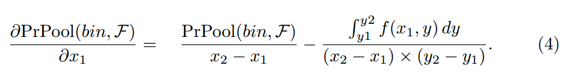

这部分源码已经公开，采用CUDA写的，有兴趣的可以去看下具体咋计算。如果要彻底理解，建议先看下CUDA版本的ROI Pooling、ROI Align的前向和反向代码。下面是附加内容：

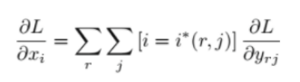

​                                                                                  ROI Pooling导数公式

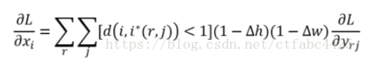

​                                                                                  ROI Align导数公式

### 3.3 联合训练

   IoU预测器分支可集成到标准的FPN的网络架构中，与分类分支同时训练。IoU预测器的loss选用smooth-L1，训练数据为上文所说的Jittered RoIs。 在inference阶段，对于anchor box先用bbox regression修正，然后用IoU-guided NMS取出置信度最高的100个bbox，最后使用基于优化的算法优化bbox。

   其他参数和原始的faster rcnn完全相同。

## 4 实验结果

在COCO数据集中trainval35k共8万张图片上训练，在minival共5000张图片上评估

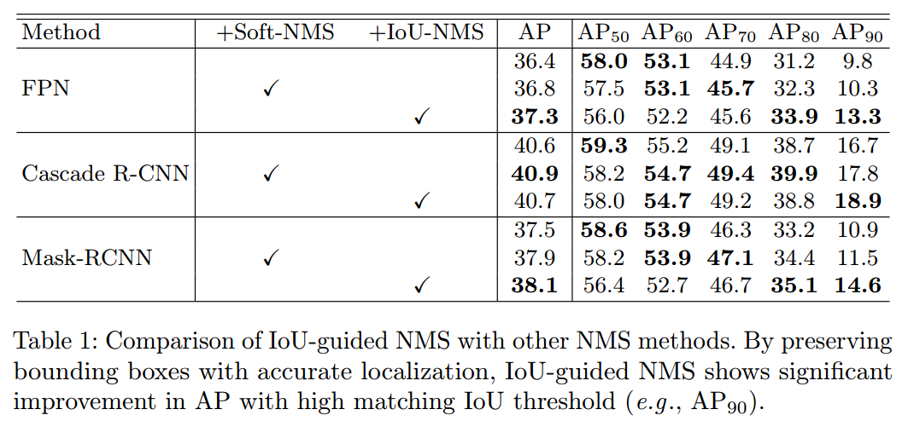

上图为仅仅使用IOU导向NMS的结果，可以看出，即使和改进的soft-nms相比，也是更好的。在任何一个算法上面都有提升。

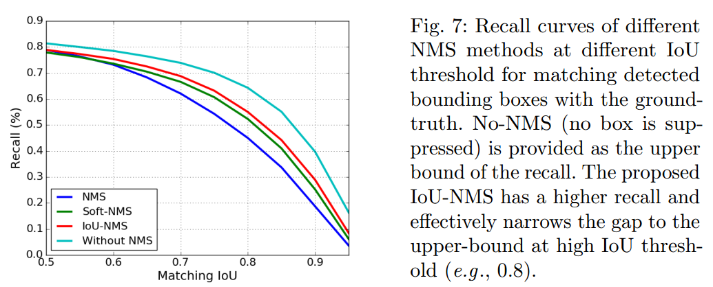

上图为recall图，可以看出，效果是最好的。

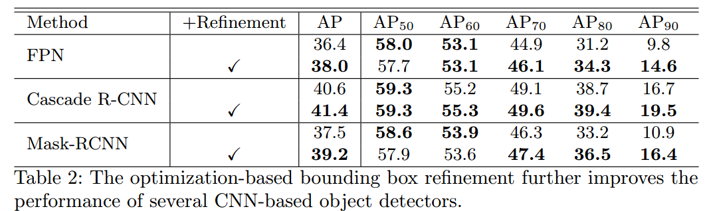

如果进行后优化处理，效果提升很明显，即使是级联的Cascade R-CNN也不如本文算法。

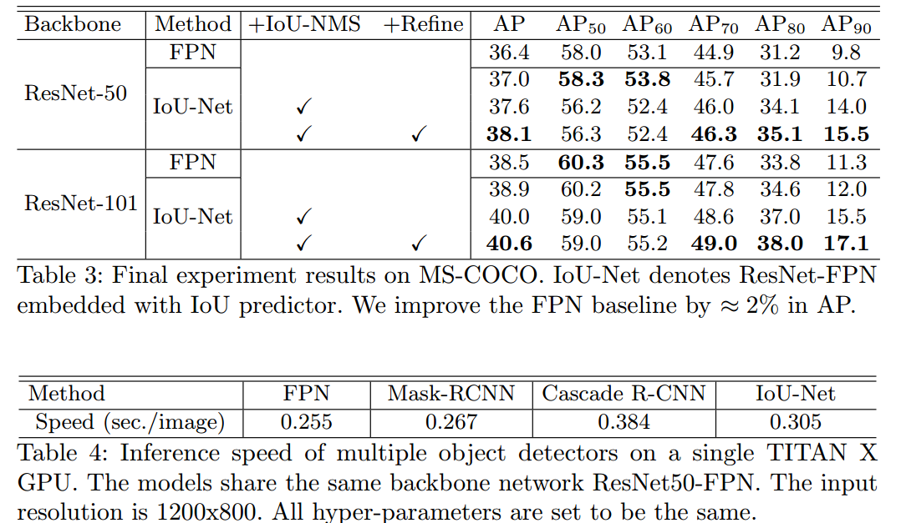

上图为联合训练结果。如果本文所提两种策略都使用，大于可以提升2个百分点，速度下降不多，且比级联网络快。

总结：本文提出一篇新颖的修正目标定位的网络IoU-Net，指出了分类与定位置信度不匹配的问题，提出IoU-NMS来获取位置更精确的bbox，并将定位的回归问题重新定义为优化问题，提升了定位的精度，同时IoU预测器可方便集成到别的网络，思想非常好。

