# 令人拍案称奇的Mask RCNN

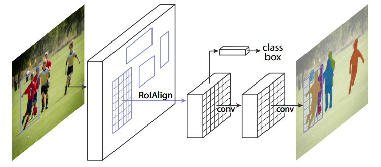

**后续还会出更多目标检测和语义分割的文章，感兴趣的请关注我。**

最近在做一个目标检测项目，用到了Mask RCNN。我仅仅用了50张训练照片，训练了1000步之后进行测试，发现效果好得令人称奇。就这个任务，很久之前用yolo v1训练则很难收敛。不过把它们拿来比当然不公平，但我更想说的是，mask RCNN效果真的很好。

所以这篇文章来详细地总结一下Mask RCNN。

Mask RCNN沿用了Faster RCNN的思想，特征提取采用ResNet-FPN的架构，另外多加了一个Mask预测分支。可见Mask RCNN综合了很多此前优秀的研究成果。为了更好地讲解Mask RCNN，我会先回顾一下几个部分：

1. Faster RCNN

2. ResNet-FPN

3. ResNet-FPN+Fast RCNN

回顾完之后讲ResNet-FPN+Fast RCNN+Mask，实际上就是Mask RCNN。

## 一、Faster RCNN

Faster RCNN是两阶段的目标检测算法，包括阶段一的Region proposal以及阶段二的bounding box回归和分类。用一张图来直观展示Faster RCNN的整个流程：

Faster RCNN使用CNN提取图像特征，然后使用region proposal network（RPN）去提取出ROI，然后使用ROI pooling将这些ROI全部变成固定尺寸，再喂给全连接层进行Bounding box回归和分类预测。

这里只是简单地介绍了Faster RCNN前向预测的过程，但Faster RCNN本身的细节非常多，比一阶段的算法复杂度高不少，并非三言两语能说得清。如果对Faster RCNN算法不熟悉，想了解更多的同学可以看这篇文章：[一文读懂Faster RCNN](https://zhuanlan.zhihu.com/p/31426458)，这是我看过的解释得最清晰的文章。

## 二、ResNet-FPN

多尺度检测在目标检测中变得越来越重要，对小目标的检测尤其如此。现在主流的目标检测方法很多都用到了多尺度的方法，包括最新的yolo v3。Feature Pyramid Network (**FPN**)则是一种精心设计的多尺度检测方法，下面就开始简要介绍FPN。

FPN结构中包括自下而上，自上而下和横向连接三个部分，如下图所示。这种结构可以将各个层级的特征进行融合，使其同时具有强语义信息和强空间信息，在特征学习中算是一把利器了。

FPN实际上是一种通用架构，可以结合各种骨架网络使用，比如VGG，ResNet等。Mask RCNN文章中使用了ResNNet-FPN网络结构。如下图：

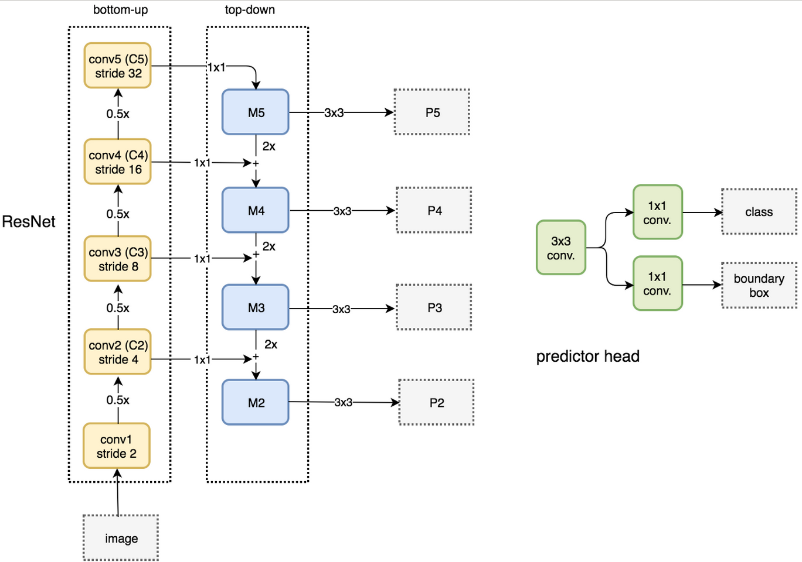

ResNet-FPN包括3个部分，自下而上连接，自上而下连接和横向连接。下面分别介绍。

**自下而上**

从下到上路径。可以明显看出，其实就是简单的特征提取过程，和传统的没有区别。具体就是将ResNet作为骨架网络，根据feature map的大小分为5个stage。stage2，stage3，stage4和stage5各自最后一层输出conv2，conv3，conv4和conv5分别定义为$C_2,C_3,C_4,C_5$，他们相对于原始图片的stride是{4,8,16,32}。需要注意的是，考虑到内存原因，stage1的conv1并没有使用。

**自上而下和横向连接**

自上而下是从最高层开始进行上采样，这里的上采样直接使用的是最近邻上采样，而不是使用反卷积操作，一方面简单，另外一方面可以减少训练参数。横向连接则是将上采样的结果和自底向上生成的相同大小的feature map进行融合。具体就是对$C_2,C_3,C_4,C_5$中的每一层经过一个conv 1x1操作（1x1卷积用于降低通道数），无激活函数操作，输出通道全部设置为相同的256通道，然后和上采样的feature map进行加和操作。在融合之后还会再采用3*3的卷积核对已经融合的特征进行处理，目的是消除上采样的混叠效应（aliasing effect）。

实际上，**上图少绘制了一个分支**：M5经过步长为2的max pooling下采样得到$P_6$，作者指出使用P6是想得到更大的anchor尺度512×512。但P6是只用在 RPN中用来得到region proposal的，并不会作为后续Fast RCNN的输入。

总结一下，ResNet-FPN作为RPN输入的feature map是$[P2,P3,P4,P5,P6]$，而作为后续Fast RCNN的输入则是$[P2,P3,P4,P5]$。

## 三、ResNet-FPN+Fast RCNN 

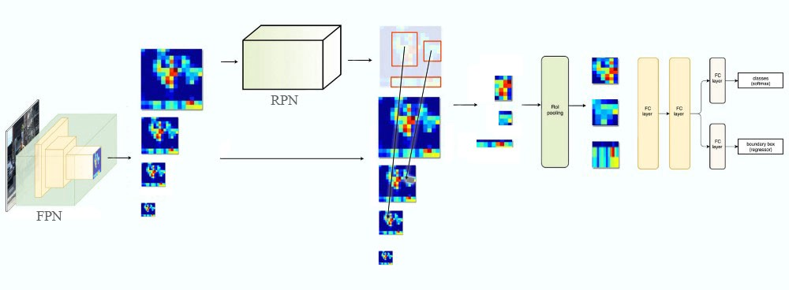

将ResNet-FPN和Fast RCNN进行结合，实际上就是Faster RCNN的了，但与最初的Faster RCNN不同的是，FPN产生了特征金字塔$[P2,P3,P4,P5,P6]$，而并非只是一个feature map。金字塔经过RPN之后会产生很多region proposal。这些region proposal是分别由$P2,P3,P4,P5,P6$经过RPN产生的，但用于输入到Fast RCNN中的是$[P2,P3,P4,P5]$，也就是说要在$[P2,P3,P4,P5]$中根据region proposal切出ROI进行后续的分类和回归预测。问题来了，我们要选择哪个feature map来切出这些ROI区域呢？实际上，我们会选择最合适的尺度的feature map来切ROI。具体来说，我们通过一个公式来决定宽w和高h的ROI到底要从哪个 $P_k$来切：

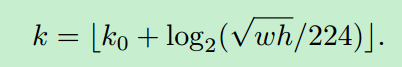

这里224表示用于预训练的ImageNet图片的大小。$k_0$表示面积为$w*h=224*224$的ROI所应该在的层级。作者将$k_0$设置为4，也就是说$w*h=224*224$的ROI应该从$P4$中切出来。假设ROI的scale小于224（比如说是112 * 112），$k = k_0-1 = 4-1 = 3$，就意味着要从更高分辨率的$P_3$中产生。另外，$k$值会做取整处理，防止结果不是整数。

这种做法很合理，大尺度的ROI要从低分辨率的feature map上切，有利于检测大目标，小尺度的ROI要从高分辨率的feature map上切，有利于检测小目标。

## 四、ResNet-FPN+Fast RCNN+mask

我们再进一步，将ResNet-FPN+Fast RCNN+mask，则得到了最终的Mask RCNN，如下图：

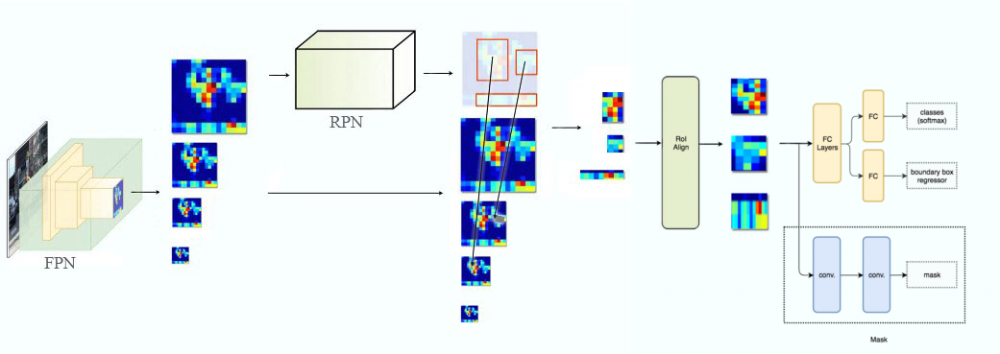

Mask RCNN的构建很简单，只是在ROI pooling（实际上用到的是ROIAlign，后面会讲到）之后添加卷积层，进行mask预测的任务。

下面总结一下Mask RCNN的网络：

1. 骨干网络ResNet-FPN，用于特征提取，另外，ResNet还可以是：ResNet-50,ResNet-101,ResNeXt-50,ResNeXt-101；

2. 头部网络，包括边界框识别（分类和回归）+mask预测。头部结构见下图：

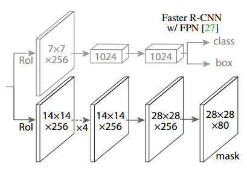

​                              

## 五、ROI Align

实际上，Mask RCNN中还有一个很重要的改进，就是ROIAlign。Faster R-CNN存在的问题是：特征图与原始图像是**不对准**的（mis-alignment），所以会影响检测精度。而Mask R-CNN提出了RoIAlign的方法来取代ROI pooling，RoIAlign可以保留大致的空间位置。

为了讲清楚ROI Align，这里先插入两个知识，双线性插值和ROI pooling。

### 1.双线性插值

在讲双线性插值之前，还得看最简单的线性插值。

**线性插值**

已知数据 $(x_0, y_0)$ 与 $(x_1, y_1)$，要计算$ [x_0, x_1] $区间内某一位置$ x$ 在直线上的$y$值，如下图所示。

计算方法很简单，通过斜率相等就可以构建y和x之间的关系，如下：
$$
\frac{y - y_0}{x - x_0} = \frac{y - y_1}{x - x_1}  ====>  y=\frac{x-x_0}{x_1-x_0}y_1+\frac{x_1-x}{x_1-x_0}y_0
$$
仔细看就是用$x$和$x_0$，$x_1$的距离作为一个权重（除以$x-x_0$是归一化的作用），用于$y_0$和$y_1$的加权。这个思想很重要，因为知道了这个思想，理解双线性插值就非常简单了。

**双线性插值**

双线性插值本质上就是在两个方向上做线性插值。

如图，假设我们想得到P点的插值，我们可以先在x方向上，对$Q_{11}$和$Q_{21}$之间做线性插值得到$R_1$，$R_2$同理可得。然后在y方向上对$R_1$和$R_2$进行线性插值就可以得到最终的P。其实知道这个就已经理解了双线性插值的意思了，如果用公式表达如下（注意$f$前面的系数看成权重就很好理解了）：

> 首先在 *x* 方向进行线性插值，得到
>
> 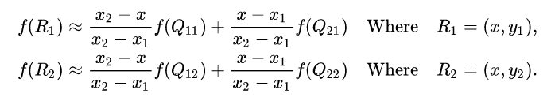
>
> 然后在 *y* 方向进行线性插值，得到
>
> 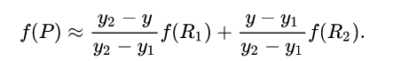
>
> 这样就得到所要的结果$f(x,y)$
>
> 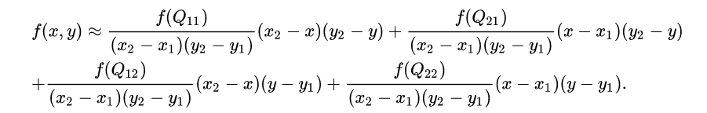

参考：[维基百科：双线性插值](https://zh.wikipedia.org/wiki/%E5%8F%8C%E7%BA%BF%E6%80%A7%E6%8F%92%E5%80%BC)

### 2.ROIpooling

ROI pooling就不多解释了，直接通过一个例子来形象理解。假设现在我们有一个8x8大小的feature map，我们要在这个feature map上得到ROI，并且进行ROI pooling到2x2大小的输出。

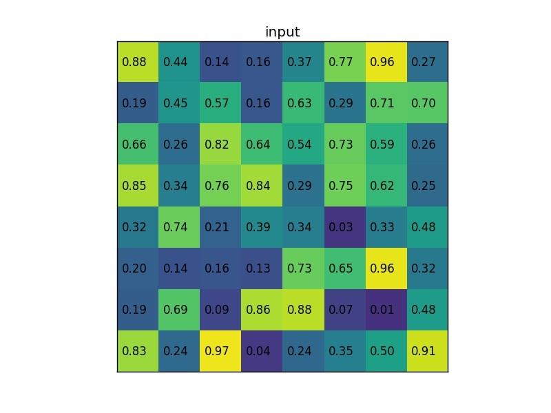

假设ROI的bounding box为$[x_1,y_1,x_2,y_2]=[0,3,7,8]$。如图：

将它划分为2x2的网格，因为ROI的长宽除以2是不能整除的，所以会出现每个格子大小不一样的情况。

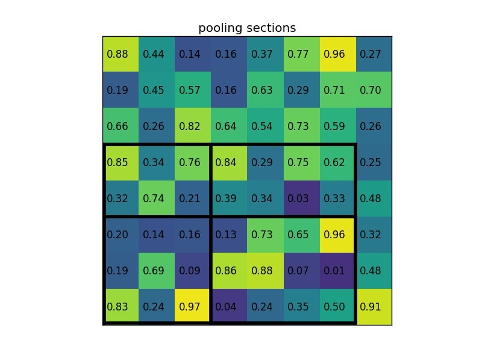

进行max pooling的最终2x2的输出为：

最后以一张动图形象概括之：

参考：[Region of interest pooling explained](https://blog.deepsense.ai/region-of-interest-pooling-explained/)

### 3. ROI Align

在Faster RCNN中，有两次整数化的过程：

1. region proposal的xywh通常是小数，但是为了方便操作会把它整数化。
2. 将整数化后的边界区域平均分割成 k x k 个单元，对每一个单元的边界进行整数化。

两次整数化的过程如下图所示：

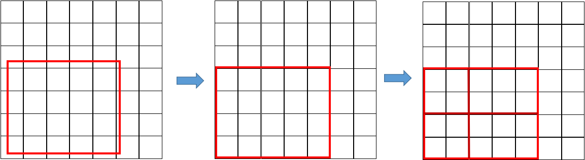

事实上，经过上述两次整数化，此时的候选框已经和最开始回归出来的位置有一定的偏差，这个偏差会影响检测或者分割的准确度。在论文里，作者把它总结为”不匹配问题“（misalignment）。

为了解决这个问题，ROI Align方法取消整数化操作，保留了小数，使用以上介绍的双线性插值的方法获得坐标为浮点数的像素点上的图像数值。但在实际操作中，ROI Align并不是简单地补充出候选区域边界上的坐标点，然后进行池化，而是重新进行设计。

下面通过一个例子来讲解ROI Align操作。如下图所示，虚线部分表示feature map，实线表示ROI，这里将ROI切分成2x2的单元格。如果采样点数是4，那我们首先将每个单元格子均分成四个小方格（如红色线所示），每个小方格中心就是采样点。这些采样点的坐标通常是浮点数，所以需要对采样点像素进行双线性插值（如四个箭头所示），就可以得到该像素点的值了。然后对每个单元格内的四个采样点进行maxmaxpooling，就可以得到最终的ROIAlign的结果。

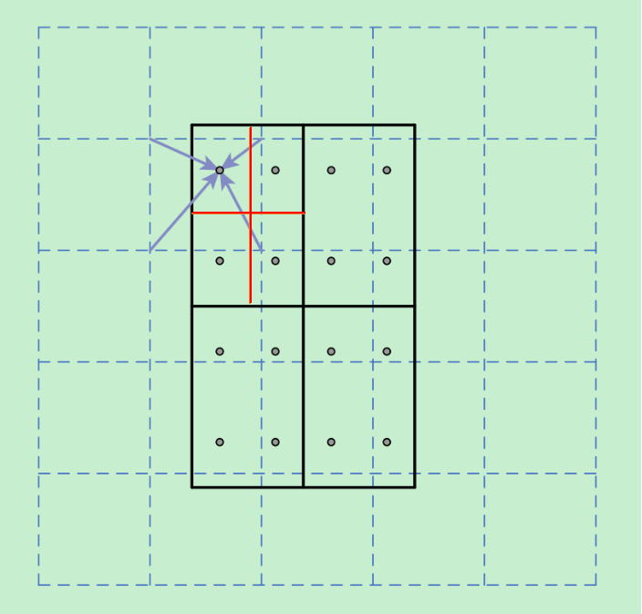

需要说明的是，在相关实验中，作者发现将采样点设为4会获得最佳性能，甚至直接设为1在性能上也相差无几。事实上，ROI Align 在遍历取样点的数量上没有ROIPooling那么多，但却可以获得更好的性能，这主要归功于解决了misalignment的问题。

## 六、损失

Mask RCNN定义多任务损失：
$$
L=L_{cls}+L_{box}+L_{mask}
$$
​	$L_{cls}和L_{box}$与faster rcnn的定义没有区别。

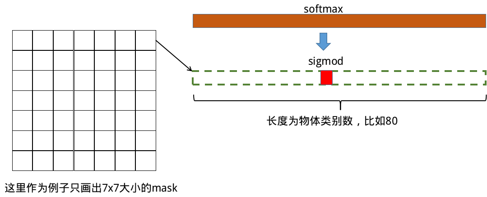

需要具体说明的是$L_{mask}$，假设一共有K个类别，则mask分割分支的输出维度是$K*m*m$, 对于$m*m$中的每个点，都会输出K个二值Mask（每个类别使用sigmoid输出）。需要注意的是，计算loss的时候，并不是每个类别的sigmoid输出都计算二值交叉熵损失，而是该像素属于哪个类，哪个类的sigmoid输出才要计算损失(如图红色方形所示)。并且在测试的时候，我们是通过分类分支预测的类别来选择相应的mask预测。这样，mask预测和分类预测就彻底解耦了。

这与FCN方法是不同，FCN是对每个像素进行多类别softmax分类，然后计算交叉熵损失，很明显，这种做法是会造成类间竞争的，而每个类别使用sigmoid输出并计算二值损失，可以避免类间竞争。实验表明，通过这种方法，可以较好地提升性能。

## 七、代码

我用到的代码是github上star最多的Mask RCNN代码：[Mask R-CNN for object detection and instance segmentation on Keras and TensorFlow](https://github.com/matterport/Mask_RCNN)

由于篇幅所限，不会在本文中讲解代码。但是会由我的一个同事视频讲解，视频正在录制中，录好之后我会把视频链接发在这里，感兴趣的可以关注。

## 参考

文章中有些图片来自medium博主：[Jonathan Hui](https://medium.com/@jonathan_hui)

如果这篇文章对你有帮助，就给点个赞呗。