# 目标检测

## 3、GN组归一化

### 3.1 名称

​     [GN组归一化 2018.03](https://arxiv.org/abs/1803.08494)

### 3.2 概述

​    主要解决当BN层的输入中批尺寸太小导致均值和方差计算不准确带来的误差率较高的问题，详细解释见[知乎：如何看待FAIR 研究工程师吴育昕和何恺明提交的论文](https://www.zhihu.com/question/269576836/answer/348670955)。 

### 3.3 细节

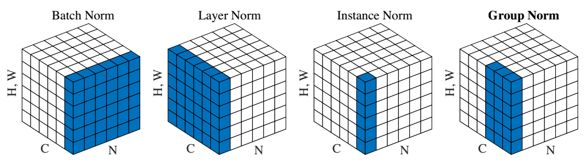

​                                                                               图3-1 4种常用归一化方案

​    上图中N表示批尺寸，C表示通道数，H表示图片高度，W表示图片宽度。

- BatchNorm：batch方向做归一化，算N\*H\*W的均值

- LayerNorm：channel方向做归一化，算C\*H\*W的均值

- InstanceNorm：一个channel内做归一化，算H*W的均值

- GroupNorm：将channel方向分group，然后每个group内做归一化，算(C//G)\*H\*W的均值

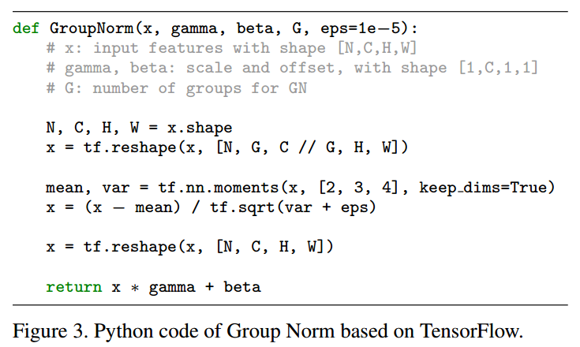

​    为了更好理解，可以参考[moments算子](https://www.jianshu.com/p/0312e04e4e83) 

### 6.2 CoupleNet

#### 6.2.1 名称

​    [CoupleNet:Coupling Global Structure with Local Parts for Object Detection](https://arxiv.org/abs/1708.02863)

#### 6.2.2 概述

​    CoupleNet是R-FCN的改进算法，主要是解决了R-FCN没有考虑egion proposal的全局信息和语义信息，只考虑了局部信息导致的精度有待提高的问题。思路非常简单，其在原来R-FCN的基础上引入了proposal的全局和语义信息，通过结合局部、全局以及语义的信息，多引入了两条分支，提高了检测的精度。但是需要说明的是由于增加了分支，精度是提高了，但是速度比R-FCN慢一些(作者说没有慢很多)，比faster rcnn还是快很多的。

#### 6.2.3 主干网络

​    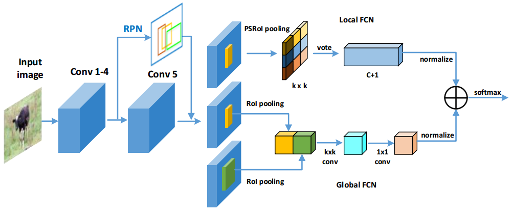

​                                                                                图6-2 CoupleNet 网络结构图

​    如上图所示，作者之所以引入全局语义信息主要是有两个原因：1.在计算机视觉算法中，存在大量这种论文，效果蛮好；2.全局语义能够提供很好的先验。在一些情况下，局部信息不起作用而全局信息起作用，有时候正好相反，如果两张融合那么就会有较好效果，作者以下图为例说明：

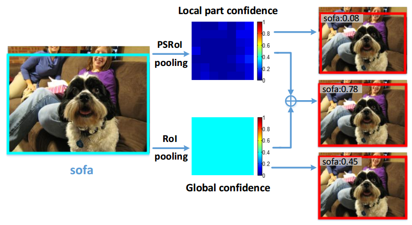

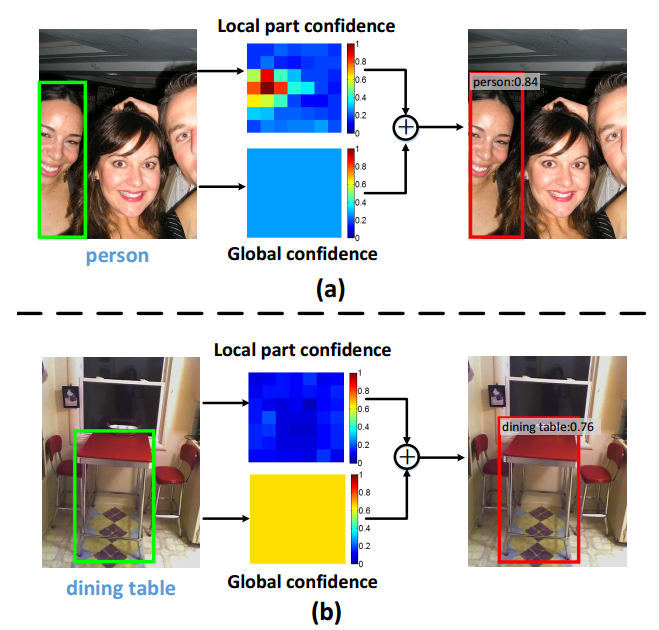

​                                                                        图6-3 全局语义和局部语义作用

一共包括3个分支：

1. 最上面这条支路就是原本的R-FCN

2. 中间这条支路是用来编码 global info的，对于一个region proposal，依次通过 k x k的RoI Pooling，k x k的conv以及1 x 1 conv

3. 最下面的支路是用来encode context prior的，对于一个region proposal，首先选择以这个proposal为中心，面积是原来2倍的proposal，一样依次通过k x k RoI Pooling，k x k conv以及1 x 1 conv

4. 最后把local FCN和Global FCN的结果couple起来，作者选择的是先各自通过1x1conv调整激活值的scale，然后对应位置元素相加，最后通过一个softmax进行分类

5. 对于坐标回归，结构是一样的。

   作者在VOC和COCO上做的实验，结果都是当时single model里面state-of-art的，证明了其算法的优越性。

## 7、Light-Head R-CNN

### 7.1 名称

​    [Light-Head R-CNN: In Defense of Two-Stage Object Detector](https://arxiv.org/abs/1711.07264)

​    face++ 轻量头部 R-CNN：守护两阶段物体检测器的尊严

### 7.2 概述

​    本文是基于faster rcnn 和 r-fcn 的改进，主要改进是增加速度和提高精度。通过探索为何两阶段目标检测算法一定比一阶段目标检测算法慢问题而提出了Light-Head R-CNN,从而实现了具备一阶段算法的快速性和两阶段算法的精度。其核心思想是将两阶段目标检测算法分为body部分和head部分，body部分就是基础分类网络，head部分就是roi以及后面的部分，通过实验发现耗时几乎都在head部分，即使把body部分改为简单网络，耗时依然很长。主要原因是faster rcnn的rcnn部分存在两个全连接层，以及r-fcn计算位置敏感分数图时候存在较大耗时，故而本算法改进就是将head部分变light即可。

​    基于以上分析，本文对Head部分进行改造，具体改进是在R-FCN上进行，故而其实可以认为是R-FCN的改进版本。主要是使用较大的可分离卷积核降低进入head部分feature map的channel数，然后去掉vote部分，改为一个2048的全连接层即可。整个网络改进非常简单，但是效果很好。

​    通过后面的实验分析发现：本文提出的方法要精度有精度(基础网络是resnet101)，要速度有速度(基础网络是Xception)，秒杀了faster rcnn、fpn、yolov2，ssd、dssd等算法，提升非常明显。

### 7.3 主干网络

​                                                                       图7-1 Light-Head R-CNN网络结构图

​    如上图所示，以coco数据集为例，faster rcnn存在2个全连接层，会严重影响检测速度且耗内存，而r-fcn由于基础网络输出的通道为2048，在PSRoi层计算时候通道数有3969(7\*7\*81)个，计算较慢且耗内存，故而本文从这两个部分着手改进。

​    首先对resnet101输出的2048个通道，采用大可分离卷积核代替r-fcn的1*1卷积核进行通道压缩，大可分离卷积借鉴了Inception V3 的思想，将k\*k的卷积转化为1\*k和k\*1。然后针对PSROI层计算耗时问题，将class直接改成了10，也就是说不再依据分类类别来设计通道数，从而将该层计算量固定住，与类别数无关了(注意，这里的k=7,而r-fcn中k=3)。最后由于与类别无关了，所以vote步骤就失效了，作者引入了一个小的全连接层代替进行分类和回归。

​    **总体上看，主要是对PSROI Pooling层的输出feature map做通道上的缩减，提高了速度；同时去掉了原来R-FCN或Faster RCNN中最后的global average pooling层，一定程度上提升了准确率。再加上其他一些操作比如pooling with alignment、NMS、multiscale train、OHEM等进一步提升效果。两种不同的主网络，要精度有精度，要速度有速度，可以根据需要灵活选择。**

## 8、MegNet

### 8.1 名称

​    [MegNet :A Large Mini-Batch Object Detector](https://arxiv.org/abs/1711.07240v1) 

### 8.2 概述

​    MegNet是face++在2017年coco物体检测上面的冠军模型，其实个人觉得已经不算一个模型了，准确来说应该是**一套系统**，要想使用这套系统，你需要**大量的底层支持**,例如face++内部自己做的Brain++平台，用于统筹资源和GPU调度。其主要解决了在物体检测算法例如faster rcnn、fpn、mask rcnn等都是使用小批量训练的问题，作者基于工程经验提出了一套可以应用大批量训练和学习率调整的一套系统，没有相应平台几乎无法复现。

​    基于CNN的物体检测方法，一直在飞速发展，其主要改进在于新的网络架构、新的范式、或者新的损失函数设计，而本文则关注mini-batch大小问题。作者提出了一个大mini-batch物体检测模型MegDet，从而可以使用远大于以往的mini-batch大小训练网络（比如从16增大到256），这样同时也可以高效地利用多块GPU联合训练（在论文的实验中最多使用了128块GPU），大大缩短训练时间，以上属于工程改进。技术层面上，作者提出了一种**学习率选择策略以及跨GPU的batch normalization方法**，两者共同使用就得以大幅度减少大mini-batch物体检测器的训练时间（例如从33小时减少到仅仅4个小时），同时还可以达到更高的准确率。

### 8.3 主干网络

​    作者首先分析为何物体检测都是小批次训练(2~8)？原因是物体检测和图像识别不同，物体检测需要一张较大的输入图片，通常的做法是800x800。由于输入图片尺寸的增长，图像检测所需显存量也会同比例增长，这也使得已有的深度学习框架无法训练大Batch-Size的图像检测模型。接着作者讨论了小批次训练存在的问题：

1. **不稳定的梯度。**由于Batch-Size较小，每次迭代生成的梯度的变化会非常大，这会导致SGD算法在一个区域内来回震荡，不易收敛到局部最优值。
2. **BN层统计不准确。**由于Batch-Size较小，难以满足BN层的统计需求，人们常常在训练过程中固定住BN层的参数，这意味着BN层还保持着ImageNet数据集中的设置，但其余参数却是COCO这个数据集的拟合结果。这种模型内部的参数不匹配会影响最后的检测结果
3. **正负样本比例失调。**由于Batch-Size较小，一个minibatch之中的图片变化可能非常大，很可能某些阶段正样本框只有个位数。当Batch-Size增大的时候，由于一个minibatch内部的图片数量增加，正负样本比例会优于小Batch-Size的情况。
4. **超长的训练时间。**这个原因非常好理解：当Batch-Size较小时，我们必须迭代更多的次数来让算法收敛；随着Batch-Size的增加，算法每次迭代见过的图片数量也随之增长，相应的迭代次数就可以下降，人们也能更快地得到结果。

​    基于以上几点，作者研发了一整套多机训练系统，以实现大Batch-Size物体检测算法：MegDet。具体包括：

1. **大量的底层支持**，大致上可以分为三类：第一是一套GPU 计算云平台，这在我们内部被称为Brain++平台，专门负责统筹规划硬件资源的使用；第二是基于Brain++平台的MegBrain软件框架，提供了诸多深度学习必备的工具箱。第三是在前面两者之上建立的物体检测算法
2. **解决了BN统计不准确的问题。**简单来讲，已有的BN统计方法局限于统计单张卡上的图片，做不到多张卡联合统计。由于物体检测本身的特性，单张卡上的图片数量达不到BN统计的要求，因此只能通过多卡联合统计来训练得到结果。为此，利用了NCCL（NVIDIA Collective Communications Library）代码库，实现了多卡BN
3. **Sublinear Memory技术。**这项技术的目的在于减少深度卷积神经网络的显存消耗量。
4. **介绍一些在大Batch-Size下的学习率调参技巧。**16-batch的FPN标准学习率是0.02， 而MegDet的Batch-Size是256。在这种情况下，如果直接设定学习率为0.32=0.02 x 16，会导致模型早期迅速发散，无法完成训练。因此需要有一个“逐步预热”的过程，让模型逐渐适应较大的学习率。当训练到一定阶段的时候，我们设定了三个下降阶段：在前两个阶段，我们直接将学习率除以10，最后再将学习率减半。

## 9、CARFT

### 9.1 名称

​    [CRAFT Objects from Images](https://arxiv.org/abs/1604.03239)

### 9.2 概述

​    本文是对faster rcnn的两个阶段分别进行改进以提高性能，思想比较重要，后续很多大模型都参考了本文思想。对于生成目标proposals阶段，论文在RPN的后面加了一个二值的Fast RCNN分类器来对RPN生成的proposals进行进一步的筛选，留下一些高质量的proposals；对于第二阶段的目标proposals分类，论文在原来的分类器后又级联了N个类别(不包含背景类)的二值分类器以进行更精细的目标检测。

### 9.3 主干网络

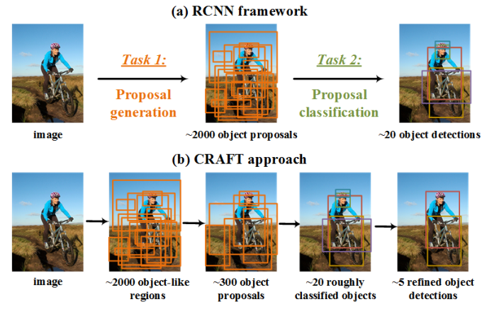

​                                                                          图9-1 CARFT网络结构图

   整体网络结构如上图所示。可以明显看出对两个部分的后续都有添加其他网络层。

   1.对于区域提取网络的改进，就是在RPN的后面接了一个二值的Fast RCNN分类器，如图所示：

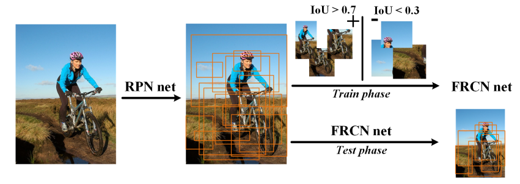

​                                                                                 图9-2 区域提取网络

可以看出，首先训练RPN网络，然后利用RPN提取的区域训练FRCN网络，进行精选区域。

2. 对Object Classification这块所做的改进，在原来的Fast RCNN分类器后面又级联了分类器，如图所示：

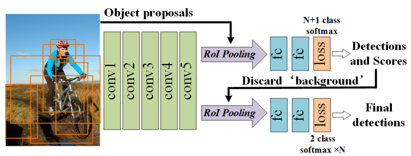

​                                                                                   图9-3 级联FRCN网络结构

思路非常简单。第一个FRCN常规的N+1类的softmax训练，第二个FRCN采用2类softmax训练，采用的是one to rest训练模式。为了更有效地训练FRCN-2以及检测，将FRCN-1和FRCN-2权值进行共享。即FRCN-2的卷积权重来自于FRCN-1，并在训练时保持不变，FRCN-2的全连接权重也来自于FRCN-1，它们将产生2N个分数以及4N回归边界框。测试时，输入300个proposals，FRCN-1产生大约20个初始检测，每一个都有N个初始得分(N类)。接着再通过FRCN-2分类，输出的分数(N个类别)与初始分数(N类别)相乘，以获得用于检测的最终N个分数。

​    值得一提的是ILSVRC2016目标检测任务冠军模型CUImage和Hikvision就是采用了上述的思想进行了多级连+集成学习。

## 10、PVAnet-重点文章

### 10.1 名称

​    [PVANET: Deep but Lightweight Neural Networks for Real-time Object Detection](https://arxiv.org/pdf/1608.08021v3.pdf)

### 10.2 概述

​    本文是对faster rcnn基础网络的定制改进版本。作者指出Faster-RCNN基础网络一般使用ZF、VGG、Resnet等，但精度与速度难以同时提高，而PVAnet的含义应该为：Performance Vs Accuracy，意为加速模型性能，同时不丢失精度。核心思想是：**更少的通道、更深的网络层数**，基于该思想，作者使用了C.ReLU、Inception、HyperNet以及residual模块等技巧来提升基础网络性能。在VOC2012和VOC2007数据集分别获得84.9%和84.2%mAP的精度，且计算量低于 resnet-101 10%。

### 10.3 主干网络

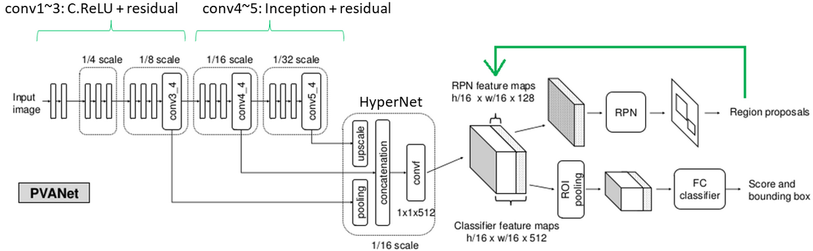

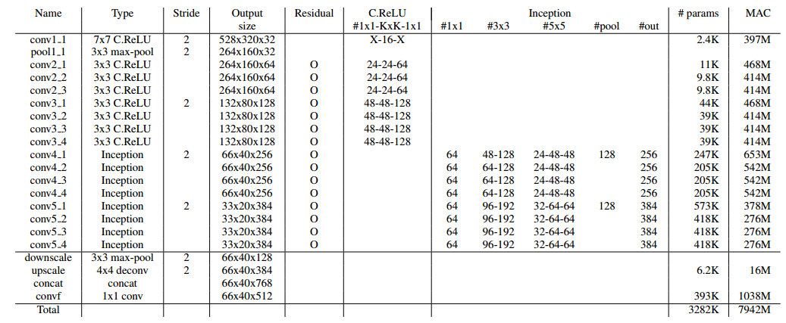

​                                                                                   图10-1 PVANet网络结构图    

​    整个网络结构如上图所示。下面分析细节：

1. 前面几层使用C.ReLU激活函数，减少参数量和计算次数，加快速度。C.ReLU是Concatenated Rectified Linear Units，论文是[Understanding and Improving Convolutional Neural Networks via  Concatenated Rectified Linear Units](https://arxiv.org/abs/1603.05201)，该文中，在深入分析CNN网络内部结构，发现在CNN网络的前几层学习到的滤波器中存在负相关即参数有一半冗余，通过可视化分析也可以看出，基于此，故可以只训练一半的参数。PAVNet作者在C.ReLU多引入两个参数：scale和shift，这允许每个channel filter的斜率和激活阈值与其相反的channel filter不同，通过这个操作可以使得网络2倍且不损失精度，结构图如下：

   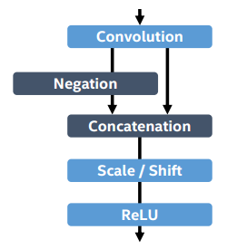

   ​                                                                                      图10-2 C.ReLU结构图

2. 中间引入**带残差的Inception模块**。作者认为Inception模块由于具有多种感受野的卷积核组合，因此能够适应多尺度目标的检测，为了捕获图像中的大目标，需要足够大的感受野，这个可以通过堆叠3x3的滤波器来达到。但是为了捕获小目标，则需要小一点的感受野，1x1的卷积核正好合适，故可以使用基于Inception模块组合并且组合进行基础网络后部分特征的提取

3. 引入**HyperNet模块**，多尺度输出。将conv3中原图1/8特征图、conv3中原图1/16特征图、conv3中原图1/32特征图连接来增加最终特征图中多尺度信息。其中，conv3中特征图被下采样，conv5中特征图被线性插值上采样。综合精细信息及高度抽象信息，用于检测不同尺度的物体，使用了中间层直接输出，第一次做max pooling，最后一层做Deconv，使特征输出shape一致。

4. 其它训练时候区别主要是：(1) PVA在每个特征点上使用了25个anchor(5种尺度，5种形状)；(2) RPN网络不使用全部特征图(全部特征图是512个，但是作者只使用了最前面的128个特征图进行区域生成)就能达到很好的定位精度，RPN网络只用生成200个proposals；(3) Batch normalization；(4) 权重衰减策略采用plateau detection，基于plateau detection动态地控制学习率。采用移动平均损失并且如果在某次的迭代周期期间其改进低于一个阀值，则将其确定为on-plateau（高原）。无论何时plateau被检测到，学习率减少一个常数因子。在实验中发现，学习率策略对准确率有一个显著的结果。

## 11、MS-CNN

### 11.1 名称

​    [A Unified Multi-scale Deep Convolutional Neural Network for Fast Object Detection](https://arxiv.org/abs/1607.07155)

### 11.2 概述

​    简单来说，MS-CNN就是将faster RCNN进行multi scale化，从而提高对 small object的判断能力。主要改进包括两个部分：(1) **在区域生成网络中，在多个不同尺度特征图上面进行区域生成，从而引入多尺度**。研究发现卷积网络不同层得到的特征特点的不同，对不同层的特征采用不同的利用方式，比如conv-3的低层，细节更加清楚，可以进行小目标的检测；而高层如conv-5，对于大目标的检测更加准确。(2) **针对检测速度问题，使用特征的上采样代替输入图像的上采样**。设计一个去卷积层，来增加特征图的分辨率，使得小目标区域可以被检测出来。这里使用了特征图的deconvolutional layer（去卷积层）来代替input图像的上采样，可以大大减少内存占用，提高速度(以前去卷积层一般用于图像分割和边缘检测，例如U-Net，这里作者说可以加快速度和提高精度)。

### 11.3 主干网络

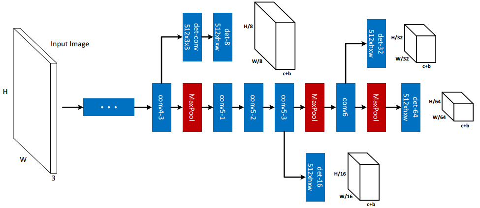

​                                                                                        图11-1 区域生成网络

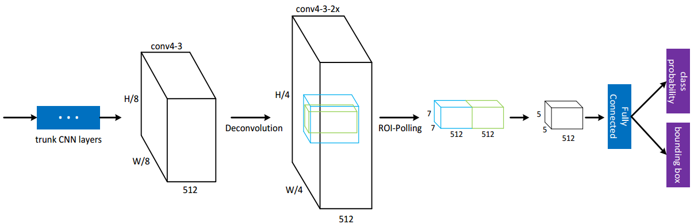

​                                                                                        图11-2 检测网络

​    (1) 区域生成网络

​    主干网络是VGG，可以看出有4个区域生成分支，其中conv4_3分支由于靠近输入非常近，在反向传播时候相比于其他分支影响很大，故而在这一层多加了一个卷积层，叫做buffer conv层。

​    对于训练方式采用的是多任务损失机制，即对每一层分支的损失进行加权求和，权重自行设置，分类损失是交叉熵，回归损失是平滑L1，正样本定义是IOU大于等于0.5的区域，负样本定义是IOU小于0.2的区域，其他丢弃。对于正负样本不平衡问题，对负样本采用3种策略：random, bootstrapping, and mixture。使其尽可能达到平衡。其他一些训练策略还包括：数据增强，输入图片裁切，减少内存消耗。

​    (2) 检测网络

​    在每个分支的后面首先进行去卷积操作，将特征图放大一倍，不仅可以加快计算速度，还可以提升小目标检测精度。同时引入了全局语义信息融合，具体操作是对去卷积层的ROI进行1.5倍放大，然后进行ROIPool操作，然后拼接到一起，进行融合提升检测精度。

​    可以明显看出：这在思路其实非常常规，在当时可能是比较先进，现在看来，**多尺度输出、全局语义信息融合几乎是检测网络的标配。**

## 12、Cascade R-CNN

### 12.1 名称

​    [Cascade R-CNN: Delving into High Quality Object Detection](https://arxiv.org/abs/1712.00726)

### 12.2 概述

​        

### 12.3 主干网络

## 14、G-CNN

### 14.1 名称

​    [G-CNN](https://arxiv.org/abs/1512.07729)

### 14.2 概述

​    

### 14.3 主干网络

## 15、CC-NET

### 1 名称

​    [Learning Chained Deep Features and Classifiers for Cascade in Object  Detection](https://arxiv.org/abs/1702.07054)

### 2 概述

​    本文是对Faster RCNN的ROI层及其后续的分类网络进行改进，引入了级联策略提高分类精度。本文的级联策略主要作用是：(1) 通过每一阶段预测分数，去掉obvious negative samples，使后续分类网络更容易训练；(2) 通过ROI层的局部和全局信息提取多样化特征，并通过特征融合实现上一层特征为下一层特征提供先验信息；(3) 虽然是级联策略，但是整个网络训练依然是end to end。

​    基础网络结构是Inception-v2，通过分类网络的逐级由粗到细的识别，以及边界框预测的联合训练，在改进Faster RCNN结构上，实现了81.1% mAP on PASCAL VOC2007。

### 3.主干网络

​    本文主要有3个贡献：(1) 通过级联链式分类网络，不断拒绝easy negative samples实现正负样本平衡，并且前一层学习的classification results可以为下一层提供分类先验，提升分类性能；(2) 设计了特征链，前一层学习的特征可以融入到下一层，为下一层提供先验，可以使得每一个特征层关注的细节不同；(3) 整个网络依然是end to end。

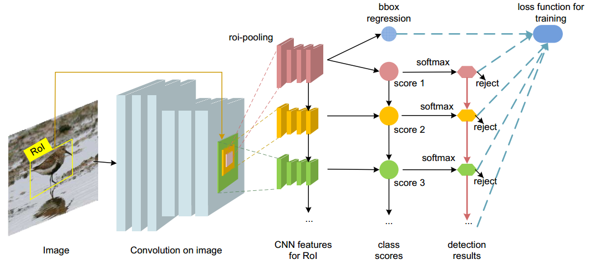

​                                                                                   图15-1 cc-net网络结构 

基础网络是Inception-v2(BN-Inception)结构，对应的示意图如下：

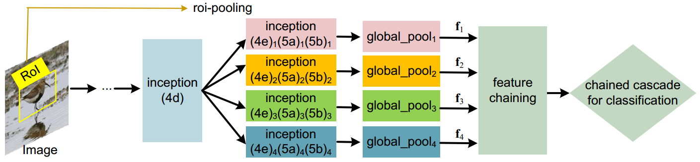

​                                                               图15-2 带BN-Iception的cc-net网络结构 

​     (1) 特征链

​     本文的级联结构设置和其他网络不同，级联分类器在不同的阶段使用了不同的特征。inception(4d)及其以前网络是共享的，然后分成4个独立不共享分支，每个分支中的结构例如inception(4e)，参数设置不一样，目的是学习到不同的特征。对于任意一个roi，每个分支的全局语义都不一样，分别是在其基础上向四周padding一部分，达到0/0.5/0.8/1.7的倍数，相当于不断扩大全局语义信息。

​    对于特征链结构，下一层特征会融入上一层特征信息，如下图所示，具体公式见论文：

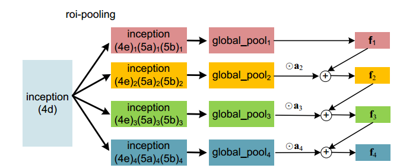

​                                                                      图15-3 带BN-Iception的特征链结构 

​    其中$\alpha$是超参，作者通过实验认为：通过特征链可以实现由粗到细的分类，下一层特征层不再需要关注上一层特征已经学习到的东西，而本层关注更加能够区分类别的精细信息，例如要识别猫和狗，第一层分类器学习到的是整个轮廓差距，而后面一层会学习例如猫狗更加不同的头部结构。

​    (2) 级联分类层

​    每一层分类器使用的是softmax函数，抛弃easy natigate sample的方法是：对于本层分类数值，例如20个类，输出20个分值，如果20个输出值中最大的值都小于阈值，那么就认为是背景，应该拒绝。并且上一层分类值会叠加到下一层，不断训练。示意图如下：

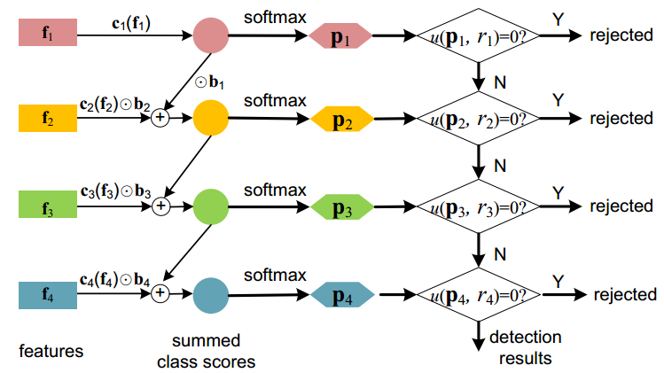

​                                                                图15-4 分类网络结构 

​    联合训练的实现是通过多任务损失函数定义实现的。

## 16、OHEM

### 1 名称

​    [Training Region-based Object Detectors with Online Hard Example Mining ](https://arxiv.org/abs/1604.03540)

### 2 概述

​    OHEM中文翻译是在线难样本挖掘，其是一种样本后处理策略，理论上可以应用到任意网络结构中。OHEM主要是通过训练中在线寻找难样本，剔除easy samples，提升网络性能和提高计算效率，同时也可以认为是一种克服样本不平衡问题策略。机器学习理论已经证明：使用难样本进行训练，可以使得网络训练速度加快、性能提高，例如常用的AdaBoost和GBDT就采用了类似思想。

​    本文将OHEM应用到Fast RCNN网络中，通过在训练中即时挖掘难训练ROI，并应用了类似的数据增强、多尺度训练和测试等策略，最终达到较好性能。

​    简单来说：OHEM就是bootstrapping在DL中的应用。需要提醒：最新的focal loss 论文指出直接修改损失函数是一种比OHEM更高效、简单的样本后处理方式。

### 3 主干网络

​     需要说明的是hard example mining技术在机器学习中应用广泛，常见的有两种：

1. 在优化SVM中使用Hard example mining时，训练算法在更新过程中去除一些工作集中样本并添加其他特殊的标准。这里的标准即去掉一些很容易区分的样本类，并添加一些用现有的模型不能判断的样本类，进行新的训练。
2. 非SVM中使用时，Hard example mining算法开始于正样本数据集和随机的负样本数据集，机器学习模型在这些数据集中进行训练使其达到该数据集上收敛，并将其应用到其他未训练的负样本集中，将判断错误的负样本数据加入训练集，重新对模型进行训练。

​    而OHEM思想和上述类似。

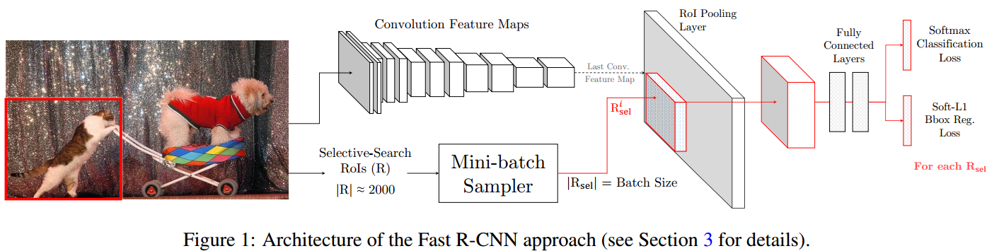

​    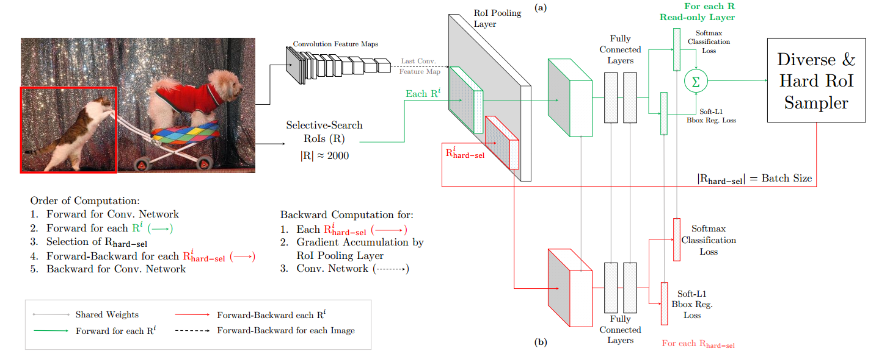

​    第一幅图表示Fast RCNN框架，第二图表示带OHEM的Fast RCNN框架。

​    整个网络非常简单，将原来的ROI Network 由一条分支变成两条分支，两条分支结构完全相同，参数共享，绿色分支是前向分支即该分支接受ROI区域输入，然后进行分类和回归，但是不进行反向梯度计算。红色分支和绿色分支参数完全相同，但是其执行前向和反向，真正使用的分支是红色分支。

​    首先绿色分支对输入的一个mini-batch ROI区域进行分类和回归，得到加和的Loss，实际上每个mini-batch包含N个图像，共|R|个ROI，也就是每张图像包含|R|/N个ROI，得到R个区域的loss后，根据loss大小，选择出loss最大前B=128个样本作为难样本。关于正负样本的选择：当一个ROI和一个ground truth的IOU大于0.5，则为正样本；当一个ROI和所有ground truth的IOU的最大值小于0.5时为负样本，并且有一个问题：重合率比较大的ROI之间的损失也比较相似，故作者采用NMS（non-maximum suppresison）去除重合率较大的ROI，这里作者给的阈值是当IOU大于0.7就认为重合率较高，需去除。**注意，作者没有采用设定背景和目标样本数的比例方式处理数据的类别不平衡问题。因为如果哪个类别不平衡，那么这个类别的损失就会比较大，这样被采样的可能性也比较大，也就是说自动具备了挑选正负样本能力。**

​    然后把选择出的B个难样本输入到红色分支上进行loss计算，并且进行参数反向传播更新。思想和实现都比较简单。

​    其实我们可以发现一个非常简单的OHEM实现方法：Fast rcnn结构不变，在计算loss时候把没有被选择的样本直接置0，这样这些没有被选中的roi就不会参与反向更新和梯度计算。作者指出上述办法是非常低效的，原因是为即便很多ROI的loss都是0，也就是不需要更新梯度，但是这样仍需要给每个ROI都分配存储空间，并且每个ROI都需要后向传播，在目前的实现框架下min batch SGD算法并不高效。

## 17、S-OHEM

### 1 名称

​    [S-OHEM: Stratified Online Hard Example Mining for Object Detection](https://arxiv.org/abs/1705.02233)

### 2 概述

​    本论文非常简单，其指出OHEM训练过程忽略了不同损失分布的影响，选取的样本可能偏向某一种类型，故而作者将传统的分层抽样方法Stratified sample和OHEM结合，并应用在Fast RCNN上提升性能，但是我通过看论文，发现提升非常不明显，在1%左右。

### 3 主干网络

​    只需要了解了分层抽样原理就非常容易理解本论文。分层抽样方法是指：先将总体的单位按某种特征分为若干次级总体（层），然后再从每一层内进行单纯随机抽样，组成一个样本。分层可以提高总体指标估计值的精确度，它可以将一个内部变异很大的总体分成一些内部变异较小的层（次总体），每一层内个体变异越小越好，层间变异则越大越好。简单来说就是：基于某些性质将样本总体分层多个层，然后在每一层中随机抽样，这样可以保证各种情况的样本都能抽样到，保证了总体的均值和方差尽量不变。

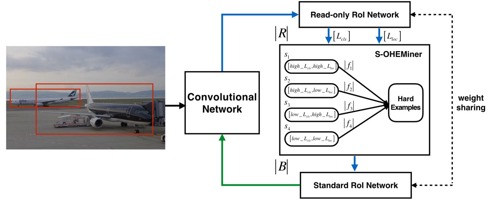

​    从上图可以很容易看出结构：将样本按照损失函数分4层，在每一层抽样即可构成hard example。

## 18、A-Fast-RCNN

### 1 名称

​    论文地址：[A-Fast-RCNN: Hard Positive Generation via Adversary for Object Detection ](https://arxiv.org/pdf/1704.03414.pdf)

### 2 issue

​    A Fast RCNN是为了解决实际采集的数据极少包含形变和遮挡图像而导致学习到的检测器对于该类问题性能很差。本文将对抗学习的思路应用在目标检测中，通过对抗网络生成遮挡和变形图片样本来训练检测网络，取得了一定的效果。明显可知：本文方法是属于样本挖掘技术，和常用的OHEM的区别是OHEM是从一堆已有样本中找到Hard Examples，而本文是直接生成Hard Examples。

​    作者指出：解决遮挡和形变问题，常用的手段是采集大量的样本，能覆盖不同的情况，但是由于长尾效应可知，这是不可能覆盖很多不常见场景，所以使用一种对抗网络来自动生成遮挡和变形的样本，对抗学习的目标是生成检测器难以识别的样本。实验表明，本方法与 Fast-RCNN 相比，在 VOC07 上mAP 提升了 2.3%，在 VOC2012 上 mAP 提升了 2.6%，可以看出**提升不是很大**。

​    题外话：有其他两种常用的生成遮挡和形变样本的方法。1. 直接学习这些罕见的遮挡形变样本，通过尾部分布生成以假乱真的样本图片，作者指出结论是不可行，太过复杂，效果还难说。2. 生成各种可能的遮挡和形变样本，结论是情况太多，根本不可能完备。作者采用了一种更巧妙的方法：不直接生成新的图片，而是在原有图片上“人为”添加遮挡和形变，也算是生成了困难的正样本，让检测器难以进行分类判断。

### 3 创新点

​    (1) 将对抗学习思想引入到目标检测框架中，充分利用训练数据来提升性能。具体是在特征图空间上进行操作，通过遮罩特征图的一部分实现空间遮挡，通过操控特征响应来实现空间变形来生成样本，而Fast R-CNN是作为判别网络，二者在学习中共同提升，最终就提升了检测器的性能；

   (2) 设计了两个生成网络，分别用于遮挡和形变，即Adversarial Spatial Dropout Network（ASDN，对抗空间丢弃网络）和Adversarial Spatial Transformer Network（ASTN，对抗空间变换网络）。这两个网络是和Fast R-CNN联合训练的，主要是为了防止固定生成模式下的过拟合。

### 4 模型

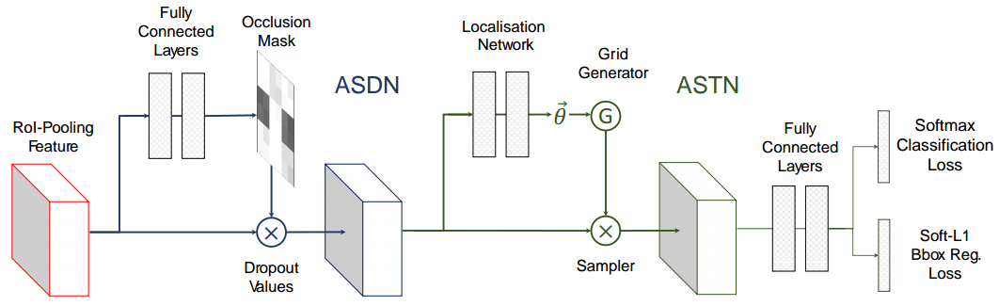

​                                                                                  A-Fast-RCNN 网络整体结构图

​                                                                                          ASDN网络结构

​    该网络结构是基于Fast RCNN网络。

​     **(1) ASDN网络**

​      **网络结构**：ASDN网络的输入是Fast R-CNN中RoI-pooling之后的特征图，然后通过全连接层生成掩模Mask，确定特征图的哪些部分应该减掉（dropout），这样生成的困难样本最好要让检测器误判，掩模会自动根据损失函数作出调整。假设ASDN的输入特征图是$d×d×c$（AlexNet中，d=6，c=256），ASDN就会生成一个$d×d$的掩模，其值只有0或1。假定掩模中某一点的值为$M_{ij}$，如果其值为1，就去掉特征图中该坐标位置所有通道的像素值，将其归零。   

​    **模型预训练**：使用标准的Fast R-CNN框架，对抗网络共享基础卷积层和RoI-pooling层，但是没有共享参数。在没有ASDN的情况下迭代Fast R-CNN模型10000次，然后才来训练ASDN。

​    **网络初始化**：假设输入ASDN的特征图维度是$d×d$，作者设定大小为$d/3×d/3$的滑动窗口，滑动窗口所在的位置将会被遮挡，每个特征图会得到10种不同的遮挡情况（滑动窗口只遮挡不同位置的1/9面积，包括完全不遮挡），这样就生成了多个新特征图，再把他们送到分类器中判别，选择损失值最高的那个为最优（因为它最能骗过分类器）,ASDN训练的损失函数是二值交叉熵。

 **采样阈值**：ASDN生成的结果不会是上述简单的矩形二值化掩模，它应该是一个连续的热图（heatmap）。作者没有使用固定阈值，二是按照重要性排序，将前面1/3的像素值给屏蔽掉。具体而言的操作是，选择概率值前1/2的像素，再随机选择其中的2/3设为0，剩下的1/3设为1，这样总共将1/3的像素给屏蔽掉，造成遮挡的情况。

​     **联合训练**：作者将ASDN和Fast R-CNN进行了联合训练，并且受到增强学习的启发，着重训练导致分类效果显著降低的二值化掩码。

​     **(2) ASTN网络**

​     ASTN的关键是在特征图上产生形变使得检测器难以判别。

​     网络概述：STN网络由三个组成部分，分别是：定位网络（localisation network）、网格生成器（grid generator）和采样器（sampler）。定位网络估计形变参数（如旋转度、平移距离和缩放因子），网格生成器和采样器用这些参数来产生新的形变后的特征图。

​     网络细节：空间变换有好几种形式（裁剪、平移、缩放、旋转等），针对本文中的形变要求，作者仅关注旋转特征，意味着ASTN只需要学习出让检测器难以判别的旋转特征就可以了。对抗网络长得和ASDN相似，其中定位网络由3个全连接层构成，前两层是由fc6和fc7初始化来的。ASTN和Fast R-CNN要联合训练，如果ASTN的变换让检测器将前景误判为背景，那么这种空间变换就是最优的。

​     实现细节：在试验中发现，限制旋转角度很重要，不加限制容易将物体上下颠倒，这样最难识别，也没啥意义。作者把旋转角度限制在了正负10度，而且按照特征图的维度分成4块，分别加以不同的旋转角度，这样可以增加任务复杂性，防止网络预测琐碎的变形。

 作者最终的训练策略是将ASDN和ASTN网络联合训练，由于这两个对抗网络提供不同类型的信息，通过同时竞争这两个网络，检测器可以变得的更鲁棒。

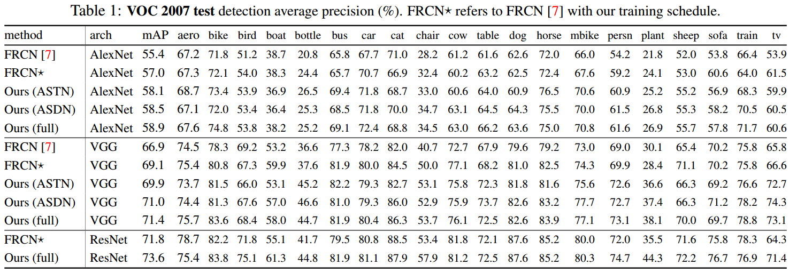

# 二、3D点云数据分类、分割

## 1、PointNet

### 1.1 名称

​    [PointNet: Deep Learning on Point Sets for 3D Classification and  Segmentation](https://arxiv.org/abs/1612.00593)

### 1.2 概述

​    **pointNet是第一个直接使用3d点云数据作为输入的深度学习模型**。作者首先分析了点云数据输入存在的难点：1.点云具有无序性；2.点云具有稀疏性；3.点云信息量有限。针对上述难点，作者第一次提出直接处理无序点云数据的深度神经网络。对于无序输入问题，作者引入T-Net充当对称函数，通过训练T-Net参数实现数据的对齐，依据该思路将T-Net应用到特征层，实现特征的对齐，通过这两个核心步骤，可以保证即使3d点云输入顺序改变、长度改变，网络依然可以学习到同样的输出。pointNet提出的本意是用于分类、分割应用，而对于分割应用，实验证明融合局部和全局语义可以有效提升分割精度，基于此，作者在分割网络中引入局部信息提升性能。

​    总之，pointNet网络设计的三个核心是：1.使用max pooling函数作为对称函数，整合所有点云数据信息，并解决无序性问题，使用共享网络参数(卷积操作)的方式来处理输入维度的变化；2.分割网络中引入局部信息，通过和全局信息融合提升性能；3.引入两个T-Net网络，解决了数据和特征对齐问题。

### 1.3 主干网络

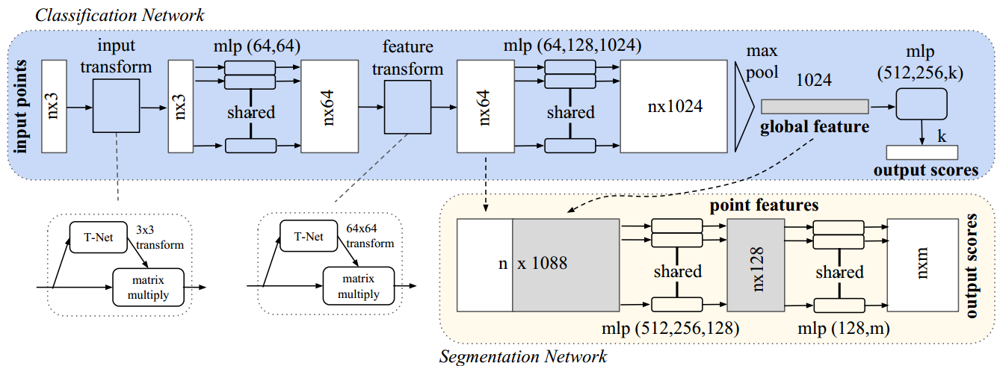

​                                                                         图1-1 PointNet网络结构图

​    如上图所示，输入是包含n个点的三维点云（nx3) , 原始数据通过一个3D 空间变换矩阵预测网络 T-Net(3)，估计出3x3的变换矩阵T(3)并作用在原始数据上，实现数据的对齐。对齐后的数据会以点为单位，通过一个共享参数的双层感知机模型(conv2d实现)进行特征提取 。每个点提取出64维的特征，再通过特征空间变换矩阵预测网络 T-Net(64) 预测64x64的变换矩阵，作用到特征上，实现对特征的对齐。然后继续利用三层感知机（64,128,1024）进行以特征点为单位的特征提取，直到把特征的维度变为1024，继而在特征空间的维度上进行Max Pooling，提取出点云的全局特征向量 。

​    **在点云分类任务中，可直接利用特征向量训练SVM或者多层感知机(pointNet分类采用该方式)来进行分类，而在以点为单位的点云分割或者分块任务中，需要结合每一点的局部特征和全局特征进行特征融合和处理，实现逐点的分类。**PointNet中把经过特征对齐之后的64维特征看成是点的局部特征，把最后的1024维特征看成是点的全局特征，因此通过一个简单的拼接，把局部和全局的特征捆绑在一起，利用多层感知机进行融合，最后训练分类器实现逐点的分类。

## 2、PointNet++

### 2.1 名称

​    [PointNet++: Deep Hierarchical Feature Learning on Point Sets in a Metric  Space](https://arxiv.org/abs/1706.02413)

### 2.2 概述

​    PointNet++是同名作者针对PointNet分类网络在局部特征描述方面能力方面稍弱而限制了它识别细粒度类别的能力以及对复杂场景的泛化能力而进行的改进版本。PointNet的基本思想是学习每个点的空间编码然后聚合所有点的特征到全局特中，但是这种结构捕捉不到测度引入的局部结构。然而探究局部结构在CNN中被证明非常重要，传统2D CNN中接受规则输入，并且不断的在不同层捕获不同尺度的特征，通过层级结构不断地抽象特征能更好地泛化，其本质就是一个从局部到整体的过程，而PointNet++本质就是模仿传统CNN学习方式，先从小的领域提取局部特征，然后group去产生更高层的特征，这个过程不断的重复直到获取整个点云集合的全局特征。

​    作者设计了一个标准的层级结构 set abstraction levels，每个层级包括3个部分： Sampling layer, Grouping layer 和PointNet layer，通过不断的重复set abstraction levels抽取局部特征，然后由局部特征组合成全局特征，最后进行分类和分割，思路比较简单。

### 2.3 主干网络

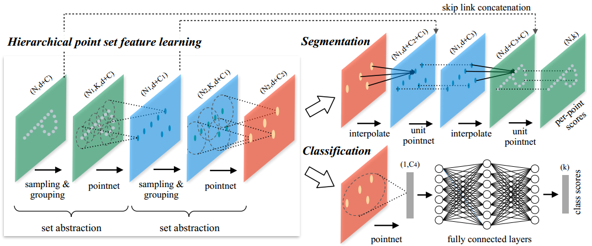

​                                                                             图2-1 PointNet++网络结构图

​    结构如上图所示，层级结构由很多个set abstraction levels构成，每个sa模块包括3层： Sampling layer, Grouping layer 和PointNet layer：

- Sampling layer主要是选出一些点作为局部区域的中心点。每个局部划分都是一个邻域球，参数包括中心点的位置和尺度，为了更加均匀地覆盖整个数据集，中心点是使用farthest point sampling（FPS）算法进行采样的即先随机选择一个点，然后再选择离这个点最远的点作为起点，再继续迭代，直到选出需要的个数为止；
- Grouping layer 主要是通过找中心点的邻居来构造局部区域。分组算法用的是ball query,就是给定中点，把给定半径内的点都包括进来，同时是要给定点个数。相比KNN，ball query保证了一个固定的区域尺寸，所以比KNN更加geralizable across space,更适合于需要局部特征的任务，而且local region中的坐标会被转换到相对于中点的坐标系中，使用相对坐标系，我们可以捕获到局部区域中点到点的关系；
- PointNet layer用于提取单个区域的全局特征，也就是整个点云的局部特征，这里采用的是mini-pointnet。

​    对于分类网络，多次循环后，得到全局特征，然后使用多层MLP进行分类即可。

​    上述流程算是层次化的pointnet，作者在实验中发现：由于空间分布多样性，数据采样是不均匀的，如果直接采用上述分组方法，会导致在低密度区域样本较少，在低密度的地方可能会丢失局部信息，为了解决该问题，常用的方法是增大尺度，故而提出density adaptive PointNet layers，或者说提出了两种自适应密度grouping方法：(a) Multi-scale grouping (MSG); (b) Multiresolution grouping (MRG)，考虑到MRG内存消耗很大，故而作者在实际中只采用了MSG方法。

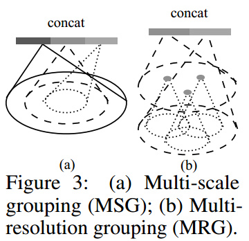

​                                                                                图2-2 MSG与MRG示意图 

   MSG就是在分组的时候分不同scale和样本数，特征是在不同尺度上进行提取，然后通过concatenated操作组合成多尺度特征。训练时会随机dropout一些input points，测试的时候不会dropout,这样训练集就有various sparsity。

​    对于分割任务而言，在sa中，点进行子采样，但是segmentation任务中对于点标记需要所有的原始点。一种方法是对所有的点都sample成中心点，但是计算复杂度太高，另一种方式是子采样点的特征传导回原始数据点。采用了一种层级的传播方式，如上图的skip link，同时进行逆向连接，之前的输入作为输出，之前的输出大小作为输入，进行插值，直到传播特征到原始的数据点为止。

## 3、Kd-Net

## 4、VoxelNet

### 4.1 名称

### 4.2 概述

### 4.3 主干网络

# 三、生成对抗网络

## 1、GAN

### 1.1 名称

### 1.2 概述

### 1.3 主干网络

# 四、图像分割

# 五、基础网络架构

## 1、LeNet

## 2、AlexNet

## 3、ZF-Net

## 4、VGG

## 5、NIN

## 6、GoogLeNet

### 6.1 Inception_v1

### 6.2 Inception_v2

### 6.3 Inception_v3

### 6.4 Inception_v4

### 6.5 Inception_resnet_v1

### 6.6 Inception_resnet_v2

### 6.7 Xception

## 7、ResNet

### 7.1 ResNet_v1

### 7.2 ResNet_v2

### 7.3 ResNeXt

### 7.4 WRN

### 7.5 DenseNet

### 7.6 DPN

## 8、SENet

## 9、NASNet

## 10、ENASNet

## 11、CliqueNet

## 12、移动端专用网络

### 1 SqueezeNet

### 2 MobileNet

#### 2.1 MobileNet_v1

#### 2.2 MobileNet_v2

### 3 ShuffleNet
