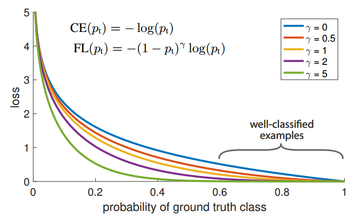
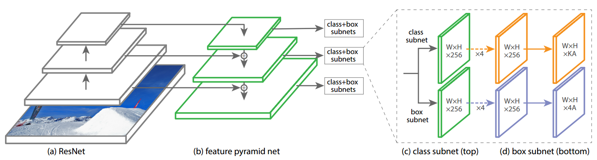
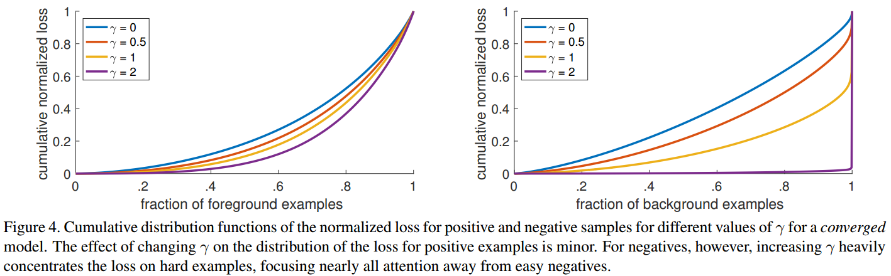
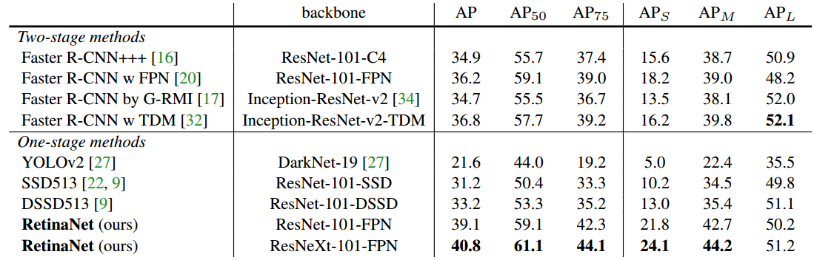

## Focal Loss-RetinaNet

 论文地址：    [Focal Loss for Dense Object Detection](https://arxiv.org/abs/1708.02002)

### 1 创新点

​     本文是FAIR出品，对目标检测领域意义重大的精品文章，思路非常简单，训练也没有任何技巧，但是效果超级好。主要创新点是：

​     (1) 深入分析了何种原因导致的one-stage detector精度低于two-stage detector算法

​     (2) 针对上述原因，提出了一种简单但是极其实用的loss function，称为Focal Loss焦点损失函数

​     (3) 针对目标检测问题，专门设计了一个新的骨架网络RetinaNet，结合Focal Loss使得one-stage detector在精度上能够达到乃至超过two-stage detector，在速度上和一阶段相同

### 2 核心思想

​     目前目标检测分为two-stage detector和one-stage detector，通常two-stage detector精度较高、速度较慢，而one-stage detector速度较快、精度较低。作者试图分析：何种原因导致的one-stage detector精度低于two-stage detector算法？通过实验分析发现： **极度不平衡的正负（前景背景）样本比例**。对于one-stage detector，例如YOLO、SSD等，anchor近似于sliding window的方式会使正负样本接近1000：1，而且绝大部分负样本都是easy example(包括easy positive和easy negative，但主要是easy negative)，这些easy example虽然每一个的loss会比较小，但是因为数量巨大，主导了最终的loss，如图1所示，导致最后训练出来的是一个degenerated model，也就是**gradient被easy example dominant**。需要注意的是two-stage detector算法例如Faster RCNN通过第一级的RPN网络屏蔽掉了大量easy example，得到的是稀疏的区域样本，所以不存在上述问题。

​    既然问题是极度不平衡的正负样本比例，也就是通常说的类别不平衡问题。在目标检测领域对付该问题常用办法是hard negative mining，例如最常用的**OHEM**，它通过对loss排序，选出loss最大的example来进行训练，这样就能保证训练的区域都是hard example。这个方法的缺陷，是把所有的easy example都去除掉了，造成easy positive example无法进一步提升训练的精度，而且复杂度高影响检测效率。故作者提出一个简单且高效的方法：**Focal Loss焦点损失函数**，其解决了两个问题：**样本不平衡问题以及算法突出hard example**，在损失函数章节详细说明。其是根据交叉熵改进而来，本质是dynamically scaled cross entropy loss，直接按照loss decay掉那些easy example的权重，这样使训练更加bias到更有意义的样本中去，说通俗点就是一个解决**分类问题中类别不平衡、分类难度差异**的一个 loss。

​    解决了最核心问题后，为了突出Loss的好处，作者结合目标检测中的state-of-art模型:FPN和ResNet101，专门提出了一种新的一阶段目标检测模型RetinaNet，实验结果表明本模型+loss可以使得one-stage detector在精度上能够达到乃至超过two-stage detector，在速度上和一阶段相同。需要注意的是：在文中作者重点说明，**达到如此高的性能原因是Focal Loss，而不是因为RetinaNet优秀**。同时可以看出Focal Loss就是普通的损失函数，理论上是可以直接应用在two-stage detector算法上面进一步提升性能，但是由于作者未进行实验，效果待定。

### 3 模型

#### 3.1 损失函数

​    对于分类问题，常用的损失函数是交叉熵，其标准定义是：
$$
\\CE(p,y)=CE(p_t)=-log(p_t)
$$
 图1蓝色线条所示。$p_t$是不同类别的分类概率，可以看出在$p_t>=0.6$时候，可以认为是well-classified examples，而one-stage detector由于存在大量的easy examples会使得total loss依然很大，最终会导致学习到一个degenerated model。

​    一种处理类别不平衡的常用策略是加入权重因子，使得CE变成带权重的CE，其定义为：
$$
\\CE=-\alpha_{t} log (p_t)
$$
$\alpha_t$可以作为超参数，并通过交叉验证确定。但是上述损失函数只关注于正负样本类别不平衡问题，而无法关注难易样本不平衡问题，而Focal Loss就是为了解决该问题。焦点损失函数：
$$
\\FL=-(1-p_t)^\gamma log(p_t)
$$
$\gamma\in[0,5]$是超参，作其中，$\alpha_t$和$\gamma$是超参，不参与训练，并且两者相互影响，作者通过实验设置$\gamma=2、\alpha_t=0.25$，其曲线如图：

​                                                                                             图1 CE和FL函数曲线图

   对于分类错误的样本或者说难分的样本，其预测概率$p_t$值比较小，loss作用和CE一致，不影响；对于分类正确的样本或者说易分的样本(well classified examples)，其预测概率$p_t$值较大，loss就会被衰减，从而达到聚焦与难负样本分类问题。对于交叉熵(做上方的蓝线)，当大量样本都是well classified examples时，每个样本带来的loss也不算小，而大量well classified examples就会给系统带来不好的梯度，使得整个系统性能下降。

​    Faster RCNN的两级结构可以很好的规避上述两个问题。具体来说它有两大法宝：1、会根据前景score的高低过滤出最有可能是前景的example (1K~2K个)，因为依据的是前景概率的高低，就能把大量背景概率高的easy negative给过滤掉，这就解决了前面的第2个问题；2、会根据IOU的大小来调整positive和negative example的比例，比如设置成1：3，这样防止了negative过多的情况(同时防止了easy negative和hard negative)，就解决了前面的第1个问题。所以Faster RCNN的准确率高。

#### 3.2 模型结构

​    作者提出了一种使用Focal Loss的全新结构RetinaNet，使用ResNet_101+FPN作为backbone，再利用单级的目标识别法+Focal Loss，达到非常好的效果。

图2 RetinaNet网络结构图

​    (1) 底层的基础网络是ResNet-101，再其后面几层再构造FPN网络，具体是$P_3$到$P_7$，每个特征金字塔的通道都设置为256，作者说明以上的参数设置和选择不是很关键，只要应用了FPN网络即可；

​    (2) 在不同金字塔层，Anchors设置是不一样的，基本和FPN原论文一致。具体为anchor区域大小为$32^2$到$512^2$，对于的level是$P_3$到$P_7$，每个金字塔有三种aspect ratios ${1:2,1:1,2:1}$ ，有三种anchors of sizes  ${2^0,2^{1/3},2^{2/3}}$,一共9种比例；

​    (3) 前景样本设置IOU为大于等于0.5，背景样本设置IOU为[0,0.4]，其他IOU级别的样本忽略；

​    (4) 对于分类分支，不同于ssd的分类回归网络，作者设置的分类和回归网络卷积层较深，并且两个subnet没有share卷积层的参数。作者设置的原因是更高级别特征层做出的决策比特殊定制超参数更重要。有一个细节，在训练初始阶段因为positivie和negative的分类概率基本一致，会造成Focal Loss起不到抑制easy example的作用，为了打破这种情况，作者对最后一级用于分类的卷积的bias作了下小修改，把它初始化成一个特殊的值$b=-log((1-π)/π)$*。*$π$在论文中取0.01，这样做能在训练初始阶段提高positive的分类概率。

​    (5) 对于回归分支，也是采用类似处理

### 4.训练

​    (1) 预训练。基础网络ResNet-50、ResNet-101、ResNet-152+FPN在ImageNet 1000类别上面进行预训练，除了最后一个卷积层，其他全部卷积层初始化bias=0，最后分类网络的卷积层$bias=-log((1-π)/π)$

​    (2) 优化方法。使用SGD+Momentum在8块GPU上同步训练，每块GPU的输入图片batch=2，迭代次数是90k，初始学习率是0.01，Momentum初始为0.9

   (3) 损失函数计算。整个loss分为分类和回归损失即focal loss+smooth L1，训练时长依据基础网络复杂度是10到35个小时；

​    (4) 全部网络都是采用coco数据集

这个结构要注意几点：

   (1) 训练时FPN每一级的所有example都被用于计算Focal Loss，loss值加到一起用来训练；

   (2) 测试时FPN每一级只选取score最大的1000个example来做nms；

   (3) 整个结构不同层的head部分共享参数，但分类和回归分支间的参数不共享；

   (4) 分类分支的最后一级卷积的bias初始化成前面提到的$-log((1-π)/π)$;

   (5) 在计算$p_t$时用sigmoid方法比softmax准确度更高；

   (6) Focal Loss的公式并不是固定的，也可以有其它形式，性能差异不大，所以说Focal Loss的表达式并不crucial。

### 5.结果分析

​    (1) Focal Loss 分析

可以看出：对于正样本而言，增大$\gamma$对于loss的分布影响不大，但是对于负样本来说，当$\gamma=2$的时候，绝大部分的负样本对于loss和的贡献都可以忽略，所有的loss都集中在很小部分的hard example上，所以作者最终选择的$\gamma=2$

​    (2) 模型对比

可以看出：使用比较好的骨架网络再结合focal loss，可以达到非常高的精度。    

​    对于类别不平衡问题，作者也分析了好几种方法:(1) 类别权重方法；(2) OHEM；(3) OHEM+按class比例sample，作者指出OHEM是一种有效的正负样本平衡方法，它的思想是通过loss，只选取前n个样本进行训练，而Focal Loss则不会抛弃样本，而是利用所有样本，针对难易程度进行Loss decay。通过实验发现OHEM效果在本文中并不佳，但是没有给出原因。
