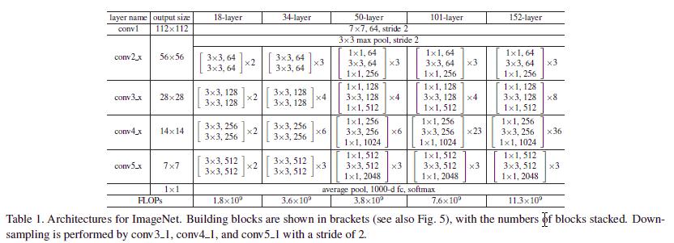
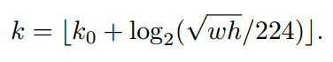
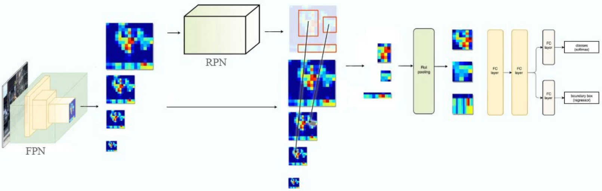
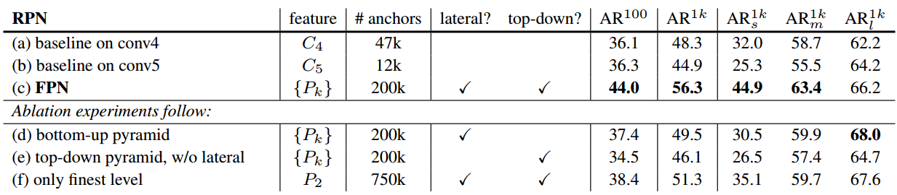
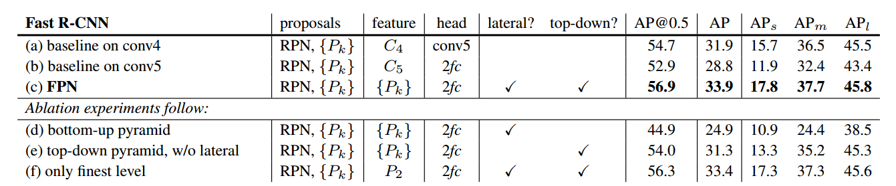
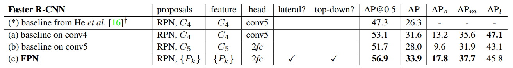

## FPN特征金字塔网络

论文地址：[Feature Pyramid Networks for Object Detection  CVPR 2017](https://arxiv.org/abs/1612.03144)

### 1 创新点

​    本文是FAIR精品文章，值得细读。本文的创新点就一个：**提出了一种可增强基础网络的特征金字塔网络(FPN,Feature Pyramid Networks)，并将FPN网络应用到Faster Rcnn中，达到当前最好效果**。本文主要目的是在不显著修改原有网络结构和不增加较大计算代价的前提下提升小物体目标检测精度。不得不说本文思想和实现非常简单，训练也没有任何技巧，但是可以取得非常好的效果。

### 2 核心思想

​    当前目标检测常用的解决方案有： 

​     (1) **图像金字塔**，也可以称为多尺度训练和测试，典型算法是DPM，如图1-a所示。对原始图片进行多尺度采样构成图像金字塔，然后在每个层级上面进行预测，缺点是计算量极大，无法实际使用。在实际中为了平衡，有些算法会在测试时候采用图像金字塔，而训练时候不使用；

​     (2) **单层预测**，典型算法是RCNN系列和YOLO，如图1-b所示。该类算法的本质是利用卷积网络具有的类似于金字塔功能的特征提取能力，然后在最高层进行预测，缺点是只使用最高层语义信息会丢失小目标精度，因为stride步骤的存在，高分辨率的低层特征很难有代表性的检测能力；

​      (3) **多层预测**，典型算法是SSD，如图1-c所示。该类算法在不同层后进行预测，部分弥补了(2)类方法的不足，缺点是直接强行让不同层学习同样的语义信息会存在语义间隙。对于卷积神经网络而言，不同深度对应着不同层次的语义特征，浅层网络分辨率高，学的更多是细节特征，深层网络分辨率低，学的更多是语义特征。SSD还存在一个问题：它并没有利用较低高分辨率特征图，而是在高层特征图后面再加了几层，作者认为这样对小目标检测不利。

​                                                                          图1 金字塔模型网络结构 

​    基于以上三种方法存在的不足，作者提出如图1-d所示结构，通过top-down pathway 从上到下路径和横向连接lateral connections，结合高分辨率、弱语义信息的特征层和低分辨率、强语义信息的特征融合，实现类似图像金字塔效果，**顶层特征通过上采样和低层特征做融合，而且每层都是独立预测的**，在COCO数据集上刷到了第一的位置，效果显著。

### 3 模型

#### 3.1 Faster RCNN模型结构

​    对于基础网络是ResNet-50、ResNet-101、ResNet-152的Faster RCNN结构，需要注意的细节是conv1_x～conv4\_x做为公共的基础网络部分，而conv5\_x是连接在ROIPooling后面的，而ResNet\_xx的结构如下：

 

​     需要重点说明的是：**为何作者将conv5\_x作为fast RCNN独有网络，不作为基础网络**？原因是目标检测包括分类问题和bbox回归问题，分类问题需要特征的平移不变性，而回归问题需要特征的变换性，这两着是矛盾的，或者说分类问题需要较深的网络结构，从而提取更抽象的语义特征，而回归问题希望有较高的特征分辨率输入，从而边界框较大。作者认为把conv5\_x作为基础网络的话，那么网络会偏向于分类问题，并且imageNet预训练权重的加载更会加深特征的平移不变性，不利于bbox回归精度，而如果将conv5\_x不作为基础网络，而是连接到ROIPooling后面，可以引入一定的平移变换性，可以平衡分类和回归问题，并且通过后续实验也印证这一点。

#### 3.2 FPN网络结构

​                                                                               图2 FPN网络结构

​    如上图所示，FPN网络主要包括高层特征图上采样和横向连接。整个网络结构包括3个部分：

​    (1) Bottom-up pathway

​        从下到上路径。可以明显看出，其实就是简单的特征提取过程，和传统的没有区别。具体就是ResNet作为基础网络特征提取过程，将ResNet特征提取层中的conv2\_x、conv3\_x、conv4\_x、conv5\_x的输出定义为$C_2,C_3,C_4,C_5$，他们相对于原始图片的stride是{4,8,16,32}

   (2) Top-down pathway 

​       从上到下路径。本质是从最高层开始进行上采样，这里的上采样为了简单化，直接使用的是线性插值算法，而不是去卷积操作。具体就是对$C_2,C_3,C_4,C_5$中的每一层经过一个conv 1x1操作，无激活函数操作，输出通道全部设置为相同的256通道，方便后续add操作

   (3) lateral connections

​       横向连接。对高层特征图进行上采样，然后对两个特征图进行相加融合操作即可。具体操作，例如$C_5$经过conv 1x1x256后，得到$P_5$，而$C_4$也经过conv 1x1x256后得到的特征图与$p_5$经过2xUpSample后得到特征图相加即可得到。

​    以上就是FPN全部细节和核心思想。需要注意的是：**FPN网络不是一个单独完整的网络结构，只能算一种基本组件，类似于一个inception结构一样。其可以嵌入到任何基础网络结构中，如果有需要的话**。作者是在Faster rcnn网络中进行测试性能的。

#### 3.3 RPN应用FPN网络

上图中的M是原文的P，作者没有使用conv1特征图进行构造金字塔，原因是该层特征图太大，非常消耗内存、计算量太大。其中**上图少绘制了一个分支**：M5经过2x2的max pooling下采样，然后经过3x3卷积得到$P_6$，作者指出额外多用一个$P_6$是想得到较大的ROI区域。另外这里 M2-M5最后又做了一次3*3的卷积，作用是消除上采样带来的混叠效应。而且 P6是用在 RPN 目标区域提取网络里面的，而不是用在 FPN 网络，意思是P6只用于训练RPN网络，其提取的ROI不会输入到Fast RCNN中。

​     由于各层特征图大小不一样，所以对于Anchors也是不一样的，作者对{P2,P3,P4,P5,P6}设置的基础区域像素大小是{$32^2,64^2,128^2,256^2,516^2$}，并添加了3种比例{1:2,1:1,2:1}，所以整个FPN网络有15种Anchors。

​     RPN网络训练的正负样本设置策略和原文一致，即IOU>=0.7为前景，<=0.3为背景

#### 3.4 Fast RCNN应用FPN网络

​     由1.3.1结构可知，conv5\_x用在Fast RCNN中，然后目前FPN已经使用了conv5\_x，所以作者在ROIPooling层后面使用了2和1024节点的全连接层代替。

​    不同尺度的ROI，使用不同特征层作为ROI pooling层的输入，大尺度ROI就用后面一些的金字塔层，比如P5；小尺度ROI就用前面一点的特征层，比如P4。那怎么判断ROI改用那个层的输出呢？这里作者定义了一个系数Pk，其定义为：

$k_0$=4，表示以P4为基础，w h是ROI的对应原图中的宽高，224是ImageNet的标准输入，假设ROI是112 * 112的大小，那么$k = k_0-1 = 5-1 = 4$，意味着该ROI应该使用P4的特征层。k值会做取整处理，防止结果不是整数。

### 4 实验细节

​    实验在目标检测Faster R-CNN+Resnet-50网络和语义分割网络中测试，数据使用coco，包括了大量实验。

#### 4.1 RPN应用FPN

​    RPN训练。输入图片的最短边全部resize到800px，SGD+Momentum，在8块GPU上面训练，每块GPU的batch=2，每张图片256个anchors，Momentum参数是0.9，前30k个batch采用的学习率是0.02，后10k个batch'是0.002。最终训练RPN用了8个小时，imagenet预训练和以前相同。

   作者做了3个额外的实验来充分说明所提创新点的优势，具体结构如下：

 由上图的(a)、(b) 实验对比可知：   (a)是将conv4用到了基础层，将conv5用到了fast rcnn层，(b)是将conv5用到了基础层，将fast rcnn中的conv5替换为2个全连接层。可以看出(a)的效果较好，说明并不是将越高层的特征作为基础网络就越好，因为目标检测需要平衡分辨率和高层语义。

​    而通过(d)、(e)、(f)实验可知这两中结构都是必须的，单独使用其中一种效果不行。因为如果不使用top-down结构，那么特征图之间由于pool操作会存在较大的语义间隙，而如果不使用lateral连接，那么就是SSD思路，这样会导致特征图bbox不精确，而如果不采用多层P结构，只使用其中一层，那么效果也不好。同时作者发现进一步增加anchors数目，效果并不能提升，说明anchors数目不是越多越好。

​    通过实验主要说明了以下几点：

​    (1) 高层特征并非一定比低一层的特征有效

​    (2) 类似与ssd的思想，在检测小目标时候不好，原因在于在自底向上的不同层之间的semantic gaps比较大

​    (3) 没有横向连接，即向下过程没有融合原来的特征。效果不好的原因在于目标的location特征在经过多次降采样和上采样过程后变得更加不准确

#### 4.2 Fast RCNN应用FPN

基本设置没有很大区别。需要注意的是上述的结果是固定了RPN参数得到的

#### 4.3 Faster RCNN应用FPN

 带*的是原始论文结果，可以看出，FPN效果好很多。

### 5 总结

​    本文最大亮点是为小目标检测提供了一种非常有效且开销不大的方法。算法同时利用低层特征高分辨率和高层特征的高语义信息，通过融合这些不同层的特征达到预测的效果。并且预测是在每个融合后的特征层上单独进行的，这和常规的特征融合方式不同。 

