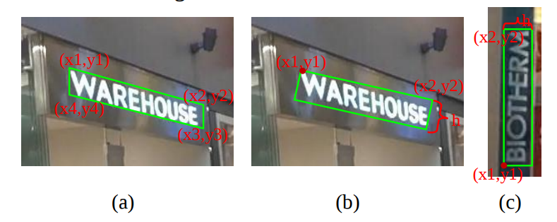
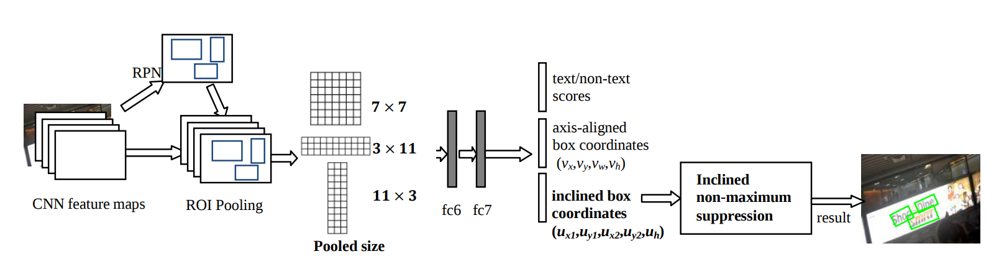
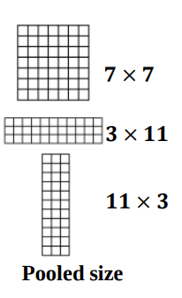
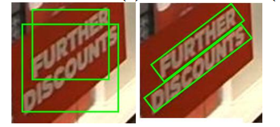
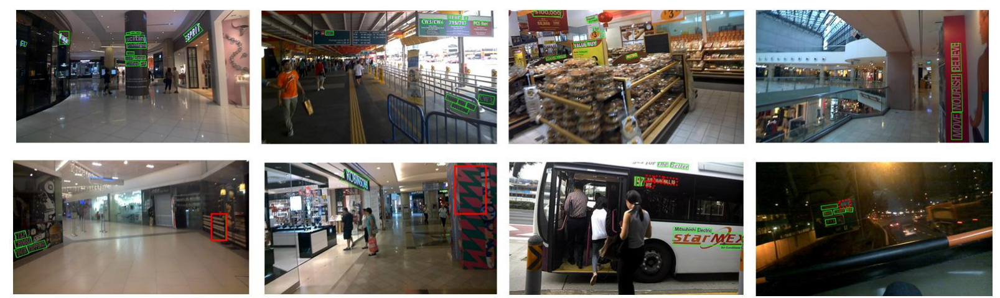

# 基于Faster RCNN的斜框检测：R2CNN

在*R2CNN: Rotational Region CNN for Orientation Robust Scene Text Detection*这篇文章中提出了一种旋转区域CNN(Rotational Region CNN，R2CNN)，用于检测在自然场景图片中的任意方向的文本框。R2CNN是基于Faster RCNN的架构，如果对Faster RCNN不了解的需要先熟悉一下。

## 1. 什么是斜框检测

ICDAR 2015数据集是关于文字检测的数据集，关于这个数据集的一个检测任务就是文字的斜框检测。在这个数据集中，文字是被斜框包裹的，这个斜框可以由4个坐标点(x1,y1,x2,y2,x3,y3,x4,y4)表示，4个坐标点以顺时针方向排列，如下图a所示。需要注意的是，这个斜框不是矩形，如果直接预测这4个点会比较麻烦。为了简化问题，我们不直接预测这四个坐标点而是直接预测一个斜矩形：即预测斜矩形的两个坐标点和矩形的高(x1,y1,x2,y2,h)。这里的第一个点指的是左上角的点，第二个点是顺时针方向的第二个点，如下图bc所示：

我觉得用(x1,y1,x2,y2,h)这种方式来表示一个斜矩形并不是唯一的，只要能用一种方式来合理表示斜矩形都是没问题的。不过不同的表示方式可能会影响网络的学习。下面介绍另外一种表示形式。

我们可以中心点坐标，宽度，高度和旋转角度来表示斜矩形，对应的关系如下图：

注意：旋转角度θ是水平轴（x轴）逆时针旋转，与碰到的矩形的第一条边的夹角。并且这个边的边长是width，另一条边边长是height。也就是说，在这里，width与height不是按照长短来定义的。在opencv中，坐标系原点在左上角，相对于x轴，逆时针旋转角度为负，顺时针旋转角度为正。在这里，θ∈（-90度，0]。

## 2. 方法

### 2.1 整体架构

R2CNN采用的是架构是两阶段的Faster RCNN架构。整体架构如下图所示：

第一个阶段：通过RPN网络，得到正框的Proposal。由于很多文字是很小的，因此在原本anchor scale(8,16,32)改为(4,8,16,32)。实验证明增加了小的尺度后检测效果明显提升。

第二个阶段：对于每个proposal，平行地使用了不同pooled size(7 × 7, 11 × 3, 3 × 11) 的ROIPooling，然后将ROIPooling的结果concate在一起，再经过fc6，fc7进行正框预测，斜框预测以及分类预测。之后，再通过斜框的NMS进行后处理，得到最后的结果。

所以从整体上来说，第一阶段和Faster RCNN的区别在于增加了anchor scale。第二阶段的区别在于增加了多尺度的ROIPooling，以及斜框预测。这里有一个问题就是，我既然检测的是斜框，为什么在第二阶段还要检测正框，作者说在检测斜框的同时去检测正框可以改善斜框的检测效果，实验也证明了这个。

### 2.2 多尺度ROIPooling

在Faster RCNN中，使用到的Pooled size是7x7的，但是，考虑到某些文字框的宽高差距很大，因此考虑增加了两种pooled size：3x11和11x3。3x11可以更好地捕捉水平特征，这对于检测宽大于高的框比较有好处，二11x3可以更好地捕捉地捕捉竖直特征，这对于检测高大于宽的框比较有好处。

### 2.3 斜NMS

我们已经知道了正框的NMS了，但是如果直接使用正框NMS的话，会遇到一个问题：可能会将一些有用的检测结果给抑制了，比如下图中的左图，两个正框的IOU是很大的，根据NMS规则，会将其中一个框舍去。但很显然，我们希望这两行文字都检测出来。所以这个时候就要用到斜框NMS。斜框NMS的方法可以参考：*Arbitrary-Oriented Scene Text Detection via Rotation Proposals*，其实和正框的NMS思想是一样的，不同的是计算两个斜框的IOU会比计算两个正框的IOU复杂一些。

所以，对于斜框检测使用斜NMS会改进检测的效果。

## 3. 损失函数

第一阶段损失函数的定义和Faster RCNN一样。

第二阶段的损失函数中多了一个斜框回归的损失。斜框中坐标损失（x1,y1,x2,y2）和Faster RCNN中xy损失的定义是一样的，h和Faster RCNN中h的损失定义也是一样的。

## 4. 一些实验结果

可以看到，很多很小的文字框都可以检测出来，效果还是很好的。

参考：[python opencv minAreaRect 生成最小外接矩形](https://blog.csdn.net/lanyuelvyun/article/details/76614872)