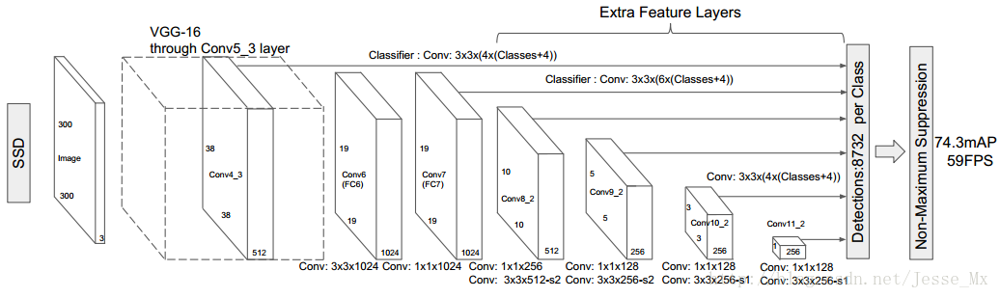
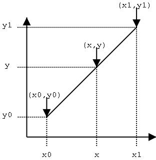
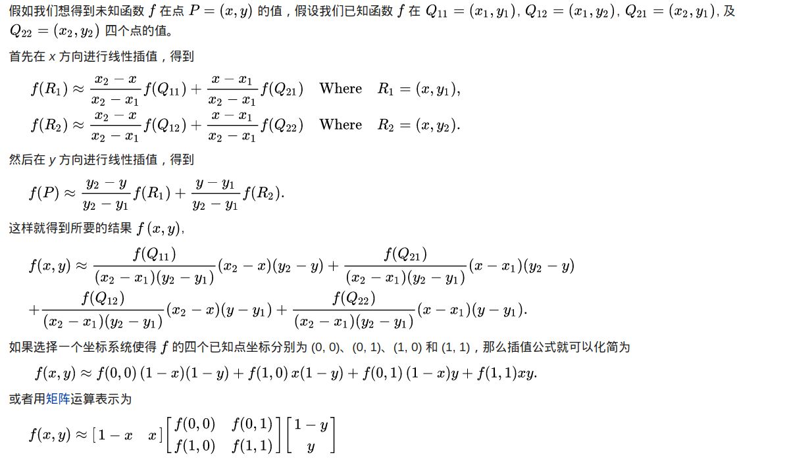
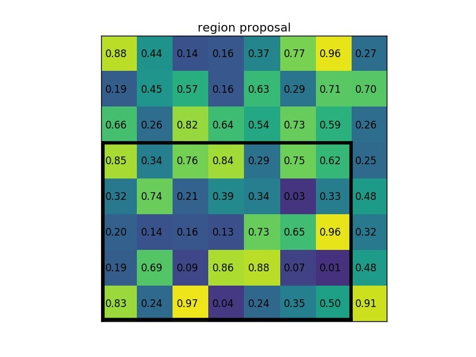
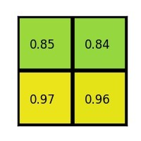
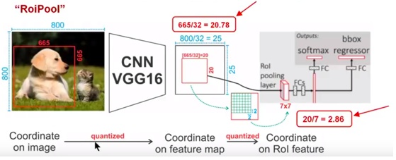
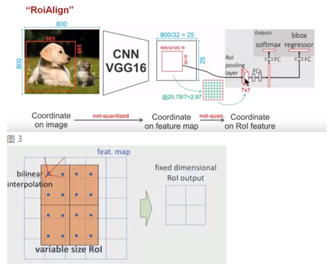
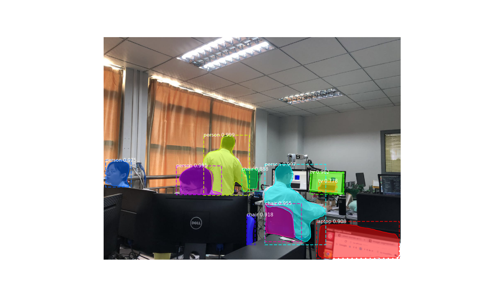

## Mask RCNN

论文地址：[MASK R-CNN](https://arxiv.org/abs/1703.06870)

## 一、创新点

1. 基于Faster RCNN框架（Backbone改为FPN），加上了mask预测的分支，实现了实例分割。

2. 提出ROI Align的方法解决了特征图与原始图像上的RoI不对准的问题。

## 二、思想

​	Mask R-CNN是基于Faster R-CNN上演进改良而来。Faster R-CNN存在的问题是：特征图与原始图像是**区域不对准**的（mis-alignment），所以会影响检测精度。而Mask R-CNN提出了RoIAlign的方法来取代ROI pooling，RoIAlign可以保留大致的空间位置。

​     Mask R-CNN成功的三个主要因素可以归纳为：

1. 提出ROIAlign层，解决特征图与原始图像上的RoI不对准问题；
2. mask部分并行使用FCN网络，一个mask编码了一个输入对象的空间布局(A mask encodes an input object’s
   spatial layout)；
3. 将mask预测和分类预测拆解，对每个类别独立地预测一个二值mask，没有引入类间竞争，每个二值mask的类别为RoI分类分支给出的分类预测结果。

## 三、模型

### 1. FPN 

Mask RCNN的骨架网络改为了FPN，所以这里简要回顾一下FPN。

卷积网络存在一个矛盾：空间信息与语义信息间的矛盾，即：

1. 低层特征分辨率高，但是语义信息很少。
2. 高层特征分辨率低，但是语义信息强。

针对高层特征分辨率低的问题，SSD解决方法：进行多尺度检测，如图1。但是低层特征仍然是低语义信息的，仍然没有解决问题。

​										图1.SSD网络示意图

为了解决这个问题，FPN（feature pyramid network）把低分辨率、高语义信息的高层特征和高分辨率、低语义信息的低层特征进行自上而下的侧边连接，使得所有尺度下的特征都有丰富的语义信息。

​			                                                      图2.FPN结构简图

FPN的网络结构图如下。

​                                                                       图3.FPN网络结构示意图

### 2. Faster RCNN 

因为Mask RCNN是Faster RCNN的演进版本，因此这里先回顾一下Faster RCNN。

​                                                                        图4. faster rcnn示意图

Faster RCNN使用CNN提取图像特征，然后使用region proposal network去提取出ROIs，然后使用ROI pooling将这些ROI全部变成固定尺寸，然后再喂给全连接层进行分类和位置偏移回归预测。

### 3. MASK RCNN

​                                                                            图5. mask rcnn示意图

Mask RCNN的构建很简单，只要在ROI pooling之后添加卷积层，进行mask的任务。

整个网络基于ResNet-101+FPN，达到了当前最好效果。网络结构分为三个部分：

1. 骨干网络，用于特征提取，可以是ResNet-50,ResNet-101,ResNeXt-50,ResNeXt-101；
2. 头部网络，用于边界框识别（分类和回归）；
3. mask网络，mask预测用来对每一个ROI进行区分，具体结构见图6所示：

​                                   图6 MaskRCNN头部架构，左图：ResNet C4， 右图：FPN

### 4. ROI Align

#### I. 插值

ROI Align用到了双线性插值，因此这里回顾一下插值的知识。

**线性插值**

先讲一下线性插值：已知数据 $(x_0, y_0)$ 与 $(x_1, y_1)$，要计算$ [x_0, x_1] $区间内某一位置$ x$ 在直线上的$y$值

$$
\frac{y - y_0}{x - x_0} = \frac{y - y_1}{x - x_1}  ====>  y=\frac{x-x_0}{x_1-x_0}y_1+\frac{x_1-x}{x_1-x_0}y_0
$$
仔细看就是用$x$和$x_0$，$x_1$的距离作为一个权重，用于$y_0$和$y_1$的加权。双线性插值本质上就是在两个方向上做线性插值。

**双线性插值**

**双线性插值**，又叫做双线性内插。在数学上，**双线性插值**是有两个变量的插值函数的线性插值扩展，其核心思想是在两个方向分别进行一次线性插值。

参考：[维基百科：双线性插值](https://zh.wikipedia.org/wiki/%E5%8F%8C%E7%BA%BF%E6%80%A7%E6%8F%92%E5%80%BC)

#### II. ROI pooling 

ROI Align是解决ROI pooling存在的问题，因此在讲ROI Aligh之前，通过一个例子来形象理解ROI pooling。假设现在我们有一个8x8大小的feature map，我们要在这个feature map上得到ROI，并且进行ROI pooling到2x2大小的输出。

假设ROI的bounding box为$[x_1,y_1,x_2,y_2]=[0,3,7,8]$。如图：

将它划分为2x2的网格：

因为ROI的长宽除以2是不能整除的，所以会出现每个格子大小不一样的情况。进行max pooling的最终2x2的输出为：

最后以一张动图形象概括之：

参考：[Region of interest pooling explained](https://blog.deepsense.ai/region-of-interest-pooling-explained/)

#### III. ROI Align

​	ROI Align 是在Mask-RCNN这篇论文里提出的一种区域特征聚集方式, 很好地解决了ROI Pooling操作中**两次整数化**造成的区域不对齐(mis-alignment)的问题。实验显示，在检测测任务中将 ROI Pooling 替换为 ROI Align 可以提升检测模型的准确性。

**1. ROI Pooling 的局限性分析**

在常见的两级检测框架（比如Fast-RCNN，Faster-RCNN，RFCN）中，ROI Pooling 的作用是根据预选框的位置坐标在特征图中将相应区域池化为固定尺寸的特征图，以便进行后续的分类和包围框回归操作。由于预选框的位置通常是由模型回归得到的，一般来讲是浮点数，而池化后的特征图要求尺寸固定。故ROI Pooling这一操作存在两次整数化的过程。

- 将候选框边界转化为整数点坐标值。
- 将整数化后的边界区域平均分割成 k x k 个单元(bin)，对每一个单元的边界进行整数化。

$$
左图：ROI pooling, 右图：ROI Align
$$
​	事实上，经过上述两次整数化，此时的候选框已经和最开始回归出来的位置有一定的偏差，这个偏差会影响检测或者分割的准确度。在论文里，作者把它总结为“不匹配问题（misalignment）。

​	下面我们用直观的例子具体分析一下上述区域不匹配问题。如图所示，这是一个Faster-RCNN检测框架。输入一张800x800的图片，图片上有一个665x665的包围框(框着一只狗)。图片经过主干网络提取特征后，特征图缩放步长（stride）为32。因此，图像和包围框的边长都是输入时的1/32。800正好可以被32整除变为25。但665除以32以后得到20.78，带有小数，于是ROI Pooling 直接将它整数化成20。接下来需要把框内的特征池化7x7的大小，因此将上述包围框平均分割成7x7个矩形区域。显然，每个矩形区域的边长为2.86，又含有小数。于是ROI Pooling 再次把它整数化到2。经过这两次整数化，候选区域已经出现了较明显的偏差（如图中绿色部分所示）。更重要的是，该层特征图上0.1个像素的偏差，缩放到原图就是3.2个像素。那么0.8的偏差，在原图上就是接近30个像素点的差别，这一差别不容小觑。

​                                                                             图2-3 ROIPooling层示意图

**2. ROI Align 的主要思想和具体方法**

​	为了解决ROI Pooling的上述缺点，作者提出了ROI Align这一改进的方法(如**图2**)。ROI Align的思路很简单：取消整数化操作，使用双线性内插的方法获得坐标为浮点数的像素点上的图像数值, 从而将整个特征聚集过程转化为一个连续的操作。值得注意的是，在具体的算法操作上，ROI Align并不是简单地补充出候选区域边界上的坐标点，然后将这些坐标点进行池化，而是重新设计了一套比较优雅的流程，如 **图3** 所示：

- 遍历每一个候选区域，保持浮点数边界不做整数化。
- 将候选区域分割成$k *k个$单元，每个单元的边界也不做整数化。
- 在每个单元中计算固定四个坐标位置，用双线性内插的方法计算出这四个位置的值，然后进行最大池化操作。

  ​这里对上述步骤的第三点作一些说明：这个固定位置是指在每一个矩形单元中按照固定规则确定的位置。比如，如果采样点数是1，那么就是这个单元的中心点。如果采样点数是4，那么就是把这个单元平均分割成四个小方块以后它们分别的中心点。显然这些采样点的坐标通常是浮点数，所以需要使用插值的方法得到它的像素值。在相关实验中，作者发现将采样点设为4会获得最佳性能，甚至直接设为1在性能上也相差无几。事实上，ROI Align 在遍历取样点的数量上没有ROIPooling那么多，但却可以获得更好的性能，这主要归功于解决了misalignment的问题。值得一提的是，我在实验时发现，ROI Align在VOC2007数据集上的提升效果并不如在COCO上明显。经过分析，造成这种区别的原因是COCO上小目标的数量更多，而小目标受misalignment问题的影响更大（比如，同样是0.5个像素点的偏差，对于较大的目标而言显得微不足道，但是对于小目标，误差的影响就要高很多）。

参考：[详解 ROI Align 的基本原理和实现细节](http://blog.leanote.com/post/afanti.deng@gmail.com/b5f4f526490b)

## 四、训练

**损失函数**

Mask RCNN定义多任务损失：
$$
L=L_{cls}+L_{box}+L_{mask}
$$
​	$L_{cls}和L_{box}$与faster rcnn的定义没有区别。$L_{mask}$主要由原来的基于单像素Softmax的多项式交叉熵变为了基于单像素Sigmod二值交叉熵。该框架对每个类别独立地预测一个二值mask，没有引入类间竞争，每个二值mask的类别依靠网络ROI分类分支给出的分类预测结果。这与FCNs不同，FCNs是对每个像素进行多类别分类，它同时进行分类和分割，基于实验结果表明这样对于对象实例分割会得到一个较差的性能。假设一共有k个类别，ROI网格切分为$m*m$个，则mask分割的输出是$k*m^2$,每个$m^2$的输出值每一点代表每个对应像素的二类分类概率值。比如一共有3个类：人、车、牛，那么k=4(包括背景)，如果分类分支预测输出是人，那么计算分割损失时候只使用人对应的sigmoid二值交叉熵，这样就不会引入类别竞争，有助于训练。

问题：为什么k个mask？

答：通过对每个 Class 对应一个 Mask 可以有效避免类间竞争（其他 Class 不贡献 Loss ）。

## 五、代码

Mask RCNN代码地址：[Mask R-CNN for object detection and instance segmentation on Keras and TensorFlow](https://github.com/matterport/Mask_RCNN)

如何用自己的数据进行训练参考medium上的一篇博客： [Splash of Color: Instance Segmentation with Mask R-CNN and TensorFlow](https://engineering.matterport.com/splash-of-color-instance-segmentation-with-mask-r-cnn-and-tensorflow-7c761e238b46)

代码运行demo：

