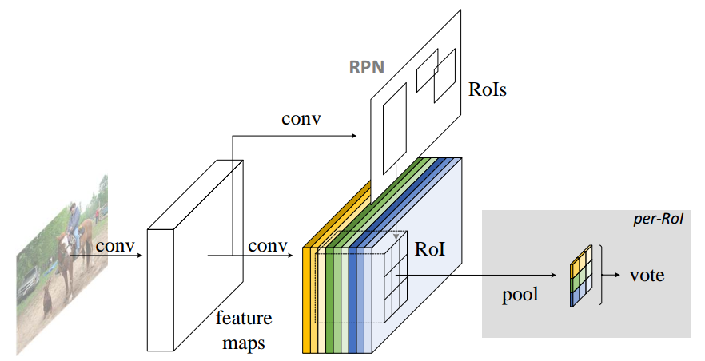
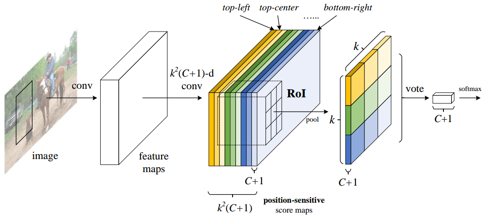
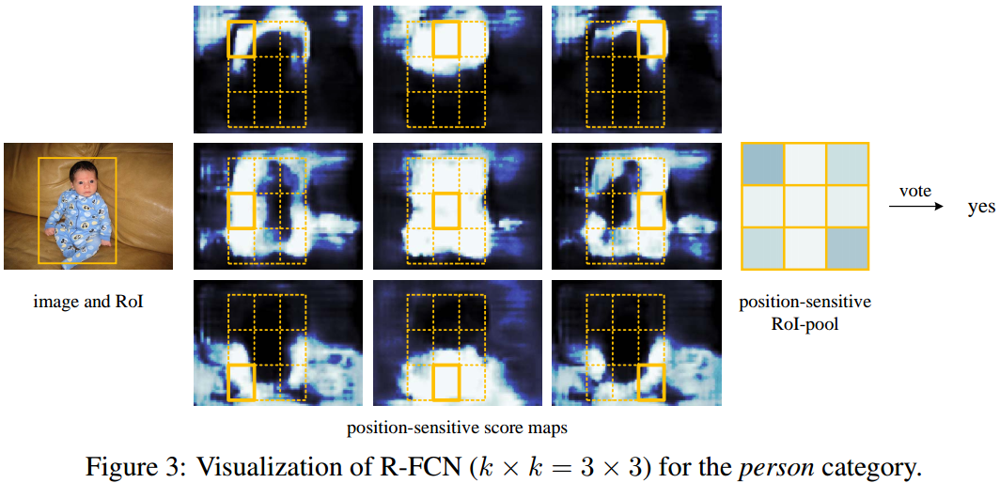
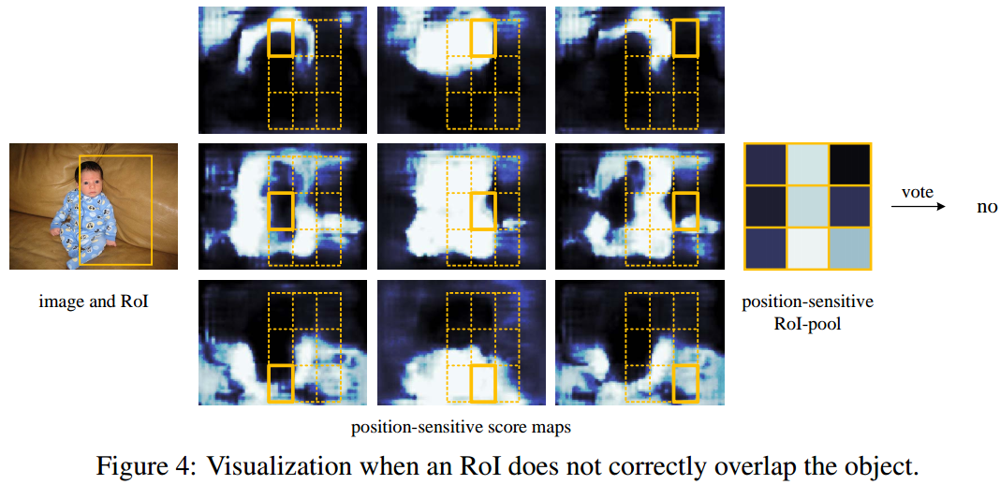
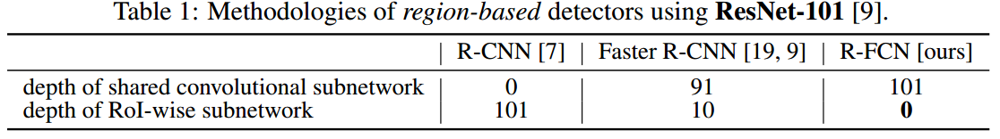
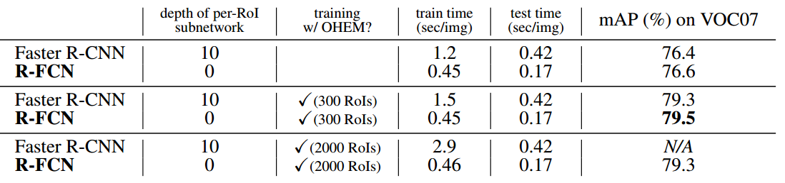
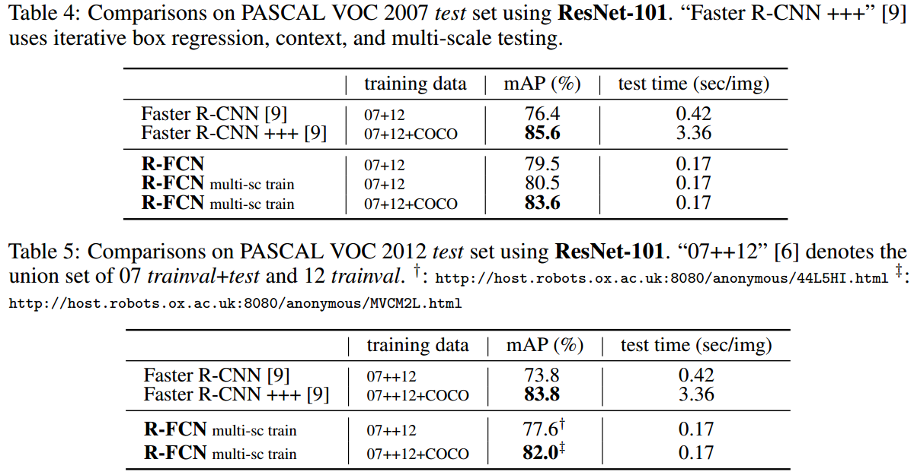
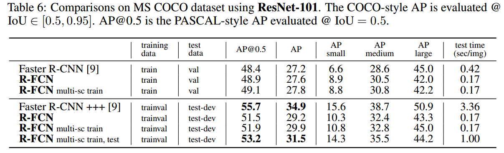

## R-FCN 系列

### 1 R-FCN

论文地址：[R-FCN基于区域的全卷积网络](https://arxiv.org/pdf/1605.06409v2.pdf)

#### 1.1 创新点

​    本文是微软和清华联合出品精品论文，对两阶段目标检测算法进行深入分析，论文核心思想是：**在不降低性能的同时尽量把所有卷积操作都共享计算从而加快Faster RCNN运行速度，实现比较简单**。值得细看，本文创新点如下：

​    (1) 将两阶段目标检测算法分为两个子网络：共享的fully convolutional subnetwork、不共享计算的 RoI-wise subnetwork，并分析了导致Faster RCNN速度和计算效率较低的原因；

​    (2) 针对上述问题，将 RoI-wise subnetwork也尽量卷积共享，操作办法是将RoI-wise subnetwork网络变薄，并将这部分卷积操作前移到fully convolutional subnetwork中;

​    (3) 上述步骤需要平衡translation-invariance in image classification and translation-variance in object detection，为此，提出了位置敏感分值图position-sensitive score maps，在提高速度的同时，精度保持和Faster RCNN一致。

#### 1.2 核心思想

​        两阶段目标检测网络，可以分为两个子网络：共享的fully convolutional subnetwork、不共享计算的 RoI-wise subnetwork。需要说明一下：fully convolutional 是指整个网络只有最后一层是全连接层，其余全部是卷积层，并且在微调时候可以去掉的网络，例如resnet和googLeNet。

​       **R-FCN网络是针对Faster RCNN算法在速度上的改进，大约快2.5~20倍**，可达到速度增加但是精度不丢失的效果。两阶段目标检测算法以ROI层作为分割线，可以分为两部分：基础分类网络，该层一般采用分类性能极好的基础网络例如resnet、googlenet等；目标检测网络，例如fast rcnn等。可以看出基础分类网络是可以实现共享计算的，而由于ROI层的引入使得后面的目标检测网络无法共享计算，每一个roi都需要前向计算一次，这会导致速度较慢。

​    一种自然的想法是将后面的网络也进行共享计算，故而引入全卷积网络，去掉roi后面的全连接层，从而将检测网络改为**全卷积网络->roi->简单分类和回归网络**，roi后面进行简单的分类和回归即可，但是通过实验发现，效果不行，作者总结的原因是**物体分类要求平移不变性越大越好 (图像中物体的移动不用区分)，而物体检测要求有平移变化**，如果roi后面就是简单分类和回归，那么整个网络起作用的依然是分类网络，对检测效果不佳。很多文章为了克服该问题会在roi后面也引入一些全卷积层(例如FPN网络)，提升检测网络效果，但是这样会导致网络计算变慢。

​    基于以上分析，作者提出了R-FCN网络，通过引入位置敏感分值图来平衡分类需要平移不变性和检测需要平移变换性问题，并且roi后面只有简单的分类、回归层，使得整个检测网络基本上都共享计算，从而加速了检测速度。

#### 1.3 模型

##### 1.3.1 模型整体结构

​                                                                                                   图1 R-FCN网络结构图 

​    整个网络依然包括两部分：RPN网络，具体实现是ResNet-101；对RPN提取的ROI进行 position-sensitive RoI pooling layer 处理，输出与空间位置有关的ROI，然后对每个编码后ROI进行vote，最后进行softmax即可，具体见下面分析。

​                                                                             图2 R-FCN关键idea示意图 

##### 1.3.2 骨架网络   

​     骨架网络这里其实就是共享卷积网络，使用的是ResNet-101，其包含100个卷积层，1个average pooling 和 一个全连接层，这里移除average pooling层和fc层，使用imageNet预训练权重初始化，在最后一个卷积层后面接一个$k^2(C+1)$通道的卷积层，用于产生后续的分值图。

##### 1.3.3 位置敏感ROI Pooling层

​     对于骨架网络输出的$k^2(C+1)$通道，其中C表示类别个数，+1是背景，K=3，表示为每类生成$k^2$个位置敏感分数图。对每个RPN训练得到的ROI特征图，同样划分为$k*k$个块，表示$k*k$个相对位置 {top−left,top−center,top−right,...,bottom−right}，例如对应人的9个部分，如图2所示。对于每个类单独处理，对于bottom-right即灰色的特征图，只取bottom-right那部分的特征图，其他$k*k$个特征图同样处理，然后对每一个选择出来的块进行pooling处理，得到一个具体数值，$k*k$个块，乘以(C+1)就可以得到长和宽为k，通道数为(C+1)的分值图。对$k*k* (C+1)$的每个类别分数进行求和，然后得到$1*1*C$的向量，然后经过softmax进行分类即可。边界框回归也是同样处理，具体是对于骨架网络输出的$k^2(C+1)$通道，后面追加一个$4k^2$通道数的卷积层，然后对RPN提取的ROI特征图采用position-sensitive RoI pooling 得到$4k^2$通道的分值图，然后经过vote转化成4维的向量，表征$t = (t_x;t_y;t_w;t_h)$。

​     R-FCN的位置敏感分值图可视化示意图如下：

##### 1.3.4 损失函数

​    和Faster RCNN一致，分类损失是交叉熵，回归损失是L1-Smooth损失

#### 1.4 实验细节

##### 1.4.1 参数设置

​    IOU大于0.5设置为正样本，其余设置为负样本，并且采用了OHEM策略根据Loss选择负样本，使其达到正负样本平衡。weight decay 是0.005，momentum是0.9，NMS阈值设置为0.3IOU，最短边缩放到600px，每块GPU输入一张图片进行训练，最终选择128个ROI进行backprop，采用8块GPU并行训练，使用VOC数据集进行网络微调，前20k mini-batches的学习率设置为0.001，后10k mini-batches 学习率设置为0.0001，采用和Faster RCNN一样的交替训练方法。

​    为了增加位置敏感分值图的分辨率，作者做了一些修改：conv4以及之前的阶段stride=16(相对整幅图而言)，和原始的ResNet-101一样，但是conv5由原来的stride=32变成stride=16，从而增加分辨率，为了保证感受野一致，此处的卷积操作采用空洞卷积。

从上图可以看出，R-FCN的共享卷积非常彻底，计算速度更快。

##### 1.4.1 实验结果

​    作者在VOC和COCO上面均进行实验验证。

以上结果是在VOC2007数据集上实验，且配置是single Nvidia K40 GPU，可以看出，训练时间和测试时间都有缩短，且精度不下降。

可以看出速度确实都有提升。

### 2 R-FCN-3000

