# 1. SSD

​    论文地址：[SSD: Single Shot MultiBox Detector](https://arxiv.org/abs/1512.02325)

## 1 创新点

1. 提出一种比single shot detectors（YOLO）更快，更准确、比两阶段faster RCNN这种需要提取Region proposal的方法相比，准确度相当，但速度更快的模型。
2. 核心操作是在特征图上应用一组固定不同尺度和长宽比的default bounding box进行分类和位置偏移的预测。
3. 为了获得较高的检测精度，从不同尺度的feature map中产生不同尺度的预测。

## 2 核心思想

​    RCNN系列的检测方法速度都太慢了， 所以本文提出了SSD模型，解决目标检测速度太慢的问题，当然同时也保证准确率。SSD算法思路非常清晰，效果也较好，但是在训练方面存在较多trick，而且论文写的和代码实现好多地方对应不上，需要注意该问题。

### 2.1 采用多尺度特征图

​    YOLO在卷积层后接全连接层，即检测时只利用了最高层feature maps（包括Faster RCNN也是如此）；SSD采用了特征金字塔结构进行检测，即检测时利用了conv4-3，conv-7（FC7），conv6-2，conv7-2，conv8-2，conv9-2这些大小不同的feature maps，在多个feature maps上同时进行softmax分类和位置回归，如图。

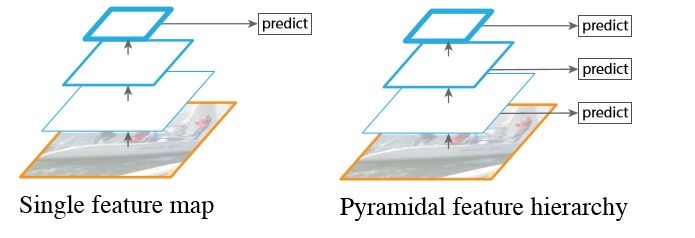

### 2.2 提供Default bounding box

​    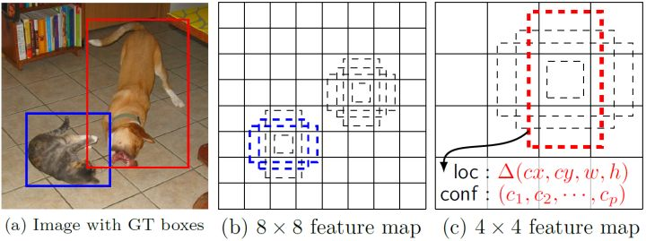

​    在SSD中引入了Default Box，实际上与Faster R-CNN Anchor非常类似，就是一些目标的预选框，后续通过softmax分类+bounding box regression获得真实目标的位置。

​    SSD按照如下规则生成Default box：

- 以feature map上每个点的中点为中心（offset=0.5），生成一些列同心的prior box（然后中心点的坐标会乘以step，相当于从feature map位置映射回原图位置）。

- 正方形prior box最小边长为和最大边长为：

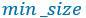

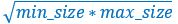

- 根据aspect ratio，会生成2个长方形，长宽为：

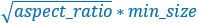

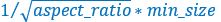

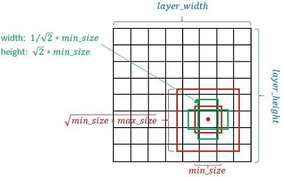

​												Default box

- 而每个feature map对应prior box的min_size和max_size由以下公式决定，公式中m是使用feature map的数量（SSD 300中m=6）：

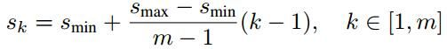

​    第一层feature map对应的min_size=$s_1​$，max_size=$s_2​$；第二层min_size=$s_2​$，max_size=$s_3​$；其他类推。在原文中，$s_{min}=0.2，s——{max}=0.9​$，但是在SSD 300中prior box设置并不能和paper中上述公式对应：按照m=6的设置，计算处理的conv 4\_3的$s_1=0.2​$，也就是min_size=300\*0.2=60。下面介绍代码里面的做法：m=5，也就是说第一层特征图层单独处理，不使用公式。对于第一个特征图，其先验框的尺度比例一般设置为 $s_{min}/2=0.1​$，那么尺度为300的图片，conv4_3的min_size=30，对于后面的特征图，先验框尺度按照公式线性增加，但是先将尺度比例先扩大100倍，此时增长步长为 $(0.9*100-0.2*100)/(5-1)=17​$,这样各个特征图的$s_k​$为20,37,54,71,88，将这些比例除以100，然后再乘以图片大小，可以得到各个特征图的尺度为60,111,162,213,264。最后一个特征图conv9\_2的size是直接计算的，300*105/100=315。

​    在计算得到每一层特征图所对于的先验框尺寸后，在计算宽高比。而对于长宽比，一般选取$a_r\in \{1,2,3,\frac{1}{2},\frac{1}{3}\}$,但是对于比例为1的先验框，作者又单独多设置了一种比例为1，但是$s^{‘}_{k}=\sqrt {s_k * s_{k+1}}$的尺度，所以一共是6种尺度。但是在实现时，Conv4\_3，Conv8\_2和Conv9\_2层仅使用4个先验框，它们不使用长宽比为3,1/3的先验框,每个单元的先验框的中心点分布在各个单元的中心。注意：下表中的conv6\_2对应论文模型原图的conv8_2，以此类推。

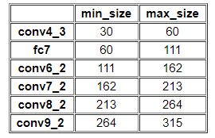

不过依然可以看出，**SSD使用低层feature map检测小目标，使用高层feature map检测大目标**，这也应该是SSD的突出贡献了。

知道了Default Box如何产生，接下来分析Default Box如何使用。这里以conv4_3为例进行分析。

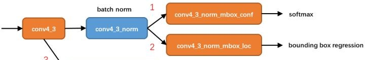

从图5可以看到，在conv4_3 feature map网络pipeline分为了2条线路：

- 经过一次batch norm+一次卷积后，生成了**[1, num_class\*num_default_box, layer_height, layer_width]**大小的feature用于softmax分类目标和非目标（其中num_class是目标类别，SSD 300中num_class = 21，即20个类别+1个背景)
- 经过一次batch norm+一次卷积后，生成了**[1, 4\*num__default_box, layer_height, layer_width]**大小的feature用于bounding box regression（即每个点一组[dxmin，dymin，dxmax，dymax]）

后续通过softmax分类+bounding box regression即可从Default Box中预测到目标。其实Default Box与Faster RCNN中的anchor非常类似，都是目标的预设框，没有本质的差异。区别是每个位置的default box一般是4~6个，少于Faster RCNN默认的9个anchor；同时Default Box是设置在不同尺度的feature maps上的，而且大小不同。

## 3 模型

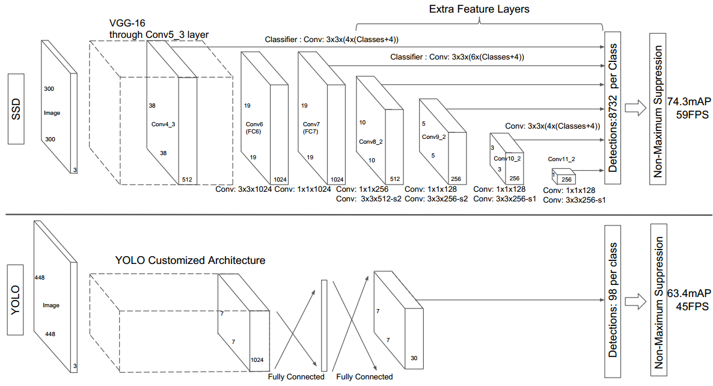

​                                                                            图1 YOLO与SSD网络结构图

​	SSD采用VGG16作为基础模型，然后在VGG16的基础上新增了卷积层来获得更多的特征图以用于检测。模型的输入图片大小是 300x300 （还可以是512x512，其与前者网络结构没有差别，只是最后新增一个卷积层），首先VGG16是在ILSVRC CLS-LOC数据集预训练，分别将VGG16的全连接层fc6和fc7转换成3x3卷积层 conv6和1x1 卷积层conv7，同时将池化层pool5去掉，为了配合这种变化，采用了一种Atrous Algorithm，其实就是conv6采用扩展卷积或带孔卷积，如图2所示，然后移除dropout层和fc8层，并新增一系列卷积层，在检测数据集上做finetuing。

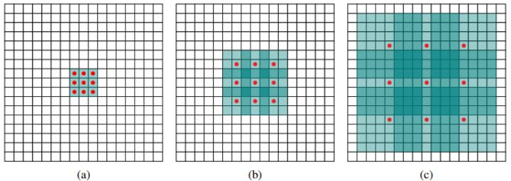

​                                                                                           图2 扩张卷积

(a) 是普通的3x3卷积；(b)是扩张率为1的3x3带孔卷积，视野大小是7x7；(c)是扩展率为3的3x3带孔卷积，视野大小是15x15，视野的特征比较稀疏。Conv6采用3x3 大小但dilation rate=6的扩张卷积。

​    VGG16中的Conv4\_3层将作为用于检测的第一个特征图，由于该层比较靠前，其norm较大，所以在其后面增加了一个L2 Normalization层以保证和后面的检测层差异不是很大(具体原因是分类和回归的梯度会直接传递到conv4\_3，而conv4\_3属于浅层，相对于后面几层来说梯度幅值是很大的，直接训练很容易跑飞，所以需要加上L2，把梯度幅值弄小一些，保证各层平衡，容易训练。或者直接理解成对conv4\_3层的激活输出值进行L2归一化，使其激活值变小，减少方差，稳定训练)，从后面新增的卷积层中提取Conv7，Conv8\_2，Conv9\_2，Conv10\_2，Conv11\_2作为检测所用的特征图，加上Conv4_3层，共提取了6个特征图，其大小分别是 (38, 38), (19, 19), (10, 10), (5, 5), (3, 3), (1, 1)，不同特征图设置的先验框数目不同。对于先验框的尺度，其遵守一个线性递增规则：随着特征图大小降低，先验框尺度线性增加，具体见公式，而对于长宽比，一般选取$a_r\in \{1,2,3,\frac{1}{2},\frac{1}{3}\}$,由于每一个先验框都会预测一个边界框，所以SSD300一共可以预测 8732($38*38*4+19*19*6+10*10*6+5*5*6+3*3*4+1*1*4$)边界框，这是一个相当庞大的数字，所以说SSD本质上是密集采样。

​    (1)**采用多尺度特征图用于检测** 

​    由于CNN网络本身具备的金字塔特性，可以利用比较大的feature map来用来检测相对较小的目标，而小的feature map负责检测大目标；

​    (2) **采用卷积进行检测** 

​    与Yolo最后采用全连接层不同，SSD直接采用卷积对不同的特征图来进行提取检测结果

​    (3) **设置先验框** 

​    SSD借鉴了Faster R-CNN中anchor的理念，每个单元设置尺度或者长宽比不同的先验框，预测的边界框（bounding boxes）是以这些先验框为基准的，在一定程度上减少训练难度。一般情况下，每个单元会设置多个先验框，其尺度和长宽比存在差异。

​    与Yolo不太一样。对于每个单元的每个先验框，其都输出一套独立的检测值，对应一个边界框，主要分为两个部分。第一部分是各个类别的置信度或者评分，值得注意的是SSD将背景也当做了一个特殊的类别；第二部分就是边界框的location，包含4个值 $(cx, cy, w, h) $，分别表示边界框的中心坐标以及宽高。但是真实预测值其实只是边界框相对于先验框的转换值。

​    对于一个大小 $m\times n$ 的特征图，共有 $mn$ 个单元，每个单元设置的先验框数目记为 $k$，那么每个单元共需要 $(c+4)k$个预测值，所有的单元共需要$ (c+4)kmn$个预测值，由于SSD采用卷积做检测，所以就需要$ (c+4)k$个卷积核完成这个特征图的检测过程。

## 4 训练方法

**(1) 先验框匹配** Matching strategy

​      第一个原则，对于图片中每个ground truth，找到与其IOU最大的先验框，该先验框与其匹配，这样，可以保证每个ground truth一定与某个先验框匹配，一个图片中ground truth是非常少的， 而先验框却很多，如果仅按第一个原则匹配，很多先验框会是负样本，正负样本极其不平衡，所以需要第二个原则。

​     第二个原则是：对于剩余的未匹配先验框，若某个ground truth的 $\text{IOU}$大于某个阈值（一般是0.5），那么该先验框也与这个ground truth进行匹配。这意味着某个ground truth可能与多个先验框匹配，这是可以的。但是反过来却不可以，因为一个先验框只能匹配一个ground truth，如果多个ground truth与某个先验框 $\text{IOU}$ 大于阈值，那么先验框只与IOU最大的那个先验框进行匹配。

**(2) hard negative mining**

尽管一个ground truth可以与多个先验框匹配，但是ground truth相对先验框还是太少了，所以负样本相对正样本会很多。为了保证正负样本尽量平衡，SSD采用了hard negative mining，就是对负样本进行抽样，抽样时按照置信度误差（预测背景的置信度越小，误差越大）进行降序排列，选取误差的较大的top-k作为训练的负样本，以保证正负样本比例接近1:3 。

 **(3) 损失函数** 

损失函数定义为位置误差（locatization loss， loc）与置信度误差（confidence loss, conf）的加权和。

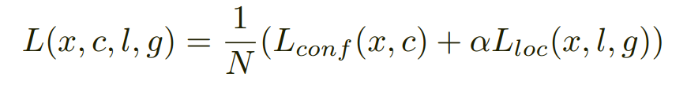

Loc误差使用smooth L1。

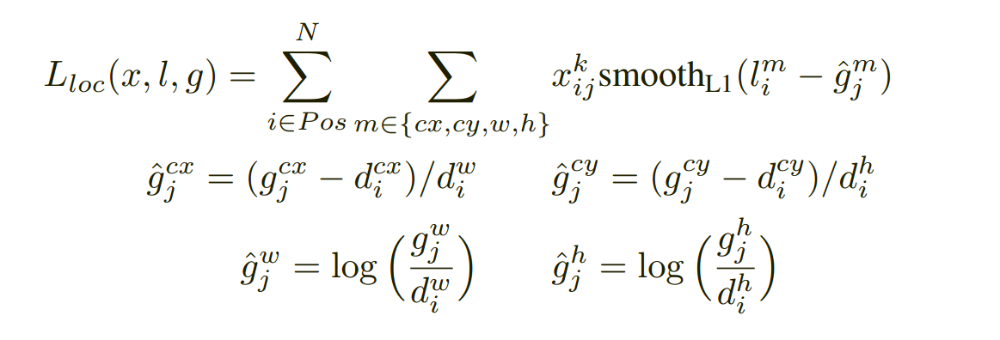

conf误差使用交叉熵。

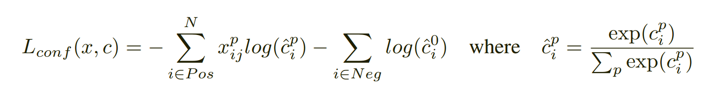

 **(4) Data augmentation**

​    数据增广，即每一张训练图像，随机的进行如下几种选择：

- 使用原始的图像
- 采样一个 patch，保证与GT之间最小的IoU为：0.1，0.3，0.5，0.7 或 0.9
- 完全随机的采样一个patch

​    采样的 patch 是原始图像大小比例在[0.1，1]之间，aspect ratio在1/2与2之间。当 groundtruth box 的 中心（center）在采样的patch中时，保留重叠部分。在这些采样步骤之后，每一个采样的patch被resize到固定的大小，并且以0.5的概率随机的 水平翻转（horizontally flipped）。

其实Matching strategy，Hard negative mining，Data augmentation，都是为了加快网络收敛而设计的。尤其是Data augmentation，翻来覆去的randomly crop，保证每一个prior box都获得充分训练而已。不过当数据达到一定量的时候，不建议再进行Data augmentation，毕竟“真”的数据比“假”数据还是要好很多。

## 5 实验过程及结果

​    基础网络是vgg_16，在ILSVRC CLS-LOC数据集上进行预训练，其他网络设置如前所述。SGD+ 0.9 momentum+0.0005 weight decay，initial learning rate $10^{-3}$,batch size 32，不同的训练数据采用不同的weight decay策略。

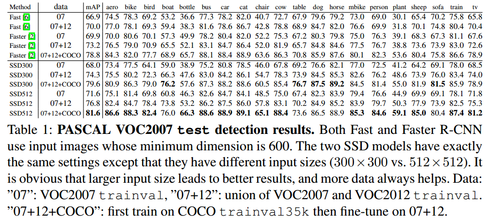

对于数据增强操作的重要性，其实验结果如下：结果表明数据增强操作非常关键。

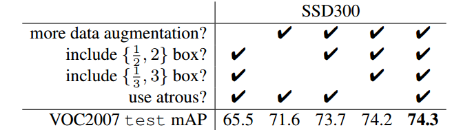

对于速度方面的对比，如下：

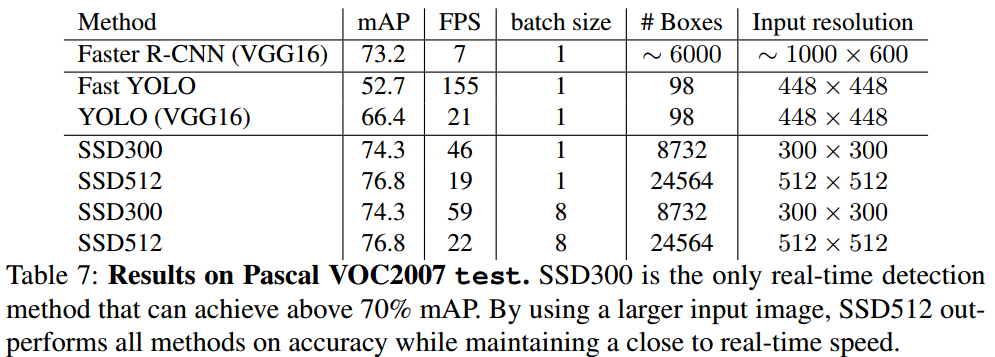

作者还在voc2012和coco上进行实验，此处不列出结果。作者通过大量实验得出结论：

​    <u>(1) 数据增强操作非常重要。Faster RCNN使用原始图片和水平翻转的图片进行训练，提升有限，作者使用大量复杂的增强操作，提升了8.8% mAP</u>

​    <u>(2) 使用更多的先验框尺寸可以取得更好的效果</u>

​    <u>(3) 去掉pool层并采用扩张卷积代替可以使得网络更快，在本实验测试中，可以快20%</u>

​    <u>(4) 在不同的分辨率采用多尺度输出可以取得较好效果</u>

参考：

​           https://zhuanlan.zhihu.com/p/31427288

​           https://zhuanlan.zhihu.com/p/33544892

# 2. DSSD

​    论文地址：https://arxiv.org/abs/1701.06659

## 1 创新点

​    DSSD是对SSD算法的第一个优化改进算法，主要改进点如下：

​    (1) 把SSD的基准网络从VGG换成了Resnet-101，增强了特征提取能力

​    (2) 类似于FPN思想，提出基于top down的网络结构，增加上下文信息，并用反卷积代替传统的双线性插值上采样。

​    (3) 在预测阶段引入残差单元，优化候选框回归和分类任务输入的特征图。

​    (4) 采用两阶段训练方法。先训练SSD，然后在利用SSD参数训练DSSD。

DSSD这篇论文，作者对于任何一个改进都有十分详细的描述，非常容易理解。

## 2 核心思想

**SSD存在的问题**

   卷积神经网络在结构上存在固有的问题：高层网络感受野比较大，语义信息表征能力强，但是分辨率低，几何细节信息表征能力弱。低层网络感受野比较小，几何细节信息表征能力强，虽然分辨率高，但语义信息表征能力弱。SSD采用多尺度的特征图来预测物体，使用具有较大感受野的高层特征信息预测大物体，具有较小感受野的低层特征信息预测小物体。这样就带来一个问题：使用的低层网络的特征信息预测小物体时，由于缺乏高层语义特征，导致SSD对于小物体的检测效果较差。

**本文提出的解决方案**

​	解决以上这个问题的思路就是对高层语意信息和低层细节信息进行融合。本文作者采用Top Down的网络结构进行高低层特征的融合并且改进了传统上采样的结构。

​	虽然Top Down的方法来丰富特征信息的思想很容易理解，但是大多数论文中所说的特征图金字塔的构造方式各不相同，只是针对于特定的网络结构来做优化，比如FPN的网络结构只是针对resnet做了优化，文章中也没有提及过更换其他的基础网络的实验结果，普适度不够。DSSD作者提出一种通用的Top Down的融合方法，使用vgg和resnet网络，以及不同大小的训练图片尺寸来验证算法的通用型，将高层的语义信息融入到低层网络的特征信息中，丰富预测回归位置框和分类任务输入的多尺度特征图，以此来提高检测精度。在提取出多尺度特征图之后，作者提出由残差单元组成的预测模块，进一步提取深度的特征最后输入给框回归任务和分类任务。除了DSSD外，另外两篇文章FPN: Feature Pyramid Networks for Object Detection（以下简称FPN）和Beyond Skip Connections: Top-Down Modulation for Object Detection（以下简称TDM），也利用了Top Down融合的思想。

​	下图给出了Google TDM、DSSD和FPN的Top Down网络结构，在特征图信道融合的步骤中，他们用了不同的方法：Google TDM使用的是concat操作，让浅层和深层的特征图叠在一起。DSSD使用的是Eltw Product（也叫broadcast mul）操作，将浅层和深层的特征图在对应的信道上做乘法运算。FPN使用的是Eltw Sum（也叫broadcast add）操作，将浅层和深层的特征图在对应的信道上做加法运算。

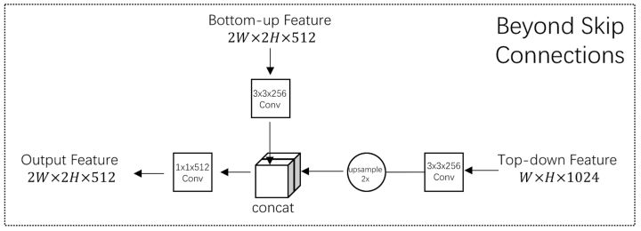

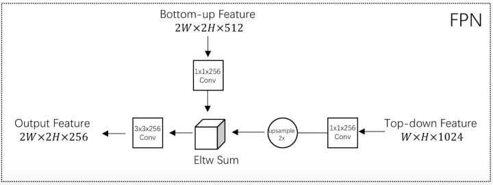

## 3 模型

### 3.1 总体结构

​     DSSD的网络结构与SSD对比如下图所示，以输入图像尺寸为为例，首先把VGG换成Resnet-101，对应的是图中的上半部分，`conv3_x`层和`conv5_x`层为原来的resnet101中的卷积层，后面的五层是SSD扩展卷积层，原来的SSD算法是将这七层的特征图直接输入到预测阶段做框的回归任务和分类任务。DSSD是将这七层特征图拿出六层输入到反卷积模型里，输出修正的特征图金字塔，形成一个由特征图组成的沙漏结构。最后经预测模块输入给框回归任务和分类任务做预测。

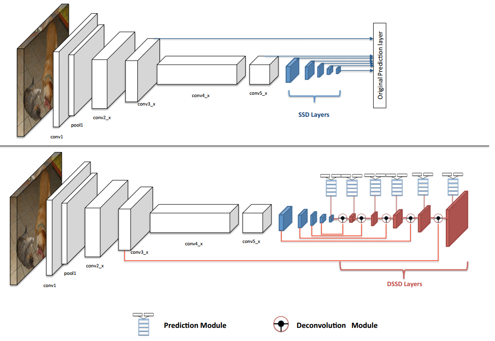

作者发现：如果仅仅是换网络的话，mAP居然还下降了一个百分点，只有增加上下文信息，精度才会有较大提升。

### 3.2 反卷积模型

所谓反卷积模型指的是DSSD中高层特征和低层特征的融合模块，其基本结构如下图所示：

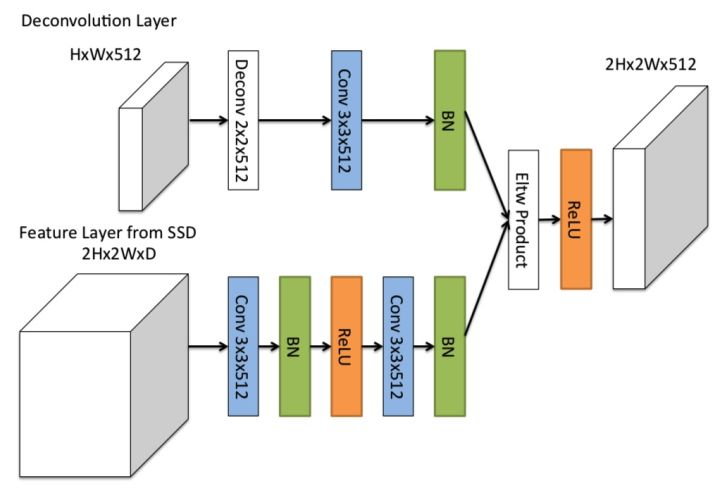

高层的特征图的尺寸为`2H*2W*D`，低层将要反卷积的特征图尺寸为`H*W*512`，这里有几点注意事项：

 1) 高层特征图的通道数将会被舍弃，在反卷积模型中，所有卷积和反卷积操作，卷积个数都依赖于输入的低层特征图的通道数。

 2) BN操作放在卷积层和激活层之间。

 3) 之前一些方法的上采样都是通过双线性插值来实现的，DSSD是通过反卷积层来学习得到的上采样特征图（**注：本条是根据原论文描述得来，具体实现过程中存在一定问题，会在下文中详细描述**）。

4) 高层特征图与低层特征图在通道融合的时候，使用了broadcast mul，DSSD作者也使用过broadcast add，结果发现通道之间相乘比相加可以提升0.2%个map，但是像素相加推理速度要略快于相乘。

5) 在SSD中一些网络如（vgg）的低层特征图需要增加normalization的操作处理，因为 它的feature scale和其他层不同，如果混在一起训练，在实践过程中会很难训练（容易训飞），具体原理详见Liu Wei另外一篇论文 ICLR 2016, ParseNet:Looking wider to see better 。在DSSD进行高低层特征融合时同样要注意这个问题，低层特征必要的时候需要增normalization处理。

​    对于反卷积结构，按理说，模型在编码和解码阶段应该包含对称的层，但由于两个原因，作者使解码（反卷积）的层比较浅：其一，检测只算是基础目标，还有很多后续任务，因此必须考虑速度，做成对称的那速度就快不起来。其二，目前并没有现成的包含解码（反卷积）的预训练模型，意味着模型必须从零开始学习这一部分，做成对称的则计算成本就太高了。

​    对于上述复杂的反卷积模型结构，作者是受到论文[Learning to Refine Object Segments](https://arxiv.org/abs/1603.08695)的启发，认为用于精细网络的反卷积模块的分解结构达到的精度可以和复杂网络一样，并且更有效率。

### 3.3 预测模型

​    预测模型是在框回归任务、分类任务之前和反卷积模型之后添加的网络结构。

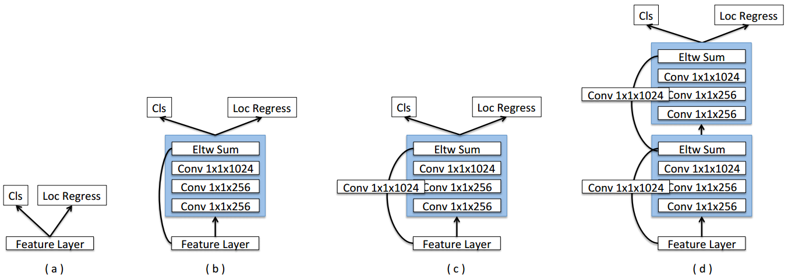

​     预测模型结构如上图所示，(a)为SSD使用的方法，直接提取出网络中的多尺度特征图做分类和框回归的预测；(b)为是resnet残差单元的网络结构；(c)为作者改进的只含一个残差单元的预测模型，在残差旁路将原来的特征图用的卷积核做处理后与网络主干道的特征图做通道间加法；(d)为只含两个残差单元的预测模型。对于(c)的改进，SSD直接从数个卷积层中分别引出预测函数，预测量多达7000多，梯度计算量也很大。MS-CNN方法指出，改进每个任务的子网可以提高准确性。根据
这一思想，作者在每一个预测层后增加残差模块，并且对于多种方案进行了对比，结果表明，增加残差预测模块后，高分辨率图片的检测精度比原始SSD提升明显。

## 4 训练

   训练技巧大部分和原始SSD类似。首先，依然采用了SSD的default boxes，把重叠率高于0.5的视为正样本。再设置一些负样本，使得正负样本的比例为3:1。训练中使Smooth L1+Softmax联合损失函数最小。训练前依然需要数据扩充（包含了hard example mining技巧）。另外原始SSD的defaultboxes维度是人工指定的，可能不够高效，为此，作者在这里采用K-means聚类方法重新得到了7种default boxes维度，得到的这些boxes维度更具代表性（和YOLOv2的聚类做法有点类似) 

​    在训练阶段，DSSD作者使用两阶段训练方法（详见下文），对比了上图四种预测方式的实验结果，最后确定采用结果(c)。因此在预测阶段，作者使用的是(c)的方式来对特征图做的处理。

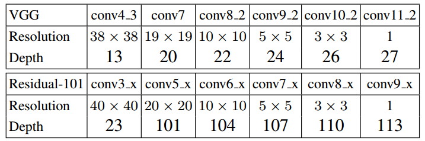

​                                                                                     图 VGG和ResNet-101结构区别

### 4.1 SSD的default box的优化方式

​     实验时，使用SSD模型初始化 DSSD网络，但是对于default box选取的长宽比例，作者在论文中做了详细的分析和改进。为了得到PASCAL VOC 2007和2012 trainval图片里各个物体对应的真实位置框的长宽比例，作者用K-means对这些真实框内区域面积的平方根作为特征做了一个聚类分析，做聚类的时候增加聚类的个数来提升聚类的准确度，最后确定七类的时候收敛的错误率最低如下图所示：

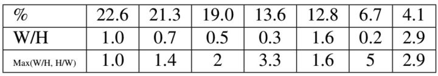

通过聚类实验最后确定了预测使用的default box的长宽比例为1、1.6、2和3，作为每一个特征图的default box所使用的长宽比例。

### 4.2  DSSD训练方法

​     DSSD作者在caffe的框架中将SSD的基础网络改成resnet101然后重新训练了一个新的SSD模型，以VOC的数据集为例，训练集使用的数据是VOC2007和VOC2012的trainval数据集，测试用的是07的测试集，训练时一共迭代了70k次，使用学习率为1e-3在前40k次iterations，然后调整学习率为1e-4、1e-5再分别训练20k次、10k次iterations。然后用训练好的SSD模型来初始化DSSD网络。训练DSSD的过程分为两个阶段，第一个阶段，加载SSD模型初始化DSSD网络，并冻结SSD网络的参数，然后只增加反卷积模型(不添加预测模型)，在这样的条件下只训练反卷积模型，设置学习率为1e-3、1e-4分别迭代20k次和10k次；第二个阶段，fine-tune第一阶段的模型，解冻第一阶段训练时候冻结的所有参数，并添加预测模型，设置学习率为1e-3、1e-4再分别训练20k次、20k次iterations。需要额外说明的是：上述两阶段训练方法不一定能得到提升，有其他实验发现，不冻结网络参数，直接训练网络效果更好。

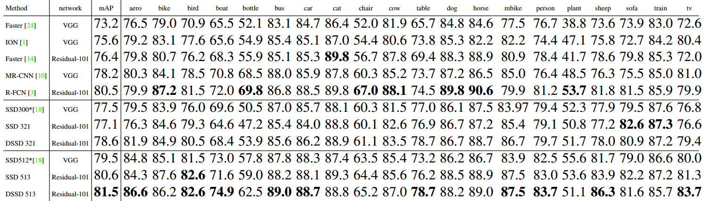

### 4.3 网络结构配置策略

 此方法主要是来验证反卷积模块和预测模型对于检测性能的作用，作者先是训练了一个输入图像为321*321的resnet101-SSD模型，它的map为76.4%。再加入了不同的预测模型结构((b)(c)(d)这三种，使用之后的map分别为76.9%,77.1%,77.0%)以后效果确实变好了，作者发现预测模型(c)的map是最高的，所以确定并选取只含一层残差单元的模型结构来做候选框回归和分类任务，并在之后的输入为512的DSSD模型中，无论是训练VOC的数据集还是coco的数据集，都使用预测模型(c)来做实验。最后又fine-tune整个模型训练反卷积模型来讨论反卷积模型中特征图通道融合是使用相加还是相乘的效果好，实验结果如下图所示，可以看出信道相乘稍微好一些。图中最后一行为使用approximate bilinear pooling的结果。

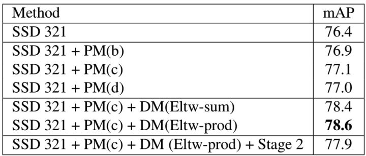

### 4.4 结论

​    相比SSD，DSSD算法确实可以带来提升，但是本文验证结果表明，以下几点和论文结论不符。一下是其他大神实验结论：

​    a) 论文中提到SSD＋resnet101+321效果不如SSD+vgg16+300好，但我们的实验结果显示SSD＋resnet101+321 结果更好。但是DSSD＋resnet101+321的结果不如 DSSD+vgg16+300的结果好。

​    b) 论文中采用两阶段训练，我们严格按照论文参数进行训练，得到提升很有限，而且训练十分耗时。后来我们采用不冻结参数，直接训练，该方法得到的提升要高于原文中的两阶段训练法。时间也要快将近三倍。

​    c) 我们同时对比了Beyond Skip Connections: Top-Down Modulation for Object Detection一文中的TDM结构。发现vgg上提升效果要高于论文中的反卷积模块的效果，且训练速度和显存使用都要优于DSSD。

此外， 我们的实验结果表明，Backbone网络为vgg16-512时，Google TDM结合在SSD上的效果优于DSSD。总之一句话：论文的结果只是作者的结果，不代表一定完全正确。

参考：https://zhuanlan.zhihu.com/p/33036037

# 3. R-SSD

​    论文地址：[https://arxiv.org/abs/1705.09587](https://arxiv.org/abs/1705.09587)

## 1 创新点

1. 通过rainbow concatenation对特征金字塔的各个feature map之间建立关系，以防止同个对象被多次检测。
2. 通过有效地增加特征金字塔中每层feature map的通道数量，提高了精度，与此同时没有太多的时间开销。
3. 由于特征金字塔不同层的feature map的通道数量相同，因此分类器可以实现参数共享。

## 2 核心思想

​    虽然深度神经网络的效果会随着feature map数量的增加而更好，但是这并不代表简单地增加feture map数量就能有更好的效果。本文就是从如何更高效的利用特征图方面着手，提出了R-SSD(RainBow SSD)。在精度方面超过了SSD，YOLO，Faster RCNN和RFCN，速度上面超越了Faster RCNN和RFCN。

​    虽然传统的SSD在速度和检测精度方面都很好，但他仍然有值得改进的地方。

**问题1：各种分类预测独立，容易多层检测到同一目标**

​    如图1所示，这是传统的SSD的架构，在feature pyramid中feature map都是独立作为分类网络的输入。因此，容易出现在多个尺度上检测同一对象。传统的SSD没有考虑到不同尺度之间的关系，因为对于某个尺度来说，它每次都只看到一层。

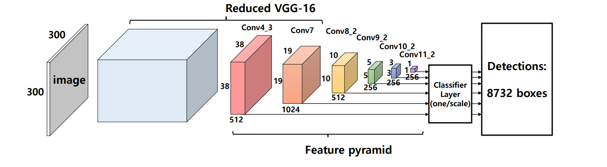

​                                                                                              图1 SSD结构

如图Figure5(a)所示，对于同一个物体，SSD找到了不同尺度的box。

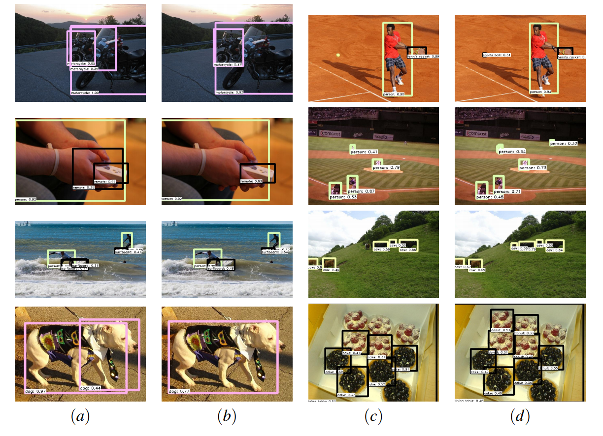

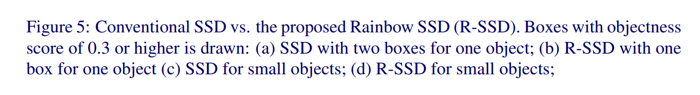

**问题2：SSD对小目标的检测效果不好**

为了解决如上的问题：一方面利用分类网络增加feature pyramid不同层之间的feature map的联系，减少重复框的出现。另一方面增加feature pyramid中feature map的通道数。通过这样的改进之后，网络可以防止一个目标对应多个检测box，并且可以更好地检测小物体。

## 3 模型

​    上文提到了增加feature map的通道数，具体怎么做呢？文章提到了三种方式。

​    (1) 采用pooling的方式进行融合。看（a）最左边的38x38的feature map，将其做pooling后和右边第二个的19x19的feature map做concate，这样就有两个19x19的feature map了（一个红色，一个橙色）；然后再对这两个19x19的feature map做pooling，再和左边第三个黄色的10x10的feature map做concate。

​    (2) 表示采用deconvolution的方式进行特征融合，这次是从最右边的1x1的紫色feature map往左做concate，因为deconvolution是升维，所以从右至左；前面pooling是降维，所以是从左至右。concate方法和前面（a）的pooling类似，不再细讲。作者认为**前两种特征融合方式的缺点在于信息的传递都是单向的**，这样分类网络就没法利用其它方向的信息，因此就有了（c）。

​    (3) 表示同时采用pooling和deconvolution进行特征融合，这也是本文rainbow SSD所采用的。应该是同时从左至右（pooling，concate）和从右至左（deconvolution，concate）。（c）中用不同颜色的矩形框表示不同层的feature map，其融合后的结果很像rainbow，这就是算法名称Rainbow SSD的由来。一个细节是：在做concate之前都会对feature map做一个normalization操作，因为不同层的feature map的scale是不同的，文中的normalization方式采用 batch normalization。

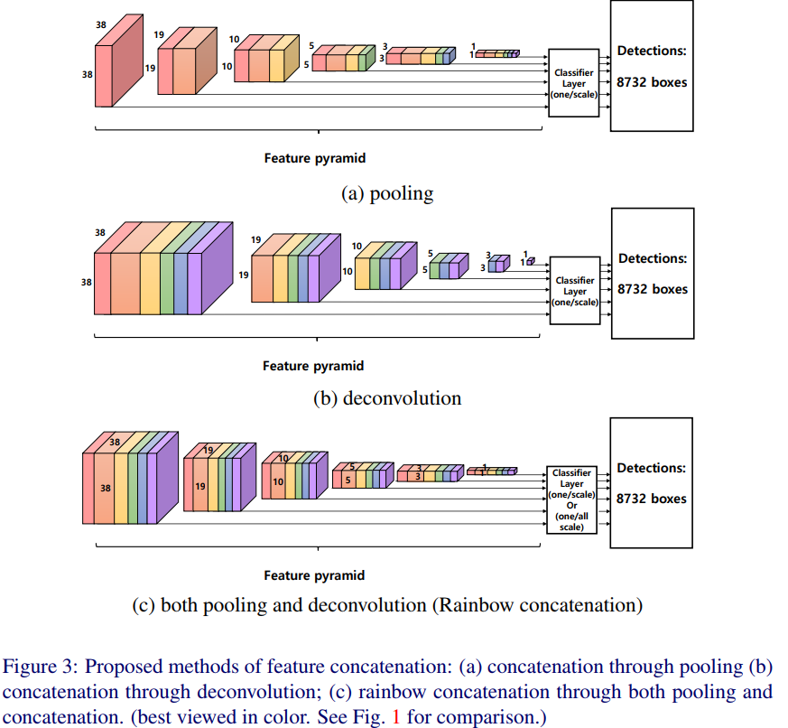

由于Figure3（c）这种特征融合方式使得融合后每一层的feature map个数都相同（2816），因此可以共用部分参数，具体来讲就是default boxes的参数共享，具体参数为：

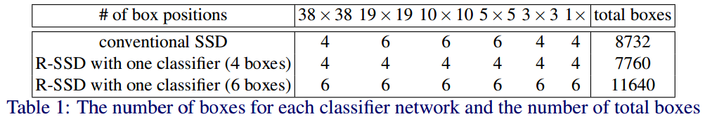

## 4 训练

​    在PASCAL VOC2007和VOC2012数据集上面训练和测试。输入图片是300*300，batch size 为8，学习率以$10^{-1}$的速率从$10^{-3}$减少到$10^{-6}$，对于每个学习率，迭代80K, 20K, 20K, and 20K ，总共迭代次数140K。对于 512 × 512的图片，batch size 设为4，学习率和前面相同，速度指标是通过以batch size为1的前向计算得到，cuDNN v5.1 using CAFFE。

## 5 实验结果

​    不同算法的实验结果对比可以看Table3，这里还有Table2表示只在原来SSD基础上增加不同层的feature map的channel个数的I-SSD算法。通过Table3的实验可以看出I-SSD虽然效果不错，但是由于增加了feature map的数量会带来计算时间的消耗，所以FPS较低。R-SSD算法的效果和FPS都表现不错。R-FCN虽然效果不错，但是速度上不占优势。

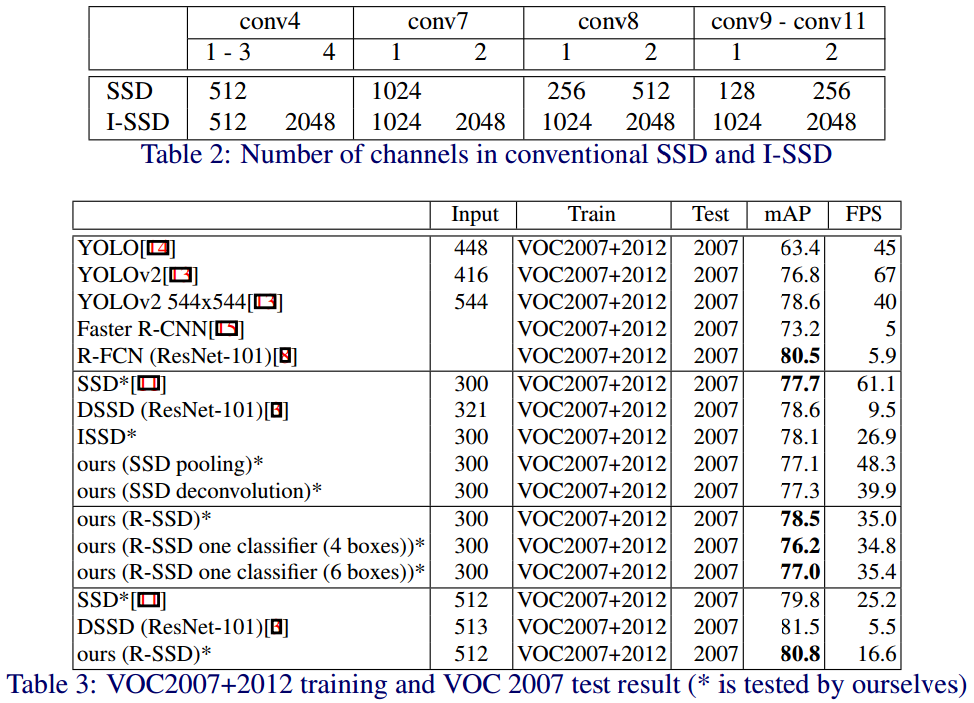

上表中的ours(R-SSD one classifier)意思是所有层的分类器权重一样，等价于就是一个分类器。原因是RSSD的每一个特征图层都是相同的，区别仅仅是尺寸不一样而已，所以可以分类器共享权重。

Table4是AP和mAP的对比：

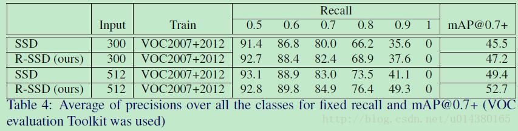

Table5是关于不同scale的object的召回率情况对比：

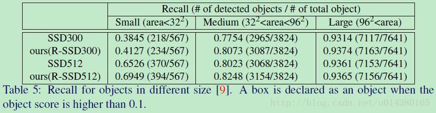

**总结： 总的来说，作者通过rainbow concatenation方式（pooling加deconvolution）融合不同层的特征，在增加不同层之间feature map关系的同时也增加了不同层的feature map个数。因此这种融合方式不仅解决了传统SSD算法存在的重复框问题，同时一定程度上解决了small object的检测问题。**

参考：https://blog.csdn.net/u014380165/article/details/77130922

# 4 ESSD

​    论文地址：https://arxiv.org/abs/1801.05918

## 1 创新点

​    ESSD全称是Extend the shallow part of Single Shot MultiBox Detector via Convolutional Neural Network，是DSSD的加速版本。DSSD在PASCAL VOC2007数据集上，mAP由SSD的77.5% 提升到78.6%，但是FPS由SSD的46降低到11.6，本文就是从提升FPS角度进行改进。总之就是：**对原始SSD算法进行改进，但是借鉴了DSSD思想，最终达到和DSSD一样的效果，但是速度加快一倍，网络模型和DSSD是不同的**。

   (1) 借鉴DSSD反卷积增加全局上下文思想，提出了一种扩展模块，并将该模块应用到SSD中的前三个ssd层中

   (2) 借鉴DSSD将残差引入预测模块思想，提出一种简化版残差预测模块，提升预测性能

本文写的非常简单，仅仅是对速度进行改进而已，意义不是很大。

## 2 核心思想

​    DSSD性能提升是通过将VGG换成了ResNet-101，并且添加了足够多的解卷积层来获取上下文信息，但是牺牲了SSD的速度。作者的核心思想来自RON网络，即SSD网络对小目标检测效果不好的原因是最低的几层特征层语义信息非常弱，采用这些层进行目标检测效果很差，解决办法是想办法增强浅层特征图的语义信息。作者就是解决DSSD反卷积思想，从增强浅层网络语义信息进行改进的。

## 3 模型

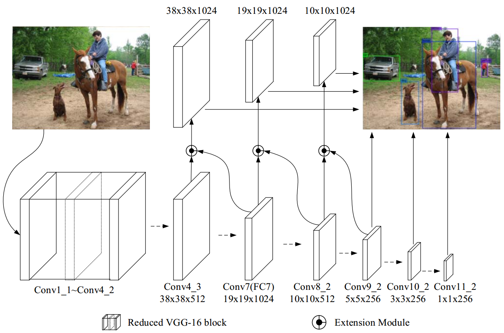

​                                                                          图 ESSD完整网络结构

​    ESSD并没有引入ResNet，而是依然采用VGG，conv1\_1~conv4\_2是reduced vgg-16 block，和原始SSD相同，作者在conv4\_3，FC7，Conv8\_2和conv9\_2四层方面进行改进，实际上改动的就只有conv4\_3，FC7，Conv8\_2三层，对这三层加入了扩展模块，其他结构和SSD完全相同。

​    在预测分类和回归模块上，参数了DSSD思想，也采用了DSSD类似的结构，唯一区别是跳跃连接线上使用的是1x1x512的卷积核，目的是加快速度。

​    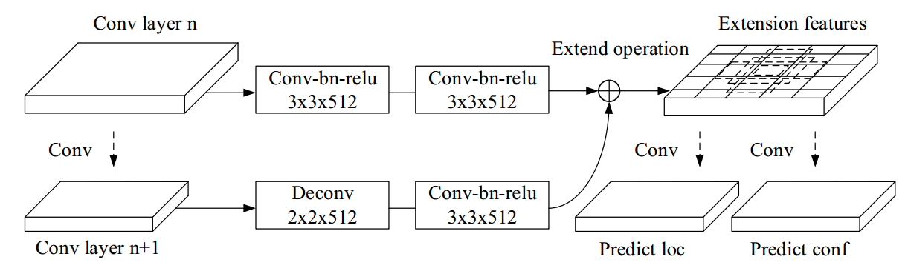

​                                                                                    图 ESSD的扩展模块结构

​    可以看出，本质上和DSSD的反卷积类似，唯一区别是不再单独引入多余的层，而是将反卷积后的特征图直接加到上一层特征图中，相当于增强了底层特征图语义信息，有利于目标检测。

## 4 实验结果

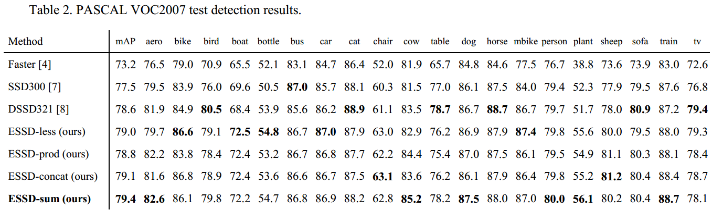

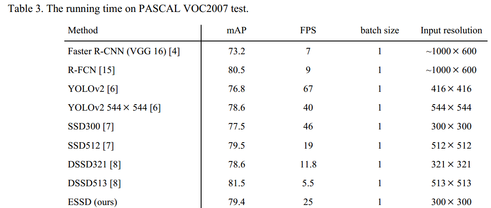

# 5 RFBNet

​    论文地址：https://arxiv.org/abs/1711.07767

## 1 创新点

​    (1) 借鉴人眼视觉系统的感受野 (Receptive Fields，RFs)机制，设计了一种同时考虑感受野大小和方向性的RF Block (RFB)模块，可以有效增强特征的可区分性和鲁棒性；

​    (2) 将RFB模块应用与原始SSD算法的顶部几层网络，从而构造出轻量级目标检测器，具备同非常深的主干网络检测器的精度，但是保持了实时性，达到了当前最好水平。

总之，本文主要工作是**增强了每一个分类和回归预测层的特征表征能力**，参考了Deeplab思想。单从效果来看，本文所提算法是很不错的，在使用VGG-16的模型中是精度最高且速度也不慢的算法。

## 2 核心思想

​    当前顶级目标检测器依赖于非常深的CNN主干网络，例如ResNet-101和Inception，优点是它们具有强大的特征表现能力，但是耗时严重。相反地，一些基于轻量级模型的检测器满足实时处理，但是精度是诟病。  本文就是基于此着手，利用轻量级模型例如VGG-16进行检测，通过设计高效机制来同时到达速度和精度的要求。

​    核心思想来自人眼视觉系统的感受野机制，如下图：

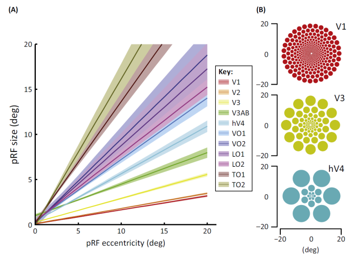

​    pRF是population Receptive Field群体感受野，可以看出，不同的视皮层V1、V3、hV4上群体感受野的大小是不同的。

引入到神经网络中，可以简要分析如下：

​    (1) 常规的卷积神经网络，对于某一个特征层，RF可以认为是相同尺寸、固定采样网格，这种设计可能会导致特征的可区分度和鲁棒性受损；    

​    (2) GoogLeNet的RF考虑了多尺寸，具体实现是通过对多个不同的CNN分支采用不同大小的卷积核，有利于目标检测；

​    (3)  带孔的空间金字塔池化层Atrous Spatial Pyramid Pooling (ASPP) 捕抓不同尺度信息，并且通过4个并行的不同扩张率的带孔卷积进行特征提取，在语义分割中应用广泛，但是其RF模型考虑为多组同心圆，而不是视觉系统中的雏菊形状，可能会导致特征的可区分度受损；

​    (4) 可变形卷积神经网络(Deformable CNN)尝试去根据目标的大小和形状自适应的调整RF空间分布，虽然具备一定的灵活性，但是并没有考虑eccentricity(怪癖？)，会导致每个像素的RF都产生相同的输出响应，不会突出重要信息。

​    针对以上不足，作者提出一种新的RF模块，对多个不同尺寸的pool分支采用多个不同的卷积核，并且添加空洞卷积来控制eccentricities。然后将RF模块应用到SSD的某些层中即可。由于RF模块的简单高效性，最终导致采用轻量级模型VGG16就可以实现复杂且深的模型效果，且速度保证基本不变。

## 3 模型

### 3.1 模型总体结构

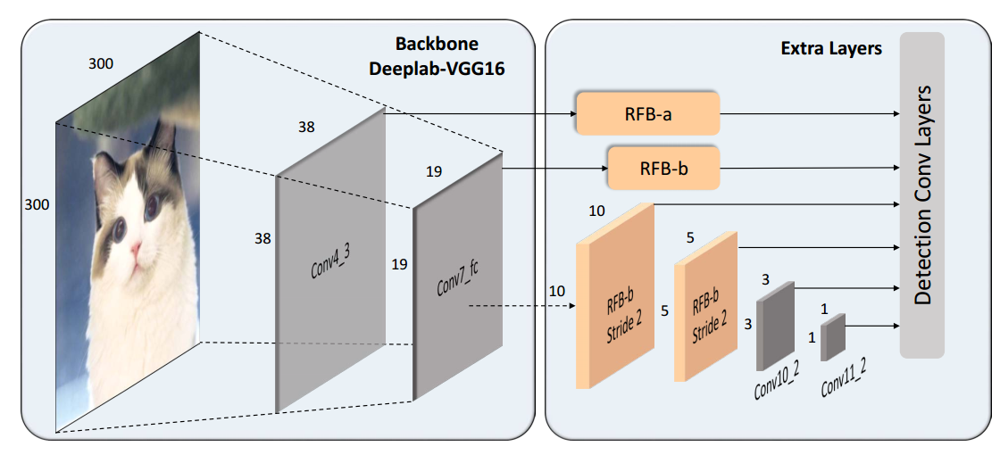

​                                                                                       图1 模型总体结构

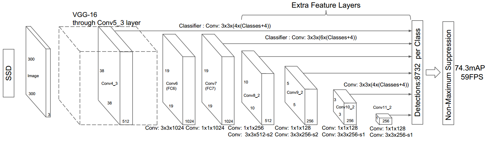

​                                                                                      图2 原始SSD结构

通过对比，明显可以看出区别。注：上图中的DeepLab-VGG16其实依然是和SSD中一样。

### 3.2 Receptive Field Block

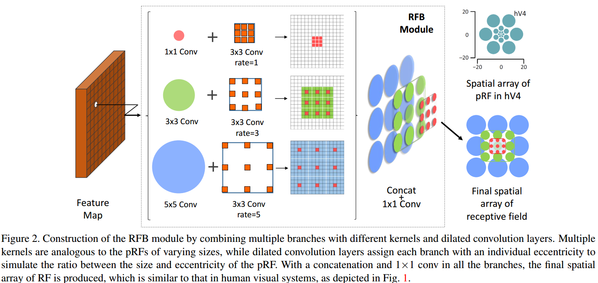

​                                                                                   图3 RFB模型示意图

可以看出：通过以上多种方式最终可以实现和视觉系统一样的感受野结构。然后在不同特征图层采用这种结构，就可以全部模拟出V1，V2，V3等视觉层感受野结构。

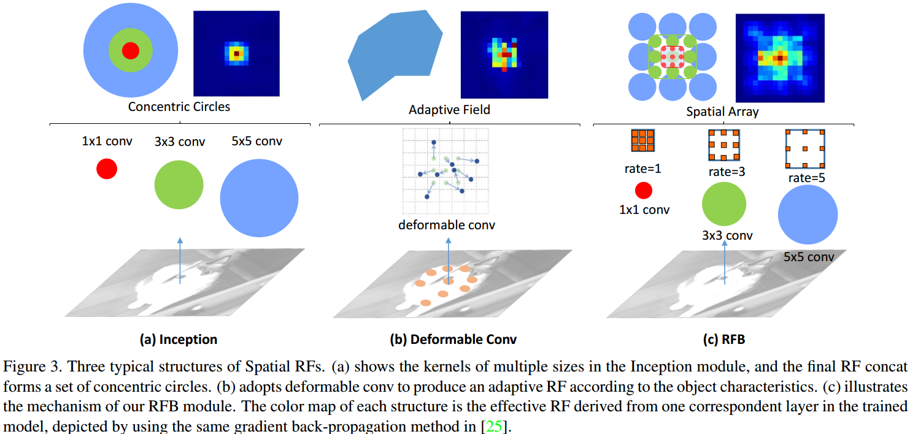

​                                                                            图4 三种不同的RF结构

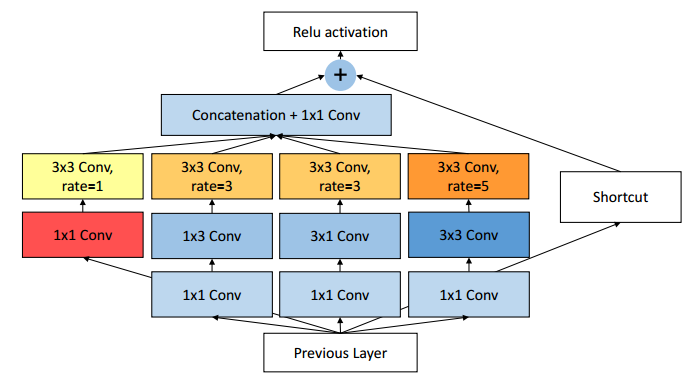

​                                                                                           图5 RFB-a结构

RFB-a模块应用于浅层

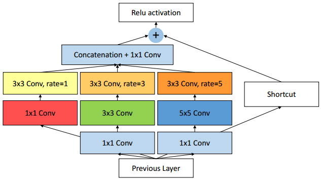

​                                                                                              图6 RFB-b结构

RFB-b模块应用于深层，并且作者试验发现，使用2个3x3卷积代替5x5卷积没有带来更好效果。

## 4 实验结果

​    实验参数设置和SSD没有很大区别。

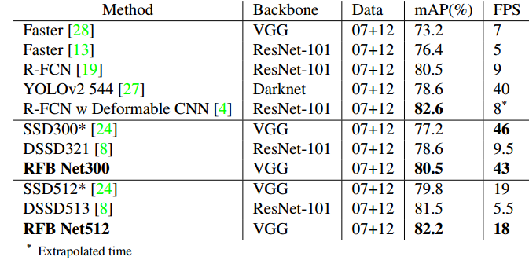

以上实验结果的测试数据是VOC2007+12

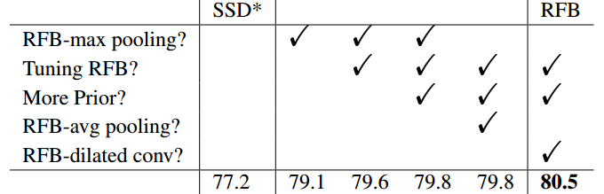

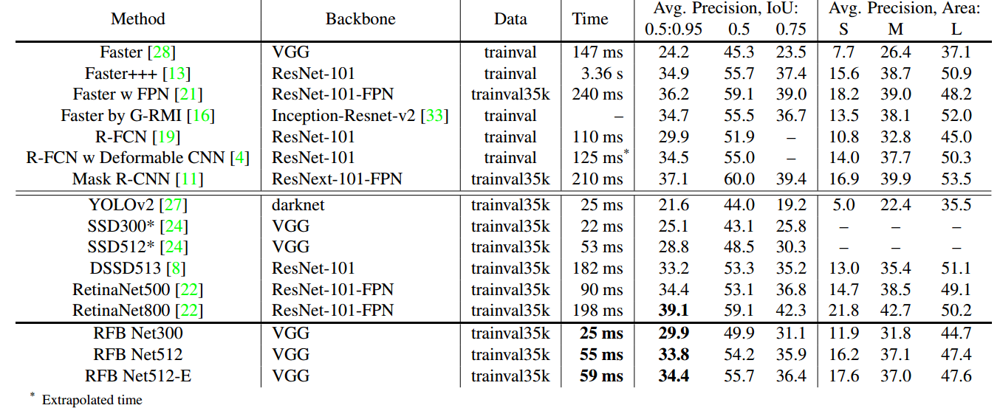

通过coco数据集，可以看出改进还是很大的。RFBNet512-E是指：(1) 类似于FPN思想，将conv7 fc特征图进行上采样，然后拼接到conv4\_3上面，引入上下文信息，然后在使用RFB-a模块；(2) 对所有的RFB所有分支层都添加一个7x7的卷积核。

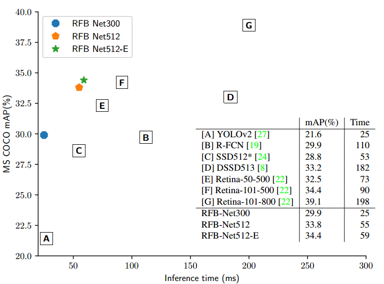

