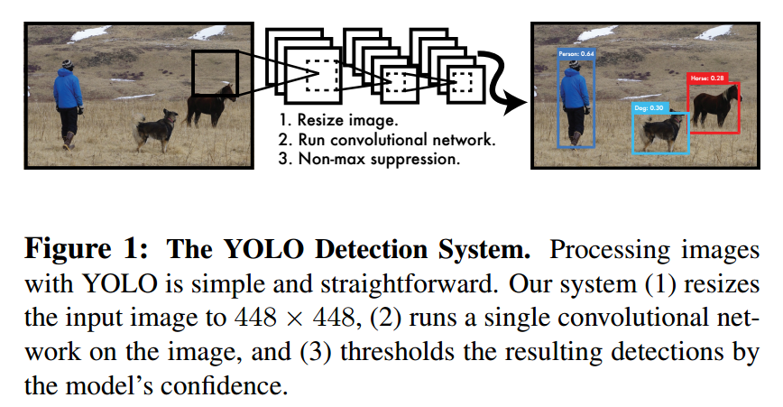
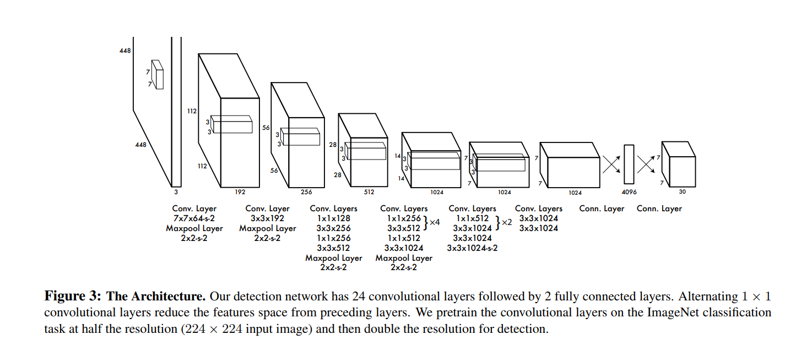
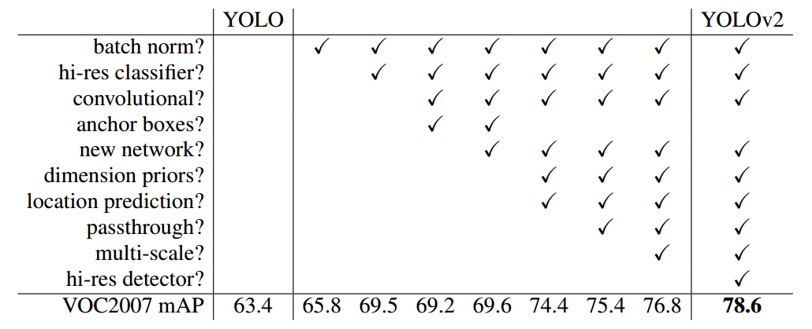
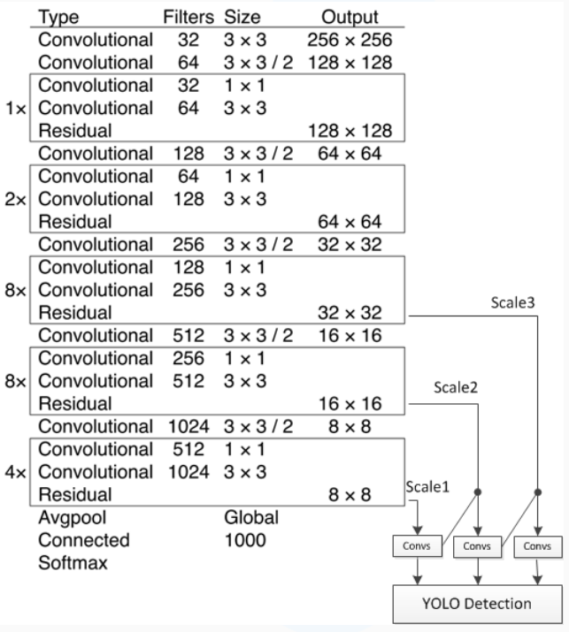

## YOLO系列

### 1. YOLO V1

论文地址： [YOLO2015.02](https://arxiv.org/abs/1506.02640)

#### 1.1 创新点

1. 将目标检测中的定位（location）和检测（detection）都当做回归问题。
2. 在预测的时候用到了全局信息，而其他基于region proposal的方法只是基于局部信息做预测，由于不能看到全局信息，容易将背景当做物体。
3. YOLO相对于RCNN系列而言，是一种一阶段目标检测算法，其优点是速度快，已经在工业界使用，缺点是精度没有RCNN系列高。You Only Look Once说的是只需要一次CNN运算，Unified指的是这是一个统一的框架，提供end-to-end的预测，而Real-Time体现是Yolo算法速度快。YOLO设计十分简洁，这也是它较快的原因。

#### 1.2 模型

**A.概览**

​	整个系统如图所示：首先将输入图片resize到448x448，然后送入CNN网络，最后处理网络预测结果得到检测的目标。相比R-CNN算法，其是一个统一的框架，其速度更快，而且Yolo的训练过程也是end-to-end的。

​	具体来说，Yolo的CNN网络将输入的图片分割成 $S* S$ 网格，然后每个单元格负责去检测那些中心点落在该格子内的目标，如图所示，可以看到狗这个目标的中心落在左下角一个单元格内，那么该单元格负责预测这个狗。

预测分为两部分，bounding box的预测和分类预测。

**B.Bounding box预测**

​	每个单元格会预测 $B$个**边界框**（bounding box）以及**边界框的置信度**（confidence score）。

​	所谓置信度其实包含两个方面，一是这个cell含有目标的可能性大小，二是这个边界框的准确度。前者记为 $Pr(object)$ ，当该cell不包含目标，此时 $Pr(object)=0$。而当该cell包含目标时， $Pr(object)=1$。边界框的准确度可以用预测框与真实框（ground truth）的IOU（intersection over union，交并比）来表征，记为 ${IOU}^{truth}_{pred}$。因此置信度可以定义为 $Pr(object)*\text{IOU}^{truth}_{pred}$ 。很多人可能将Yolo的置信度看成边界框是否含有目标的概率，但是其实它是两个因子的乘积，预测框的准确度也反映在里面。

> 注：置信度的理解要分训练和测试两个阶段来看待。当训练的时候，物体的中心落在该cell，那么此时$Pr(object)$就为1，对应的${IOU}^{truth}_{pred}=1$，此时置信度为1。否则$Pr(object)$就为0，这个时候置信度就为0。这也是训练的时候置信度的label。相反，如果是测试阶段，直接预测得到的实际上只有一个置信度，只是它隐式地包含了$Pr(object)*\text{IOU}^{truth}_{pred}$ 。

​	边界框的大小与位置可以用4个值来表征： $(x, y,w,h)$，其中 $(x,y)$ 是边界框的中心坐标，而 $w$和 $h $是边界框的宽与高。还有一点要注意，中心坐标的预测值 $(x,y)$ 是相对于每个单元格左上角坐标点的偏移值，并且单位是相对于单元格大小的，单元格的坐标定义如图6所示。而边界框的 $w$和 $h$ 预测值是相对于整个图片的宽与高的比例，这样理论上4个元素的大小应该在 $[0,1]$ 范围。这样，每个边界框的预测值实际上包含5个元素： $(x,y,w,h,c)$，其中前4个表征边界框的大小与位置，而最后一个值是置信度。

> 注：怎么计算偏移值？按照下图的方式计算。假设原图的大小为`w*h`, grid的size为S*S，某物体中心的坐标为（x,y），且其所在的cell左上角坐标为（a,b），如图箭头指向的cell的坐标为（5,0）。首先，x进行归一化，x/w，即将尺度缩小到[0,1]。然后扩大S倍，xS/w，将尺度扩大到[0,S]。最后，减去cell的坐标，则得到最终的偏移值。总公式为：(xS/w-a,yS/h-b)。

**C.分类**

​	还有分类问题，对于每一个单元格还要给出预测出 $C$ 个类别概率值，其表征的是由该单元格负责预测的边界框其目标属于各个类别的概率。这个概率是条件概率，即 $Pr(class_{i}|object)$，表示cell存在物体的条件下类别的概率值 。值得注意的是，不管一个单元格预测多少个边界框，其只预测一组类别概率值，这是Yolo算法的一个缺点，在后来的改进版本中，Yolo9000是把类别概率预测值与边界框是绑定在一起的。同时，我们可以计算出各个边界框类别置信度（class-specific confidence scores）:$Pr(class_{i}|object)*Pr(object)*\text{IOU}^{truth}_{pred}=Pr(class_{i})*\text{IOU}^{truth}_{pred}$。

> 注：这里也要分训练阶段和测试阶段来看，如果是训练阶段，首先看cell中是否有物体中心落入，如果有，再看落入的是什么物体，对应的$Pr(class_{i}|object)=1$，否则，相应的$Pr(class_{i}|object)=0$，这里也就体现了条件概率的意义。对于测试阶段， 我们还要将类别概率值乘以置信度。$Pr(class_{i}|object)*Pr(object)*\text{IOU}^{truth}_{pred}=Pr(class_{i})*\text{IOU}^{truth}_{pred}$。which gives us class-specific confidence scores for each box. These scores encode both the probability of that class appearing in the box and how well the predicted box fits the object。个人的理解，公式中应该是联合概率，如：$Pr(class_{i}|object)*Pr(object)*\text{IOU}^{truth}_{pred}=Pr(class_{i}，object)*\text{IOU}^{truth}_{pred}$，表示同时包含物体并且是某一类的可能性。

边界框类别置信度表征的是该边界框中目标属于各个类别的可能性大小以及边界框匹配目标的好坏。后面会说，一般会根据类别置信度来过滤网络的预测框。

总结一下，每个单元格需要预测 $(B*5+C)$个值。如果将输入图片划分为 $S\times S$网格，那么最终预测值为 $S\times S\times (B*5+C)$大小的张量。整个模型的预测值结构如下图所示。对于PASCAL VOC数据，其共有20个类别，如果使用 $S=7,B=2$ ，那么最终的预测结果就是 $7\times 7\times 30$ 大小的张量。在下面的网络结构中我们会详细讲述每个单元格的预测值的分布位置。

**D.网络设计**

​                                                                                        图4-1 YOLO网络结构    

​    yolo采用卷积网络来提取特征，然后使用全连接层来得到预测值。网络结构参考GooLeNet模型，包含24个卷积层和2个全连接层，如图所示。对于卷积层，主要使用1x1卷积来做channle reduction，然后紧跟3x3卷积。对于卷积层和全连接层，采用Leaky ReLU激活函数： $max(x, 0.1x)$。但是最后一层却采用线性激活函数。网络先用224x224的图片imageNet上进行分类训练，得到卷积层的预训练模型。而在yolo中，将图片的分辨率扩大到448x448。网络的输出是一个7x7x30的tensor，之后会详细解释这个tensor的含义。

#### 1.3 训练

​    YOLOv1网络借鉴了GoogLeNet分类网络结构。不同的是，YOLO未使用inception module，而是使用1x1卷积层（此处1x1卷积层的存在是为了跨通道信息整合）+3x3卷积层简单替代。YOLOv1网络在最后使用全连接层进行类别输出，因此全连接层的输出维度是 $S×S×(B×5+C)$，YOLO全部使用了均方和误差作为loss函数，将整个问题都转化为回归问题处理，性能评价指标为mAP。

​    不足之处

- 输入尺寸固定：由于输出层为全连接层，因此在检测时，YOLO训练模型只支持与训练图像相同的输入分辨率。其它分辨率需要缩放成改分辨率。
- 占比较小的目标检测效果不好。虽然每个格子可以预测B个bounding box，但是最终只选择只选择IOU最高的bounding 
  box作为物体检测输出，即每个格子最多只预测出一个物体。当物体占画面比例较小，如图像中包含畜群或鸟群时，每个格子包含多个物体，但却只能检测出其中一个。
  ​

参考：[YOLO详解](https://zhuanlan.zhihu.com/p/32525231)    

### 2 YOLO V2

#### 2.1 名称

​    [YOLOV2 16.02](https://arxiv.org/abs/1612.08242)

#### 2.2 概述

​    yolo_v2主要工作为：(1) **使用了一系列的方法对原来的YOLO多目标检测框架进行了改进，在保持原有速度的优势之下，精度上得以提升**。VOC 2007数据集测试，67FPS下mAP达到76.8%，40FPS下mAP达到78.6%，基本上可以与Faster R-CNN和SSD一战，是重点研究部分；(2) **提出了一种目标分类与检测的联合训练方法，通过这种方法，YOLO9000可以同时在COCO和ImageNet数据集中进行训练，训练后的模型可以实现多达9000种物体的实时检测**。具体可以归纳为：提高了训练图像的分辨率；引入了faster rcnn中anchor box的思想，对网络结构的设计进行了改进，输出层使用卷积层替代YOLO的全连接层，联合使用coco物体检测标注数据和imagenet物体分类标注数据训练物体检测模型。相比YOLO，YOLO9000在识别种类、精度、速度、和定位准确性等方面都有大大提升。

#### 2.3 主干网络

​    先简单归纳YOLO_v1的步骤：

1. 给一张输入图像448\*448，首先将图像划分成7 * 7的网格
2. 对于每个网格，每个网格预测2个bouding box（每个box包含5个预测量）以及20个类别概率，总共输出7×7×（2*5+20）=1470个tensor
3. 根据上一步可以预测出7 * 7 * 2 = 98个目标窗口，然后根据阈值去除可能性比较低的目标窗口，再由NMS去除冗余窗口即可。

​    YOLOv1使用了end-to-end的回归方法，没有region proposal步骤，直接回归便完成了位置和类别的判定。种种原因使得YOLOv1在目标定位上不那么精准，直接导致YOLO的检测精度并不是很高。

​    

1. **新增BN层**

   ​    新的YOLO网络在每一个卷积层后添加batch normalization，通过这一方法，mAP获得了2%的提升

2. **高分辨率分类器**

   ​    作者首先对分类网络（自定义的darknet）进行了fine tune，分辨率改成448 * 448，在ImageNet数据集上训练10轮（10 epochs），训练后的网络就可以适应高分辨率的输入了。然后，作者对检测网络部分（也就是后半部分）也进行fine tune。这样通过提升输入的分辨率，mAP获得了4%的提升

3. **引入锚点机制**

   ​    YOLO利用全连接层完成边框的预测，导致丢失较多的空间信息，定位不准。所以作者首先**去掉了全连接层**，然后**去掉了后面的一个池化层**以确保输出的卷积特征图有更高的分辨率。然后，通过缩减网络，让图片**输入分辨率为416 * 416**，这一步的目的是为了让后面产生的卷积特征图宽高都为奇数，这样就可以产生一个center cell。作者观察到，大物体通常占据了图像的中间位置， 就可以只用中心的一个cell来预测这些物体的位置，否则就要用中间的4个cell来进行预测，这个技巧可稍稍提升效率。最后，YOLOv2使用了卷积层降采样（factor为32），使得输入卷积网络的416 * 416图片最终得到13 * 13的卷积特征图（416/32=13）。

   ​    加入了anchor boxes后，可以预料到的结果是**召回率上升，准确率下降**。我们来计算一下，假设每个cell预测9个建议框，那么总共会预测13 *13 * 9 = 1521个boxes，而之前的网络仅仅预测7 * 7 * 2 = 98个boxes。具体数据为：没有anchor boxes，模型recall为81%，mAP为69.5%；加入anchor boxes，模型recall为88%，mAP为69.2%。这样看来，准确率只有小幅度的下降，而召回率则提升了7%，说明可以通过进一步的工作来加强准确率，的确有改进空间。

4. **维度聚类**

   ​    该技巧主要为了解决先验框要提前精确给定的不足。虽说在训练过程中网络也会学习调整boxes的宽高维度，最终得到准确的bounding boxes。但是，如果一开始就选择了更好的、更有代表性的先验boxes维度，那么网络就更容易学到准确的预测位置。

   ​    和以前的精选boxes维度不同，作者使用了K-means聚类方法训练bounding boxes，可以自动找到更好的boxes宽高维度。传统的K-means聚类方法使用的是欧氏距离函数，也就意味着较大的boxes会比较小的boxes产生更多error，聚类结果可能会偏离。为此，作者采用的评判标准是IOU得分（也就是boxes之间的交集除以并集），这样的话，error就和box的尺度无关了，最终的距离函数为：$d(box,centroid) = 1 − IOU(box,centroid)$，具体实验结果请看论文。

5. **直接位置预测**

   ​    作者在使用anchor boxes时发现的**第二个问题就是：模型不稳定，尤其是在早期迭代的时候**。大部分的不稳定现象出现在预测box的 (x,y) 坐标上了，作者借鉴了Faster RCNN思路并且进行了改进，使得使用Dimension Clusters和Direct location prediction这两项anchor boxes改进方法，mAP获得了5%的提升。

   ​    这部分不太好理解，主要思想是Faster RCNN中的锚地在学习中没有进行限制，可能会出现某一个锚地最终调整到了和原始位置很远的地方，这样会出现模型不稳定，并且收敛速度会变慢，作者的解决办法是不再学习box距离锚地的偏移，而是直接学习锚地距离左上角网格的距离，通过sigmoid限制ground truth在0-1之间变化，使anchor只负责周围的box，有利于提升效率和网络收敛，具体见论文。

6. **细粒度特征**

   ​    当前的预测特征图大小是13\*13，对于大尺寸物体是足够了，但是可能对小目标不够好，而SSD算法在不同层次的特征图上产生区域建议，获得了多尺度的适应性，本文采用一种更简单的方法替代。简单添加一个转移层(passthrough layer)，把浅层特征图（分辨率为26 * 26，是底层分辨率4倍）连接到深层特征图，把高低两种分辨率的特征图做了一次连结，连接方式是叠加特征到不同的通道而不是空间位置，类似于Resnet中的identity mappings，具体是将把26 * 26 * 512的特征图转换为13 * 13 * 2048的特征图，然后拼接到预测特征图后面进行特征融合，有利于检测小目标。

7. **多尺度训练和测试**

   ​    不同于固定输入网络的图片尺寸的方法，作者在几次迭代后就会微调网络。每经过10次训练（10 epoch），就会随机选择新的图片尺寸。YOLO网络使用的降采样参数为32，那么就使用32的倍数进行尺度池化{320,352，…，608}。最终最小的尺寸为320 * 320，最大的尺寸为608 * 608。接着按照输入尺寸调整网络进行训练。这种机制使得网络可以更好地预测不同尺寸的图片，意味着同一个网络可以进行不同分辨率的检测任务，在小尺寸图片上YOLOv2运行更快，在速度和精度上达到了平衡。

8. **速度改进**

   ​    YOLOv2使用的是基于Googlenet的定制网络，比VGG-16更快，但精度稍低一些。作者设计了一个新的分类网络作为特征提取部分Darknet-19，包含19个卷积层、5个最大值池化层。

   ​    使用Darknet-19在标准1000类的ImageNet上训练了160次，用的随机梯度下降法，starting learning rate 为0.1，polynomial rate decay 为4，weight decay为0.0005 ，momentum 为0.9。训练的时候仍然使用了很多常见的数据扩充方法（data augmentation），包括random crops, rotations,and hue, saturation, and exposure shifts。 然后初始的224 * 224训练后，作者把分辨率上调到了448 * 448，然后又训练了10次，学习率调整到了0.001。高分辨率下训练的分类网络在top-1准确率76.5%，top-5准确率93.3%。

### 3 YOLO V3

#### 3.1 名称

​     [YOLOV3](https://pjreddie.com/media/files/papers/YOLOv3.pdf)

#### 3.2 概述

​     V3版本的主要改进是提高速度和精度，作者用于‘惊讶’等词汇表明这次算法改进效果提升非常大，但是速度依然快。其主要改进包括两个部分：(1) 多尺度预测 （类FPN）；(2) 更好的基础分类网络（类ResNet）和分类器。

#### 3.3 主干网络

​                                                                           图4-3 YOLO V3网络结构图--darknet-53

​    具体改进包括如下：

1. 边界框中置信度预测使用逻辑回归，而不是原先的均方误差。与真实框重合程度最大的先验框，其值置1，即使超过阈值但是不是最好的先验框也会被忽略，系统只为每个ground truth对象分配一个边界框，如果先前的边界框未分配给grounding box对象，则不会对坐标或类别预测造成损失。
2. 分类损失函数不再采用softmax，而是使用二值交叉熵，这是因为Softmax使得每个框分配一个类别（score最大的一个），而对于Open Images这种数据集，目标可能有重叠的类别标签，因此Softmax不适用于多标签分类，并且Softmax可被独立的多个logistic分类器替代，且准确率不会下降。
3. 多尺度预测。思想类似与FPN网络。每种尺度预测3个box, anchor的设计方式仍然使用聚类,得到9个聚类中心,将其按照大小均分给3中尺度。需要注意的是：虽然yolov3增加了anchor centroid，但是对ground truth的估计变得更加简单，每个ground truth只匹配一个先验框，而且每个尺度只预测3个框，v2预测5个框。这样的话也降低了复杂度。
4. 基础网络改造，提出了新的darknet-53，仿ResNet, 与ResNet-101或ResNet-152准确率接近,但速度更快。

#### 3.4 总结

​    YOLOV3在速度不咋增加的情况下性能得到大幅提升，性能超越SSD512且速度更快。但是其依然存在不足：识别物体位置精准性差，召回率比RCNN系列低。主要原因是为了考虑速度而使得网络较简单。
