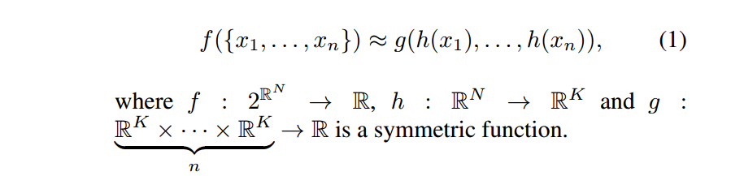
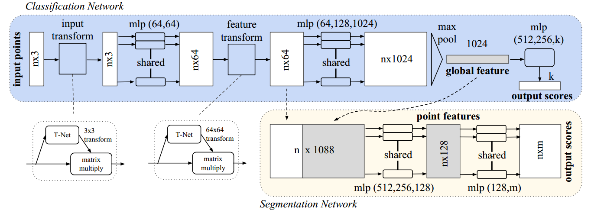
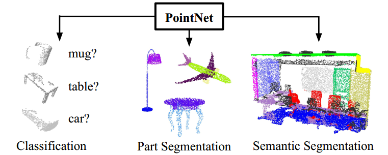
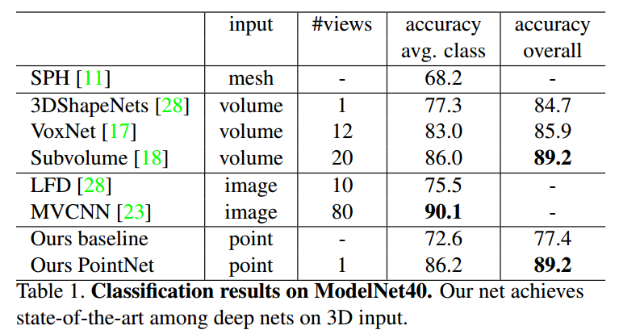
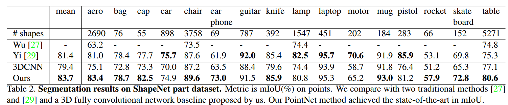
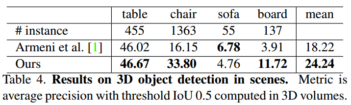
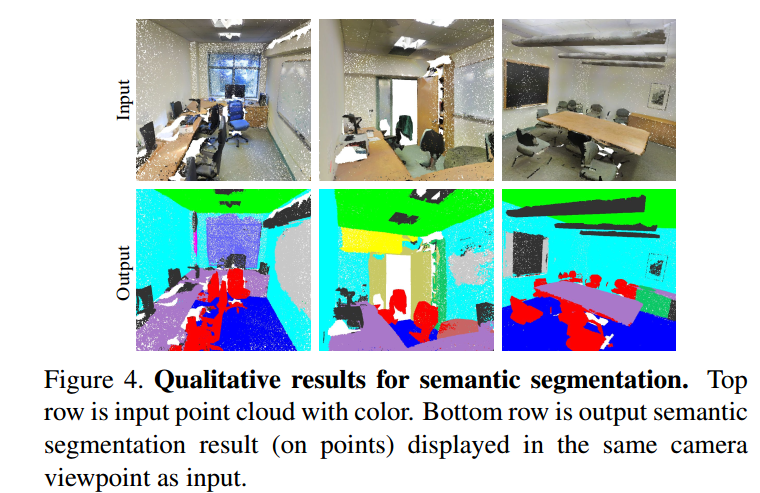
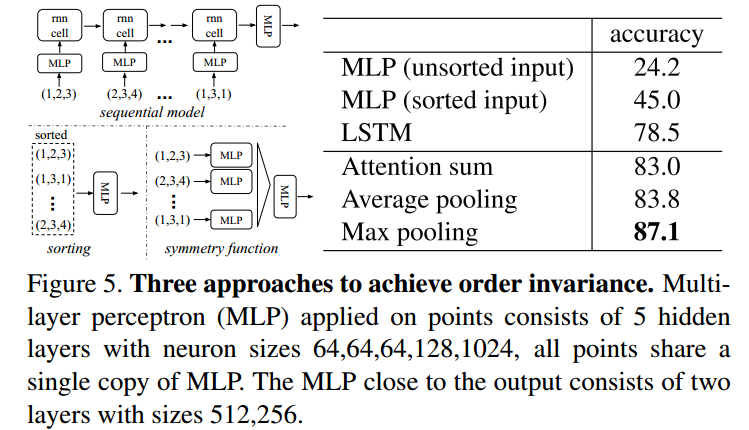
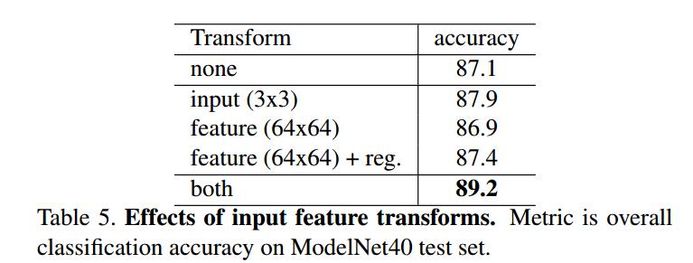
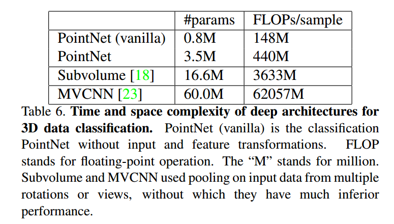

# PointNet

论文地址：    [PointNet: Deep Learning on Point Sets for 3D Classification and  Segmentation](https://arxiv.org/abs/1612.00593)

## 1 创新点

​    (1) 第一个可直接输入3d无序点云数据的深度学习模型，可实现分类、部件分割和场景分割任务

​    (2) 提供了理论和实践证明网络的高效性

​    (3) 说明了网络中所选神经元计算出的3D特征，并对其性能进行直观的解释

## 2 核心思想    

​    随着激光雷达，RGBD相机等3D传感器在机器人，无人驾驶领域的广泛应用。针对三维点云数据的研究也逐渐从低层次几何特征提取（ PFH, FPFH,VFH等）向高层次语义理解过渡（点云识别，语义分割）。与图像感知领域深度学习几乎一统天下不同，针对无序点云数据的深度学习方法研究则进展缓慢。分析其背后的原因，不外乎三个方面：

​    **1.点云具有无序性。**受采集设备以及坐标系影响，同一个物体使用不同的设备或者位置扫描，三维点的排列顺序千差万别，这样的数据很难直接通过End2End的模型处理。

​    **2.点云具有稀疏性。**在机器人和自动驾驶的场景中，激光雷达的采样点覆盖相对于场景的尺度来讲，具有很强的稀疏性。在KITTI数据集中，如果把原始的激光雷达点云投影到对应的彩色图像上，大概只有3%的像素才有对应的雷达点。这种极强的稀疏性让基于点云的高层语义感知变得尤其困难。

​    **3.点云信息量有限。**点云的数据结构就是一些三维空间的点坐标构成的点集，本质是对三维世界几何形状的低分辨率重采样，因此只能提供片面的几何信息。

​    而如果直接采用点云作为网络输入，那么需要网络需要考虑点云输入的如下特性：

​    **1.无序性。**不像将点云转化为体素形式，点云的排列是无序的，对于N个点的点云，那么就存在N！种排列情况。例如分类问题，对N！种情况的点云输入应该都预测同一个值

   **2.点与点之间的关联性。**点云数据是分布在一个欧式曲面上，点与点之间是有联系的，不能孤立的单独处理每个点。故网络应该能综合考虑点与点直接的关系，例如局部特征和全局特征融合

​    **3.点云的变换不变性。**类似图片，点云数据在进行旋转、平移后对于分类和分割任务应该具有变换不变性。网络应该具备这种不变性

​    对于第一个问题，解决办法有3个：(1) 预处理所有点，将其转化为固定的标准输入顺序。这种方法比较难实现，因为有些数据本身就没有顺序，无法定义顺序；(2) 将其转化为序列数据，然后对输入数据进行随机重排，最后采用类似RNN网络进行学习，让网络学习到这种不变性。但是有论文指出输入顺序是非常重要的，不能够随意重排，而且如果点云个数成千上万，那么这种方法性能就较差；(3) 引入对称函数，使得对无序输入产生一致的输出。

​    作者采用的是第3种方法，其核心原理如下：

其中，f函数解释无序的n个点云输入，然后产生相同的输出，即f是对称函数。而约等号右边是作者设计的网络结构，对输入的每一点使用对称函数h进行处理，h的实现是多层感知机MLP，g是单值函数和max pooling函数的组合。上述的公式意思是：对输入的无序点云数据，逐点进行特征提取，然后通过对称函数max poooling就可以解决无序问题。作者在论文后面用了大量篇幅证明**max pooling函数对于点云特征处理等价于代数组合学中的对称函数**，由于证明比较复杂，请自行看论文。

​    对于第二个问题，常用的解决办法就是局部特征和全局特征融合，后面详述。

​    对于第三个问题，作者设计了一个联合对齐网络(Joint Alignment Network)，具体实现是通过迷你网络T-net预测仿射变换矩阵，并直接将该变换应用于输入点的坐标。同时也可以将该思想应用与特征层，实现特征对称。就可以使得整个网络都具有变换不变性。由于**特征空间中的变换矩阵具有比空间变换矩阵高得多的维度，如果直接优化，那么搜索空间过大，网络训练不稳定**，这极大地增加了优化的难度，所以作者增加了一个正则项，约束特征空间变换矩阵使其接近正交阵。**采用正交阵的好处是对输入信息不会有任何损失，仅仅变换了一下而言**：

A是T-net网络输出，作者指出通过增加正则正交约束，使得训练非常稳定，模型性能较好。

## 3 网络结构

​    如上图所示，第一行是分类网络，第二行是分割网络。输入是包含n个点的三维点云（nx3) , 原始数据通过一个3D 空间变换矩阵预测网络 T-Net(3)，估计出3x3的变换矩阵T(3)并作用在原始数据上，实现数据的对齐，克服点云变换性。对齐后的数据会以点为单位，通过一个共享参数的双层感知机模型(conv2d实现)进行特征提取 。每个点提取出64维的特征，再通过特征空间变换矩阵预测网络 T-Net(64) 预测64x64的变换矩阵，作用到特征上，实现对特征的对齐。然后继续利用三层感知机（64,128,1024）进行以特征点为单位的特征提取，直到把特征的维度变为1024，继而在特征空间的维度上进行Max Pooling，提取出点云的全局特征向量，克服无序点云输入问题 。

​    **在点云分类任务中，可直接利用特征向量训练SVM或者多层感知机(pointNet分类采用该方式)来进行分类，而在以点为单位的点云分割或者分块任务中，需要结合每一点的局部特征和全局特征进行特征融合和处理，实现逐点的分类。**PointNet中把经过特征对齐之后的64维特征看成是点的局部特征，把最后的1024维特征看成是点的全局特征，因此通过一个简单的拼接，把局部和全局的特征捆绑在一起，利用多层感知机进行融合，最后训练分类器实现逐点的分类，完成分割任务。

## 4 实验结果

### 4.1 3D Object Classification

​    分类问题采用 ModelNet40数据集，总共包括40个人造物体，12311个cad模型，将其分成9854个训练样本和2468个测试样本，对每个cad模型均匀球面采样成1024个点，训练时候采用数据增强操作，包括物体绕轴旋转、通过高斯噪声随机抖动点的位置。

其中baseline是指输入网络的是提取的特征点，而不是原始点云。可以看出pointnet和基于多视图的方法MVCNN存在一定差距，作者怀疑是由于丢失了MVCNN中可以通过渲染图像捕获的精细几何细节。

 ### 4.2 3D Object Part Segmentation

​    作者采用的是ShapeNet part 数据集，一共16个类别，包括16881个部件，有50个部件已经标注。部件分割问题本质是逐点分类问题，采用mIOU评估指标.

### 4.3 Semantic Segmentation

​    作者采用的是广泛应用的3D semantic数据集

### 4.4 网络架构分析

​    **(1) 比较不同的无序处理方法**

​    **(2) 比较特征变换性作用**   

   **(3) 比较效率**

FLOPs是每秒浮点运算量。可以看出MVCNN参数超级多，耗内存非常大，且必须要GPU才行。

