# tangent-convolutions

论文地址：http://vladlen.info/papers/tangent-convolutions.pdf

## 1 创新点

​      inter出品。不同于通常的基于体素网格处理点云的方法，提出一种基于表面几何结构的深度学习处理方法，可处理无结构化点云、含噪声的现实场景点云和百万级点云数据的场景。本文最突出的贡献是可高效的处理百万级、亿级点云数据。

## 2 核心思想

​    常用的点云分割算法都是将其转化为体素网格形式，然后采用3d卷积运算，这种操作的缺点是占用内存极大。例如一张256x256的图片，像素个数是65536，但是如果是体素网格形式的点云，那么个数是256x256x256=16777216。所以目前基于体素的点云分割方法只能处理小分辨率的点云，例如64x64。所以直接处理点云数据才是未来。

​    基于以上缺点，作者基于切线卷积(tangent convolutions)概念，假设点云数据采集是在某个欧式曲面上。切线卷积计算是基于在每个点周围的切平面上投影形成的局部表面几何。**简单来说就是对每个点计算法向量，然后估计切平面，对该切平面进行约束形成切图片，最后在该图片上采用2d卷积即为切线卷积操作**。基于上述性质，本文所提算法可以接收各种能够计算法向量的3d数据输入，例如点云，网格，甚至多边形场。需要注意：以上只是理论层面，实际实现非常高效，并没有真的生成切图片。从上面分析可知，其实作者所提方法本质是一种多视图处理点云方法(多视图处理方法是指将点云在多个视图情况下投影形成图片，然后采用2d卷积进行运算)，只不过作者所提方法可直接基于点云运算，且非常高效，思想非常简单，难点主要在实现方法。

### 2.1 切线卷积原理

​    设$\mathcal{P}=\{p\}$表示点云集，p是点云中的某个点，$S$表示连续信号，这里表示切线图片，$\pi_p$表示p点的切线图片，c为卷积核，$u \in R^2$表示切线图片中的某个点，那么p点的切线卷积定义如下：

​    公式(1)就是本文的核心，后面的所有理论都是关于如何更高效的转化该公式的。可以看出，如果S就是真实图片的话，那么其实就是普通的卷积公式。

### 2.2 点云版本的卷积原理

​    以上公式要能够计算，需要知道$S$和$u$。下面分析如何计算

​     **(1) 切线平面估计**

​     对某点计算切线平面是比较简单的，使用局部协方差分析算法(local covariance analysis)即可。具体操作是考虑该点的一个估计范围的球面内的点，利用这些点就可以构成一个平面，公式为：$r=q-p$，q是邻域内点，斜方差矩阵$C=\sum_q(rr^T)$,对C进行特征值分解，最小特征值对应的特征向量就是法平面向量$n_p$,其余两个向量$i，j$构成2d平面中的两个轴。

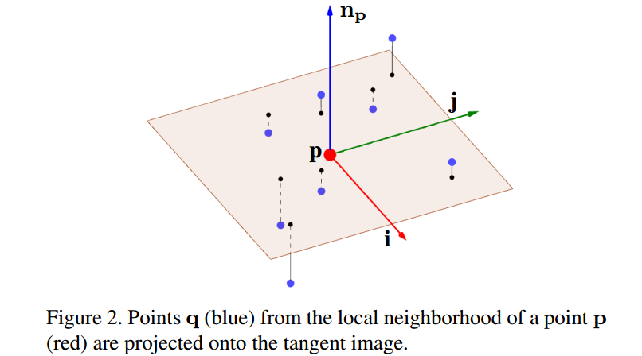

​    **(2) 信号插值**

​     以上操作完成即可得到S和u，但是对于一个切线图片而言，只有几个点有像素值，肯定是不够的，所以需要进行插值操作。作者提出了三种插值操作：邻近插值；高斯插值、top-k高斯插值。其表示式为：

v是步骤1得到的邻域点，u是插值后的值，w是插值的权重。注意S是连续函数。

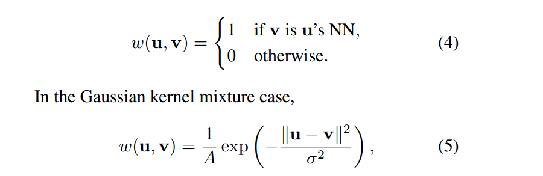

其示意图如下：

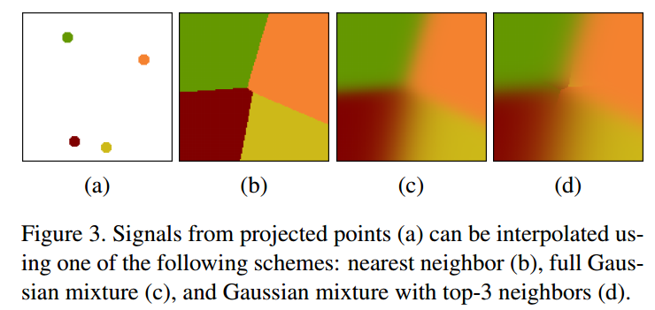

### 2.3 最终形式

​    经过上述步骤处理后，最终的切线卷积公式如下：

其中F函数表示对点进行编码操作，可以编码颜色，密度，深度，xyz等信息，是可变的，并且如果是中间卷积层，那么F函数就是特征。

## 3 切线卷积实现

​    第二点只是理论层面的操作，里面的所有变量都是连续的，但是实际上转化到代码层面是离散的。所以如何将以上公式转化为高效的离散卷积计算方法，是本文的核心及难点。

### 3.1 切线卷积计算

​    现在假设u是图片中像素，c是离散卷积核，如果采用近邻插值方法，那么切线卷积可以写成如下形式：

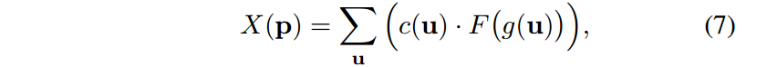

由于近邻插值的权重要么是1或0，所以公式(7)省略了。其中g是选择函数，作用是选择p所对应的切线平面中的邻域点。通俗理解就是对任意一个点，基于某个邻域半径，选择出投影到该切线平面中的l个最近点。这个步骤其实就完成了切线图片计算和邻域插值操作。

​    如果采用的插值方式是高斯top-k插值法，那么操作完全相同，具体公式是：

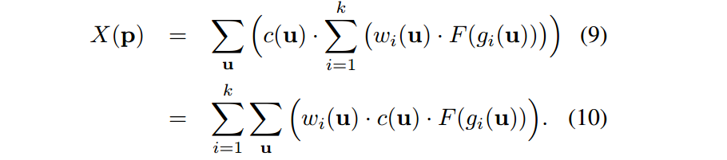

### 3.2 核心pipeline

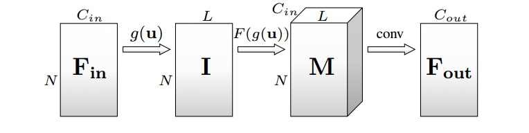

​                                                                      图 一次切线卷积计算流程

​     上图是某一层切线卷积操作的流水线操作。首先输入网络的是原始点云，N表示点云个数，$C_{in}$表示输入维度，即F编码函数，作者设置了多个实验，每个实验$C_{in}$维度不一样，分别是： distance from tangent plane (D), height above ground (H), normals (N), and color (RGB)，4种情况。经过g(u)选择函数后就可以得到N个点云的邻域和切线平面，需要说明的是：由于g函数和F没有关系，所以可以提前计算，无需在网络中计算。所以作者实际上是提前使用open3d提前算好了。经过g(u)后，原始的输入$N *  C_{in}$变成$N*L*C_{in}$，L是邻域点个数，实际取9。然后对$N*L*C_{in}$使用2d卷积操作即可，输出维度是$N*C_{out}$。然后所有的切线卷积操作都要经过这4个pipeline。

## 4 网络结构

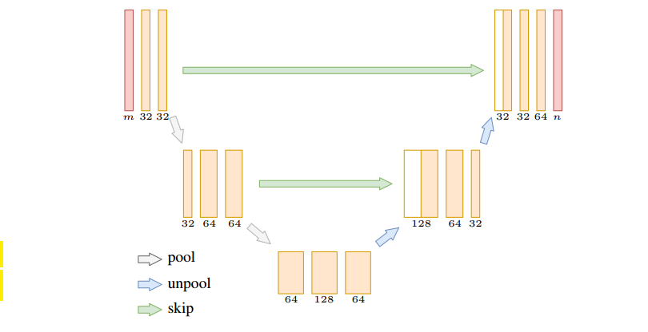

​    网络结构是仿照U-net。m是输入特征维度，其实就是$C_{in}$，假设N个点云，那么输入维度是$N*C_{in}$，经过一次卷积后，维度变成Nx32，然后再经过一次卷积变成Nx32，然后经过一次pool操作，变成$N_{out}*32$,然后两次卷积操作，其他操作类似，unpool操作是pool的反操作。网络最终输出维度是$N*n$,n是类别数。整个网络比较简单。

​    输入有一个细节部分：网络的输入特征是$C_{in}$,但是实际上作者另外拼接了一个距离特征，其计算为：$d=(q-p)^T*n_{p}$，其维度是N*1。

​    上述操作中还有pool操作实现没有涉及，其实现原理是：将输入维度$N_{in}*C_{in}$中的$N_{in}$个点按照区间哈希化为$N_{out}$个值，为了防止哈希冲突，设置为哈希化为$N_{out}*8$个位置，8是指每个位置的8个链表位置，最后操作是将$N_{out}$位置的8个值进行max或者avg操作即可。unpool操作是pool的反操作。

​     网络参数非常简单：adam，学习率$10^{-4}$，Loss函数是交叉熵，激活函数是leakyRelu。

## 5 实验结果

​    作者采用的是3个开源数据集：Semantic3D，Stanford Large-Scale 3D Indoor Spaces Dataset (S3DIS)和ScanNet，并采用3个网络进行对比：PointNet，ScanNet和OctNet，其中pointnet是直接处理点云的识别和分割网络，scannet是体素网格数据输入的分割网络，octnet是使用oct-tree结构表示点云结构的方式，可以处理比scannet更高的分辨率点云。

​    所有输入数据都进行归一化操作，结果如下：

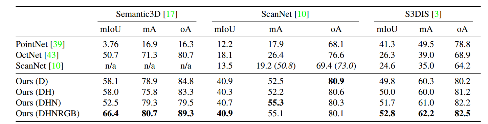

其中，评价指标常用的识别和分割指标为： mean accuracy over classes (mA), mean intersection over union (mIoU), and overall accuracy (oA) 。distance from tangent plane (D), height above ground (H), normals (N), and color (RGB)    

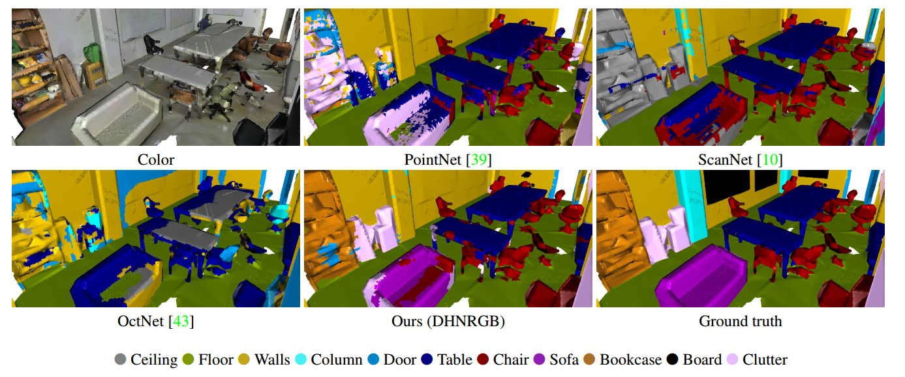

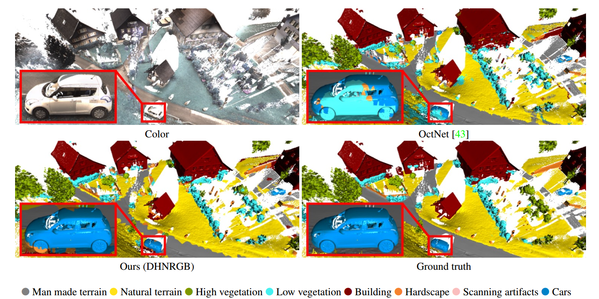

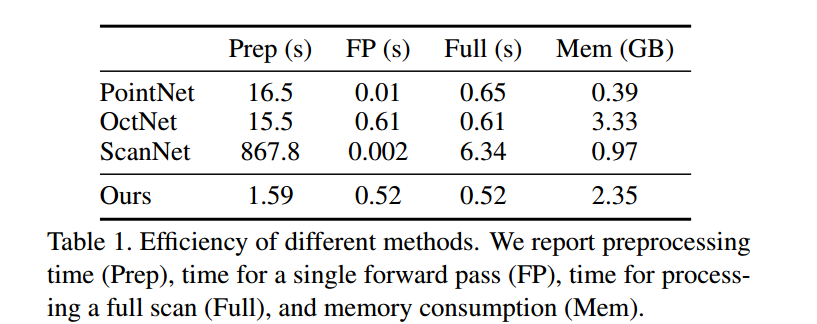

可以看出，所提算法在预处理和前向计算中效率最高。

 