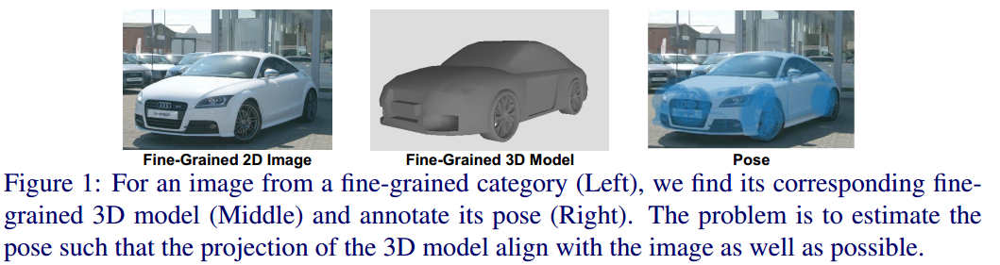
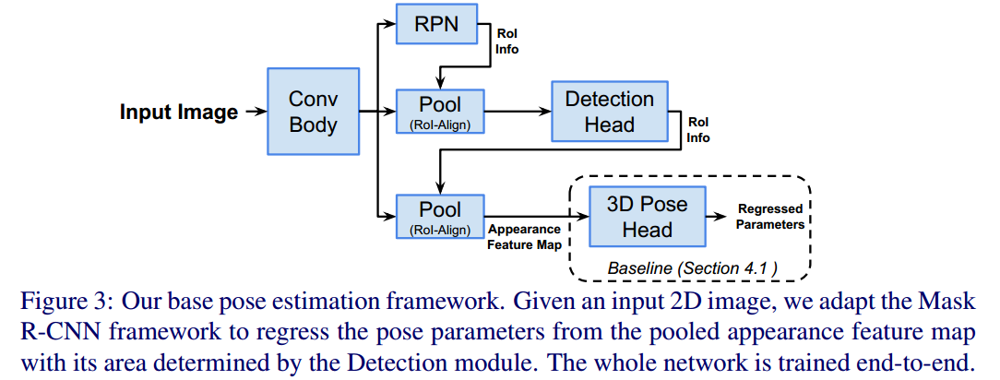
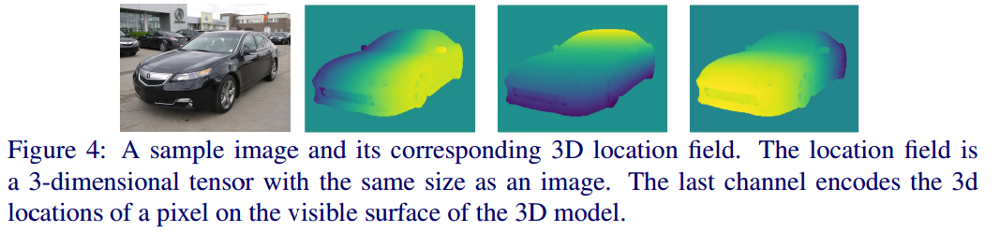
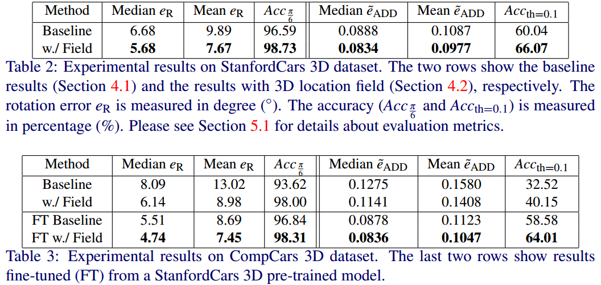
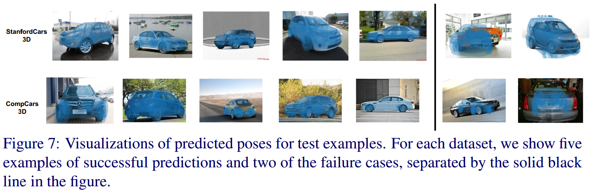

## 3D Pose Estimation for Fine-Grained Object Categories

论文地址：https://arxiv.org/abs/1806.04314

### 1 创新点

​    (1) 发布了一个全新的细粒度物体姿态估计数据集

​    (2) 对目前流行的自动驾驶相关数据集StanfordCars and CompCars使用细粒度3D CAD模型进行增强，扩充数据集

​    (3) 通过细粒度3D CAD模型，作者提出定位场(location field)的概念来辅助姿态估计，整个网络和deep-6d-pose非常相似

### 2 核心思想

​    本文是百度和马里兰大学联合发布的CVPR2018文章。作者指出本文提出的目的是当前姿态估计都是通用的物体，并没有一个细粒度姿态估计的数据集，所以作者提出了一个新的数据集，并扩展了两个数据集，并在新数据集基础上提出了一个姿态估计算法，用于细粒度姿态估计。  

   本文姿态估计的目的是：仅仅依靠2d图片和标注精细的3d cad模型，网络直接预测出姿态参数，而不是2d/3d关键点。作者基于mask rcnn进行扩展，指出如果直接新增pose分支，预测精度是不高。因此本文提出3d定位场概念，其是一种新的3d密集表示方式，将每个像素映射到模型表面上的3D位置上，作者指出，这种表示方式可以提供强有力的监督方法来促使网络学习到物体的3d shape。需要特别说明的是该分支的训练是采用合成数据，但是并不是渲染cad模型得到的，所以不会出现现实场景和仿真场景的gap。

​    论文花了很大篇幅讲述新数据集是如何从网络下载、参数是如何标注的？有兴趣的可以自行阅读原文。

### 3 网络结构

​    给定任意一张2d图片和3d cad模型，为了达到全视角姿态估计(物体的姿态掩码完全覆盖车体)，网络训练要学习7个参数：相机焦距f、主点坐标(u,v)、方位角、仰角、面内旋转角和高度d。当然这7个参数是有label的。需要说明的是：作者所提网络是要回归焦距、主点坐标的，而我们的场景不需要，这是因为作者的数据集图片是网络下载的，场景是不固定的，焦距也是不一样的，所以7个参数都需要回归出来，适用场景更广泛。

​    上图是整个网络结构图。虚线以外部分就是mask rcnn结构，作者提出了一3D Pose Hea结构来归7个参数。

#### 3.1 基线网络

​      作者回归的7个参数要进行转化，具体为：回归4元数代替方位角、仰角、面内旋转角，主点坐标预测是基于ROI中心的偏移，深度d和焦距f直接回归。pose 分支是有全连接层构成，损失函数是smoth L1。到这里为止，整个网络和deep-6d-pose差别不大。其中基线网络是为了和后面的改进网络进行区分而命名。

#### 3.2 3D定位场改进姿态估计精度

​    3d 定位场是将每个前景像素映射到3D模型表面上的相应位置，得到的结果是3通道、和原图大小一样、分别包含了X，Y和Z坐标即$f(x;y) = (X;Y;Z)$。

​    三个通道的定位场具体如何生成，论文没写。

​    具体网络设计是：3D Pose Head保持不变，3D Field Head中，利用3d定位场分支代替原始mask rcnn中的mask分支，3D Field Head用于回归3个通道的定位场，然后经过卷积层和全连接层也输出Pose参数(该分支仅预测4元数)，最后和3D Pose Head的预测姿态参数进行组合，得到最终姿态。论文没写如何组合生成最终的Pose。

​    从上图可以看出：由3d定位成预测输出pose，是采用合成数据训练的，数据来源于3d cad模型和预设的多个pose。作者指出(1) 3d 定位场数据是自己使用3d cad模型和姿态生成，没有render步骤，所以不存在现实场景和合成场景的gap；(2) 定位场是对颜色、纹理和图片尺度不敏感的。

​    整个代码是在facebook的 Detectron平台上实现。

## 4 实验结果

可以看出，使用了定位场后，精度有所提升。

可以看出，有几个物体的估计完全错误了，这种是直接回归pose，例如deep-6d-pose方法存在的固有缺陷。作者指出失败案例原因是训练集没有足够多的该姿态图片。

​    总结：**从整个论文来看，应该算是基于rgb图和rgb-d图的一种折中方案**。仅仅依靠2d信息来估计3d姿态，存在必然的精度缺少，但是在不存在深度图的情况下，是否可以利用3d cad模型提升性能，因为3d cad模型本身带有3d信息。本文的方案可以认为是一种基于rgb图片和3d cad模型来提升姿态精度的尝试。

​    