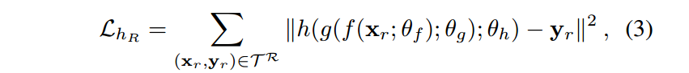
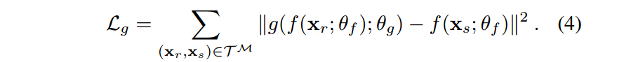
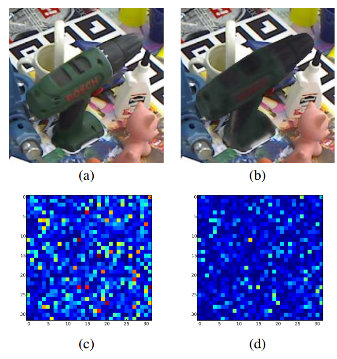
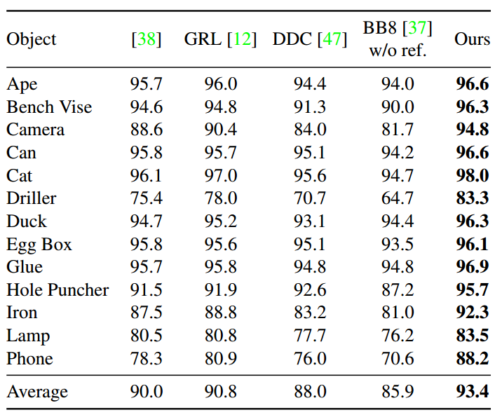

# Feature Mapping for Learning Fast and Accurate 3D Pose Inference from Synthetic Images

论文地址：https://arxiv.org/abs/1712.03904

## 1 创新点

   将domain adaptation方法应用到6d姿态估计领域，提出一种利用合成数据训练网络，极度快速、精度高的姿态估计算法。

## 2 核心思想

​     最近，exemplar-based的domain adaptation方法可以将真实场景中图片的特征映射到合成数据的特征中，从而消除gap，模型可以表现出极高的性能和泛化能力。基于该思想，作者将上述理论迁移到6d姿态估计中。

​    作者指出6d姿态估计任务和普通的2d分类、检测任务不同，实际场景数据获取和label标注非常困难和耗时，所以应该优先考虑合成数据。整个网络设计原理和思想都非常简单，下面直接分析实现。

左图是BB8结果(BB8论文的端到端算法实现就是yolo-6d论文)，右图是作者所提算法结果。

## 3 网络模型

### 3.1 网络结构

​    

​     模型输入可以是rgb图片，也可以是深度图。

​     整个网络包括3个网络，分别是特征提取网络f，特征映射网络g和姿态估计网络h。需要说明的是整个网络是端到端的，3个网络同时训练。由于网络非常简单，网络前向步骤速度可以达到300fps。

​    **(1) 特征提取网络f**

​    特征提取网络作用是提取合成数据和实际场景数据的特征。其基础部分是VGG-16，且仅仅使用前10个卷积层，后面再连接两个1024节点的全连接层。特征提取网络f的输入包括大量合成数据和少量实际场景数据。

   **(2) 姿态估计网络h**

​    针对开源的linemod数据，作者设计的姿态估计网络h仅仅包括1个全连接层，输出节点是16，分别表示8个控制点坐标。最后使用pnp算法估计出6d pose。注意网络输出的8个控制点坐标是相对于图片的绝对坐标。可以看出网络结构非常简单。姿态估计网络的输入包括大量合成数据和少量实际场景数据。

​    **(3) 特征映射网络g**

​    特征映射网络g仅仅包括2个残差块，如图中所示。需要注意的是特征映射网络的输入是1对相同尺寸、相同姿态的数据，一个是实际场景数据，一个是完全相同姿态合成的仿真数据，网络学习的目的是将实际场景图片所提取的特征映射到合成数据所提取的特征中，所以梯度更新时需要利用合成数据的特征。    

### 3.2 Loss设计

​    设$T^S=\{(x^S_i,y^S_i)\}_i$ 为合成图片和相应的label， $T^R=\{(x^R_i,y^R_i)\}_i$ 为实际图片和相应的label ，$T=\{T^S,T^R\}$,$T^M$表示实际场景图片中的数据，用于训练特征映射网络g。

   整个网络的loss可以定义为：

超参：$\beta=1,\gamma=0.2$。

​    第一部分loss定义为：

$L_{h_S}$是指仅仅使用合成数据训练特征提取网络f和姿态估计网络h。注意这里没有使用实际数据。由于合成数据可以是无限的，所以这两个网络可以训练的非常好。  

​    第二部分loss定义为：  

$L_{h_R}$是值仅仅使用实际场景数据训练特征提取网络f和姿态估计网络h。作者没说这部分Loss是否会影响特特征映射网络g，个人理解应该是没有改变g，因为第三个分支在同步训练。

   第三部分Loss定义为：

$L_g$是特征映射网络的Loss，仅仅使用实际场景数据训练特征映射网络g。但是其label来自合成数据的特征。

​    整个网络的3个Loss同步进行，可以实现端到端训练，优化器选择ADAM。

​    在测试阶段：给定任意一张实际图片，经过如下网络得到最终的姿态：

### 3.3 数据生成

​    合成数据$T^S$在线一共生成500w张图片和对应的label。合成数据生成规则和我们的代码一致，即在一个预设的球面上均匀采样。面内旋转角度范围是[-45°~45°]，距离是[65cm～115cm]，在linemod数据中选择cad模型，背景是随机从imagenet中选择。对合成数据不进行其他操作，例如不进行饱和度修改、高斯噪声添加等数据增强操作。作者特意说明的目的是为了和后面额训练数据增强区分。

​    对于实际数据$T^R$,采用了各种增强操作。对图片进行随机小范围图像中心平移后，对要估计姿态的物体进行轻微尺度缩放，然后从imagenet随机选择图片作为背景，大部分操作和BB8论文或者说yolo-6d论文是一致的。

​    以上操作都是在线进行。

## 4 实验结果

   为了保证收敛性，作者实际上是先仅仅使用合成数据进行预训练，预训练的网络是f和g，然后才采用联合训练方式。    

​    以上所示中(a)为实际场景数据，(c)为对实际场景数据提取特征后，计算合成数据和实际场景数据的差距；(b)是合成数据，(d)为实际场景特征进行g特征映射后结果与合成数据的差距，可以看出g去除了较大的差异，迁移效果较好。

如上表所示，计算的是2d 投影准确率，其中[38]是cvpr2017提出的一种迁移算法，GRL和DDC是较早的迁移算法。BB8是没有ref的结果。可以看出，所提算法精度是最高的。yolo-6d的结果是90.37。

上表是使用深度图ref的结果。可以看出精度都是最高的，结果也会比yolo-6d更好一些。

从上表可以看出，作者所提算法和BB8比较，仅仅使用BB8的0.5倍真实场景图片就可以达到同样的精度。

​    整个代码是使用tensorflow实现，硬件环境是：Intel Core i7 3.30GHz ，Geforce TITAN X。输入一张实际场景图片，输出预测结果仅仅需要3.2ms，非常快，接近300fps。证明了所提算法的高效性。

​        