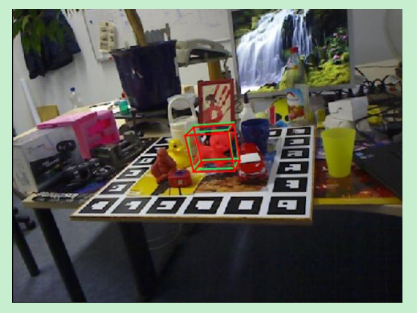
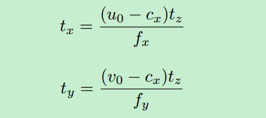
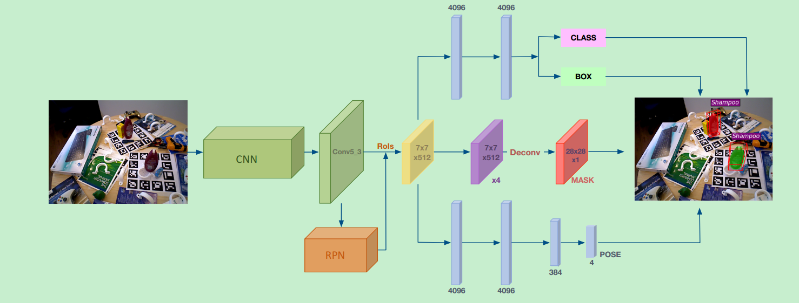
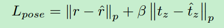
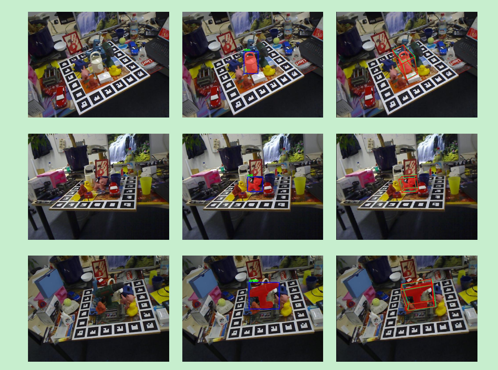

# 基于Mask RCNN的3D目标检测：deep-6d

阅读本文需要对Mask RCNN有所了解，不了解的请看我写的文章：

https://zhuanlan.zhihu.com/p/37998710

在上篇yolo-6dhttps://zhuanlan.zhihu.com/p/41790888中已经讲了如何通过物体的3D bounding box在2D图像上投影的8个角点和一个中心点来评估物体的6d姿态，这是一种将3d问题转化为2d问题来解决的思路。但deep6d提供了另外一种思路，直接回归6d pose，非常简单暴力。下面详细介绍这种方法。

## 为什么要基于目标检测框架？

在正式讲deep6d之前，我们先思考一个问题：很多6d姿态估计的方法都是基于2D图像的目标检测框架，为什么要这么做？

我的看法是：目前主流的目标检测方法都是基于多目标检测设计的，而6d姿态估计也涉及多目标，并且也是基于2D图像来进行预测的，只是目标检测预测的目标是xywh，而6d姿态估计预测的是xyzuvw（平移和旋转），因此基于目标检测框架来进行姿态估计也是非常自然的选择。

## 怎么表示物体的旋转？

这部分是立体视觉的知识。如果对这部分不了解的可以跳过，只要知道，一个物体的旋转可以用一个**三维向量**来表示就好了。

3D空间中物体的姿态可以用旋转矩阵R和平移向量t来表示。直接回归t没有问题，但是直接回归旋转矩阵R就比较麻烦，因为旋转矩阵需要满足单位正交的条件，网络回归的结果很难满足这种限制，因此需要考虑用其他方式来表示旋转。

表示旋转有几个选择：

1.  欧拉角
2.  旋转矩阵
3.  四元数
4.  旋转向量

**欧拉角**的表示最为简单，也很容易理解，用一个三维向量来表示旋转就好了。但欧拉角有一个问题，同一个角度可以有多种表示，比如1度和361度实际上是同一个角度。除此之外还有万向锁的问题。所以欧拉角不是一个好的选择。

**旋转矩阵**也是一个选择，但是旋转矩阵的自由度实际上是3，用一个3x3的矩阵来表示旋转显然是多余的。除此之外，旋转矩阵需要满足单位正交的限制，如何在训练目标中加入这个限制条件也是一件难事。所以直接回归旋转矩阵也不是一个好的选择。

**四元数**就是用一个四维向量来表示旋转，具体什么是四元数这里就不讲了，有兴趣的请查阅其他资料。但是四元数需要满足一个限制，就是这个四维向量必须是一个单位向量。你很难让网络吐出来的结果满足这种限制，因此四元数也不是一个很好的选择。

总之，以上表示方法都有缺点，因此作者就考虑使用一种新的表示方法：旋转向量。旋转向量用一个三维向量的方向来表示旋转轴，用该三维向量的模来表示旋转的角度，所以没有上面的问题。

## 怎么表示平移？

以上讲解了如何表示旋转，现在还要关心的是如何表示平移xyz。直接预测xy是不容易的，考虑这样一种情况，如果两个物体的z大小一致，但是xy不太一样，这样将3D物体投影到2D图像上之后，从图像上看表面非常相似，大小也相似，只是会在图片中的不同位置。因此很难通过2D图像中的物体来预测xy。因此作者提出通过目标检测得到2D bounding box的中心坐标，由这个中心坐标映射到相机的坐标系就可以得到xy坐标。具体如下：

其中 ， (u0,v0)是2d边界框的中心点坐标， (cx,cy)是相机内参。注意：上面原图的第2个公式中写错了，应该是cx->cy

## 模型

知道了如何表示旋转和平移，实际上就知道了模型的训练目标，基于此就可以设计模型了。

模型的架构和mask RCNN是一致的，如下图，只是多了一个pose预测分支。我们先来分别看每个分支。

class和box分支：这两个分支是公用一个head的，共用一个head代表分类和回归任务之间的gap比较小，本质上做的事情很像，所以可以共用一个分支。

Mask分支：mask分支和MaskRCNN的网络设计是一样的，唯一不同的是，输出的mask是与类别无关的，只是一个二值mask。而Mask RCNN中，mask的预测是和类别相对应起来的。为什么要这么做？我觉得这是因为mask预测在6d pose预测中是一个很必要的东西，但作者仍然保留下来。既然没什么用，但还保留下来，好吧，那就减少mask预测的复杂度，不管对于哪一类物体，只要预测mask就好了。

Pose分支：pose分支是本文新增的分支。与mask分支不同的是，pose预测是和类别有关的。也就是说每个类别的物体，都会对应一个pose预测。因此pose预测的输出维度是4×num_class。为什么这么做？我觉是因为pose我们的最根本任务就是预测pose，那么我pose预测针对每个类别来做，会更专业化，效果也会更好。这种做法在很多论文里都有这么做。

那么，网络的损失计算就包括了四个方面，总结如下：

分别包括分类，box回归，mask和pose损失。其中需要特别注意的是pose分支的loss：

这里将rotation和z分开算了，前面的系数表示它们的权重，言下之意就需要分别对待旋转和平移。

## 实验

具体的实验结果这里不多说了，这里看一下实验的一个可视化结果：

## 总结

这种通过直接回归6D姿态的方法非常直觉，也很简单，但这类方法想要很好地work的一个重要条件就是，2D图像的变化和6D姿态的变化要能够match，比如说，一个2D图像只有一个轻微的变化，但6D姿态可能变化很大，这种情况是很难让网络学习好的，除非我们有足够的数据进行训练，否则很容易过拟合。直接回归6D姿态应该此前就有人想过，但是可能效果不太好，而这篇文章则验证了直接回归6d姿态也是一个可行的方法，可以说是提供了一种新的思路。