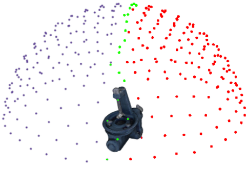
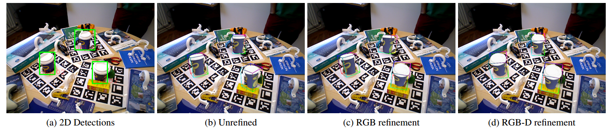
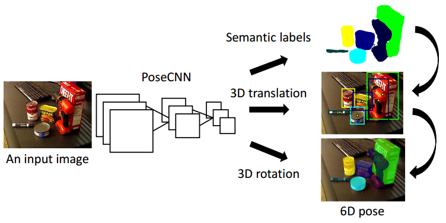
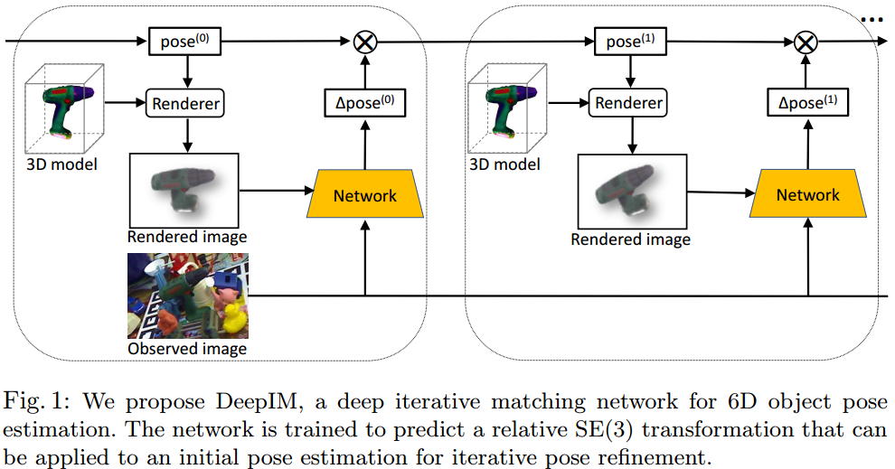
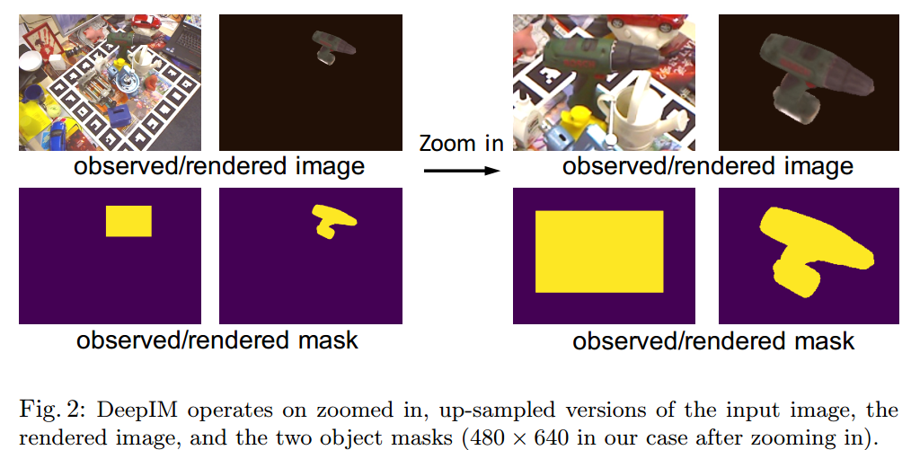
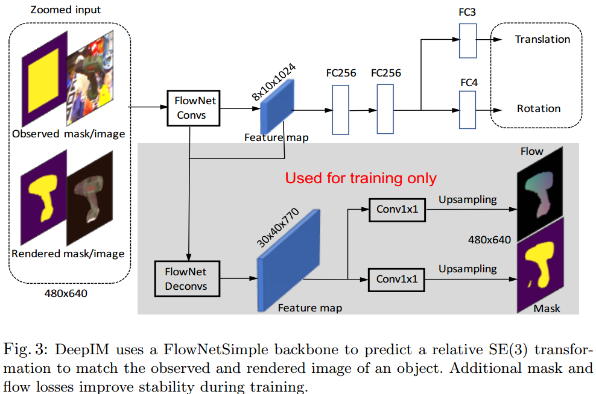

# 6D 姿态估计论文梳理

## 1 Deep-6DPose

### 1.论文标题

​    Deep-6DPose: Recovering 6D Object Pose from a Single RGB Image [18.02]

### 2.论文概述

​    输入为RGB图片，作者提出一种端到端的学习框架Deep-6DPose，能够从单张RGB图片中同时进行目标检测、分割和6D姿态估计。作者是在当前优异的Mask RCNN基础上扩展了一个6D目标姿态的回归分支，在不需要后处理的基础上直接训练，达到了当前最好水平。本文的核心创新点是：**引入了一条全新的6D姿态回归分支，并且将姿态参数中的平移和旋转解耦输出，不直接训练旋转矩阵，而是通过引入李代数将问题转化为无约束，更容易训练的问题，同时Loss也相应的改变**。最终验证是在两个广泛应用的数据集上测试：Hinterstoisser和Tejani，结果表明前向速度可以达到10fps，精度超越了SSD-6D，BB8和Brachmann。

## 2 SSD-6D

### 1.论文标题

​    SSD-6D: Making RGB-Based 3D Detection and 6D Pose Estimation Great Again [17.11]

### 2.论文概述

​    本文没有把姿态估计问题看成是回归问题，而是从传统方法着手，把姿态估计问题转化为类似于模板匹配的分类问题。具体思路是：首先对训练数据建立姿态假设池( a pool of 6D hypotheses )，也就是说把姿态估计问题转化为离散空间的分类问题，姿态假设池是通过上半球空间上的Viewpoint ID、in-plane rotation ID和object ID确定，如下图所示：

​    假设池包括了物体的所有姿态假设。然后对假设池包括的数据进行SSD训练，SSD网络结构如下：

​    其他地方和原始SSD区别不大，主要是换了基础网络，最重要的修改部分是输出：(4+C+V+R)*每个尺度。C是分类ID，V是视图ID，R是面内角度ID，可以看出想要尽可能覆盖整个上半球，那么V和R的个数就不能太少，否则假设池建立就不完全。但是如果太多，计算量就会很大，实际需要根据数据集进行平衡。

​    在网络训练好后，对于任意一张图片，经过SSD-6D网络后就可以输出(4+C+V+R)*n个尺度的通道，下面开始进行Pose refinement 操作。首先过滤掉一些概率分值小于阈值的C 、V和R通道，保留一些比较可信的结果，然后利用C、V、R和2D边界框值建立精细的假设池，如图所示：

​    左边图是2D平面图，右边是利用SSD输出结果建立的假设池，可以看出，目前，一个物体估计了好多种姿态。在论文中作者指出：给定了viewpoint ID和 in-plane rotation ID 很容易既可以计算得到3D旋转矩阵，然后再利用2D边界框值，很容易计算得到3D平移向量(我不知道咋算的？)。

​    对于RGB数据，作者使用了IRLS(迭代重加权最小二乘)算法，最终确定最优的姿态。如果是RGB-D数据，可以将点转化为点云数据，然后使用ICP进行精确匹配。以上两种算法都可以运行多次，不断得到更精细的结果。作者指出Pose refinement非常重要。下面是示意图：

​    下面给出Pose refinement重要性图示：

可以看出，如果不采用refinement，那么其实精度是很低的，优化过后，效果有明显提升。但是依然可以看出仅仅使用RGB数据的结果和使用RGB-D数据的结果差距甚远，还有很大的优化空间。

## 3 PoseCNN

### 1.论文题目

​    PoseCNN: A Convolutional Neural Network for 6D Object Pose Estimation in Cluttered Scenes [17.11]

### 2.简要介绍

​    输入图片为RGB，作者重新构造了一个卷积神经网络，而没有借鉴经典网络，整个网络如图所示：

​                                                                                              图 简要结构

​                                                                                       图 网络详细结构

​    整个网络分为2个部分，第一部分是基础网络，包括13个卷积层和4个pool层，第二部分是三个不同的任务分支，第一个分支是语义分割分支，作者指出预测掩码比预测边界框更好，其可以提供更精细的结果，对付偶现物体也更好；第二个分支是3D translation分支，作者并不是直接预测相对于摄像头坐标系的三个坐标分量，而是通过预测2D目标的坐标中心和物体距离摄像机的距离，然后通过数学换算即可得到3D translation坐标，具体操作非常复杂；第三个分支是3D rotation分支，首先利用前两个分支的结果得到目标的边界框，然后提取ROI进行卷积和FC运算，最后得到每个类别的4元数(在计算机图像学中，常用**单位**四元数（**unit **quaternion）来表示三维空间的旋转（rotation）及定向（orientation），具体见https://www.zhihu.com/question/23005815)，基于4元数可以直接换算得到3D旋转矩阵。为了处理对称物体，因为对称物体在不同的角度可能会产生相同的观测投影，作者提出一种全新的损失函数作用于4元数上。训练数据集采用LINEMOD dataset，也就是Hinterstoisser提供的数据集，自己制作的YCB-Video Dataset和OccludedLINEMOD Dataset。

## 4 YOLO-6D

### 1.论文题目

​    Real-Time Seamless Single Shot 6D Object Pose Prediction [17.11]

### 2.论文概述

17.11月出品论文。本文主要从实时6D姿态估计入手进行改进，为了加快速度且精度不丢失太多，作者使用了YOLO作为基础网络，最终在Titan X GPU上达到了50fps。作者首先讲述了以前论文例如BB8和SSD-6D存在后处理步骤过多，无法端到端训练，导致速度非常慢的不足，而提出一种直接3D目标边界框在2D图像上的投影值，然后使用PnP算法即可恢复6D姿态。网络图如下：

​    可以看出网络结构和YOLO几乎一样。首先输入一种RGB的彩色图片，然后划分为n×n的网格，哪个网络中心有物体，就那个网格负责预测目标，和YOLO的输出不同，这里输出是$1*1*(9*2+1+C)$个通道，其中9x2是指3D目标在2D图像上的边角投影点，8个边角坐标再加上一个物体中心坐标一共9个坐标，1+C是包含背景的类别分类概述输出值。可以看出，思路非常简单，但是有个前提要求：需要知道3D物体的空间shape，并将其转化到GT中。相对于BB8和SSD-6D来说，没有复杂的后处理阶段。如果采用后处理的化，可以进一步提高精度，但是速度只能维持在10fps左右。训练数据集是LineMod数据集和OCCLUSIONLineMod数据集。通过实验可以看出：如果SSD-6D不进行后处理，那么本文所提算法明显优于SSD-6D，但是如果SSD-6D进行后处理后，依然是SSD-6D效果更好。

## 5 DeepIM

### 1.论文标题

​    DeepIM: Deep Iterative Matching for 6D Pose Estimation [18.04]

### 2.论文概述

​    本文提出一种pose refinement方法，达到了当前最好水平，并且可以实现采用RGB图片进行6D姿态估计和采用RGB-D图片进行6D姿态估计一样好的效果。意义重大，然而该算法的缺点是需要不断迭代，无法进行实时处理。论文写的比较复杂，涉及到很多其他领域知识。

   作者首先阐述了目前基于CNN模型进行6D姿态估计算法的不同思路，然后得出结论：仅仅RGB图片进行6D姿态估计情况下，要想到达和RGB-D图片一样好的效果，需要采用pose refinement方法。然后引入作者所提的pose refinement方法：给定一张待测试的RGB图片和一个初始的姿态估计值，利用初始的姿态估计值，通过render得到一张render图片，然后采用所提光流网络预测relative SE(3) transformation ，目的是用于计算render图片和测试图片的匹配度。基于上述步骤，可以得到一张改善后的render图片，然后不断把改善后的render图片和测试图片迭代输入网络，最终可以使得render视图图片和测试图片越来越像，最终得到精确的6D姿态。作者论文使用的初始姿态值是通过PoseCNN计算得到的，整体结构如下图：

​    具体操作步骤如下：

 **(1) High-resolution Zoom In**

​    作者指出，如果图片非常小，那么很难提取到特征进行匹配，为了能够获得足够多的信息进行姿态匹配，作者将输入的4张图片全部进行放大，然后crop，具体操作见下图：

**(2) Network Structure**

​    网络的输入是4张图片，分别是render image和test image，一共6个通道，render mask和test mask一共2个通道，将这8个通道的值进行concatenated操作，然后输入到网络中，网络结构如下图：

​    其中FolwNet是来自论文：Flownet: Learning optical flow with convolutional networks，该网络可以预测两对图片的光流，作者也尝试用VGG-16作为基础网络，结果发现效果很差，进一步说明了预测光流对姿态匹配的重要性。灰色部分网络是辅助网络，应用使得网络训练更平稳。

**(3) Untangled Transformation Representation**

​    这一步是利用网络输出的relative SE(3) transformation 值然后计算得到真正的6D姿态

**(4) 损失函数**

​    作者指出如果对于3d旋转和3d平移分别设计损失函数，那么会存在两者权重不好设置问题，借鉴geometric reprojection loss 思想，作者提出一种新的改进版的geometric reprojection loss 叫做 Point Matching Loss，该损失函数可以衡量姿态匹配程度。

## 5.iPose

### 1.论文标题

​    iPose: Instance-Aware 6D Pose Estimation of Partly Occluded Objects [17.12]

### 2.论文概述

​    本文是第一篇专门对付遮挡物体的姿态估计论文。作者的思想非常简单，对于遮挡物体，如果直接采用端到端的处理方式会存在很多问题，那么实际上可以采用分阶段处理方法，每一个阶段专门处理某一个问题，等价于把复杂问题简单化。作者采用的分阶段处理方法一共包括3个步骤：第一步是对RGB图片进行实例分割，得到每个物体的mask，该步骤可以去掉背景，可以有效解决背景混乱和遮挡；第二步利用神经网络建立2D掩码图像和3D物体之间的像素级映射关系即object coordinates，使用的网络结果是编解码结构，通过这一步骤，可以消除物体的外观；第三步是利用几何优化算法，基于映射点计算得到6D姿态。

​    

**(1) Instance Segmentation**

​    对于实例分割，作者直接使用其他论文成果，例如Instance-aware semantic segmentation via multi-task network cascades和Mask RCNN，可以得到精细的实例分割图。为了使得结果更加稳定，作者采用了数据增强操作：object-centric data augmentation strategy，作者指出数据增强操作对于遮挡物体非常重要，直接影响后续算法精度。

**(2) Object Coordinate Regression**

​    作者使用的是编解码器结构进行2D像素和3D物体的映射。采用的论文算法是：Learning 6D object pose estimation using 3D object coordinates(ECCV2014)，这篇文章应该是第一篇使用CNN进行3D坐标回归的论文。

**(3) Pose Estimation**

​    作者采用的是：Uncertainty-driven 6D pose estimation of objects and scenes from a single RGB image. In: CVPR. (2016)论文算法，并配合RANSAC算法计算得到6D姿态。

## 6 BB8

### 1.论文标题 

​    BB8: A Scalable, Accurate, Robust to Partial Occlusion Method for Predicting the 3D Poses of Challenging Objects without Using Dep [17.03]

### 2.论文概述 

​    思想和第4篇几乎一样，或者说第4篇文章思想来自BB8

## 7 PoseAgent

​    PoseAgent: Budget-Constrained 6D Object Pose Estimation via Reinforcement Learning [16.12]

​    本文由德国德累斯顿工业大学（TU Dresden）与微软联合发表，主要通过强化学习估计物体6D姿态。传统姿态估计系统首先对物体姿态生成一个姿态假设池（a Pool of Pose Hypotheses），接着通过一个预先训练好的卷积神经网络计算假设池中所有姿态假设得分，然后选出假设池中的一个姿态假设子集，作为新假设池进行Refine。以上过程迭代，最后返回得分最高的假设姿态作为姿态估计的结果。

​    但传统方法对姿态假设池Refinement的步骤非常耗时，如何选择一个较好姿态假设子集作为姿态假设池就变得尤为重要。本文作者提出了一同基于策略梯度的强化学习算法来解决这个问题。该强化学习算法通过一个不可微的奖励函数来训练一个Agent，使其选取较好的姿态假设，而不是对姿态假设池中的所有姿态进行Refine。

​    首先给强化学习Agent输入一个较大初始姿态假设池，然后该Agent通过对其策略采样，选择一个新的强化学习池，并对其进行Refine。上述过程达到一定次数后，最后求得的姿态假设池中得分最高的姿态假设即为所求得姿态。实验表明该方法在大大提高运行速度时，还得到超出此前最佳算法的估计结果。

## 8 Global Hypothesis Generation for 6D Object Pose Estimation

​    16.12月发布。

