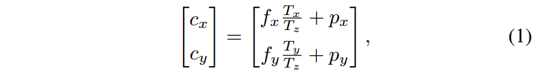
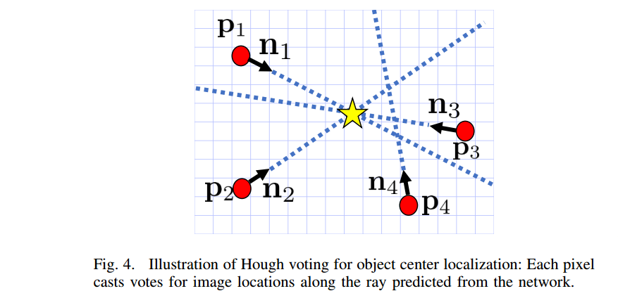
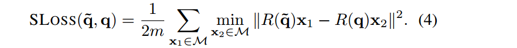
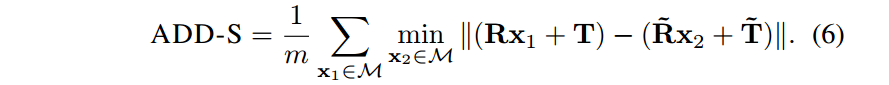
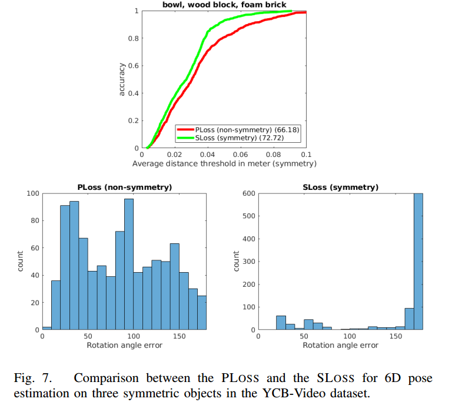
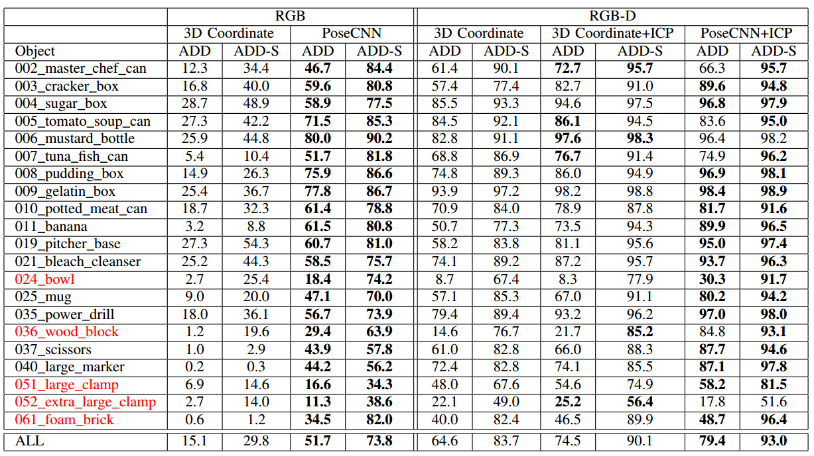
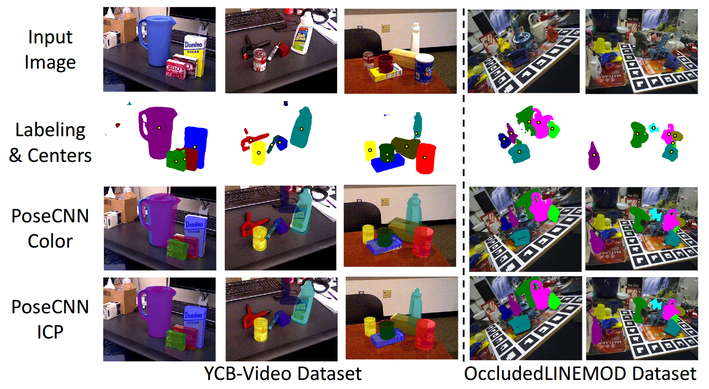

# PoseCNN

论文地址：https://arxiv.org/abs/1711.00199

## 1 创新点

​    (1) 将6d姿态估计问题解耦输出，其中通过四元数预测代表3d旋转矩阵，通过2d图片中心和距离摄像头距离预测代表3d平移向量

​    (2) 提出一个新的损失函数来对付对称物体姿态估计问题

​    (3) 贡献了一个新的数据集： YCB-Video dataset，包括21类物体的精确6d姿态

## 2 核心思想

​    本文核心思想就是将6d姿态估计问题解耦输出，简要图示如下：

​    (1) 对于输入的任意一种rgb图片，通过PoseCNN输出每个物体的像素级标签即语义分割

​    (2) 通过输出向量，预测物体在2d图片中的中心坐标，为了将预测出的中心坐标和物体一一对应，还需要使用上面的语义分割掩码，通过该掩码就可以一对一的确定每个物体的中心坐标

​    (3) 对于第三条3d rotation分支，首先对输入的图片进行前向运算得到特征图，然后基于前面两条分支可以确定每个物体所对于的边界框，利用该边界框对特征图进行ROI提取，对提取后的每个roi进行预测，输出四元数，表征该物体所对于的3d旋转矩阵

​    在6d姿态估计中，对称物体是一个比较大的挑战。因为对称物体在不同的姿态下可能呈现相同的观测结果，也就是说对于对称物体的二维图片，估计得到的姿态是不唯一的，这会导致姿态估计失败。传统的做法是：对称物体采用特殊的评价指标，并且在训练时候忽略对称性。这种做法会导致坏的训练结果，因为在对称物体出现时候Loss会突然增大(因为姿态估计可能完全错误)，导致loss不连续。作者提出一种新的Loss函数 ShapeMatch-Loss来解决该问题。

## 3 模型

​    **(1) 骨架网络**

​    骨架网络部分是由13个卷积层和4个最大池化层构成，结构是完全参考VGG-16，实际训练也是采用了VGG-16的预训练权重初始化

​    **(2) 语义分割分支**

​    不同于其他6d姿态估计方法，通常是采用目标检测的思路，例如ssd-6d等，而本文是采用语义分割思路，作者认为直接提取像素级语义可以提供比边界框更丰富的信息，更有利于处理遮挡和混乱场景。

​    从骨架网络中提取两个卷积特征图，其分辨率分布是原图的1/8和1/16，对这两个特征图都通过2个卷积层，统一缩减 通道数到64；对1/16的特征图使用反卷积层上采样为1/8，然后对相同尺寸的特征图进行add操作变成一个特征图；接着使用反卷积层进行8倍上采样，恢复到和原图一样大小；最后经过一个卷积层，最终输出特征图大小为原图大小，通道数为类别个数，该分支的损失函数是softmax 交叉熵。

​    **(3) 3d平移向量估计分支**

​    作者并没有采用直接输出预测3d平移向量的方法，作者认为这种做法通用性不好，因为物体可以出现在图片中的任何位置，同时无法处理当同一类别物体在图片中出现多次的情况。所以作者采用的方法是从图片中预测出物体的2d中心坐标和距离摄像头的距离，组成3维向量。假设物体预测的值是[$c_x,c_y,T_z$]，那么有：

$f_x,f_y$是相机焦距，($p_x,p_y$)是主点。通过上述公式就可以恢复3d平移向量[$T_x,T_y,T_z$]。

​    但是如果直接回归上述3维向量，其实是不work的，因为有可能物体存在遮挡，那么中心点就无法估计了。作者借鉴传统隐式形状模型算法(Implicit Shape Model,ISM)思想，回归图像中每个像素的中心方向。特别的例如图像中的像素$p=(x,y)^T$,回归以下三个变量：

分母是归一化操作，通过转化另一种输出，也可以得到($c_x,x_y$)。并且作者通过实验验证了这种形式更容易训练。

​    该分支的网络设计和语义分割分支没有太大区别，除了通道数以外，此处不再详述。网络输出是图片宽高、通道数为3x类别个数。损失函数采用L1 loss。

​    上述只是输出了所有结果，不过还没有确定每个物体的3d平移向量，所以作者新增了一个Hough voting layer，该层输入是语义分割结果和本分支的预测输出，接下来的操作是：对于每个对象类，首先计算图像中每个位置的投票分数。 投票分数表示相应的图像位置是该类对象中心的可能性。 具体来说，对象类中的每个像素都会增加沿网络中预测的射线方向的投票。 处理完对象类中的所有像素后，我们获得所有图像位置的投票分数。 然后选择对象中心作为得分最高的位置。 对于图像中可能出现同一对象类的多个实例的情况，将非极大值抑制应用于投票分数，然后选择分数大于特定阈值的位置。如下图：

​    在得到每个物体对于的中心坐标后，采用公式(1)即可最终确定每个物体的3d平移向量。

​    **(4) 3d旋转矩阵回归**

​    本分支的输入是roi，即对每个roi预测一个四元数。对骨架网络的两个特征图分别进行pool操作统一尺度，然后基于前两预测分支得到的边界框，使用roi-pooling操作提取roi，对每个roi都经过两个4096节点的fc层，最后输出4x类别个数的节点，然后将4元数转化为3d旋转矩阵即可。可以看出本分支的精度直接取决于前两个分支。

​    为了对付对称物体，作者首先引入了PoseLoss函数：

在3d模型空间中，计算正确的模型姿态和估计值建立的模型姿态的平均平方距离。$M$是代表3d模型空间中的点，$R(\widetilde{q})、R(q)$分别代表预测的3d旋转矩阵和真正的3d旋转矩阵。但是以上Loss是不能处理对称物体的。

​     基于以上函数，作者提出一种新的loss： ShapeMatch-Loss (SLOSS)，如下：

类似于ICP算法，该损失衡量估计模型方向上的每个点与真实模型上最接近的点之间的偏移。具体操作未知。

## 4 训练

​    作者采用的数据集是OccludedLINEMOD数据集以及自己所提出的YCB-Video数据集。评估准则是the average distance (ADD) metric ，计算方法是：

其中$R和T$是真正的旋转矩阵和平移向量，$\widetilde{R} 和 \widetilde{T}$是预测的旋转矩阵和平移向量，$m$是3d空间中的点数。如果ADD值小于预设的某一阈值，则认为估计的姿态正确。对于对称物体，采用以下评估指标：

​    作者的代码实在tensorflow上面训练的，通过VGG-16进行参数初始化，首先只训练语义分割和3d平移向量分支，训练到40k代后，再添加上3d旋转矩阵估计分支，然后在训练整个网络80k次。

​    在深度信息可以获得的前提下，作者对预测结果进行pose refinement操作，具体是使用ICP算法。

## 5 结果

### 5.1 旋转矩阵回归损失分析

​    可以看出：SLoss性能是由于PLoss的，通过统计直方图可以发现，对于对称物体，PLoss的旋转角错误个数，在不同角度时候几乎相同，符合均匀分布，说明此时网络对于对称物体是非常困惑的，在各个姿态角度下均会发生错误。而Sloss只在180度时候错误比较明显，因为此时无法正确估计姿态。

### 5.2 YCB-Video 数据集上结果分析

红色是对称物体。

