# SSD-6D

论文地址: https://arxiv.org/abs/1711.10006

## 1 创新点

​    (1) 基于SSD网络并扩展其功能,提出一种利用SSD网络进行3D目标检测和6D姿态估计算法

​    (2) 6D姿态估计问题,是一个关于顶点视图Vertex View的分类问题,而不是其他算法所采用的姿态回归问题

​    (3) 考虑实际图片采集不完全,故网络训练不采用实际图片,而是采用OPENGL渲染图片,可以避免数据的限制

## 2 核心思想

​    作者首先指出目前6d姿态估计常用方法中性能最好的方法是采用基于视图的方法。对于传统方法，该类方法首先在不同的顶点视图处生成一系列离散的物体视图 ，建立数据库，随后进行各种特征计算，例如SIFT，最后采用分类器对不同视图进行分类。在测试阶段，对于输入某一个角度采样的图片，进行特征提取，输出其离散空间位置，然后和训练阶段建立的数据库进行匹配，最终找到最佳姿态。本文也是采用类似思想。

​    基于视图的方法精度取决于以下几个方面影响：(1) 6d姿态空间的采样覆盖率；(2) 不同物体所提取特征的可区分度；(3) 匹配规则在混乱、遮挡、亮度变化情况下的鲁棒性。

​    对于以上所提(2)、(3)方面，传统方法存在不同的技巧，目前由于深度学习的快速发展，可以直接使用类似于SSD、YOLO等快速高精度目标检测算法进行处理，省去了较多步骤。故本文使用深度神经网络来直接代替传统方法中的(2)、(3)两个方面，并且和SSD算法的不同之处是:

​    (1) 训练阶段只使用合成的图片

​    (2) 将模型的姿态空间解耦输出，方便训练和处理对称物体

​    (3) 扩展了SSD模块，从而可以产生2d边界框和6d姿态结果

   作者强调了在存在pose refinement时候，只使用颜色信息而不用深度信息，也可以达到和使用深度信息一样的效果。

## 3 模型

### 3.1 网络结构

​    整个算法的流程是：输入一种rgb图片到网络；输出2d边界框、物体分类概率和解耦的viewpoint ID、In-plane rotation ID分数；使用映射关系建立6d假设池；最后通过pose refinement操作选择最好的6d姿态，对于pose refinement操作可以选择rgb图片，也可以选择rgb-d图片。

​    网络结构如下：

​    

​                                                                                       图 SSD-6D结构图

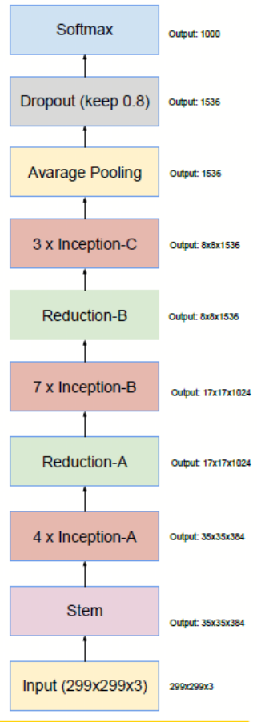

​                                                                                      图 Inception V4结构图

和原始SSD不同，此处使用的主干网络是Inception-V4，具体流程是：

​    (1) 输入图片尺寸是299x299x3

​    (2) 为了得到第一个分类预测特征图维度71x71x384，在stem模块前的最后一个pool层，引入一个额外的Inception-A模块，即可得到71x71x384特征图，同样的，在特征图大小为71x71x384的Inception-A模块、17x17x1024的Inception-B模块和9x9x1536的Inception-C之后也进行插入Inception-A模块

​    (3) 为了得到更大的尺度，对Inception-V4结构进行扩展，即在inception-v4的Reduction-B模块后面，新增加两个Inception-C模块，以得到5x5x1024的特征图；新增加一个Reduction-B模块、Inception-C模块以得到3x3x1024特征图

​    在6个特征图上进行分类和回归预测。对于每个尺度的每一个anchor，预测输出值都为(w，h，4+C+V+R)，6个尺度一共预测21222个anchor，输出维度一共(w,h,21222x(4+C+V+R))，其中w和h是对应尺度特征图大小，4是表示4个预测边界框值，C是类别格式，V是viewpoint ID，R是in-plane ratation ID，可以看出，V和R的个数不能太少，否则viewpoint sample不完全。

### 3.2 ViewPoint解释

​    本文涉及一个非常重要的基于view的分类观点，具体如下图：

​    viewpoint分类问题是指将物体的3d模型由连续空间离散化，变成离散空间，如上图所示。在离散空间内组成一个半球(一般只需要上半球)，半球中的任意一点都可以用4个自由度衡量，不同的衡量方式就可以定义不同的离散空间描述，描述可以是：(**PS：以下描述不一定完全正确，有个人理解成分**)

​    (1) Azimuth方位角， elevation仰角，distance距离和In-plane ratotion面内旋转角度

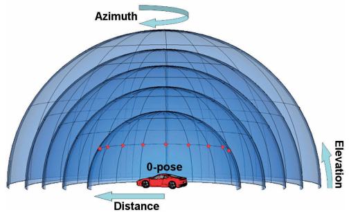

​    (2) 球坐标系和 In-plane ratotion面内旋转角度  

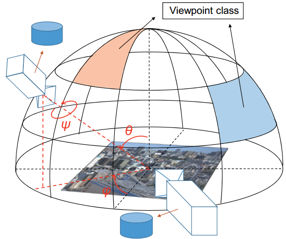

​    (3) 绕物体旋转角度0~360度，倾斜角度0~90度，缩放尺度(距离)和In-plane ratotion面内旋转角度  

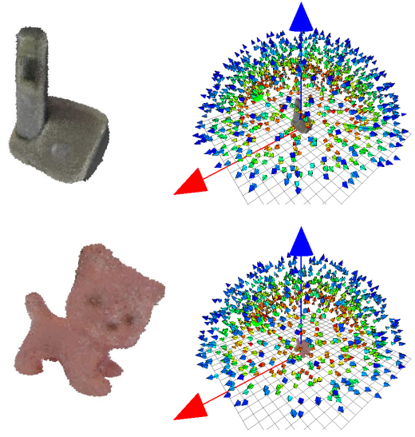

​    本文采用的离散手段是(3)-(暂无明显证据说明一定是(3))

​    在对3d模型进行离散化后，就可以得到整个物体在不同角度、不同距离下的viewpoint，基于该离散空间数据进行训练，每一个离散空间中点都认为是一个分类问题，假设viewpoint有300个点，那么就是类别数为300的分类问题。

### 3.3 损失函数

​    由于就是普通的分类和回归问题，损失函数比较好确定，难题是各个损失函数的权重。

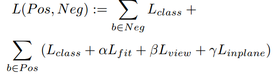

​    $L_{class}$ 是物体ID的分类损失函数，$L_{fit}$是边界框的回归损失函数，$L_{view}$是viewpoint ID的分类损失函数，$L_{inplane}$是in-plane ratotion ID的分类损失函数，对于分类损失函数使用的是交叉熵，对于回归损失函数使用的是smooth L1。三个权重都作者通过多次实验确定的，分别是$\alpha =1.5，\beta =2.5，\gamma =1.5$ 。

## 4 训练与测试

### 4.1 训练阶段

#### 4.1.1 数据生成

​    由于本文算法的特殊性，很难找到包含整个离散空间的图片，所以作者是自己通过3d模型渲染处理的虚拟图片。具体操作是：随机选择MS COCO数据集作为背景，然后使用opengl命令把单个物体的3d模型渲染到MS COCO图片上作为前景，对于渲染后的任意一张rgb图片，自己标注出边界框，如果渲染掩码和渲染后的边界框IOU大于0.5，那么该边界框标注为正样本。

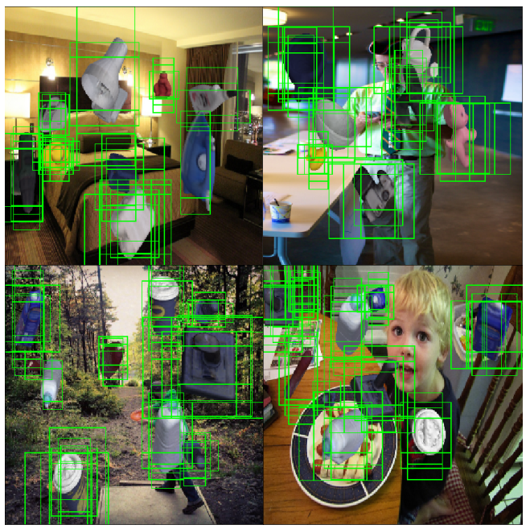

绿色框即为用于训练的正样本。

​    和原始SSD一样，对数据也需要进行各种增强操作，和原始SSD增强唯一不同的是此处不能使用flip操作，因为会带来视图混乱和错误的检测结果。训练结果依然采用ohem策略，保证正负样本比例是1:2。

#### 4.1.2 样本处理 

​    对于对称物体和视图模糊样本是需要进行特殊处理的，实际操作就是丢弃那些会引起混乱的样本。联系3.2节图形，在训练阶段，对于对称物体，只留下中心绿色点，对于半对称物体，只留下红色点。在测试阶段，也忽略掉一些视图的view id。(PS:具体实现不明)

#### 4.1.3 训练参数设置

​    作者的训练机器和软件是tensorflow1.0 c++版本、cuda5、i7、GTX1080。使用3个数据集进行评估： Tejani、Hinterstoisser、Hinterstoisser extend。Tejani数据集包含6个物体，存在杂乱和不同程度的遮挡；Hinterstoisser是应用最广泛的数据集，一共15个物体，存在大量混乱场景；Hinterstoisser extend是对Hinterstoisser的扩展，存在高度遮挡。

​    viewpoint个数是一个非常关键的参数，如果过少，采集的视点就过于粗糙，如果太多，则导致计算量过大，无法实时。作者通过实际测试，最终确定viewpoint点数是337点，in-plane ratotion点数是18(-45度～45度)。

​    网络采用微调模型进行训练，即主干网络不训练，直接使用预训练权重，只训练分类和回归的最后一层。优化算子是ADAM，固定学习率为0.0003，当合成的验证集表现收敛时停止训练。

### 4.2 测试阶段

​    (1) 输入一张299x299x3的rgb图片，经过nms后，网络输出一些优异的2d边界框、物体分类概率、viewpoint id分类概率和in-plane ratotion分类概率值；

​    (2) 从2d边界框中重建6d假设池。对于任何一个2d边界框，按照分类概率值大小排序，只保留特点数目，通过其对应的viewpoint id和in-plane ratotion id可以非常容易的估计姿态即计算得到3d旋转矩阵，而3d平移向量的计算方法不同，如下图所示：

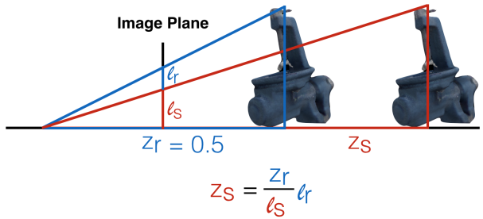

$z_s$是要计算的物体距离，$z_r$是质心距离=0.5m，$l_r$是预测得到的2d边界框对角距离，$l_s$是渲染得到图片边界框对角距离，采用上述公式即可得到物体距离，再结合相机内参、物体中心坐标即可计算3d 平移向量(PS:具体操作未知)。

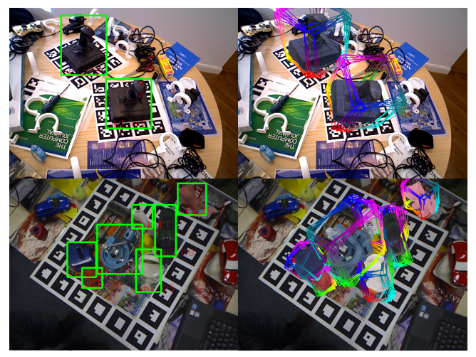

​    (3) pose refinement。在建立6d假设池后，得到的只是比较粗糙的姿态，需要进行后续优化。本文采用的方法是迭代重加权最小二次法，公式如下：

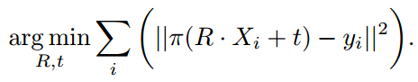

其中映射函数$\pi $，不知道是啥，具体实现未知。如果打算使用pose refinement，由于这是离线方法，个人觉得可以使用其他开源方法实现。

​    (4) 最终得到优化后的最佳姿态

## 5 结果

### 5.1 单物体场景

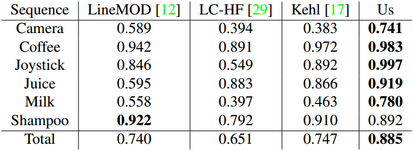

​    以上是单纯2d边界框检测的F1 分值表，可以看出，本文所提方法性能最佳。

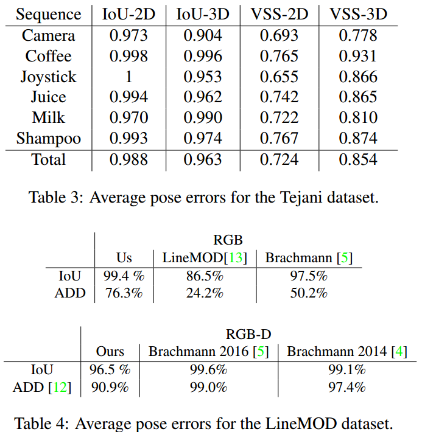

以上是平均姿态错误。

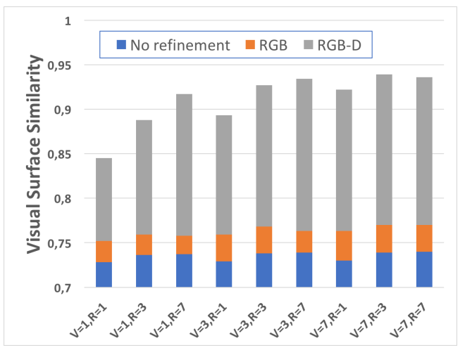

以上是选择不同的V和R，得到的VSS值。可以看出，即使是进行了Pose refinement，单纯采用rgb图片结果比采用rgb-d图片结果差别还是蛮大。

### 5.2 错误实例

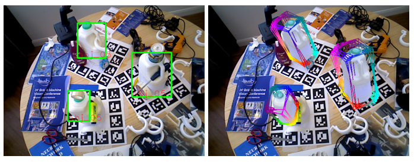

​    可以看出，明显估计错误。作者分析原因是(1) 合成图片和实际场景差距太大；(2) 边界框回归错误，如果不能提供非常贴近物体的边界框，那么6d假设池的建立就会出现偏差。实际解决办法可以使用更具贴近实际的增强操作以及更鲁棒性高的训练网络。

## 6 代码复现存在的难点

​    (1) 对于训练图片，作者实际上是自己使用opengl渲染的，没有提供数据和代码，存在一定难度

​    (2) 训练网络的ground truth，viewpoint和in-plane ratotion如何算？实际上肯定是在渲染图片并且进行viewpoint sample时候确定的，那么viewpoint sample如何做？ground truth如何得来？这部分难度很大

​    (3) pose refinement操作作者说的非常简单，具体如何操作，存在一定难度？当然目前可以不用即不进行pose refinement。

​    由于ssd-6d的作者提供了一部分前向的代码，目前可以知道如果得到了网络预测值，就可以计算得到6d假设池，然后选择最佳的一个姿态即可。

## 7 参考文献

[1] Model Based Training, Detection and Pose Estimation of Texture-Less 3D Objects in Heavily Cluttered Scenes

[2] Robust camera pose estimation by viewpoint classification using deep learning

[3] Learning 6D Object Pose Estimation using 3D Object Coordinates

[4] Viewpoint-Independent Object Class Detection using 3D Feature Maps

[5] http://cmp.felk.cvut.cz/sixd/challenge_2017/

[6] http://ptak.felk.cvut.cz/6DB/public/datasets/

[7] https://github.com/wadimkehl/ssd-6d

[8] https://github.com/thodan/sixd_toolkit