# yolo-6d

论文地址：https://arxiv.org/abs/1711.08848

## 1 创新点

​    (1) 提出一个单阶段、仅需要RGB图像、可同时进行目标检测和6d姿态估计的快速网络，在Titan X GPU上可达到50fps

​    (2) 6d姿态估计的做法是在当前姿态下，网络预测3d物体模型边缘构成的8个坐标点和物体中心点一共9个点在2d图片上的投影坐标，最终使用PnP算法(Perspective n point)计算出预测6d姿态。

​    本文思想来源于论文BB8: A Scalable, Accurate, Robust to Partial Occlusion Method for Predicting the 3D Poses of Challenging Objects without Using Depth，由于使用yolo网络，使其具备非常快的预测速度，同时作者指出如果使用post-processing，可以实现更高的精度，但是速度会下降到10fps。

## 2 核心思想

​    BB8是第一篇将CNN应用于6d姿态估计的论文，效果非常显著，但是其不是一个端到端的算法，分成好几个阶段，并且和SSD-6D一样，需要pose refinement。基于以上问题，作者采用BB8论文思想，但是网络进行了修改，在速度提升的同时也提高了精度(速度和精度的提高都是因为yolo，作者本文没有大改进)。

​    BB8预测6d姿态的核心思想就是不直接预测3d物体表面上点到2d图片的映射点的关系，因为这样复杂度太高，而是预测3d物体所构成的3d边界框在2d图片上的投影坐标点，如果网络预测得到2d图片投影坐标点后，就可以使用PnP算法(PnP求解算法是指通过多对3D与2D匹配点，在已知或者未知相机内参的情况下，利用最小化重投影误差来求解相机外参的算法，PnP求解算法是SLAM前端位姿跟踪部分中常用的算法之一，opencv可以直接调用api)直接得到3d旋转矩阵和3d平移向量。然而本文采用的是9个点，多预测一个物体中心点(我猜想是因为yolo网络的特点，需要一个中心点，而不是说有了中心点，重建的3d姿态会更准)。如下图所示：

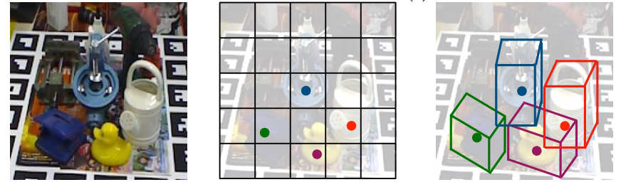

## 3 模型

### 3.1 模型结构

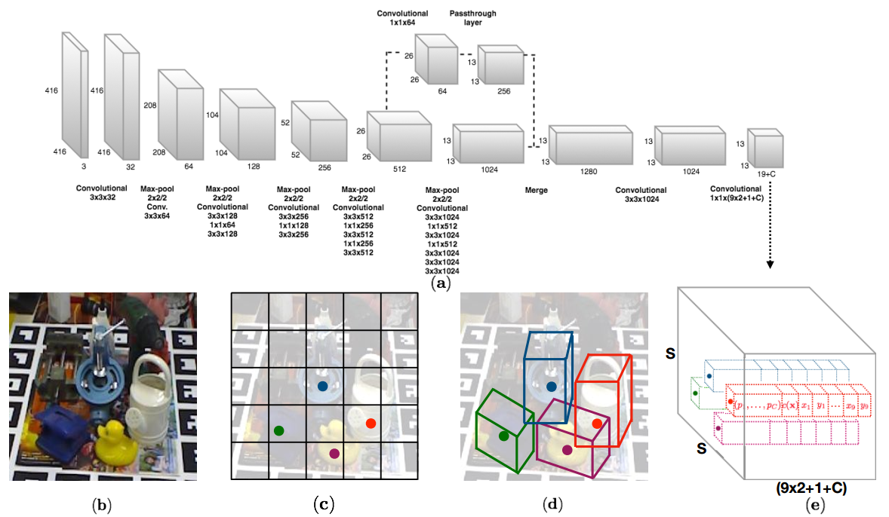

​                                                                           图 yolo-6d网络结构  

  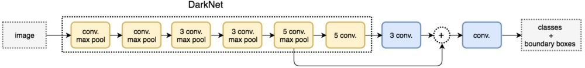

​                                                                           图 yolo-v2网络结构

​    本文整个网络结构是yolo-v2，如上图所示，但是训练策略不是完全按照yolo-v2的，而是作者自己设计的，后面会细说。yolo-v2是由基础网络darkNet-19和后续的头部网络构成，基础网络包括19个卷积+5个最大池化层，通过 passthrough方式将低层特征图直接快捷连接到高层特征图，由于底层特征图的高分辨率信息的融合，有利于目标检测。本文yolo-6d网络结构和yolo-v2几乎完全相同，唯一区别是最后一个卷积层的通道输出不同，yolo-v2是输出classes+bbox，而yolo-6d是输出classes+9个控制点坐标。

​    假设网络将图片划分为$S*S$个网格，那么输出维度是$S*S*D$，D是9x2+1+C，其中9是2d图片上的9个控制点，x2是x和y坐标，C是物体类别概率，1是confidence置信度。非常容易理解。因为很有可能多个物体靠的很近，此时一个cell预测一组2d坐标值肯定是不够的，故yolo-v2引入了anchor机制，同样yolo-6d也引入了anchor，所以作者网络的实际输出并不是上面那个，而是$S*S*[anchor\_num*(9*2+1+C)]$，作者设置的anchor_num=5，5种anchor的设置和yolo-v2一样，是采用k-mean确定。而$S$的值也不是固定的，需要根据输入图片的宽高实时计算，即最后一层特征图的宽高是多少，那么$S$就设置为该值即可，其实我们可以提前计算出来，因为最后一层特征图的宽高就是输入图片宽高的1/32，如果输入是416x416，那么S=13。

### 3.2 网络处理

​    在yolo-v2中，任何一个网格cell，输出的是bbox值和confidence置信度 ，其中confidence 表示cell含有物体的概率以及bbox的准确度($confidence=P(object)*IOU^{truth}_{pred}$)，由于本文算法没有直接预测bbox所以无法计算IOU，所以需要进行修改，如下图所示。

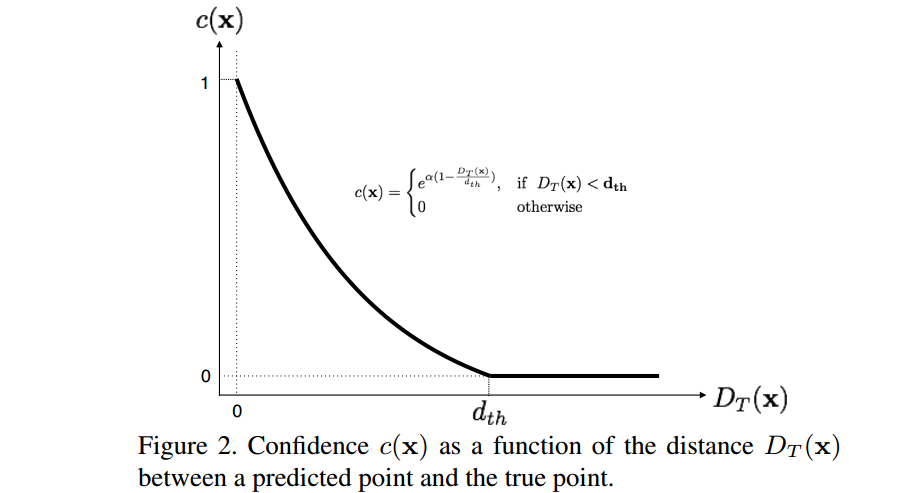

Confidence修改为c(x)，$D_T(x)$是预测的坐标值与真实值之间的欧式距离，$d_t$是提前设定的阈值30px，最终的c(x)是9个点的Confidence取均值，$\alpha$是超参，作者设置为2。从上图可以看出，当预测值与真实值越接近时候，c(x)值越大。

## 4 训练

### 4.1 训练策略

​     网络的最后一层的输出是$S*S*[anchor\_num*(9*2+1+C)]$,对于每个cell grid中的每个anchor输出物体所属类别概率值、9个控制点的平均confidence值和9个(x,y)坐标值。对于(x,y)坐标值需要特别注意：因为预测中心点一定在网格内，所以2d物体中心点坐标的输出预测值需要约束到0~1之间，但是其余8个点坐标是不能约束的，因为很可能在当前网格的外面，故具体实现是：

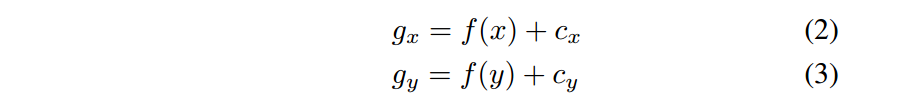

对于中心点，$f()$取sigmod函数，映射到0~1之间，对于其他8个点，$f(x)=x$即可，$c_x和c_y$是当前网格的归一化坐标值(例如网格大小是13x13，则(0,1)坐标处的cell的$c_x和c_y$就是(0,1))，这个设定和yolo-v2是一样的。

​    yolo-v2采用了多分辨率图片输入进行训练，yolo-6d也是一样，具体是从{320,352,...,608}集合中随机选择分辨率大小的图片进行训练，它们都是32的倍数，输入分辨率改变了，那么最后一层的输出网格个数也会随之改变，在计算ground truth时候也要改变维度。

### 4.2 损失函数  

​    损失函数定义为：

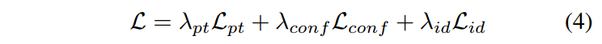

pt代表9个坐标点，conf代表置信度，id代表类别，前两个损失函数是均分误差，最后一个损失函数交叉熵。对于包括物体的网格，conf项loss的权重是5，不包括物体是0.1，其他loss权重设为1。可以看出这个loss其实和yolo-v1很类似，和yolo-v2是不同的(yolo-v2的损失函数定义非常复杂)。这个loss写的过于简洁了，为了方便理解，下面给出yolo-v1和v2的损失函数定义：

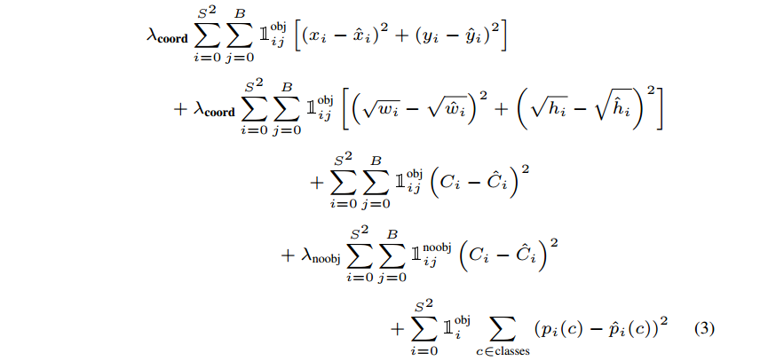

​                                                                             图 yolo-v1的loss定义

​    confidence和类别的loss设置和yolo-v1是完全一样的，但是由于yolo-6d没有bbox，所以只有$x_i$，而没有$w_i$部分的loss，并且由于引入了anchor，所以以上所有项都有再加上一层anchor的循环，就像下面的yolo-v2 loss一样。

​    说到anchor，就必须要说到anchor匹配规则，由于yolo-v2和yolo-6d论文都没有说这部分，参考其他资料应该是：对于某个ground truth，首先要确定其中心点要落在哪个cell上，然后计算这个cell的5个先验框与ground truth的IOU值，计算IOU值时不考虑坐标，只考虑形状，所以先将先验框与ground truth的中心点都偏移到同一位置（原点），然后计算出对应的IOU值，IOU值最大的那个先验框与ground truth匹配，对应的预测框用来预测这个ground truth；如果一个cell里面同时存在多个物体中心，那么其他由其他剩下的先验框进行匹配，也就是说一个cell内部最多预测5个物体，实际上肯定是够了。

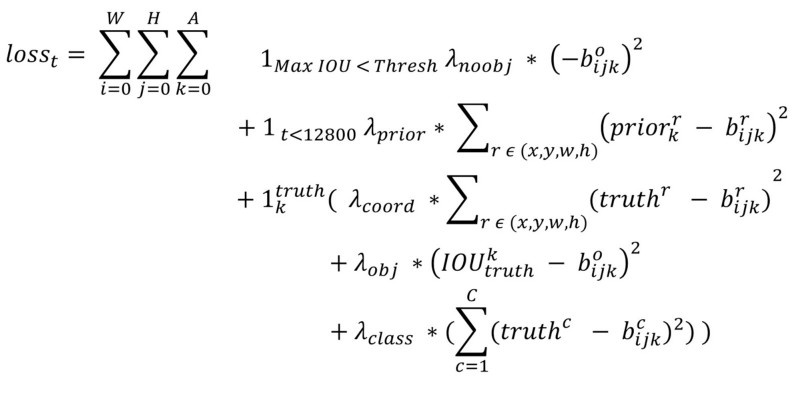

​                                                                         图 yolo-v2的loss定义

​    在前向预测阶段，考虑到物体有大有小、有密集有稀疏， 很可能出现多个网格同时输出非常高的置信度，为了结果更加鲁棒，我们对每个cell，要关注周边的8个cell，首先选择周边的8个cell，并对周边的每个cell(预测5组输出值)都取最大置信度所对于的预测值，然后基于每个cell的置信度取值大小进行加权平均，得到最终的预测值。

​    在最终得到9个2d坐标值后，使用PnP算法即可得到3d旋转矩阵和3d平移向量。

​    具体网络训练策略是：网络的初始化参数是使用ImageNet分类任务训练后的预训练权重进行初始化。考虑到前期网络的6d估计值非常不稳定，难以训练，所以我们通过将置信度的正则化参数设置为0来预训练我们的网络参数。其他网络参数设置为SGD，初始学习率为0.001，每过100个回合除以10，为了避免过拟合，使用了数据增强操作，分别是色调，饱和度和曝光、随机缩放、翻转，这些设置和yolo-v1一致。

## 5 结果

​    实验在两个数据集上面测试，分别是LineMod数据集和OCCLUSION LineMod数据集。

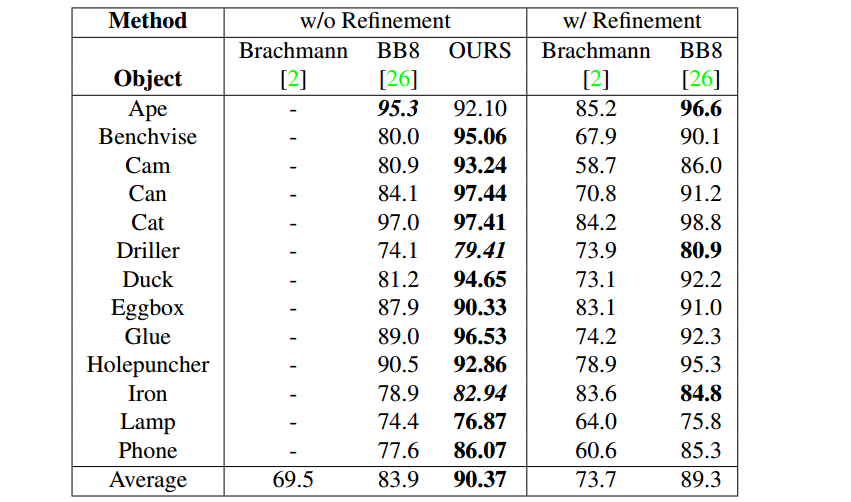

​                                                                          图 linemod数据集上的2d pose指标

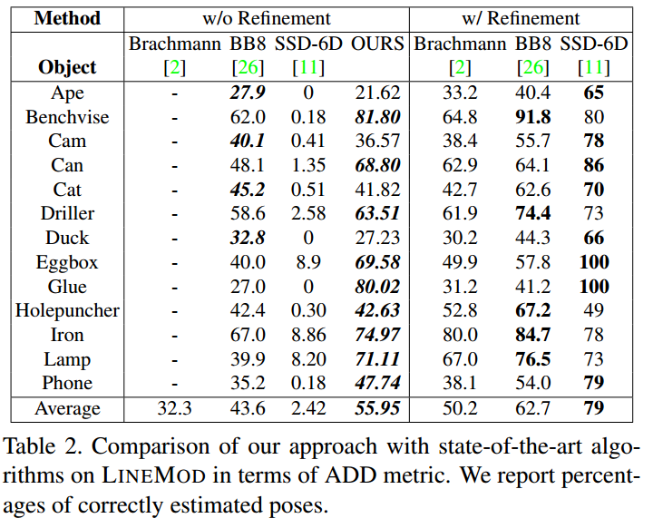

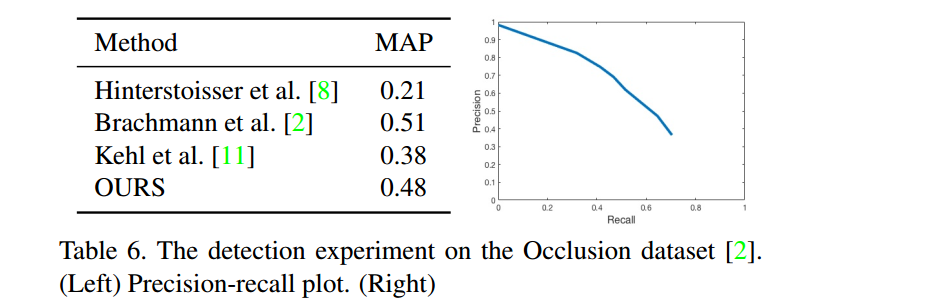

MAP是mean average precision。

