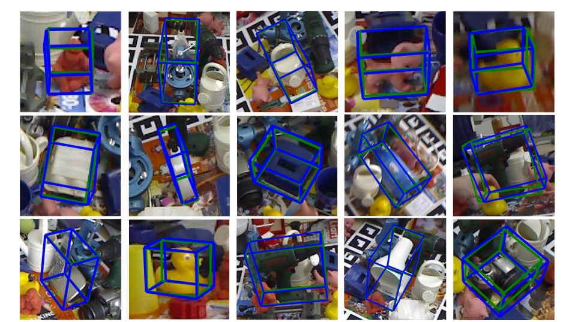
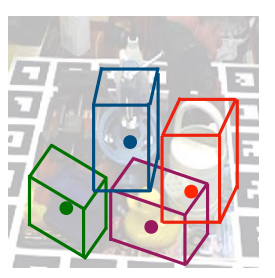
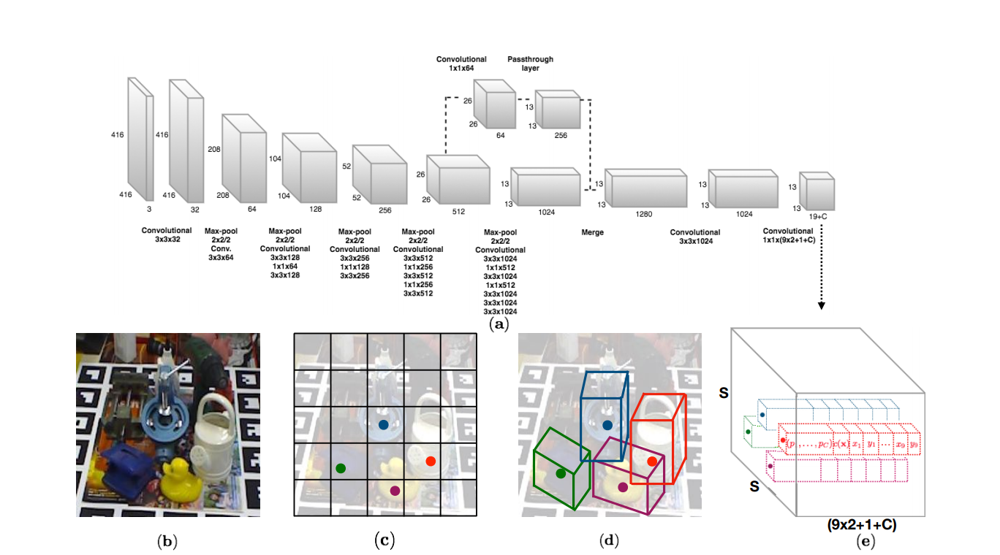
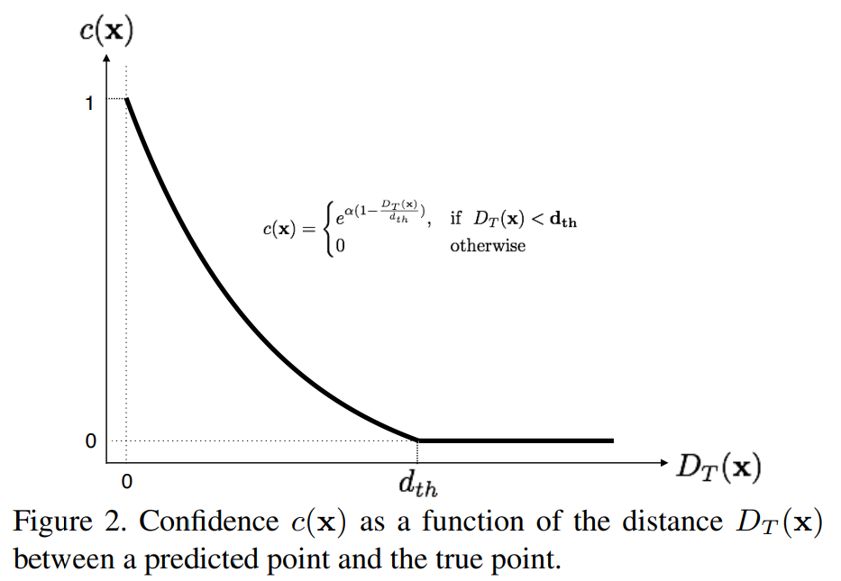
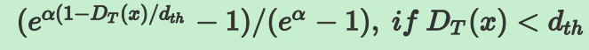
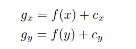

# 基于YOLO的3D bounding box检测

*Real-Time Seamless Single Shot 6D Object Pose Prediction*这篇文章中提出了一种只要输入一张RGB图片，就可以预测物体6D姿态的方法。我们知道物体在2D图像上存在一个2D的bounding box，那么物体在3D空间中也存在一个3D bounding box，如果将3D bounding box画在2D图像上，那么长这样子：

这个3D bounding box实际上就可以表示一个物体的姿态。那什么是物体的姿态？物体的姿态实际上就是物体在3D空间中的空间位置xyz，以及物体绕x轴，y轴和z轴旋转的角度。换言之，一个物体在3D空间中只要知道了这六个自由度，就可以唯一确定物体的姿态。知道了物体的姿态对于机器人来很重要，因为这样就可以进行愉快地抓取了。

这篇文章就是通过一张2D图片来预测这个6D姿态的。但是，并不是直接预测这个6D姿态，而是通过预测3D bounding box在2D图像上的投影的1个中点点和8个角点，然后再由这八个角点通过PNP算法计算得到6D姿态。

下面介绍具体的做法。

## 1. 整体架构

这篇文章设计了一个end-to-end模型，模型是基于YOLO v2来搭建的。整个网络结构图如下：

从这张图片中可以看到，网络吃一张2D的图片，网络吐出物体3D bounding box在2D图像上的9个投影点（8个角点和一个中心点）。得到这9个点之后就可以通过PNP算法得到6D的pose。

## 2. 模型

模型使用的是yolo v2的骨架网络，不过进行了一些改进，比如从前面层中。。。

## 模型输出的意义

输出的维度是13x13x(19+C)，这个19=9x2+1，表示9个点的坐标以及1个confidence值，另外C表示的是类别预测概率，总共C个类别。

confidence的意义

confidence表示这个cell表示cell含有物体的概率以及bbox的准确度(confidence=P(object) *IOU)要分训练阶段和测试阶段来看confidence。我们知道，在yolo v2中，confidence的label实际上就是gt bbox和预测的bbox的IOU。但是在6D姿态估计中，如果要算IOU的话，需要在3D空间中算，这样会非常麻烦，因此本文提出了一种新的IOU计算方法，即定义了一个confidence函数：

其中D(x)是预测的坐标值与真实值之间的欧式距离，dth是提前设定的阈值，比如30pixel。最终的c(x)是9个点的Confidence取均值， alpha是超参，作者设置为2。从上图可以看出，当预测值与真实值越接近时候，D(x)越小，c(x)值越大，表示置信度越大。反之，表示置信度越小。

不过需要注意的是，图上的那个公式是错的，和函数图对应不起来，真正的公式应该是：

## 坐标的意义

上面讲到网络需要预测的9个点的坐标，包括8个角点和一个中心点。但是我们并不是直接预测坐标值，和yolo v2一样，我们预测的是相对于cell的偏移。不过中心点和角点还不一样，（中心点落在哪个cell哪个cell就负责预测这个物体），中心点的偏移一定会落在cell之内，因此通过sigmoid函数将网络的输出压缩到0-1之间，但对于其他8个角点，是有可能落在cell之外的，所以我们没有对8个角点预测添加任何限制。因此坐标偏移可以表示为：

其中cx，cy表示cell的坐标。对于中心点而言，f（.）表示sigmoid函数，对于角点而言，f（.）表示恒等函数。

## 损失函数

