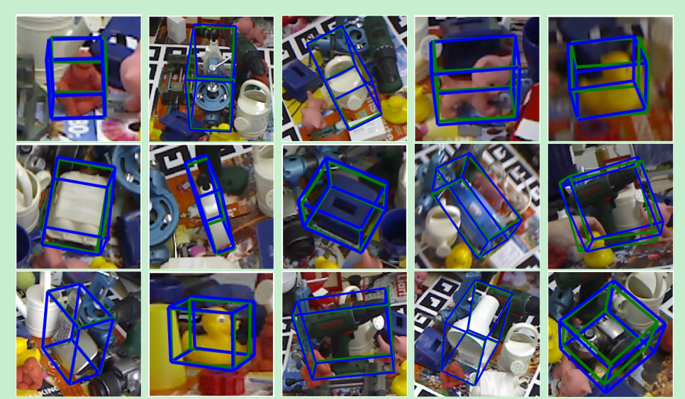
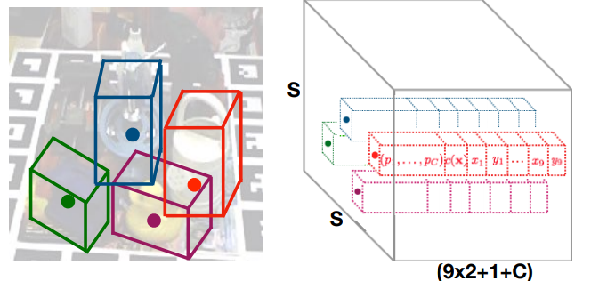

# 基于YOLO的3D目标检测：YOLO-6D

阅读本文之前需要对yolo算法有所了解，如果不了解的可以看我的两篇文章：

2D图像的目标检测算法我们已经很熟悉了，物体在2D图像上存在一个2D的bounding box，我们的目标就是把它检测出来。而在3D空间中，物体也存在一个3D bounding box，如果将3D bounding box画在2D图像上，那么长这样子(忽略绿色框)：

这个3D bounding box可以表示一个物体的姿态。那什么是物体的姿态？实际上就是物体在3D空间中的空间位置xyz，以及物体绕x轴，y轴和z轴旋转的角度。换言之，只要知道了物体在3D空间中的这六个自由度，就可以唯一确定物体的姿态。

知道物体的姿态是很重要的。对于人来说，如果我们想要抓取一个物体，那么我们必须知道物体在3D空间中的空间位置xyz，但这个还不够，我们还要知道这个物体的旋转状态。知道了这些我们就可以愉快地抓取了。对于机器人而言也是一样，机械手的抓取动作也是需要物体的姿态的。因此研究物体的姿态有很重要的用途。

*Real-Time Seamless Single Shot 6D Object Pose Prediction*这篇文章提出了一种使用一张2D图片来预测物体6D姿态的方法。但是，并不是直接预测这个6D姿态，而是通过先预测3D bounding box在2D图像上的投影的1个中心点和8个角点，然后再由这9个点通过PNP算法计算得到6D姿态。我们这里不管怎么由PNP算法得到物体的6D姿态，而只关心怎么预测一个物体的3D bounding box在2D图像上的投影，即9个点的预测。

## 1. 思想

上面已经讲到，我们把预测6D姿态问题转为了预测9个坐标点的问题。而在2D的目标检测中，我们实际上也是需要预测坐标点xy的。那么，我们能不能把目标检测框架拿来用呢？ 很显然是可以的。所以这篇文章就提出基于yolo的6D姿态估计框架。

## 2. 网络架构

整个网络结构图如下：

从上图可以看到，整个网络采用的是yolo v2的框架。网络吃一张2D的图片（a），吐出一个SxSx(9x2+1+C)的3D tensor(e)。我们会将原始输入图片划分成SxS个cell（c），物体的中心点落在哪个cell，哪个cell就负责预测这个物体的9个坐标点（9x2），confidence（1）以及类别(C)，这个思路和yolo是一样的。下面分别介绍这些输出的意义。

## 3. 模型输出的意义

上面已经提到，模型输出的维度是13x13x(19+C)，这个19=9x2+1，表示9个点的坐标以及1个confidence值，另外C表示的是类别预测概率，总共C个类别。

### 3.1 confidence的意义

confidencel表示cell含有物体的概率以及bbox的准确度(confidence=P(object) *IOU)。我们知道，在yolo v2中，confidence的label实际上就是gt bbox和预测的bbox的IOU。但是在6D姿态估计中，如果要算IOU的话，需要在3D空间中算，这样会非常麻烦，因此本文提出了一种新的IOU计算方法，即定义了一个confidence函数：

其中D(x)是预测的2D点坐标值与真实值之间的欧式距离，dth是提前设定的阈值，比如30pixel， alpha是超参，作者设置为2。从上图可以看出，当预测值与真实值越接近时候，D(x)越小，c(x)值越大，表示置信度越大。反之，表示置信度越小。需要注意的是，这里c(x)只是表示一个坐标点的c(x)，而一个物体有9个点，因此会计算出所有的c(x)然后求平均。

另外需要注意的是，图上的那个公式是错的，和函数图对应不起来，真正的公式应该是：

通过以上定义的confidence函数，就可以代替IoU的计算。

### 3.2 坐标的意义

上面讲到网络需要预测的9个点的坐标，包括8个角点和一个中心点。但是我们并不是直接预测坐标值，和yolo v2一样，我们预测的是相对于cell的偏移。不过中心点和角点还不一样，中心点的偏移一定会落在cell之内（因为中心点落在哪个cell哪个cell就负责预测这个物体），因此通过sigmoid函数将网络的输出压缩到0-1之间，但对于其他8个角点，是有可能落在cell之外的，所以我们没有对8个角点预测添加任何限制。因此坐标偏移可以表示为：

其中cx，cy表示cell的坐标。对于中心点而言，f（.）表示sigmoid函数，对于角点而言，f（.）表示恒等函数。

### 3.3 类别的意义

类别代表的意义很简单，就是指预测的类别概率，不过这是一个条件概率P(class/object)，因为我们在训练的时候，只会在有物体的情况下才计算概率损失，这个和yolo是一样的。

### 3.4 多目标检测

以上讲的只是对于单目标的情况，如果是多目标的话，某个cell可能会落入多个物体，这个时候就需要使用anchor了，引入anchor之后，网络的输出相应地变为：13x13x(19+C)×anchors，这篇文章使用的anchor数目为5。引入anchor就需要考虑一个问题，如果一个物体落入了某个cell，那么这个cell中的哪个anchor去负责这个物体？这篇文章中的做法和yolo一样，就是去表物体的2D bounding box和anchor的尺寸，最匹配的那个anchor就负责这个物体。

## 4. 训练

### 4.1 损失函数

yolo的损失函数是很复杂的，具体计算方法可以参考我yolo v2的文章，唯一的区别就是IOU的计算方式发生了变化，其它没变。如果不考虑细节的话，可以简单的表示为：

Lpt，Lconf和Lid分别表示坐标点，confidence和分类的损失。前面的系数表示各项损失的权重。

### 4.2 训练技巧

- 数据的预处理。

  对于输入图片进行大量的图像增强，另外做了换背景操作，即通过物体的mask将物体提取出来，然后粘贴到coco的数据集的图片上。

- 由于一开始网络的confidence预测是很不准的，因此在训练的早期，将损失函数中的$\lambda_{conf}$设置为0。也就是说不训练confidece。等坐标预测的结果变准的时候，这时候再将有物体cell设置$\lambda_{conf}=5$, 没有物体的cell设置$\lambda_{conf}=0.1$ 。

- 多尺度训练。这和yolo v2的多尺度训练的思想是一样的，由于输入图片到grid之间的缩小比例为32，因此本文设置了{320，352，..., 608}11种尺度进行训练。 

## 5. 实验结果

以下展示一些检测结果：

可见检测效果还是不错的。

## 6. 总结

这篇文章实际上将6d姿态问题转为了2D图像中坐标点检测的问题，而2D坐标点的检测问题可以很好地利用目标检测框架来做。当然，这种做法会有一个问题，就是即使你在2D上坐标的检测误差很小，但映射到3D空间中可能会存在较大的误差。当然，这可能是2D图像作为输入的6D姿态估计算法都会面临的问题。不过这篇文章的这个思路还是很值得借鉴的。

