# 图解LSTM

LSTM相对于卷积网络来说复杂度高很多，对于刚开始接触的人来说，如果没有好的阅读资料，是不容易理解的。所以这篇文章希望通过图解的方式来清晰地理解LSTM内部工作流程。文章的图基本上都是来自台大李宏毅教授的PPT，有些地方为了说得更清楚，我也加了一些自己画的图。

## 一、从一个例子讲起

首先从一个例子讲起。假设我们现在要做一个智能的订票系统，它的功能是：用户输入一句话，比如：

> I would like to arrive Taipei on November 2nd. 

我们希望系统能够自动识别出这句话中的到达地点和时间，然后通过这些信息进行自动订票。

这个功能可以怎么设计？我们可以设置一些固定的槽（slot），比如时间槽，到达地点槽等。然后系统去识别这句话中哪些单词属于这些槽，然后将槽填满就好了。填满了之后，系统就可以根据这些信息自动订票了。这种方法叫做槽填充(slot filling)。

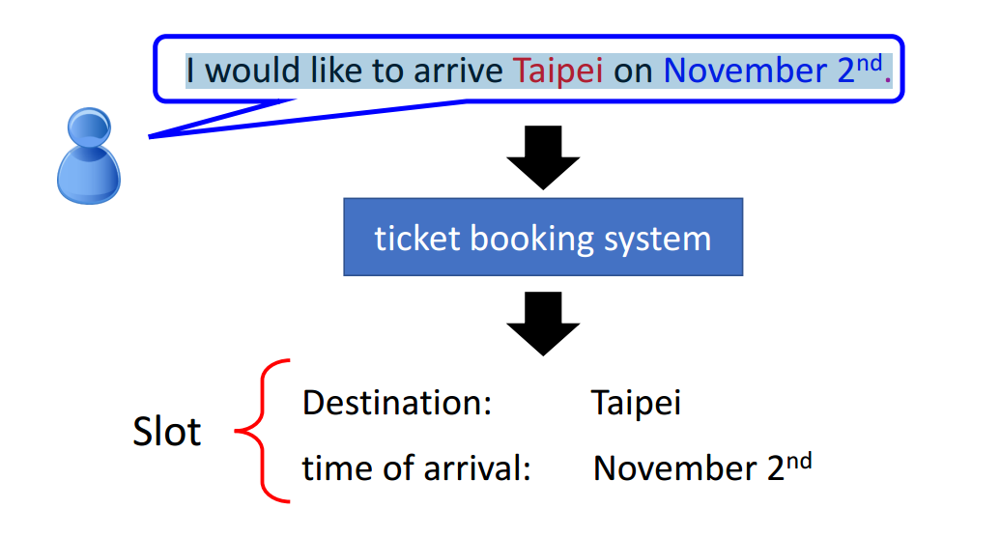

但问题的关键是，我们怎么去识别一个句子中的单词呢？其中比较容易能想到的方法就是通过神经网络来识别。

我们可以把句子中的每个单词都用一个向量（比如用最简单的one-hot encoding）来表示，然后把它输入到一个全连接网络中，网络输出各个槽的概率。比如输入Taipei这个词，网络输出出发时间槽和目的地槽的概率。

但这样并不能解决序列问题。考虑如果句子中前面的arrive变成了leave，我们希望网络输入Taipei，然后输出是出发地而不是目的地。但是，通过全连接网络这种方法，我们输入Taipei，输出的结果就是一定的，并不能输出不同的结果，因此我们根本无法区分是目的地和还是出发地，导致订票系统出错。

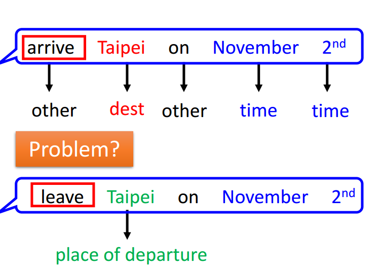

所以，我们希望在输入Taipei这个单词的时候，同时将Taipei之前的单词信息也能进行输入。也就是说我们希望在神经网络中加入记忆，让网络的输出不仅仅与当前的单词有关，还和之前的单词有关，这样我们就可以捕捉到序列的信息。

## 二、RNN登场

### 1.基本的RNN架构

为了往神经网络中加入记忆，RNN（循环神经网络）就登场了。RNN的示意图如下图所示。其中神经网络的隐藏层的输出$a_1$和$a_2$ 就是记忆。此时，网络的输入不仅包含当前的输入x，还包含当前的记忆。

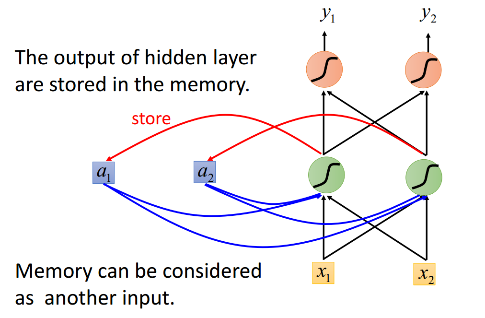

图中的循环箭头表示网络是循环的。这种结构图可能并不容易看，我们可以把它展开：

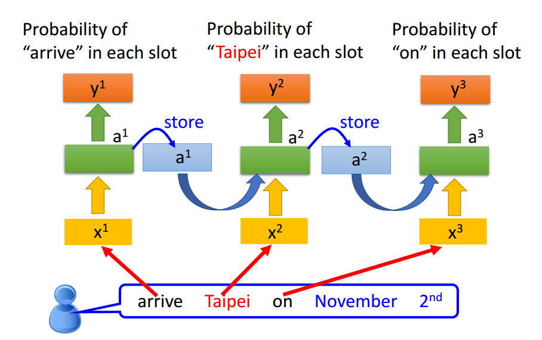

需要注意的是，在时间线上，这些网络都是同一个网络，或者说这些网络都是共享权重的。图中相同颜色的箭头就表示相同的权重。

现在，往这个网络中输入以上所述的两句话中的Taipei，得到的值就会不一样了，因为这时候已经加入了记忆，能够将Taipei之前的arrive和leave信息进行输入。

以上讲的只是一层的循环神经网络，我们当然可以把它叠加起来，变成更深的网络：

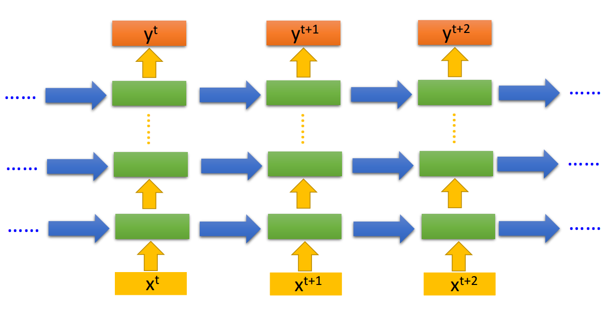

### 2.输出作为记忆的RNN

以上讲的是将隐藏层的输出作为记忆，用于输入到下一个神经网络中。但实际上，也可以将网络的输出作为记忆。如下图所示。不过目前还是第一种方案用得比较多。

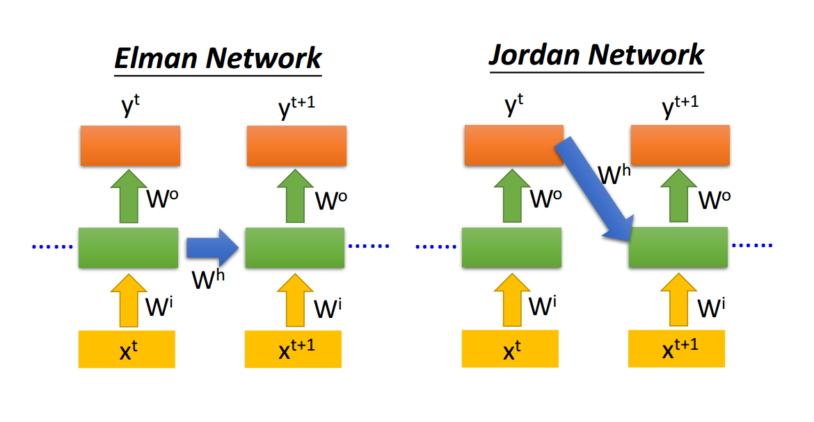

###3.双向RNN

以上讲的RNN仅仅可以捕捉正向序列的信息，而有的时候序列的方向信息也是很有作用的。这时候可以将正向和反向的RNN联合起来，如图所示。

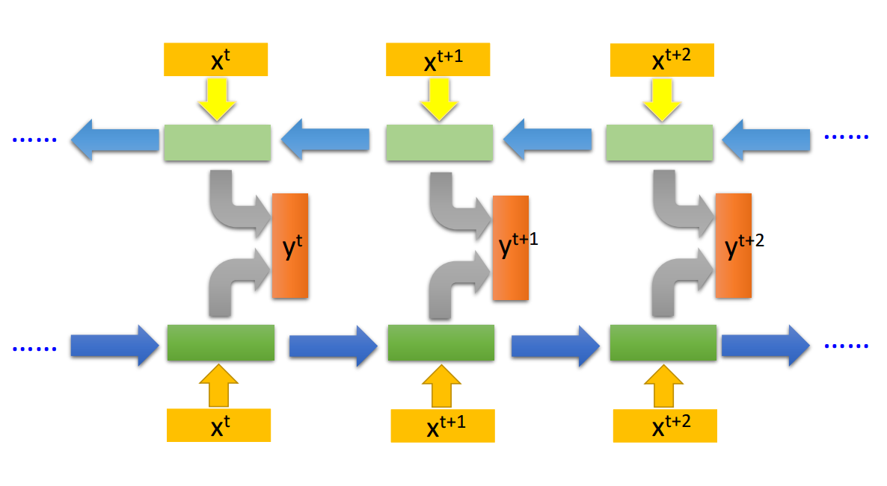

## 三、LSTM

RNN虽然可以捕捉序列信息，进行序列学习，但它本身有很多问题，这篇文章并不打算讲RNN的缺点，而是直接讲RNN的改进版本：LSTM（长短时记忆）。LSTM是怎么改进RNN的呢？我们先不着急改变整个网络，而是先从隐藏层的一个神经元（包括输入和输出）来进行改进，如下图所示，左图是RNN架构，最右边的图表示一个隐层的神经元（这里包括输入和输出）：

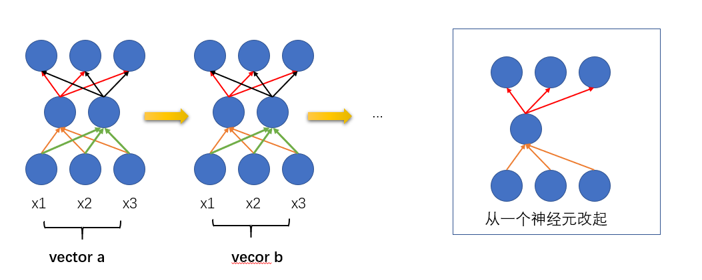

LSTM对这个神经元改进之后的神经元名字叫做cell，如下图所示：

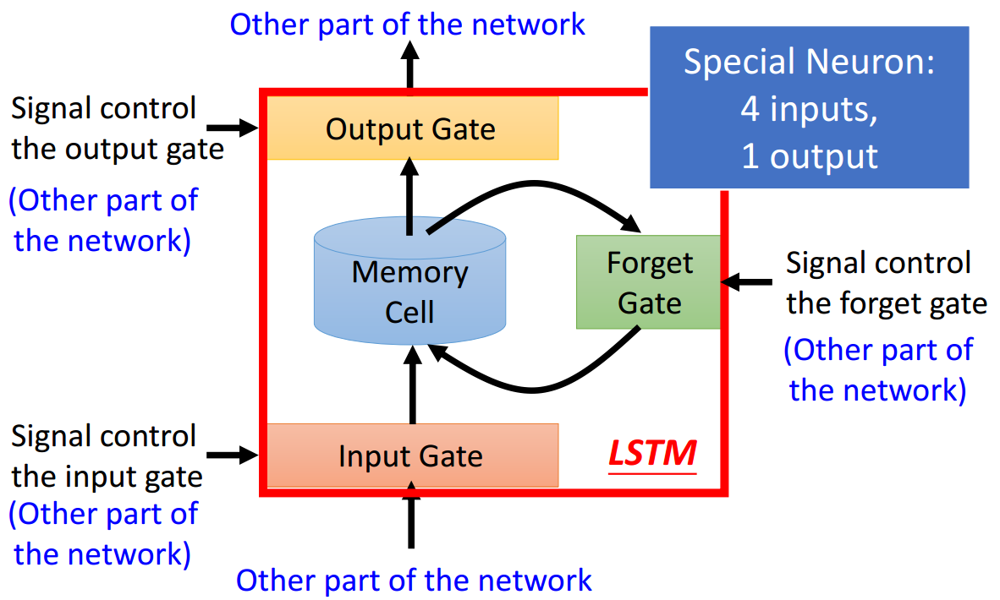

我们发现，改进之后，一个神经元的输入变多了，原本的神经元只有一个部分的输入，但现在变成了四个部分，输出则由一个部分变成了两个部分。我们用另外一张图来进行更具体的表示：

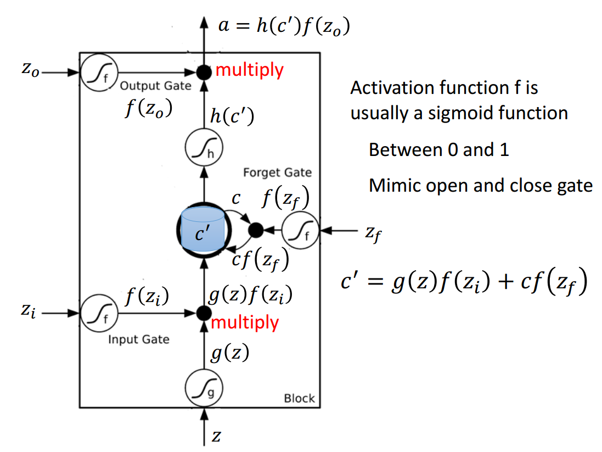

这张图中有四个部分的输入，他们分别为：

> $z=xw^T$;
>
> $z=xw_i^T$；
>
> $z=xw_o^T$；
>
> $z=xw_f^T$；

注意：$x$是输入向量，另外，因为我们现在考虑的仅仅是一个神经元，所以$w^T$也是一个向量，两者相乘就是一个实数值$z$。用图来表示就是：

从以上四部分可以看出，这四个部分的输入都是一样的，都是$x$，但是相乘的权重向量w是不同的。

除了第一个输入z，另外几个$z_i,z_o,z_f$都是用来当作gate输入的，这些gate的作用就是来控制信息的流通，它们的作用分别为：

> 1. input gate，0-1之间，控制信息有多少输入。
> 2. output gate，0-1之间，控制信息要遗忘多少
> 3. output gate，0-1之间：控制信息输出多少。
>

这些门限的激活函数f通常为sigmoid函数，它的值为0-1之间，0表示门关闭，信息不流通，1表示门完全打开，信息完全流通。g,h也是激活函数。

我们来看这个cell的工作流程：

> 1. 首先信息z进行输入，激活之后和input gate相乘：$g(z)f(z_i)$，表示有多少信息要流入。
>
>
> 2. 将记忆c与forget gate相乘，$cf(z_f)$ ，表示留下多少记忆。
> 3. 将1和2的结果相加，得到新的记忆$c^′=g(z)f(z_i )+cf(z_f )$，表示记忆信息和当前信息相加。
> 4. 将3的结果$c'$进行激活，得到$h(c')$，再将它与output gate相乘，$f(z_0)h(c')$，表示想要多少信息输出。

从这个流程可以看到，信息的输入，记忆的输入和信息的输入都是受到严格控制的。

我们来看一个用具体数字作为输入的例子，如下图，图中的输入都是相同的向量$x=[x_1,x_2,x_3]$,但权重向量

$w,w_o^T,w_f^T,w_i^T$ 各不相同。输出y可以是一个向量，也可以是一个实数值。

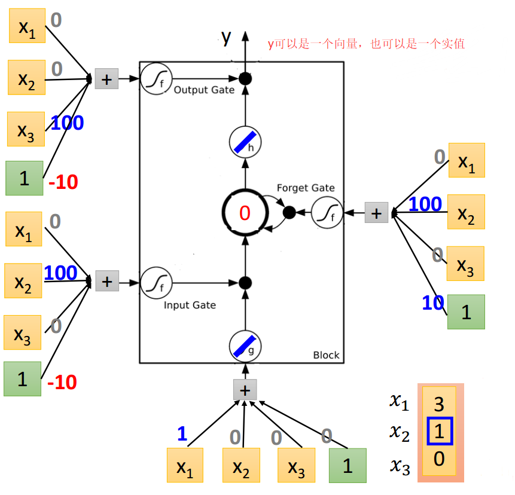

LSTM的cell的输入有四部分，但把它们合起来当作一个输入看待也是完全没问题的。所以即使你不知道LSTM的cell内部是怎么工作的，你完全把它当作一个神经元看待。

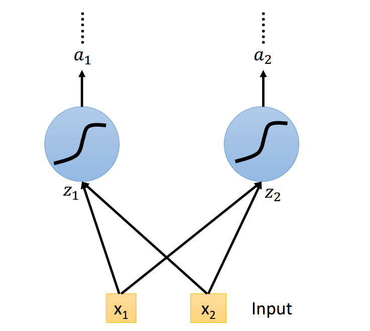

需要注意的是，经过这样改进之后，一个cell的参数就变成了原本的四倍了。

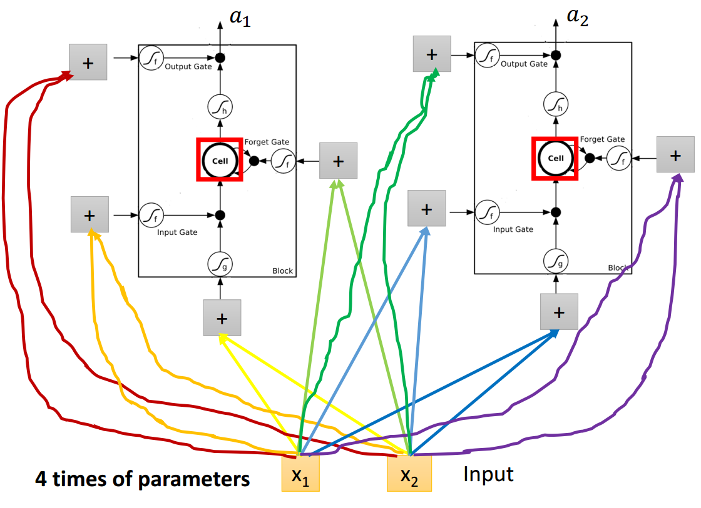

以上讲的是对一个神经元的改进，现在要对隐藏层的多个神经元进行改进，怎么做?其实很简单，只要把输入的z改成向量**z**就好了，类似向量化编程的思想。一张图表示：

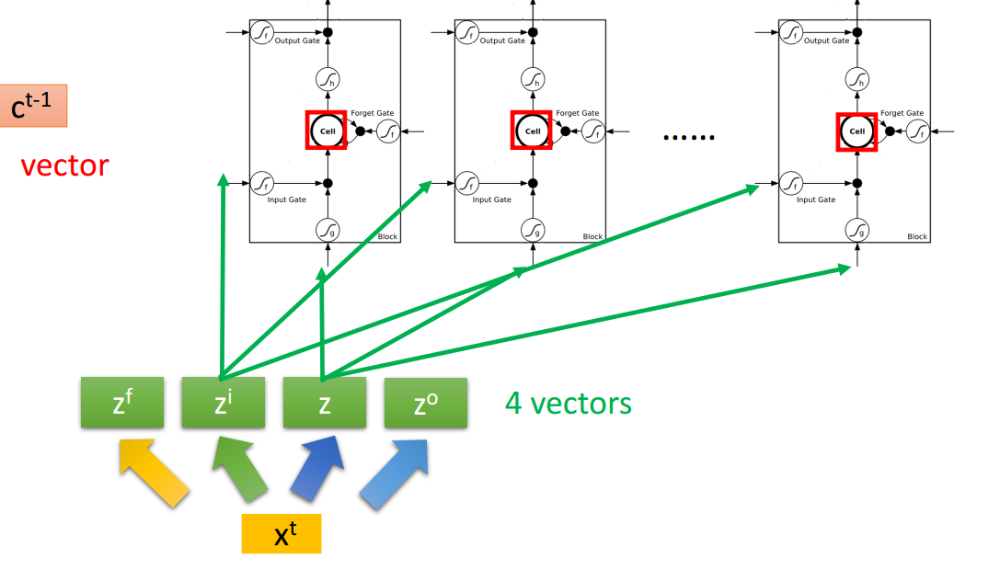

更加具体化的图是：

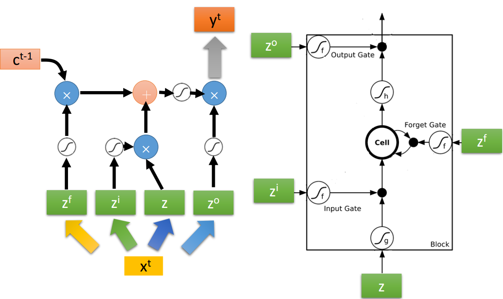

不过，真正的LSTM并不是上面所讲的那样，而是增加了peephole。增加peephole之后实际上改变的只是输入，输入不再只是x，而是增加了隐层的输出h和当前记忆c。

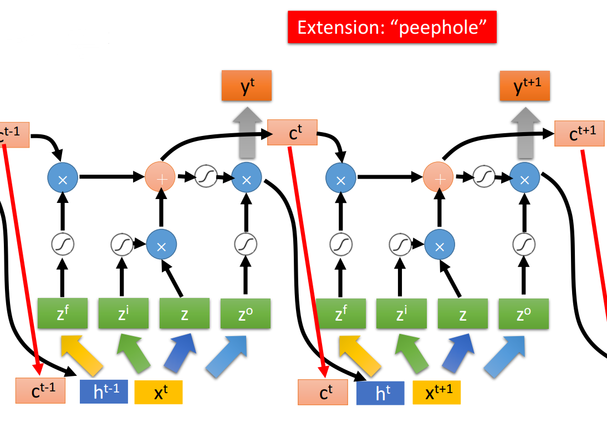

到这里LSTM的基本结构就讲完了，这里只讲了LSTM的结构是怎么基于RNN改进来的，而关于RNN存在的问题以及LSTM为什么这么改进等等这篇文章还没有涉及到，之后会详细讲到这些方面。

另外，李宏毅教授的PPT真是做得很用心，把LSTM结构画得非常清楚，很容易理解。这么良心的教授真不多，对于此，有那么一刻，我竟有些感动。

