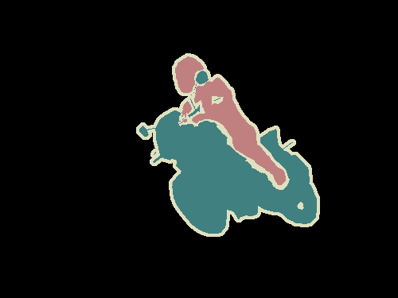
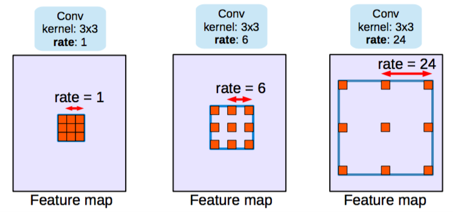
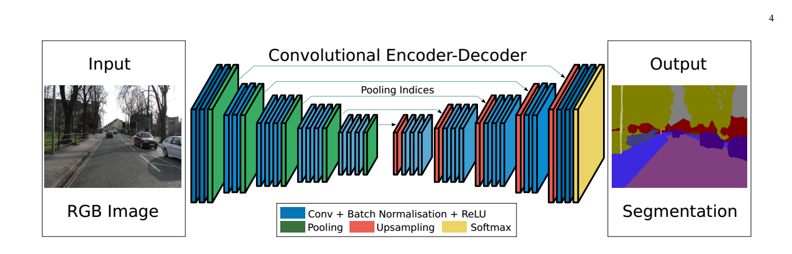
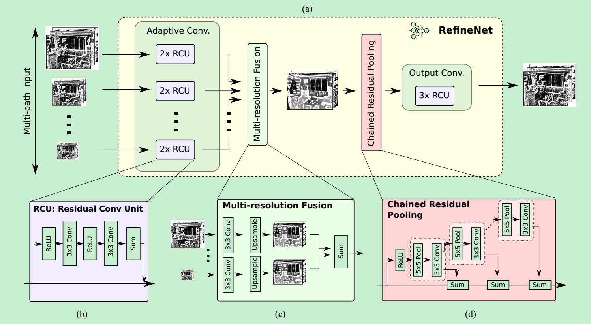
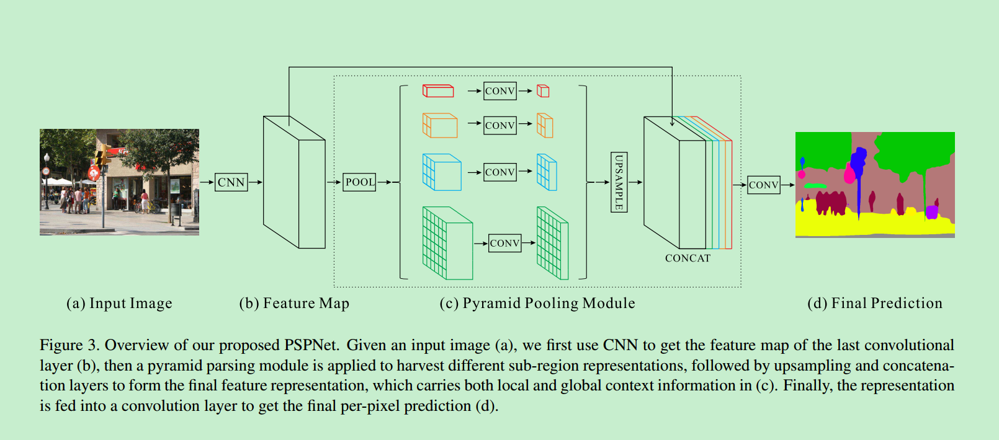

# 语义分割总结

参考：

1. [A 2017 Guide to Semantic Segmentation with Deep Learning](http://blog.qure.ai/notes/semantic-segmentation-deep-learning-review#dilation)
2. [A Review on Deep Learning Techniques Applied to Semantic Segmentation](https://arxiv.org/abs/1704.06857) 

## 一、什么是语义分割

​	语义分割是在像素级别上的分类，属于同一类的像素都要被归为一类，因此语义分割是从像素级别来理解图像的。比如说如下的照片，属于人的像素都要分成一类，属于摩托车的像素也要分成一类，除此之外还有背景像素也被分为一类。注意语义分割不同于实例分割，举例来说，如果一张照片中有多个人，对于语义分割来说，只要将所由人的像素都归为一类，但是实例分割还要将不同人的像素归为不同的类。也就是说实例分割比语义分割更进一步。

图1(a). 原图

图1(b). 分割结果

## 二、语义分割的思路

### 1.传统方法

在深度学习方法流行之前，TextonForest和基于随机森林分类器等语义分割方法是用得比较多的方法。不过在深度卷积网络流行之后，深度学习方法比传统方法提升了很多，所以这里就不详细讲传统方法了。

### 2.深度学习方法

深度学习方法在语义分割上得到了巨大成功，深度学习方法解决语义分割问题可以概括为几种思路。下面进行详细介绍。

**Patch classification**

最初的深度学习方法应用于图像分割就是Patch classification。Patch classification方法，顾名思义，图像是切成块喂给深度模型的，然后对像素进行分类。使用图像块的主要原因是因为全连接层需要固定大小的图像。

**全卷积方法**

2014年，全卷积网络（FCN）横空出世，FCN将网络全连接层用卷积取代，因此使任意图像大小的输入都变成可能，而且速度比Patch classification方法快很多。

尽管移除了全连接层，但是CNN模型用于语义分割还存在一个问题，就是下采样操作（比如，pooling）。pooling操作可以扩大感受野因而能够很好地整合上下文信息（context中文称为语境或者上下文，通俗的理解就是综合了更多的信息来进行决策），对high-level的任务（比如分类），这是很有效的。但同时，由于pooling下采样操作，使得分辨率降低，因此削弱了位置信息，而语义分割中需要score map和原图对齐，因此需要丰富的位置信息。目前的文献中主要有两种不同的架构来解决这个问题。

**encoder-decoder架构**

第一中架构就是encoder-decoder架构。encoder由于pooling逐渐减少空间维度，而decoder逐渐恢复空间维度和细节信息。通常从encoder到decoder还有shortcut connetction（捷径连接，也就是跨层连接）。其中U-net就是这种架构很流行的一种，如下图：

**空洞卷积**

第二种架构叫做dilated/atrous （空洞卷积），这种结构代替了pooling，一方面它可以保持空间分辨率，另外一方面它由于可以扩大感受野因而可以很好地整合上下文信息。如下图：

**条件随机场**

除了以上思路，还有一种对分割结果进行后处理的方法，那就是条件随机场(Conditional Random Fields (CRFs))后处理用来改善分割效果。DeepLab系列文章基本都采用这种后处理方法，可以较好地改善分割结果，如下图：

## 三、深度学习语义分割方法

### 方法总览

现在的深度学习语义分割模型基本上都是基于FCN发展而来的，它是开山鼻祖，一张图概括FCN的延伸方法：

**各方法的详细信息**

### 各方法简要介绍

下面总结一些从FCN进行改进的几种架构：

1. [FCN](http://blog.qure.ai/notes/semantic-segmentation-deep-learning-review#fcn)
2. [SegNet](http://blog.qure.ai/notes/semantic-segmentation-deep-learning-review#segnet)
3. [Dilated Convolutions](http://blog.qure.ai/notes/semantic-segmentation-deep-learning-review#dilation)
4. [DeepLab (v1 & v2)](http://blog.qure.ai/notes/semantic-segmentation-deep-learning-review#deeplab)
5. [RefineNet](http://blog.qure.ai/notes/semantic-segmentation-deep-learning-review#refinenet)
6. [PSPNet](http://blog.qure.ai/notes/semantic-segmentation-deep-learning-review#pspnet)
7. [Large Kernel Matters](http://blog.qure.ai/notes/semantic-segmentation-deep-learning-review#large-kernel)
8. [DeepLab v3](http://blog.qure.ai/notes/semantic-segmentation-deep-learning-review#deeplabv3)

#### 1. FCN

**论文信息**

> Fully Convolutional Networks for Semantic Segmentation
>
> Submitted on 14 Nov 2014
>
> [Arxiv Link](https://arxiv.org/abs/1411.4038)

**主要贡献**

1. 使端对端的卷积语义分割网络变得流行起来。
2. 通过deconvolutional layers进行上采样。
3. 通过skip connection改善了上采样的粗糙度。

**概要**

1. **全卷积化(Fully Convolutional)**：用于解决逐像素(pixel-wise)的预测问题。通过将基础网络(例如VGG)最后面几个全连接层换成卷积层，可实现任意大小的图像输入，并且输出图像大小与输入相对应；
2. **反卷积(deconvolution)** ：上采样操作，用于恢复图片尺寸，方便后续进行逐像素预测;
3. **跳跃结构(skip architecture)**：用于融合高低层特征信息。通过跨层连接的结构，结合了网络浅层的细(fine-grain)粒度信息信息以及深层的粗糙(coarse)信息，以实现精准的分割任务。

*Benchmarks (VOC2012)*:

| Score | Comment                               | Source                                   |
| ----- | ------------------------------------- | ---------------------------------------- |
| 62.2  | -                                     | [leaderboard](http://host.robots.ox.ac.uk:8080/leaderboard/displaylb.php?cls=mean&challengeid=11&compid=6&submid=6103#KEY_FCN-8s) |
| 67.2  | More momentum. Not described in paper | [leaderboard](http://host.robots.ox.ac.uk:8080/leaderboard/displaylb.php?cls=mean&challengeid=11&compid=6&submid=6103#KEY_FCN-8s-heavy) |

评论：

FCN是基于深度学习的语义分割的开山之作，尽管现在很多方法都超越了FCN，但它的思想仍然有很重要的意义。

#### 2. Segnet

**论文信息**

> SegNet: A Deep Convolutional Encoder-Decoder Architecture for Image Segmentation
>
> Submitted on 2 Nov 2015
>
> [Arxiv Link](https://arxiv.org/abs/1511.00561)

**主要贡献**

- 使用Maxpooling indices来增强位置信息。

**简要概述**

FCN的upconvolution层+shortcut connections产生的分割图比较粗糙，因此SegNet增加了更多的shortcut connections。不过，SegNet并不是直接将encoder的特征进行直接复制，而是对maxpooling中的indices进行复制，这使得SegNet的效率更高。

maxpooling 的indices复制原理如下：

**Benchmarks (VOC2012)**

| Score | Comment | Source                                   |
| ----- | ------- | ---------------------------------------- |
| 59.9  | -       | [leaderboard](http://host.robots.ox.ac.uk:8080/leaderboard/displaylb.php?challengeid=11&compid=6#KEY_SegNet) |

**评论**

- FCN和SegNet都是encoder-decoder架构。
- SegNet的benchmark表现太差了，不建议用这个网络。

#### 3. Dilated convolution

**论文信息**

> Multi-Scale Context Aggregation by Dilated Convolutions
>
> Submitted on 23 Nov 2015
>
> [Arxiv Link](https://arxiv.org/abs/1511.07122)

**创新点**

1. 使用空洞卷积用来进行稠密预测（dense prediction）。
2. 提出上下文模块（context module），使用空洞卷积（Dilated Convolutions）来进行多尺度信息的的整合。

**简要解释**

pooling操作可以增大感受野，对于图像分类任务来说这有很大好处，但由于pooling操作降低了分辨率，这对语义分割来说很不利。因此作者提出一种叫做dilated convolution的操作来解决这个问题。dilated卷积(在deeplab中称为atrous卷积)。可以很好地提升感受野的同时可以保持空间分辨率。

网络架构有两种，一种是前端网络，另外一种是前端网络+上下文模块，分别介绍如下：

- 将VGG网络的最后两个pooling层给拿掉了，之后的卷积层被dilated 卷积取代。并且在pool3和pool4之间空洞卷积的空洞率=2，pool4之后的空洞卷积的空洞率=4。作者将这种架构称为前端（front-end）。
- 除了前端网络之外，作者还设计了一种叫做上下文模块（context module）的架构，加在前端网络之后。上下文木块中级联了多种不同空洞率的空洞卷积，使得多尺度的上下文信息可以得到整合，从而改善前端网络预测的效果。**需要注意的是前端网络和上下文木块是分开训练的，因为作者在实验中发现，如果是联合在一起进行端对端的训练并不能改善性能。**

**Benchmarks (VOC2012)**

| Score | Comment                      | Source                |
| ----- | ---------------------------- | --------------------- |
| 71.3  | frontend                     | reported in the paper |
| 73.5  | frontend + context           | reported in the paper |
| 74.7  | frontend + context + CRF     | reported in the paper |
| 75.3  | frontend + context + CRF-RNN | reported in the paper |

**评论**

需要特别注意的是，网络输出的分割图并不是和原始图像大小一样的，而是其1/8，需要对输出的分割图进行线性插值才能得到最终的分割结果。这种做法也是很多其他的方法都使用的。

#### 4. DeepLab(v1,v2)

**论文信息**

> **v1**: Semantic Image Segmentation with Deep Convolutional Nets and Fully Connected CRFs
>
> Submitted on 22 Dec 2014
>
> [Arxiv Link](https://arxiv.org/abs/1412.7062)
>
>
> **v2** : DeepLab: Semantic Image Segmentation with Deep Convolutional Nets, Atrous Convolution, and Fully Connected CRFs
> Submitted on 2 Jun 2016
> [Arxiv Link](https://arxiv.org/abs/1606.00915)

**主要贡献**

1. 使用atrous卷积，也就是后来的空洞卷积，扩大感受野，保持分辨率。
2. 提出了atrous spatial pyramid pooling (ASPP)，整合多尺度信息。
3. 使用全连接条件随机场（fully connected CRF)进行后处理，改善分割结果。

**简要概述**

1. 空洞卷积可以在不增加参数的情况下增加感受野。
2. 通过两种方式来进行多尺度的处理：A.将原始图像的多种尺度喂给网络进行训练。B.通过平行的不同空洞率的空洞卷积层来获得。
3. 通过全连接条件随机场来进行后处理，以改善分割结果。

**Benchmarks (VOC2012)**

| Score | Comment                                  | Source                                   |
| ----- | ---------------------------------------- | ---------------------------------------- |
| 79.7  | ResNet-101 + atrous Convolutions + ASPP + CRF | [leaderboard](http://host.robots.ox.ac.uk:8080/leaderboard/displaylb.php?cls=mean&challengeid=11&compid=6&submid=6103#KEY_DeepLabv2-CRF) |

#### 5. RefineNet

**论文信息**

> RefineNet: Multi-Path Refinement Networks for High-Resolution Semantic Segmentation
>
> Submitted on 20 Nov 2016
>
> [Arxiv Link](https://arxiv.org/abs/1611.06612)

**主要贡献**

1. 精心设计了encoder-decoder架构中的decoder部分，使得性能提升。
2. 整个网络的设计都遵循residual connections，网络表达能力更强，梯度更容易反向传播。

**简要概述**

作者提出空洞卷积方法应用于语义分割也是有缺点的，包括：

- 因为使用了大分辨率的feature map，因此计算代价大，并且需要大量的内存。对于这个问题，DeepLab的做法是只预测原始输入的1／8。

本文提出使用encoder-decoder架构。encoder部分是RESNET-101。decoder具有RefineNet blocks，它将此前的RefineNet blocks的低分辨率特征和encoder部分高分辨率特征进行concatenate/fuse。

**Benchmarks (VOC2012)**

| Score | Comment                                  | Source                                   |
| ----- | ---------------------------------------- | ---------------------------------------- |
| 84.2  | Uses CRF, Multiscale inputs, COCO pretraining | [leaderboard](http://host.robots.ox.ac.uk:8080/leaderboard/displaylb.php?challengeid=11&compid=6#KEY_Multipath-RefineNet) |

#### 6. PSPNet

**论文信息**

> Pyramid Scene Parsing Network
>
> Submitted on 4 Dec 2016
>
> [Arxiv Link](https://arxiv.org/abs/1612.01105)

**主要贡献**

1. 使用pyramid pooling整合context。
2. 使用auxiliary loss。

**概要**

骨架网络使用Resnet，并在此基础上加上pyramid pooling module。该模块用到了很多kernel大小不一的pooling 。将pooling的结果再上采样，经过concatenate进行融合。

在RESNET的第四阶段（即输入到金字塔池模块）之后，应用auxiliary loss。这种方法在别的地方也被称为intermediate supervision。

**Benchmarks (VOC2012)**

| Score | Comment                                  | Source                                   |
| ----- | ---------------------------------------- | ---------------------------------------- |
| 85.4  | MSCOCO pretraining, multi scale input, no CRF | [leaderboard](http://host.robots.ox.ac.uk:8080/leaderboard/displaylb.php?challengeid=11&compid=6#KEY_PSPNet) |
| 82.6  | no MSCOCO pretraining, multi scale input, no CRF | reported in the paper                    |

#### 7. Large Kernel Matters

见论文解读。

#### 8. deeplab v3

见论文解读。