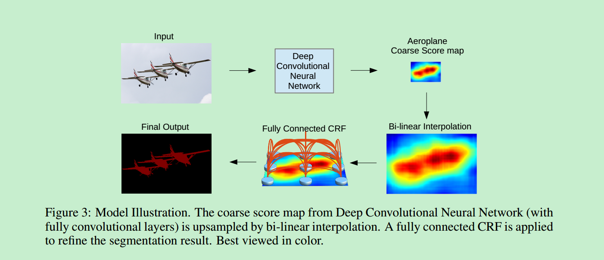
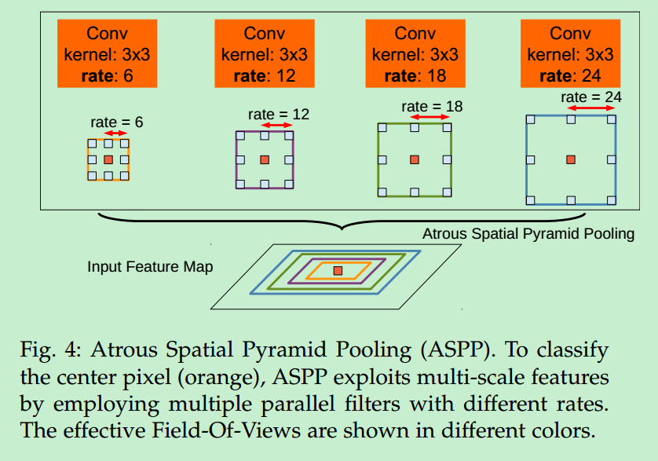
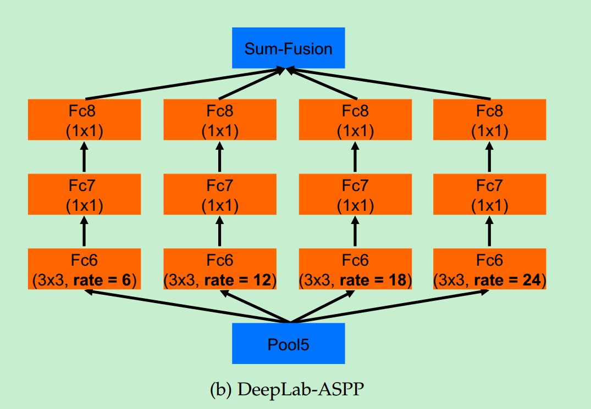

# 论文信息

论文地址：https://arxiv.org/abs/1606.00915

论文发表日期：(Submitted on 2 Jun 2016 ([v1](https://arxiv.org/abs/1606.00915v1)), last revised 12 May 2017 (this version, v2))

# DeepLab V1

## 创新点

本文将深度卷积网络（DCNN）和概率图模型结合起来，解决pixel-level的语义分割问题。作者指出DCNN的最后层的特征通常是非常high-level的，对于需要精准定位的语义分割来说是缺少位置信息的。因此作者提出将DCNN的最后一层加上全连接条件随机场（fully connected conditional random field(CRF)）的方法来解决语义分割中的定位不准确的问题。

## 思想

DCNN网络具有不变形特性，对于图像分类这些high-level的任务来说，这种不变形是非常有用的。但是对于语义分割和姿态估计等这些low-level的任务来说，需要非常精准的像素定位而非特征抽象，这种不变性反而是非常不利的。

DCNN如果直接用于语义分割会存在两个挑战：

1. 下采样(如max pooling)会导致分辨率降低，不利于像素级别的语义分割问题。
2. DCNN的空间不变性（spatial insensitivity/invariance），分类器获取对象类别的信息是需要空间变换不变性的，但这限制了DCNN的空间定位精度。

针对以上两个问题，文章作者分别提出了解决方法：

对于1：使用atrous卷积（和空洞卷积是一个意思）来减少分辨率降低。

对于2：使用全连接CRF来提高模型捕获细节和边缘信息的能力。

## 模型

对于问题1，具体解决的办法：

将VGG16网络的全连接层改成了卷积。但是这样得到的图像分辨率和原始图片尺寸相差太大（stride=32），而目标是使最终的feature map分辨率达到原始图像的1/8（stride=8），因此使用了空洞卷积来达到这个目的。

对于问题2，具体解决的办法：

使用条件随机场的方法来改善结果。CRF是后处理，是不参与训练的，在测试的时候对feature map做完CRF后，再双线性插值resize到原图尺寸，因为feature map是8s的，所以直接放大到原图是可以接受的。

# DeepLab V2

## 改进

DeepLab V1中讲到DCNN用于语义分割存在两个挑战。DeepLab V2则又说到新的一个挑战：多尺度目标。因此DeepLab V2主要是针对这个挑战进行设计，其他两个挑战的部分的解决方法和DeepLab V1一致。

## 多尺度目标

多尺度对性能提升很大，我们知道感受野是指feature map上一个点能看到的原图的区域，那么如果有多个receptive field，是不是相当于一种多尺度。出于这个思路，v2版本在v1的基础上增加了一个多视野域。这种思路是受SPP（spatial pyramid pooling）的启发，一个任意尺寸的区域可以通过对一个固定尺度下的卷积特征进行resample。具体看图可以很直观的理解：

# DeepLab V3

pass

# 参考

https://zhuanlan.zhihu.com/p/37124598

https://blog.csdn.net/c_row/article/details/52161394