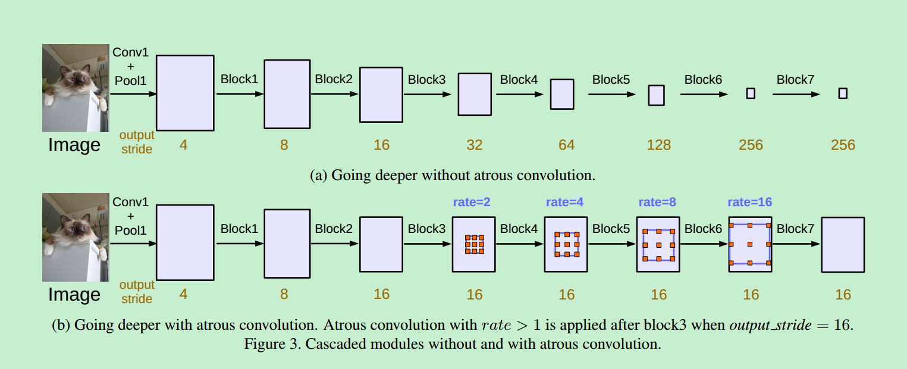
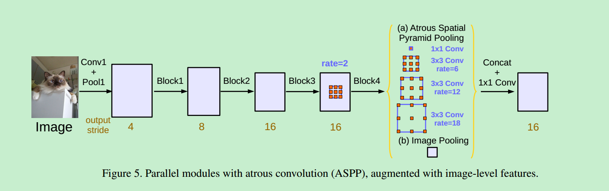
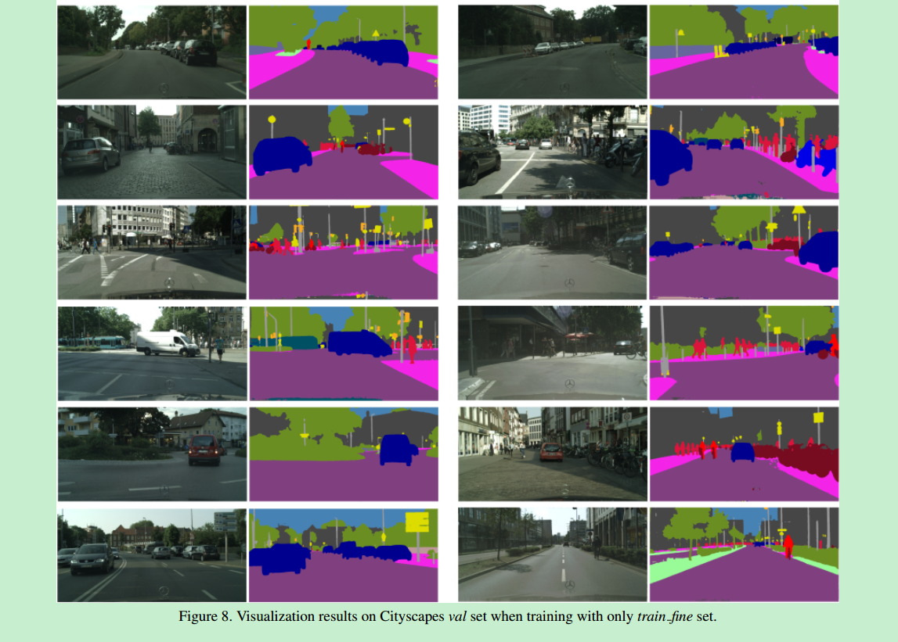
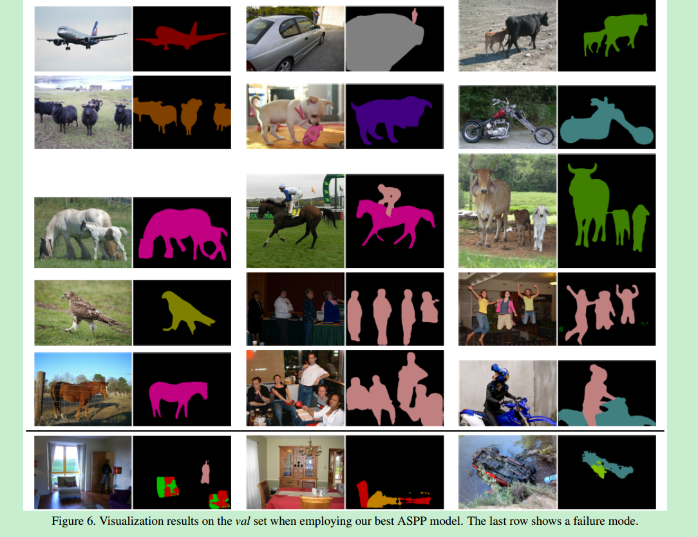

#Deeplab v3：Rethinking Atrous Convolution for Semantic Image Segmentation

## 一、创新点

1. 这篇文章重新思考了atrous convolution(带孔卷积)，它可以很好的调整filter的感受野以及控制输出feature map的分辨率。
2. 为了解决分割中物体的多尺度问题，设计了带孔卷积（多种atrous rate(采样率)）的串行和并行模块来获取多尺度信息。
3. 增强其他论文中提出的Atrous Spatial Pyramid Pooling(ASPP)，它可以获取不同尺度的信息。
4. 在没有CRF后处理的情况下，明显的提高了我们之前DeepLab版本，在PASCAL VOC 2012语义图像分割测试中获得最佳效果。

## 二、思想

### 语义分割存在的问题

语义分割存在两个问题：

1. 由于卷积中连续的下采样或者卷积的stride造成的分辨率下降，学习到了更抽象特征，但是损失分辨率从而丧失详细的空间信息。
2. 另一个问题就是物体的多尺度问题。

### 实现多尺度上下文的四种思路

#### 1. 图像金字塔

采用了图像金字塔来提取不同尺寸图像输入。

优点：小尺度的输入的特征可以编码long-range上下文信息。大尺度输入保存小物体的细节。

缺点：耗费GPU内存。通常在测试阶段做。

#### 2. Encoder-decoder

编码：挖掘不同尺度的特征，随着feature  map的空间分辨率降低longer range information可以更好地捕捉。

解码：恢复图像的分辨率。解码阶段物体的细节和空间维度逐渐得到恢复。比如：segnet，unnet，refinenet等。

#### 3. Context module

这类方法在网络的背后增加一些额外的级联模块，这样可以捕捉long range information。比如：1. denseCRF。2. Multi-scale context aggregation by dilated convolutions。

#### 4. Spatial pyramid pooling

空间金字塔采样。

> probes an incoming feature map with filters or pooling operations at multiple rates and multiple effective field-of-views, thus capturing objects at multiple scales.

## 三、方法

本篇文章基于以上3和4，然后做了一些略微的改进。

### 1. Going Deeper with Atrous Convolution

我们首先探索设计级联布局的具有超大卷积的模块。我们复制ResNet的Block4，并且让它们级联起来，如图3所示。 每一个卷积block都有3层卷积层，kernel都是3x3，除了最后一个block之外，其它的block中最后一个卷积层的stride都为2，和原始的Resnet是一致的。这样做的目的就是就是因为在更深的block中采样率可以提取长程信息。举个例子，如图3a所示，整个的图像可以被总结成最后一个小的feature map，但是这对语义分割是非常不利的，因为这会损失细节信息。因此我们采用带孔卷积，采样率可以决定最后的输出步长，如图3b所示。

  在这个提出的模型中，我们试验了直到块7的级联ResNet块（即，额外块5，块6，块7作为块4的复制品），如果不应用无量卷积，其具有输出步长= 256。

### 2. Atrous Spatial Pyramid Pooling

我们重新利用论文11中的带孔空间金字塔池化(ASPP)。不同之处，增加了BN。

ASPP具有不同的采样率，可以非常有效的提取多个尺度的信息。然而我们发现当采样率增大时，卷积核中有效的卷积权重(作用于feature map内部区域，而不是pad区域)越来越小。采用最极端的情况当采样率接近feature map的大小时，3x3的卷积核并不是提取整个图像的上下文信息，而是退化为1x1的卷积核，因为只有卷积核中间的权重是有效的。

为了解决这个问题： 为了克服这个问题并融合全局上下文信息，我们采用图像级(image-level)的特征，和论文58,95相同的方法。特别的，我们对模型的最后一个feature map采用全局均值池化，然后把池化的结果送入256个1x1的卷积核以及BN，最后进行双线性插值恢复到想要的分辨率。

## 四、实验

两个数据集上的效果分别为：

