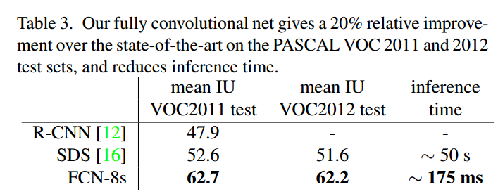

## FCN

论文地址： [Fully Convolutional Networks for Semantic Segmentation](https://arxiv.org/abs/1411.4038v2)

发表日期：

### 1 介绍

 图像语义分割是图像处理和是机器视觉技术中关于图像理解的重要一环，也是 AI 领域中一个重要的分支。语义分割即是对图像中每一个像素点进行分类，确定每个点的类别(如属于背景、人或车等)，从而进行区域划分。目前，语义分割已经被广泛应用于自动驾驶、无人机落点判定等场景中。

​ 与分类不同的是，语义分割需要判断图像每个像素点的类别，进行精确分割。**图像语义分割是像素级别的！**但是由于CNN在进行convolution和pooling过程中丢失了图像细节，即feature map size逐渐变小，所以不能很好地指出物体的具体轮廓、指出每个像素具体属于哪个物体，无法做到精确的分割。针对这个问题，FCN网络被提出，成为了语义分割的基本框架，后续算法其实都是在这个框架中改进而来。

FCN是解决图像语义分割的开山之作，并且提出的3个创新点对后续研究影响重大，因此深入理解本文极其关键。

### 2 创新点

  FCN是一种端到端的语义分割模型，主要创新点如下：

1. **全卷积化(Fully Convolutional)**：用于解决逐像素(pixel-wise)的预测问题。通过将基础网络(例如VGG)最后面几个全连接层换成卷积层，可实现任意大小的图像输入，并且输出图像大小与输入相对应；
2. **反卷积(deconvolution)** ：上采样操作，用于恢复图片尺寸，方便后续进行逐像素预测;
3. **跳跃结构(skip architecture)**：用于融合高低层特征信息。通过跨层连接的结构，结合了网络浅层的细(fine-grain)粒度信息信息以及深层的粗糙(coarse)信息，以实现精准的分割任务。

### 3 模型

#### 3.1 模型思想

(1) 对于一般的分类CNN网络，如VGG和Resnet，都会在网络的最后加入一些全连接层，经过softmax后就可以获得类别概率信息。但是这个概率信息是1维的，即只能标识整个图片的类别，不能标识每个像素点的类别，所以这种全连接方法不适用于图像分割。但实际上，全连接层也可以看做是卷积层。如图1所示，上图中有两个全连接层，大小均为4096，还有一个概率输出层，大小为1000。如果我们考虑把这些一维向量看成是feature map，只不过feature map的size是1x1大小，而向量的长度为通道数(如图1下图所示)，那么实际上，全连接层也可以看作是卷积层。因此，基于这么考虑，可以将这些传统的CNN网络转为全卷积网络。

​												图1

​ FCN提出可以把后面几个全连接都换成卷积，这样就可以获得一张2维的feature map，后接softmax获得每个像素点的分类信息，从而实现了pixel-wise的图像分割。

(2) 端到端像素级语义分割需要输出大小和输入图像大小一致，而传统的conv+pooling结构会缩小图片尺寸。基于此作者引入反卷积(deconvolution)操作，对缩小后的特征进行上采样，使其满足分割要求。

(3) 语义分割任务包括语义识别和目标定位两个方面。一般而言，卷积网络的高层特征图可以有效地反应语义信息，而低层特征图则可以有效反应目标的位置。而语义分割任务要同时进行语义识别和目标定位，对于传统网络而言，这是一对矛盾，因为网络设置的层数较少，目标位置信息丰富，但语义信息弱，反之，如果网络设置的层数多，则目标位置信息损失严重，但语义信息强。因此本文提出一种全新的跨层连接结构(skip architecture)，将低层的目标位置信息强但语义信息弱的特征图和高层目标位置信息弱但语义信息强的特征图进行融合，以此来提升语义分割性能。

#### 3.2 模型结构

​    整个FCN网络基本结构如图：

​                                                                                              FCN V1版本模型结构图

1. 原始图像经过多个conv和+一个max pooling变为pool1，宽高变为1/2
2. pool1再经过多个conv+一个max pooling变为pool2，宽高变为1/4
3. pool2 feature再经过多个conv+一个max pooling变为pool3 ，宽高变为1/8
4. ......
5. 直到pool5，宽高变为1/32。

那么：

1. 对于FCN-32s(s是strides缩写)，直接对pool5进行32倍上采样获得32x upsampled feature，再对32x upsampled feature每个点做softmax prediction，就可以获得32x upsampled prediction(即分割图)。
2. 对于FCN-16s，首先对pool5进行2倍上采样获得2x upsampled feature（大小和pool4一样），然后将其与pool4逐点相加，然后对相加的feature进行16倍上采样，并softmax prediction，获得16x upsampled feature prediction。
3. 对于FCN-8s，首先对pool5 feature进行2倍上采样获得2x upsampled feature，再把pool4 feature和2x upsampled feature**逐点相加**，又得到2x upsampled feature，继续pool3 feature和2x upsampled feature进行逐点相加。然后对相加的feature进行8倍上采样，并softmax prediction，获得8x upsampled feature prediction。即进行更多次特征融合。具体过程与16s类似。

注：FCN-32s、FCN-16s和FCN-8s是三个不同的模型，对于FCN-8s，loss只来自于8x UpSampled prediction部分，是不存在32 x UnSampled prediction部分loss的。

#### 3.3 损失函数

​    本文采用的是简单的常规softmax分类损失，对于PASCAL VOC2012数据而言，其包括20个类别(加背景一共21个类别)，假设输入图片是W x H，那么最后输出的尺度是 W x H x 21，每个像素位置对应21个通道，softmax损失函数计算就是基于逐像素点而言的。

#### 3.4 上采样

​    网络结构图中有讲到上采样。什么是上采样？本文提到两种上采样方式。

1. Resize，它利用到双线性插值进行缩放。
2. 反卷积(Deconvolution)。

​    本文用到的是反卷积。

​    对于一般卷积，输入蓝色4x4矩阵，卷积核大小3x3。当设置卷积参数pad=0，stride=1时，卷积输出绿色2x2矩阵，如图。

​                                                                                Convolution forward示意图

而对于反卷积，相当于把普通卷积反过来，输入蓝色2x2矩阵，卷积核大小还是3x3。当设置反卷积参数pad=0，stride=1时输出绿色4x4矩阵，如图。

​                                                                                   Deconvolution forward示意图

想了解更多细节，可参考：https://github.com/hhaAndroid/conv_arithmetic

### 4 训练

​    基础网络是AlexNet，VGG16，GoogLeNet，文章主要以VGG16进行说明。具体实验细节是：(1) 第一阶段。以经典的分类网络(imagnet)为初始化，最后两级是全连接(红色)，弃去不用；(2)第二阶段。从特征小图($16*16*4096$)预测分割小图($16*16*21$)，之后直接升采样为大图。反卷积(橙色)的步长为32，这个网络称为FCN-32s。这一阶段使用单GPU训练约需3天；(3) 第三阶段。在第二次升采样前，把第4个pooling层(绿色)的预测结果(蓝色)融合进来。使用跳级结构提升精确性，第二次反卷积步长为16，这个网络称为FCN-16s。这一阶段使用单GPU训练约需1天；(4) 第四阶段。进一步融合了第3个pooling层的预测结果，第三次反卷积步长为8，记为FCN-8s。这一阶段使用单GPU训练约需1天。思想就是较浅层的预测结果包含了更多细节信息，跳级结构利用浅层信息辅助逐步升采样，有更精细的结果。

#### 4.1 数据预处理

​    (1) 对图像进行随机镜像和抖动处理的增强手段，发现没有效果，实际未采用;

​    (2) 增加大量有效标注数据，对网络性能提升很大。

#### 4.2 优化参数

​    sgd+momentum，一个mini batch是20张图片，学习率固定，momentum 0.9，带weight decay ，最后的语义分值卷积层参数全部初始化为0(作者发现随机初始化效果没啥提升，所以直接全部置0)，原始论文中的dropout保留。

#### 4.3 fine-tune细节

​    (1) 由于图像分割和分类任务不同，故整个网络的所有层都进行微调，实验发现：仅仅微调后续几层，性能只能达到全部微调的70%，但是全部微调耗时较长，单NVIDIA Tesla K40c 耗时3天；

  (2) 没有采用类别平衡策略，原因是作者发现即使背景样本占到了3/4，对性能也没有影响；

​    (3) 中间的deconvolution layers具体实现是一个不可学习的(学习率设置为0)，初始化方式是bilinear插值的Upsampling，而中间的deconvolution layers是可学习的，初始化方式是bilinear的Upsampling；

#### 4.4 模型评价指标

​    作者使用了4种评价指标对模型进行全面评估，具体包括：

- pixel accuracy: $\sum_in_{ii}/\sum_it_i$
- mean accuracy: $(1/n_{cl})\sum_in_{ii}/t_i$
- mean IU: $(1/n_{cl})\sum_in_{ii}/(t_i+\sum_jn_{ji}-n_{ii})$
- frequency weighted IU : $(\sum_kt_k)^{-1}\sum_it_in_{ii}/(t_i+\sum_jn_{ji}-n_{ii})$

​     其中，$n_{ij}$表示类别$i$预测为$j$的像素个数，$t_i=\sum_jn_{ij}$。pixel accuracy表示整张图片的像素中，预测正确像素个数所占比例；mean accuracy是对pixel accuracy结果除以类别个数；mean IU是平均像素交并比；frequency weighted IU是mean IU的改进，其考虑了类别出现的频率，将其作为权重因子。

#### 4.5 结果分析

​     对于FCN-32s，FCN-16s和FCN-8s的直观效果对比：

可以看到，直观效果：FCN-8s>FCN-16s>FCN-32s。也就是说使用多层特征融合有利于提高分割准确性。

注：R-CNN是基于区域的CNN目标检测系列的第一篇论文，而SDS也是基于R-CNN框架，只不过将检测和分割结合一起而已，当年效果不好。
