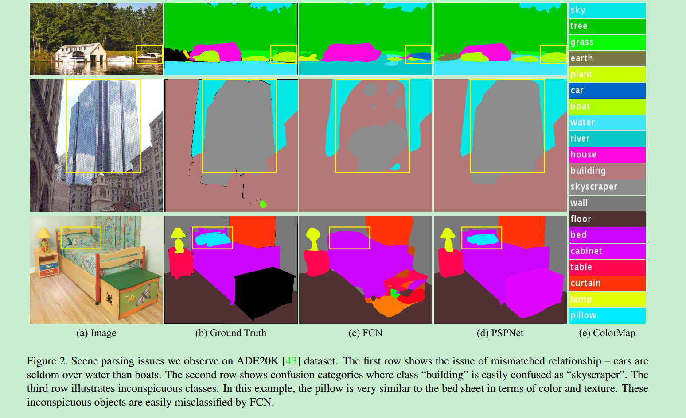
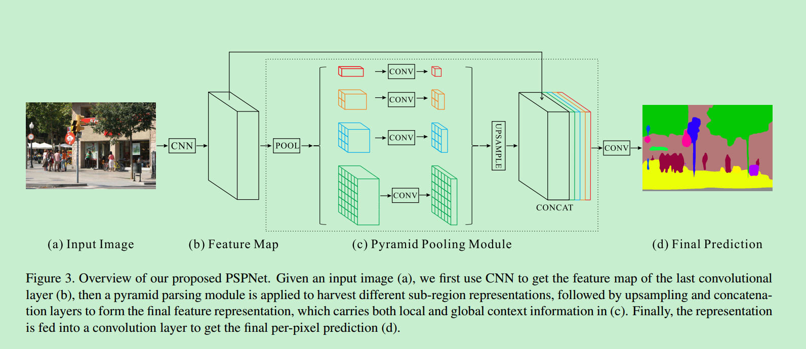
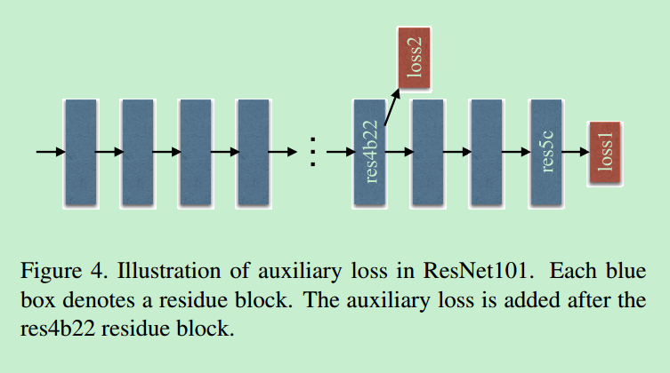
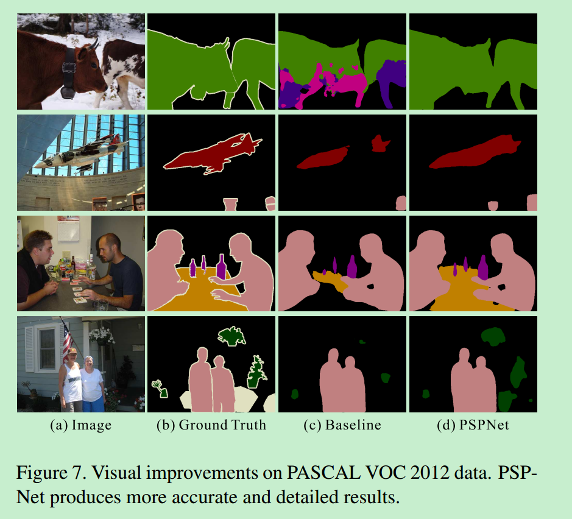
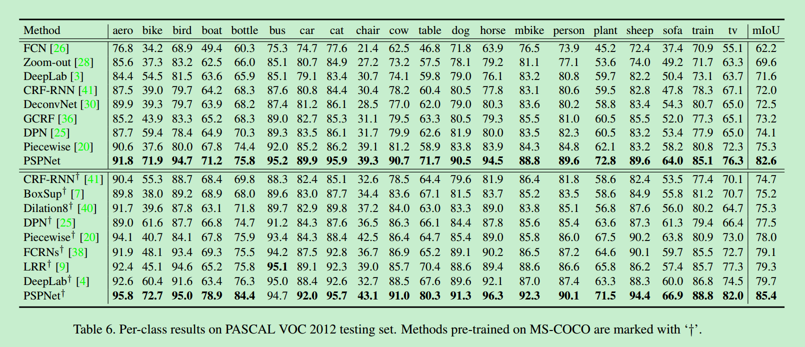

# PSPNet

论文地址：[Pyramid Scene Parsing Network](https://arxiv.org/abs/1612.01105)

发表日期：Submitted on 4 Dec 2016 ([v1](https://arxiv.org/abs/1612.01105v1)), last revised 27 Apr 2017 (this version, v2)

## 创新点

1. 提出金字塔场景解析网络（pyramid scene parsing network ，PSPNet），通过不同区域的上下文信息整合来得到全局上下文信息（global context information）。
2. 使用一种有效的优化策略： deeply supervised loss（实际上就是中继监督策略）。

## 思想

PSPNet的提出是用于复杂场景解析的（scene parsing），场景解析实际上就是语义分割，只不过场景解析场景比较复杂，物体的类别也比较多，因此场景解析的任务也比较难。

作者在文中提出，FCN类方法在复杂场景和unrestricted vocabulary的情况下，仍然存在一些问题。比如：

> 物体具有相似的表面，这个导致很难判断。比如下图的第一行，船被错误地预测为车。但是，如果这种场景下能有“河流”的上下文信息，可能就不至于判断错误。因此，上下文信息在复杂场景中对物体的识别是非常重要的。

因此，为了更准确的场景理解，就需要更多的场景上下文信息。而作者发现，FCN类方法很多都缺乏利用全局场景类别信息的策略（lack of suitable strategy to utilize global scene category clues）。  [Spatial pyramid pooling](https://hal.archives-ouvertes.fr/file/index/docid/548585/filename/cvpr06_lana.pdf) 和 [Spatial pyramid pooling network](https://arxiv.org/pdf/1406.4729.pdf) 在这方面有些尝试。不同于这些方法，本文提出了金字塔场景解析网络（PSPNet），可以更好地整合全局特征。PSPNet使用了global clues和local clues，使得结果更为准确。

除此之外，本文还提出了一种称为deeply supervised loss的优化方法。

## 观察

作者观察了FCN类方法在场景解析中失败的一些例子，正是受这些观察的启发，作者提出了PSPNet。

主要有三点：

1. Mismatched relationship

上下文关系（context relationship）对于复杂场景解析来说是非常重要的。举个例子，飞机要么在天上飞，要么在飞机场上跑，但不可能在一个公路上。对于第一行中的例子，FCN将船预测成car，但如果能知道car几乎不可能在水上这个信息的话，就不会预测错误。

2. Confusion categories

在ADE20K数据集中存在很多类别很模糊的类，比如说field和earth，mountain和hill，wall，housebuilding和skyscraper。比如下图2中，摩天大楼就被FCN一部分预测为building，一部分预测为skyscraper。通过利用类别之间的相关关系可以得到解决。

3. Inconspicuous Classes

场景中包含任意大小的物体，一些小尺寸、不显著(Inconspicuous)的物体很难被发现，比如路灯和信号牌等。而，大尺寸的物体可能会超出FCN的接受野，导致预测结果不连续(discontinuous)。如上图中的第三行，pillow(枕头) 和 sheet(床单) 外形比较相似，Overlooking the global scene category may fail to parse the pillow（不知怎么翻译）。因此，为了能较好的考虑不同尺寸大小的物体，需要特别注意包含不显著物体的不同子区域。

## 模型

网络模型细节：

1. 用CNN网络提取图片特征，得到最后一层的卷积层的feature map（b）。骨架网络的选择是多样的，不过这篇文章中作者选择的是ResNet架构。

2. 然后通过空间金字塔进行pool。pool之后的feature map通道比较大，因此通过1x1的卷积进行降维处理。此时得到的feature map尺寸是不一样的，因此通过上采样方法将它们的尺寸变成一样，最后进行concat就得到了包含局部上下文信息和全局上下文信息的特征表达。

   （c）中红色部分代表global pooling，捕获的是 global contextual prior。2x2、3x3、6x6捕获的是不同尺度sub-regions contextual prior

3. 将2得到的结果输入到最后的卷积层中进行预测。最后得到的结果是原图的1/8。因此在测试的时候还要经过上采样得到最后的分割图。

特征金字塔融合了四种尺度的特征。

注意一点：作者说金字塔的层级数和和各个层级的大小是可以修改的。

## 训练

为了更好地训练网络，作者在ResNet的stage4增加了一个附属loss。附属loss可以更好地优化学习。为了平衡两个losss，作者在它们前面添加了权重。

http s://www.cnblogs.com/everyday-haoguo/p/Note-PSPNet.html

## 实验结果

VOC 2012的结果

一些可视化的结果：

和其他方法的比较

