# Fully Convolutional Networks for Surface Defect Inspection in Industrial Environment

## 一、主要贡献

1. 提出了一种用于工业的表面缺陷检测的可复用，高效的二阶段方法。目标是为了达到效率和准确度的平衡。

## 二、动机

缺陷检测的传统方法基本上都是基于特征提取+分类器的思路。这种方法的缺点是需要进行人为的特征提取，繁琐耗时。而目前的深度学习方法可以自动提取特征，因此本文考虑使用深度学习方法来解决缺陷检测的问题。具体来说，考虑到缺陷检测实际上可以当做是语义分割的问题，因此本文提出了一种两阶段的FCN算法，来实现缺陷检测。

## 三、方法

### 假设

在讲具体的方法之前，需要对数据做一个假定：

局部信息或者说缺陷区域的一个小块能够表明缺陷的存在，并且缺陷检测过程和缺陷区域的几何形状没有很大的关系。这个假设意味着缺陷不是一个常规物体，常规物体的几何信息和全局信息在检测中是非常重要的。

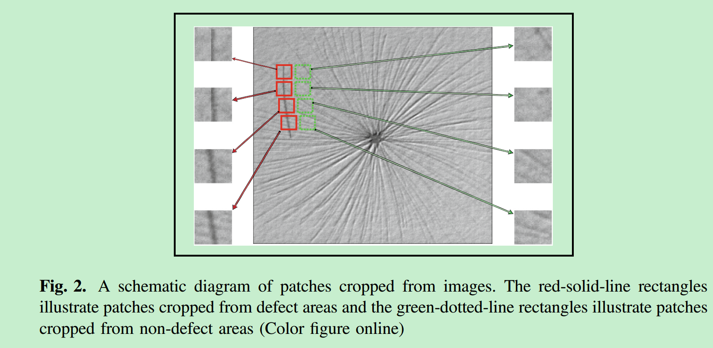

### 数据生成

从原始图像中截取32x32或者64x64大小的图像块，步长分别为16和64。经过这个操作，150张训练图片就可以得到16000张图片。

### 阶段一

阶段一的目标是对缺陷区域（也叫做ROI）进行一个快速但是相对粗糙的检测。ROI的预测结果可以用于阶段二，限制阶段二的搜索范围。最终的目的是为了改善效果。

问题：

如果用一个现成的FCN网络来进行语义分割在缺陷检测的任务中可能并不是合适。因为：

1. FCN是一个比较深的网络，训练的数据量很大，类别很多，但是缺陷检测中通常数据量很少，因此很可能导致过拟合。

2. ImageNet预训练的网络直接迁移到缺陷检测中可能并不合适，因为ImageNet是自然图片，而缺陷图片和自然图片差异通常很大。

基于以上两个考虑，作者提出需要寻找一个合适的网络和合适的训练策略避免过拟合。

FCN架构

FCN网络使用了 ZF的前面4层。训练阶段，使用图像块进行训练，测试阶段，使用整张图像进行测试。

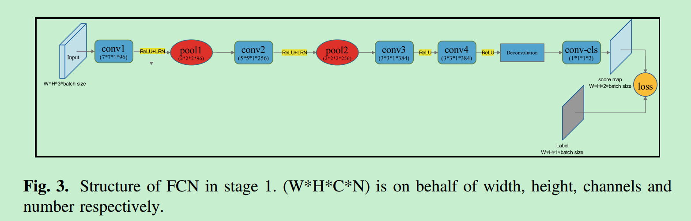

### 阶段二 

**Segmentation Refinement with Instance-Sensitive Patches**

阶段二是对分割结果的微调。第一阶段主要把注意力集中在了局部信息，但是物体级别的信息对分割一个缺陷区域来说也很重要，也就是说，某块区域是不是缺陷区域在缺陷检测中是一个重要的信息。因此阶段2主要在物体级别上去改善阶段一的结果。阶段二热仍然使用阶段一从原始图像上切下来的图像块，但是阶段二的任务是检测这个块是否是缺陷区域而不是分割。因此，训练的时候，图像的label不是分割的label。对那些和整个缺陷区域的重叠度达到n%（本文中n=40）的缺陷区域当做缺陷区域，否则就当做非缺陷区域。

阶段二的网络结构如下图，该网络设置了多损失。网络输出的score map要么全是0要么全是1。

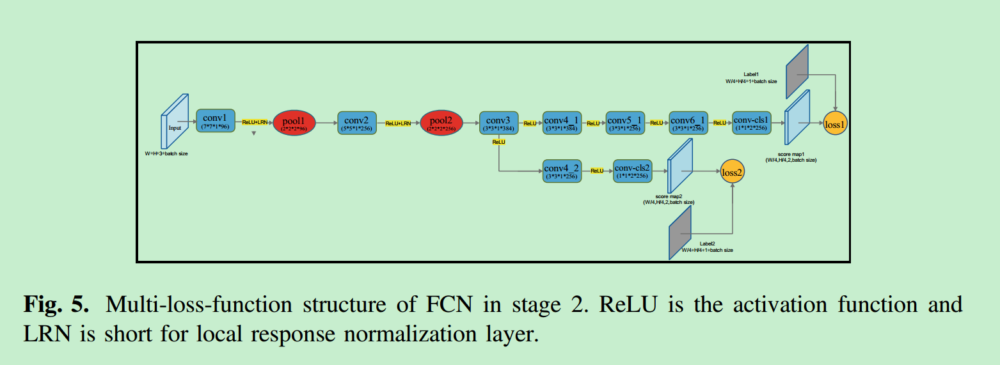

在检测阶段：

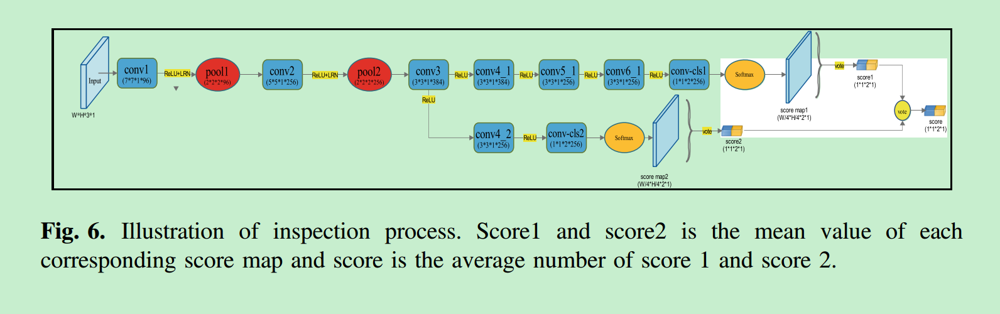

将网络的输出scope map进行平均，得到1x1的输出。再求一次平均，得到最终结果。实际上就是一种多尺度检测的思想。

### 两个阶段的整合

将分割和检测进行整合，得到最终的结果。

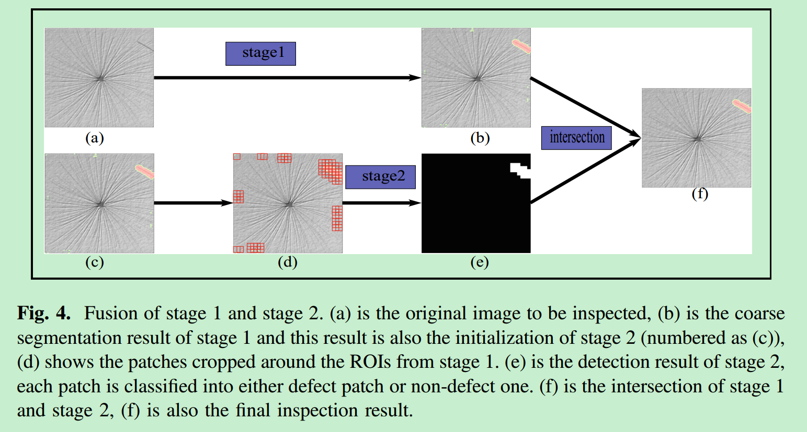

## 四、实验结果

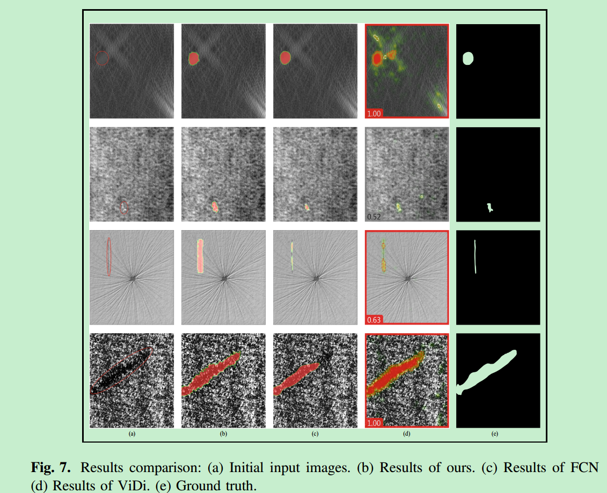

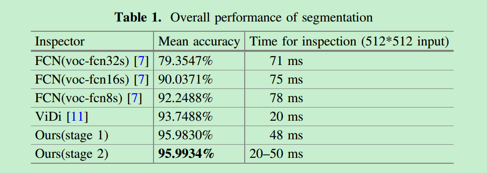

# Vision-Based Defect Detection for Mobile Phone Cover Glass using Deep Neural Networks

## 一、主要内容：

1. 对Mobile Phone Cover Glass进行缺陷检测。
2. 改进的深度学习分割方法用于缺陷检测。

## 二、数据示例

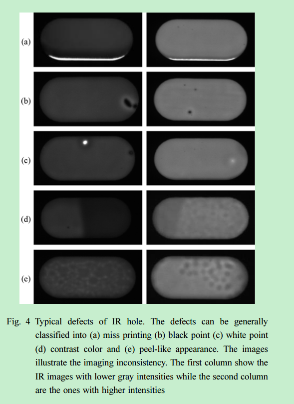

## 三、动机

传统方法很难表达缺陷的形态学和成像不连续性。因此考虑使用深度学习方法。但深度学习方法也有限制，比如：

1. 需要大量数据，因此提出一个数据生成的方法。
2. 采用语义分割进行检测，受到对抗分割思想的启发，本文使用对抗学习设计了一个分割网络，使得结果更有鲁棒性。

## 四、模型

考虑到pooling会降低分辨率，同时为了保持网络的感受野，本文使用Dilated conv进行构建网络。模型的设计如下：

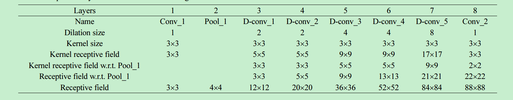

网络的前五层：

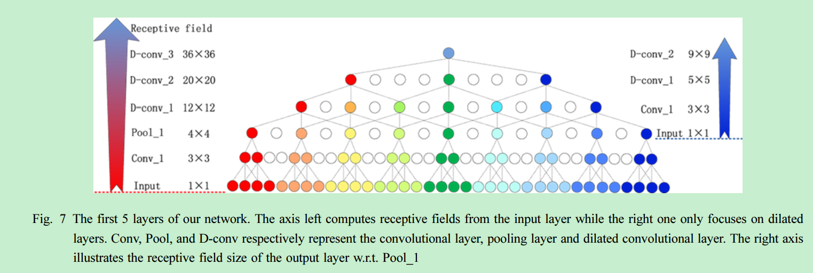

另外，网络输出是二值化的输出，也就是说不分缺陷类型。

## 五、对抗训练

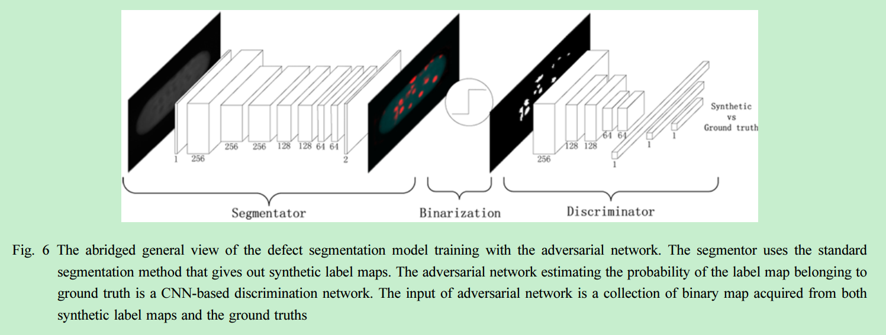

因为分割网络的输出是二值化的，因此损失函数是一个二值交叉熵损失：

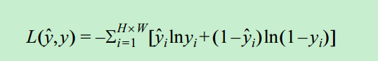

本文的分割架构使用到了对抗分割的思想。

分割模型用S表示，判别器用D表示。S的目标是产生分割结果来欺骗D，而D的目标则是将S的预测和GT区别开来。

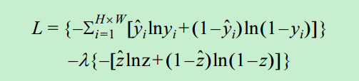

## 六、实验

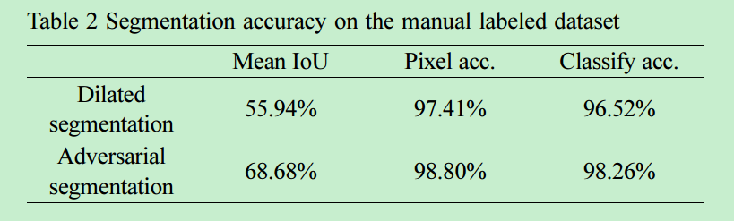

# A Fast Detection Method via Region-Based Fully Convolutional Neural Networks for Shield Tunnel Lining Defects

## 1. 数据

地铁轨道的数据：Tunnel lining defects

数据采集过程：

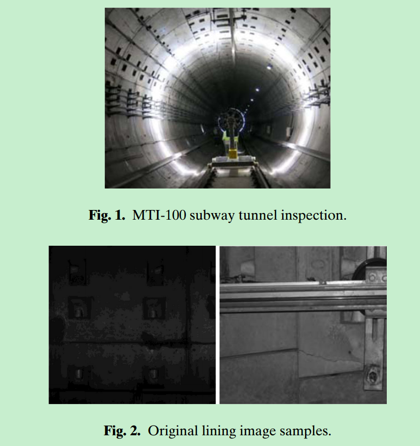

缺陷种类：

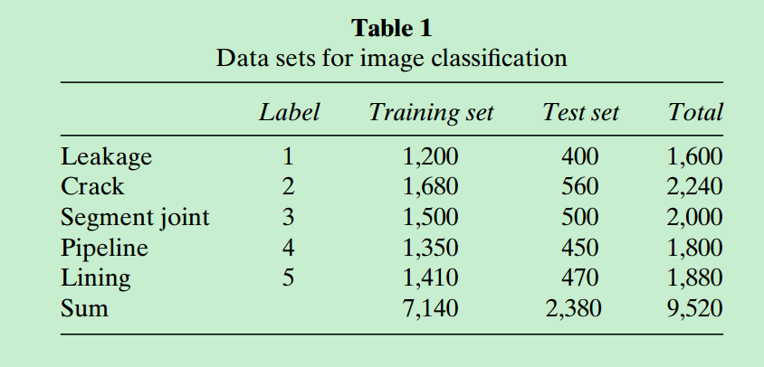

缺陷多样性：

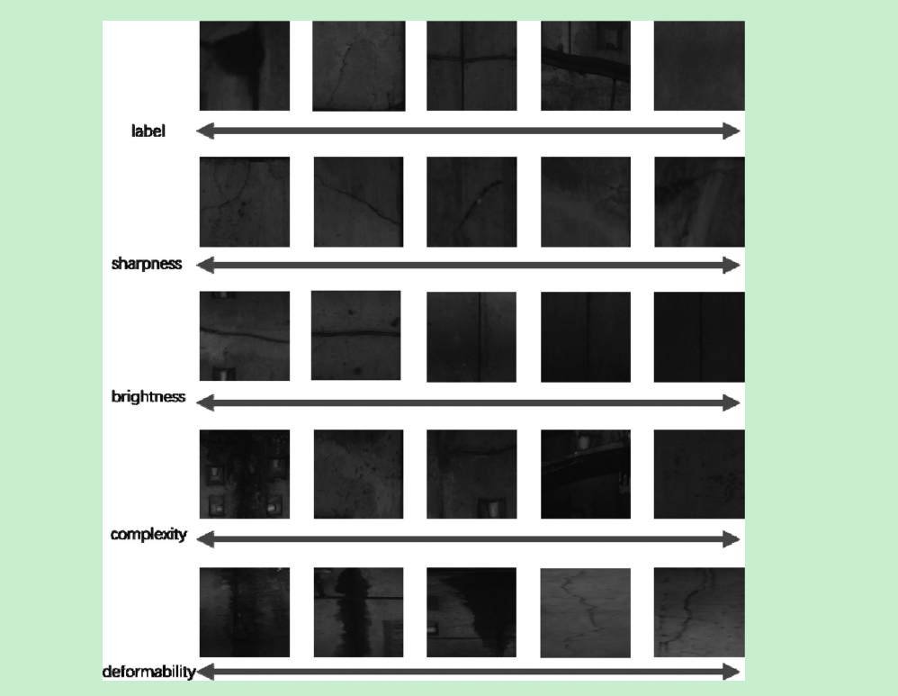

## 2. 检测方法

本文采用R-FCN的方法，另外也和faster RCNN的检测结果进行对比：

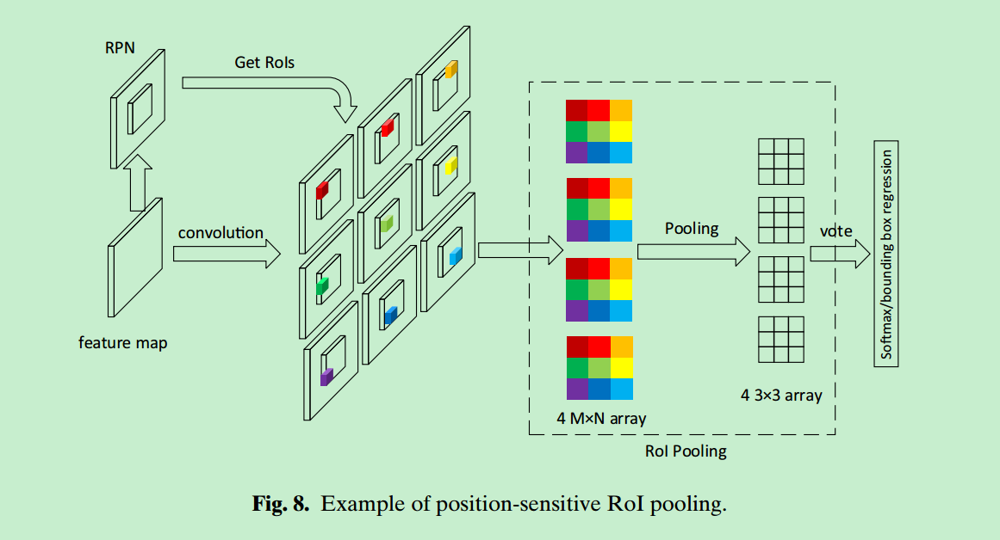

## 3. 实验结果

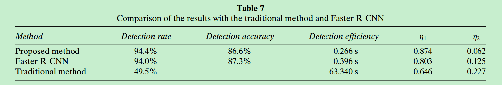

# Automatic Localization of Casting Defects with Convolutional Neural Networks

## 数据

检测元件：金属铸件

图像获取：X-ray

红色框区域表示缺陷区域。

## 模型

Faster RCNN

SSD

R-FCN

## 实验

训练损失：

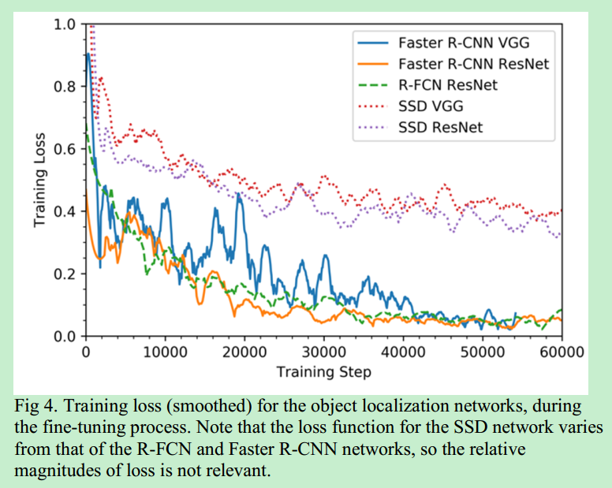

mAP和训练数据集大小的关系

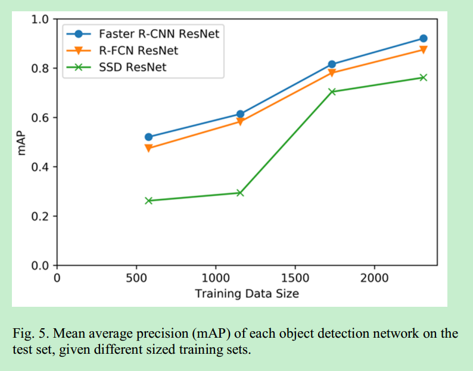

实验结果对比：

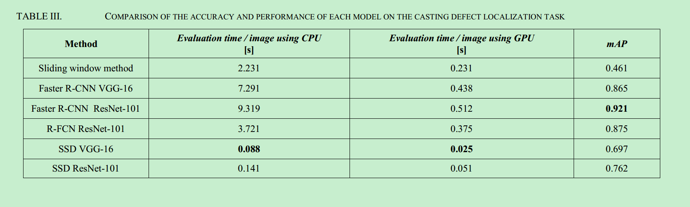

# 其他文章

分类：

A Generic Deep-Learning-Based Approach for Automated Surface Inspection

目标检测：

A New Method in Wheel Hub Surface Defect Detection: Object Detection Algorithm Based on Deep Learning

无监督缺陷分类：

Defects Detection Based on Deep Learning and Transfer Learning