# Object detection

[TOC]

## 一、基本概念

### I.IOU

首先直观上来看 IoU 的计算公式：

由上述图示可知，IoU 的计算综合考虑了交集和并集，如何使得 IoU 最大，需要满足，更大的重叠区域，更小的不重叠的区域。

两个矩形窗格分别表示：

左上点、右下点的坐标联合标识了一块矩形区域（bounding box），因此计算两块 Overlapping 的 bounding boxes 的 IoU 如下：

~~~python
# ((x1[i], y1[i]), (x2[i], y2[i]))
areai = (x2[i]-x1[i]+1)*(y2[i]-y1[i]+1)
areaj = (x2[j]-x1[j]+1)*(y2[j]-y1[j]+1)
xx1 = max(x1[i], x1[j])
yy1 = max(y1[i], y1[j])
xx2 = min(x2[i], x2[j])
yy2 = min(y2[i], y2[j])
h = max(0, yy2-yy1+1)
w = max(0, xx2-xx1+1)
intersection = w * h
iou = intersection / (areai + areaj - intersection)
~~~

### II.NMS

**NMS（non maximum suppression）**，中文名非极大值抑制，在很多计算机视觉任务中都有广泛应用，如：边缘检测、目标检测等。这里主要以人脸检测中的应用为例，来说明NMS。

**人脸检测的一些概念**

1. 绝大部分人脸检测器的核心是分类器，即给定一个尺寸固定图片，分类器判断是或者不是人脸；
2. 将分类器进化为检测器的关键是：在原始图像上从多个尺度产生窗口，并resize到固定尺寸，然后送给分类器做判断。最常用的方法是滑动窗口。

以下图为例，由于滑动窗口，同一个人可能有好几个框(每一个框都带有一个分类器得分)

而我们的目标是一个人只保留一个最优的框：

**于是我们就要用到非极大值抑制，来抑制那些冗余的框：** 抑制的过程是一个迭代-遍历-消除的过程。

1. 将所有框的得分排序，选中最高分及其对应的框：

2. 遍历其余的框，如果和当前最高分框的重叠面积(IOU)大于一定阈值，我们就将框删除。

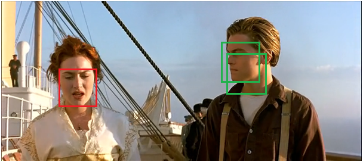

3. 从未处理的框中继续选一个得分最高的，重复上述过程。

参考：[NMS——非极大值抑制](http://blog.csdn.net/shuzfan/article/details/52711706)

mensaochun注：NMS只是对同一个类别的物体做的，不会对不同类别的物体做。

### III.感受野和映射

首先，要明白卷积网络的感受野是怎么计算的，参考中文版文章：[卷积神经网络中的感受野计算（译）](https://zhuanlan.zhihu.com/p/26663577)

以及英文原文[A guide to receptive field arithmetic for Convolutional Neural Networks](https://link.zhihu.com/?target=https%3A//medium.com/%40nikasa1889/a-guide-to-receptive-field-arithmetic-for-convolutional-neural-networks-e0f514068807)

**A guide to receptive field arithmetic for Convolutional Neural Networks**

The **receptive field** is perhaps one of the most important concepts in Convolutional Neural Networks (CNNs) that deserves more attention from the literature. All of the state-of-the-art object recognition methods design their model architectures around this idea. However, to my best knowledge, currently there is no complete guide on how to calculate and visualize the receptive field information of a CNN. This post fills in the gap by introducing a new way to visualize feature maps in a CNN that exposes the receptive field information, accompanied by a complete receptive field calculation that can be used for any CNN architecture. I’ve also implemented a simple program to demonstrate the calculation so that anyone can start computing the receptive field and gain better knowledge about the CNN architecture that they are working with.

To follow this post, I assume that you are familiar with the CNN concept, especially the convolutional and pooling operations. You can refresh your CNN knowledge by going through the paper “[A guide to convolution arithmetic for deep learning](https://arxiv.org/pdf/1603.07285.pdf) [1]”. It will not take you more than half an hour if you have some prior knowledge about CNNs. This post is in fact inspired by that paper and uses similar notations.

> Note: If you want to learn more about how CNNs can be used for Object Recognition, [this post](https://medium.com/@nikasa1889/the-modern-history-of-object-recognition-infographic-aea18517c318) is for you.

**The fixed-sized CNN feature map visualization**

*The ***receptive field*** is defined as the region in the input space that a particular CNN’s feature is looking at (i.e. be affected by)*. A receptive field of a feature can be fully described by its center location and its size. Figure 1 shows some receptive field examples. By applying a convolution C with kernel size** k =3x3**, padding size **p = 1x1**, stride **s = 2x2** on an input map **5x5**, we will get an output feature map **3x3 **(green map). Applying the same convolution on top of the 3x3 feature map, we will get a **2x2** feature map (orange map). The number of output features in each dimension can be calculated using the following formula, which is explained in detail in [[1](https://arxiv.org/pdf/1603.07285.pdf)].

Note that in this post, to simplify things, I assume the CNN architecture to be symmetric, and the input image to be square. So both dimensions have the same values for all variables. If the CNN architecture or the input image is asymmetric, you can calculate the feature map attributes separately for each dimension.

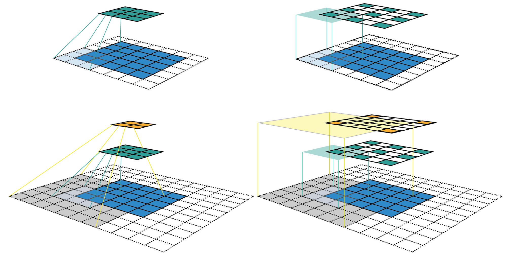

Figure 1: Two ways to visualize CNN feature maps. In all cases, we uses the convolution C with kernel size k = 3x3, padding size p = 1x1, stride s = 2x2. (Top row) Applying the convolution on a 5x5 input map to produce the 3x3 green feature map. (Bottom row) Applying the same convolution on top of the green feature map to produce the 2x2 orange feature map. (Left column) The common way to visualize a CNN feature map. Only looking at the feature map, we do not know where a feature is looking at (the center location of its receptive field) and how big is that region (its receptive field size). It will be impossible to keep track of the receptive field information in a deep CNN. (Right column) The fixed-sized CNN feature map visualization, where the size of each feature map is fixed, and the feature is located at the center of its receptive field.

The left column of Figure 1 shows a common way to visualize a CNN feature map. In that visualization, although by looking at a feature map, we know how many features it contains. It is impossible to know where each feature is looking at (the center location of its receptive field) and how big is that region (its receptive field size). The right column of Figure 1 shows the fixed-sized CNN visualization, which solves the problem by keeping the size of all feature maps constant and equal to the input map. Each feature is then marked at the center of its receptive field location. Because all features in a feature map have the same receptive field size, we can simply draw a bounding box around one feature to represent its receptive field size. We don’t have to map this bounding box all the way down to the input layer since the feature map is already represented in the same size of the input layer. Figure 2 shows another example using the same convolution but applied on a bigger input map — 7x7. We can either plot the fixed-sized CNN feature maps in 3D (Left) or in 2D (Right). Notice that the size of the receptive field in Figure 2 escalates very quickly to the point that the receptive field of the center feature of the second feature layer covers almost the whole input map. This is an important insight which was used to improve the design of a deep CNN.

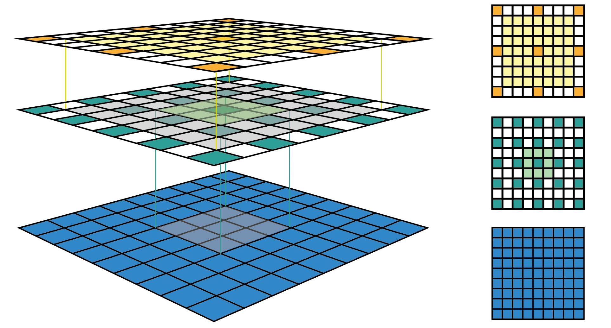Figure 2: Another fixed-sized CNN feature map representation. The same convolution C is applied on a bigger input map with i = 7x7. I drew the receptive field bounding box around the center feature and removed the padding grid for a clearer view. The fixed-sized CNN feature map can be presented in 3D (Left) or 2D (Right).

**Receptive Field Arithmetic**

To calculate the receptive field in each layer, besides the number of features **n **in each dimension, we need to keep track of some extra information for each layer. These include the current receptive field size **r , **the distance between two adjacent features (or jump)  $j$, and the center coordinate of the upper left feature (the first feature) **start**. Note that the center coordinate of a feature is defined to be the center coordinate of its receptive field, as shown in the fixed-sized CNN feature map above. When applying a convolution with the kernel size **k**, the padding size **p**, and the stride size **s**, the attributes of the output layer can be calculated by the following equations:

- The **first equation **calculates the **number of output features** based on the number of input features and the convolution properties. This is the same equation presented in [[1](https://arxiv.org/pdf/1603.07285.pdf)].
- The **second equation** calculates the **jump **in the output feature map, which is equal to the jump in the input map times the number of input features that you jump over when applying the convolution (the stride size).
- The **third equation** calculates the **receptive field size** of the output feature map, which is equal to the area that covered by **k **input features $(k-1)*j_{in}$ plus the extra area that covered by the receptive field of the input feature that on the border.
- The **fourth equation** calculates the **center position** of the receptive field of the first output feature, which is equal to the *center position of the first input feature* plus the distance from the location of the first input feature to the center of the first convolution $(k-1)/2*j_{in}$ minus the padding space $p*j_{in}$. Note that we need to multiply with the jump of the input feature map in both cases to get the actual distance/space.

The first layer is the input layer, which always has **n = image size**, **r = 1**, **j = 1**, and **start = 0.5. **Note that in Figure 3, I used the coordinate system in which the center of the first feature of the input layer is at 0.5. By applying the four above equations recursively, we can calculate the receptive field information for all feature maps in a CNN. Figure 3 shows an example of how these equations work.

Figure 3: Applying the receptive field calculation on the example given in Figure 1. The first row shows the notations and general equations, while the second and the last row shows the process of applying it to calculate the receptive field of the output layer given the input layer information.

I’ve also created a small python program that calculates the receptive field information for all layers in a given CNN architecture. It also allows you to input the name of any feature map and the index of a feature in that map, and returns the size and location of the corresponding receptive field. The following figure shows an output example when we use the AlexNet. The code is provided at the end of this post.

~~~python
# [filter size, stride, padding]
#Assume the two dimensions are the same
#Each kernel requires the following parameters:
# - k_i: kernel size
# - s_i: stride
# - p_i: padding (if padding is uneven, right padding will higher than left padding; "SAME" option in tensorflow)
# 
#Each layer i requires the following parameters to be fully represented: 
# - n_i: number of feature (data layer has n_1 = imagesize )
# - j_i: distance (projected to image pixel distance) between center of two adjacent features
# - r_i: receptive field of a feature in layer i
# - start_i: position of the first feature's receptive field in layer i (idx start from 0, negative means the center fall into padding)

import math
convnet =   [[11,4,0],[3,2,0],[5,1,2],[3,2,0],[3,1,1],[3,1,1],[3,1,1],[3,2,0],[6,1,0], [1, 1, 0]]
layer_names = ['conv1','pool1','conv2','pool2','conv3','conv4','conv5','pool5','fc6-conv', 'fc7-conv']
imsize = 227

def outFromIn(conv, layerIn):
  n_in = layerIn[0]
  j_in = layerIn[1]
  r_in = layerIn[2]
  start_in = layerIn[3]
  k = conv[0]
  s = conv[1]
  p = conv[2]
  
  n_out = math.floor((n_in - k + 2*p)/s) + 1
  actualP = (n_out-1)*s - n_in + k 
  pR = math.ceil(actualP/2)
  pL = math.floor(actualP/2)
  
  j_out = j_in * s
  r_out = r_in + (k - 1)*j_in
  start_out = start_in + ((k-1)/2 - pL)*j_in
  return n_out, j_out, r_out, start_out
  
def printLayer(layer, layer_name):
  print(layer_name + ":")
  print("\t n features: %s \n \t jump: %s \n \t receptive size: %s \t start: %s " % (layer[0], layer[1], layer[2], layer[3]))
 
layerInfos = []
if __name__ == '__main__':
#first layer is the data layer (image) with n_0 = image size; j_0 = 1; r_0 = 1; and start_0 = 0.5
  print ("-------Net summary------")
  currentLayer = [imsize, 1, 1, 0.5]
  printLayer(currentLayer, "input image")
  for i in range(len(convnet)):
    currentLayer = outFromIn(convnet[i], currentLayer)
    layerInfos.append(currentLayer)
    printLayer(currentLayer, layer_names[i])
  print ("------------------------")
  layer_name = raw_input ("Layer name where the feature in: ")
  layer_idx = layer_names.index(layer_name)
  idx_x = int(raw_input ("index of the feature in x dimension (from 0)"))
  idx_y = int(raw_input ("index of the feature in y dimension (from 0)"))
  
  n = layerInfos[layer_idx][0]
  j = layerInfos[layer_idx][1]
  r = layerInfos[layer_idx][2]
  start = layerInfos[layer_idx][3]
  assert(idx_x < n)
  assert(idx_y < n)
  
  print ("receptive field: (%s, %s)" % (r, r))
  print ("center: (%s, %s)" % (start+idx_x*j, start+idx_y*j))
~~~

## 二、Faster RCNN

笔记源自于[一文读懂Faster R-CNN](https://zhuanlan.zhihu.com/p/31426458)，做了略微的修改。

​	经过R-CNN和Fast R-CNN的积淀，Ross B. Girshick在2016年提出了新的Faster R-CNN，在结构上，Faster R-CNN已经将特征抽取(feature extraction)，proposal提取，bounding box regression(rect refine)，classification都整合在了一个网络中，使得综合性能有较大提高，在检测速度方面尤为明显。

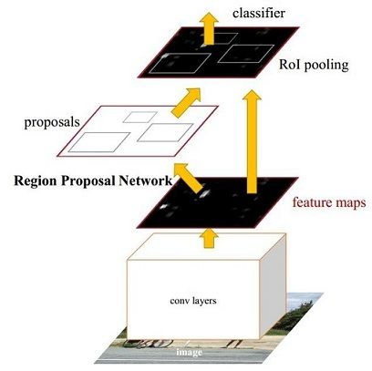

依作者看来，如图1，Faster R-CNN其实可以分为4个主要内容：

1. Conv layers。作为一种CNN网络目标检测方法，Faster R-CNN首先使用一组基础的conv+relu+pooling层提取image的feature maps。该feature maps被共享用于后续RPN层和全连接层。
2. Region Proposal Networks。RPN网络用于生成region proposals。该层通过softmax判断anchors属于foreground或者background，再利用bounding box regression修正anchors获得精确的proposals。
3. Roi Pooling。该层收集输入的feature maps和proposals，综合这些信息后提取proposal feature maps，送入后续全连接层判定目标类别。
4. Classification。利用proposal feature maps计算proposal的类别，同时再次bounding box regression获得检测框最终的精确位置。

所以本文以上述4个内容作为切入点介绍Faster R-CNN网络。

​	图2 faster_rcnn_test.pt网络结构 （pascal_voc/VGG16/faster_rcnn_alt_opt/faster_rcnn_test.pt）

​	图2展示了python版本中的VGG16模型中的faster_rcnn_test.pt的网络结构，可以清晰的看到该网络对于一副任意大小PxQ的图像，首先缩放至固定大小MxN，然后将MxN图像送入网络；而Conv layers中包含了13个conv层+13个relu层+4个pooling层；RPN网络首先经过3x3卷积，再分别生成foreground anchors与bounding box regression偏移量，然后计算出proposals；而Roi Pooling层则利用proposals从feature maps中提取proposal feature送入后续全连接和softmax网络作classification（即分类proposal到底是什么object）。

### I.Conv layers

​	Conv layers包含了conv，pooling，relu三种层。如图2，Conv layers部分共有13个conv层，13个relu层，4个pooling层。这里有一个非常容易被忽略但是又无比重要的信息，在Conv layers中：

1. 所有的conv层都是：kernel_size=3，pad=1
2. 所有的pooling层都是：kernel_size=2，stride=2

  ​为何重要？在Faster RCNN Conv layers中对所有的卷积都做了扩边处理（pad=1，即填充一圈0），导致原图变为(M+2)x(N+2)大小，再做3x3卷积后输出MxN。正是这种设置，导致Conv layers中的conv层不改变输入和输出矩阵大小。如图3：

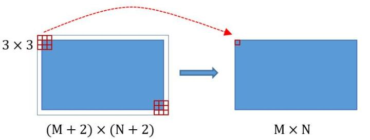
$$
图3
$$
​	

类似的是，Conv layers中的pooling层kernel_size=2，stride=2。这样每个经过pooling层的MxN矩阵，都会变为(M/2)*(N/2)大小。综上所述，在整个Conv layers中，conv和relu层不改变输入输出大小，只有pooling层使输出长宽都变为输入的1/2。那么，一个MxN大小的矩阵经过Conv layers固定变为(M/16)x(N/16)！这样Conv layers生成的featuure map中都可以和原图对应起来。

### II.Region proposal network(RPN)

$$
图4
$$
​	上图4展示了RPN网络的具体结构。可以看到RPN网络实际分为2条线，上面一条通过softmax分类anchors获得foreground和background（检测目标是foreground），下面一条用于计算对于anchors的bounding box regression偏移量，以获得精确的proposal。而最后的Proposal层则负责综合foreground anchors和bounding box regression偏移量获取proposals，同时**剔除太小和超出边界**的proposals。其实整个网络到了Proposal Layer这里，就完成了相当于目标定位的功能。

#### 1.Anchors

​	提到RPN网络，就不能不说anchors。所谓anchors，实际上就是一组由rpn/generate_anchors.py生成的矩形。直接运行作者demo中的generate_anchors.py可以得到以下输出：

~~~python
[[ -84.  -40.   99.   55.]
 [-176.  -88.  191.  103.]
 [-360. -184.  375.  199.]
 [ -56.  -56.   71.   71.]
 [-120. -120.  135.  135.]
 [-248. -248.  263.  263.]
 [ -36.  -80.   51.   95.]
 [ -80. -168.   95.  183.]
 [-168. -344.  183.  359.]]
~~~

​	其中每行的4个值[x1,y1,x2,y2]代表矩形左上和右下角点坐标。9个矩形共有3种形状，长宽比为大约为：width:height = [1:1, 1:2, 2:1]三种，如图6。实际上通过anchors就引入了检测中常用到的多尺度方法。

​	注：关于上面的anchors size，其实是根据检测图像设置的。在python demo中，会把任意大小的输入图像reshape成800x600（即图2中的M=800，N=600）。再回头来看anchors的大小，anchors中长宽1:2中最大为352x704，长宽2:1中最大736x384，基本是cover了800x600的各个尺度和形状。

​	那么这9个anchors是做什么的呢？借用Faster RCNN论文中的原图，如图7，**遍历Conv layers计算获得的feature maps，为每一个点都配备这9种anchors作为初始的检测框。**这样做获得检测框很不准确，不用担心，后面还有2次bounding box regression可以修正检测框位置。

解释一下上面这张图的数字。

1. 在原文中使用的是ZF model中，其Conv Layers中最后的conv5层num_output=256，对应生成256张特征图，所以相当于feature map每个点都是256-dimensions
2. 在conv5之后，做了rpn_conv/3x3卷积且num_output=256，相当于每个点又融合了周围3x3的空间信息（猜测这样做也许更鲁棒？反正我没测试），同时256-d不变（如图4和图7中的红框）
3. 假设在conv5 feature map中每个点上有k个anchor（默认k=9），而每个anhcor要分foreground和background，所以每个点由256d feature转化为cls=2k scores；而每个anchor都有[x, y, w, h]对应4个偏移量，所以reg=4k coordinates
4. 补充一点，全部anchors拿去训练太多了，训练程序会在合适的anchors中**随机**选取128个postive anchors+128个negative anchors进行训练（什么是合适的anchors下文5.1有解释）

注意，在本文讲解中使用的VGG conv5 num_output=512，所以是512d，其他类似.....

#### 2.Softmax判定foreground与background

​	一副MxN大小的矩阵送入Faster RCNN网络后，到RPN网络变为(M/16)x(N/16)，不妨设W=M/16，H=N/16。在进入reshape与softmax之前，先做了1x1卷积，如图8：

​	该1x1卷积的caffe prototxt定义如下：

~~~protobuf
layer {
  name: "rpn_cls_score"
  type: "Convolution"
  bottom: "rpn/output"
  top: "rpn_cls_score"
  convolution_param {
    num_output: 18   # 2(bg/fg) * 9(anchors)
    kernel_size: 1 pad: 0 stride: 1
  }
}
~~~

​	可以看到其num_output=18，也就是经过该卷积的输出图像为WxHx18大小（注意第二章开头提到的卷积计算方式）。这也就刚好对应了feature maps每一个点都有9个anchors，同时每个anchors又有可能是foreground和background，所有这些信息都保存WxHx(9x2)大小的矩阵。为何这样做？后面接softmax分类获得foreground anchors，也就相当于初步提取了检测目标候选区域box（一般认为目标在foreground anchors中）。

​	那么为何要在softmax前后都接一个reshape layer？其实只是为了便于softmax分类，至于具体原因这就要从caffe的实现形式说起了。在caffe基本数据结构blob中以如下形式保存数据：

~~~yaml
blob=[batch_size, channel，height，width]
~~~

​	对应至上面的保存bg/fg anchors的矩阵，其在caffe blob中的存储形式为[1, 2x9, H, W]。而在softmax分类时需要进行fg/bg二分类，所以reshape layer会将其变为[1, 2, 9xH, W]大小，即单独“腾空”出来一个维度以便softmax分类，之后再reshape回复原状。贴一段caffe softmax_loss_layer.cpp的reshape函数的解释，非常精辟：

~~~protobuf
"Number of labels must match number of predictions; "
"e.g., if softmax axis == 1 and prediction shape is (N, C, H, W), "
"label count (number of labels) must be N*H*W, "
"with integer values in {0, 1, ..., C-1}.";
~~~

​	综上所述，RPN网络中利用anchors和softmax初步提取出foreground anchors作为候选区域。

**mensaochun补充：anchors的label怎么得来的？**

anchors的label通过与原图像的ROI计算IOU来得到。当IOU大于一定阈值的时候就认为该anchor为fg，否则就为bg。yolo也是这种类似的思路。可以参考一下下面这个图。

#### 3.Bounding box regression原理

​	介绍bounding box regression数学模型及原理。如图9所示绿色框为飞机的Ground Truth(GT)，红色为提取的foreground anchors，那么即便红色的框被分类器识别为飞机，但是由于红色的框定位不准，这张图相当于没有正确的检测出飞机。所以我们希望采用一种方法对红色的框进行微调，使得foreground anchors和GT更加接近。

​	对于窗口一般使用四维向量(x, y, w, h)表示，分别**表示窗口的中心点坐标和宽高**。对于图 10，红色的框A代表原始的Foreground Anchors，绿色的框G代表目标的GT，我们的目标是寻找一种关系，使得输入原始的anchor A经过映射得到一个跟真实窗口G更接近的回归窗口G'，即：

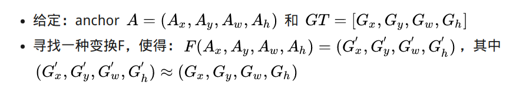

- 先做平移

  

- 再做缩放

  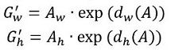

  ​观察上面4个公式发现，需要学习的是$d_{x}(A),d_{y}(A),d_{w}(A),d_{h}(A)$这四个变换。当输入的anchor A与GT相差较小时，可以认为这种变换是一种线性变换， 那么就可以用线性回归来建模对窗口进行微调（注意，只有当anchors A和GT比较接近时，才能使用线性回归模型，否则就是复杂的非线性问题了）。

  ​接下来的问题就是如何通过线性回归获得 $d_{x}(A),d_{y}(A),d_{w}(A),d_{h}(A) $ 了。线性回归就是给定输入的特征向量X, 学习一组参数W, 使得经过线性回归后的值跟真实值Y非常接近，即$Y=WX$。对于该问题，输入X是一张经过卷积获得的feature map，定义为Φ；同时还有训练传入的GT，即$t_{x}, t_{y}, t_{w}, t_{h}$。输出是$d_{x}(A),d_{y}(A),d_{w}(A),d_{h}(A)$四个变换。那么目标函数可以表示为：

​	其中Φ(A)是对应anchor的feature map组成的特征向量，w是需要学习的参数，d(A)是得到的预测值（*表示 x，y，w，h，也就是每一个变换对应一个上述目标函数）。为了让预测值$t_{x}, t_{y}, t_{w}, t_{h}$与真实值差距最小，设计损失函数：

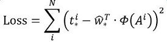

​	函数优化目标为：

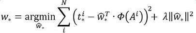

​	需要说明，只有在GT与需要回归框位置比较接近时，才可近似认为上述线性变换成立。

说完原理，对应于Faster RCNN原文，foreground anchor与ground truth之间的平移量 $(t_x, t_y)$ 与尺度因子 $(t_w, t_h) $如下：

​	对于训练bouding box regression网络回归分支，输入是cnn feature Φ，监督信号是Anchor与GT的差距 $(t_x, t_y, t_w, t_h)$，即训练目标是：输入 Φ的情况下使网络输出与监督信号尽可能接近。

​	那么当bouding box regression工作时，再输入Φ时，回归网络分支的输出就是每个Anchor的平移量和变换尺度 $(t_x, t_y, t_w, t_h)$，显然即可用来修正Anchor位置了。

#### 4. 对Proposals进行bounding box regression

​	在了解bounding box regression后，再回头来看RPN网络第二条线路，如图11

~~~protobuf
layer {
  name: "rpn_bbox_pred"
  type: "Convolution"
  bottom: "rpn/output"
  top: "rpn_bbox_pred"
  convolution_param {
    num_output: 36   # 4 * 9(anchors)
    kernel_size: 1 pad: 0 stride: 1
  }
}
~~~

可以看到其num_output=36，即经过该卷积输出图像为WxHx36，在caffe blob存储为[1, 36, H, W]，这里相当于feature maps每个点都有9个anchors，每个anchors又都有4个用于回归的$d_{x}(A),d_{y}(A),d_{w}(A),d_{h}(A)$变换量。

#### 5.Proposal layer

​	Proposal Layer负责综合所有 $d_{x}(A),d_{y}(A),d_{w}(A),d_{h}(A)$变换量和foreground anchors，计算出精准的proposal，送入后续RoI Pooling Layer。还是先来看看Proposal Layer的caffe prototxt定义：

~~~protobuf
layer {
  name: 'proposal'
  type: 'Python'
  bottom: 'rpn_cls_prob_reshape'
  bottom: 'rpn_bbox_pred'
  bottom: 'im_info'
  top: 'rois'
  python_param {
    module: 'rpn.proposal_layer'
    layer: 'ProposalLayer'
    param_str: "'feat_stride': 16"
  }
}
~~~

​	Proposal Layer有3个输入：fg/bg anchors分类器结果rpn_cls_prob_reshape，对应的bbox reg的$d_{x}(A),d_{y}(A),d_{w}(A),d_{h}(A)$变换量rpn_bbox_pred，以及im_info；另外还有参数feat_stride=16，这和图4是对应的。

​	首先解释im_info。对于一副任意大小PxQ图像，传入Faster RCNN前首先reshape到固定MxN，im_info=[M, N, scale_factor]则保存了此次缩放的所有信息。然后经过Conv Layers，经过4次pooling变为WxH=(M/16)x(N/16)大小，其中feature_stride=16则保存了该信息，用于计算anchor偏移量。

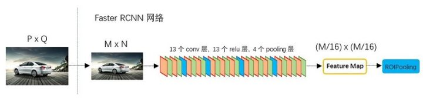

Proposal Layer forward（caffe layer的前传函数）按照以下顺序依次处理：

**mensaochun注：以下过程是预测的步骤，不是训练的步骤。**

1. 生成anchors，利用$d_{x}(A),d_{y}(A),d_{w}(A),d_{h}(A)$对所有的anchors做bbox regression回归（这里的anchors生成和训练时完全一致）
2. 按照输入的foreground softmax scores由大到小排序anchors，提取前pre_nms_topN(e.g. 6000)个anchors，即提取**修正位置后**的foreground anchors。
3. 限定超出图像边界的foreground anchors为图像边界（防止后续roi pooling时proposal超出图像边界）
4. 剔除非常小（width<threshold or height<threshold）的foreground anchors
5. 进行nonmaximum suppression
6. 再次按照nms后的foreground softmax scores由大到小排序fg anchors，提取前post_nms_topN(e.g. 300)结果作为proposal输出。

  之后输出proposal=[x1, y1, x2, y2]，注意，由于在第三步中将anchors映射回原图判断是否超出边界，**所以这里输出的proposal是对应MxN输入图像尺度的**，这点在后续网络中有用。另外我认为，严格意义上的检测应该到此就结束了，后续部分应该属于识别了~

RPN网络结构就介绍到这里，总结起来就是：

生成anchors -> softmax分类器提取fg anchors -> bbox reg回归fg anchors -> Proposal Layer生成proposals

**mensaochun注：注意proposal是对应原图的，不是对应feature map的，因此得到proposal之后，要将其转为到feature map中的proposal，再将其喂给ROI pooling进行进一步的操作！**

### III.ROI Pooling

​	而RoI Pooling层则负责收集proposal，并计算出proposal feature maps，送入后续网络。从图2中可以看到Rol pooling层有2个输入：

1. 原始的feature maps
2. RPN输出的proposal boxes（大小各不相同）

#### 1.为何需要RoI Pooling

​	先来看一个问题：对于传统的CNN（如AlexNet，VGG），当网络训练好后输入的图像尺寸必须是固定值，同时网络输出也是固定大小的vector or matrix。如果输入图像大小不定，这个问题就变得比较麻烦。有2种解决办法：

1. 从图像中crop一部分传入网络
2. 将图像warp成需要的大小后传入网络

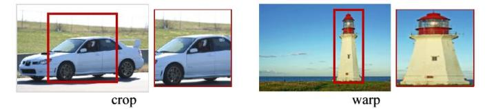

​	两种办法的示意图如图13，可以看到无论采取那种办法都不好，要么crop后破坏了图像的完整结构，要么warp破坏了图像原始形状信息。

​	回忆RPN网络生成的proposals的方法：对foreground anchors进行bounding box regression，那么这样获得的proposals也是大小形状各不相同，即也存在上述问题。所以Faster R-CNN中提出了RoI Pooling解决这个问题。

​	不过RoI Pooling确实是从[Spatial Pyramid Pooling](https://link.zhihu.com/?target=https%3A//arxiv.org/abs/1406.4729)发展而来，但是限于篇幅这里略去不讲，有兴趣的读者可以自行查阅相关论文。

#### 2.RoI Pooling原理

分析之前先来看看RoI Pooling Layer的caffe prototxt的定义： 

~~~protobuf
layer {
  name: "roi_pool5"
  type: "ROIPooling"
  bottom: "conv5_3"
  bottom: "rois"
  top: "pool5"
  roi_pooling_param {
    pooled_w: 7
    pooled_h: 7
    spatial_scale: 0.0625 # 1/16
  }
}
~~~

​	RoI Pooling layer forward过程：在之前有明确提到：proposal=[x1, y1, x2, y2]是对应MxN尺度的，所以首先使用spatial_scale参数将其映射回(M/16)x(N/16)大小的feature maps尺度；之后将每个proposal水平和竖直分为pooled_w和pooled_h份，对每一份都进行max pooling处理。这样处理后，即使大小不同的proposal，输出结果都是7x7大小，实现了fixed-length output（固定长度输出）。

### VI.Classification

​	Classification部分利用已经获得的proposal feature maps，通过full connect层与softmax计算每个proposal具体属于那个类别（如人，车，电视等），输出cls_prob概率向量；同时再次利用bounding box regression获得每个proposal的位置偏移量bbox_pred，用于回归更加精确的目标检测框。Classification部分网络结构如图15。

从PoI Pooling获取到7x7=49大小的proposal feature maps后，送入后续网络，可以看到做了如下2件事：

1. 通过全连接和softmax对proposals进行分类，这实际上已经是识别的范畴了
2. 再次对proposals进行bounding box regression，获取更高精度的rect box

这里来看看全连接层InnerProduct layers，简单的示意图如图16，

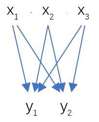

其计算公式如下：

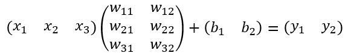

​	其中W和bias B都是预先训练好的，即大小是固定的，当然输入X和输出Y也就是固定大小。所以，这也就印证了之前Roi Pooling的必要性。到这里，我想其他内容已经很容易理解，不在赘述了

### V.训练

​	Faster R-CNN的训练，是在已经训练好的model（如VGG_CNN_M_1024，VGG，ZF）的基础上继续进行训练。实际中训练过程分为6个步骤：

1. 在已经训练好的model上，训练RPN网络，对应stage1_rpn_train.pt

2. 利用步骤1中训练好的RPN网络，收集proposals，对应rpn_test.pt

3. 第一次训练Fast RCNN网络，对应stage1_fast_rcnn_train.pt

4. 第二训练RPN网络，对应stage2_rpn_train.pt

5. 再次利用步骤4中训练好的RPN网络，收集proposals，对应rpn_test.pt

6. 第二次训练Fast RCNN网络，对应stage2_fast_rcnn_train.pt

​        可以看到训练过程类似于一种“迭代”的过程，不过只循环了2次。至于只循环了2次的原因是应为作者提到："A similar alternating training can be run for more iterations, but we have observed negligible improvements"，即循环更多次没有提升了。接下来本章以上述6个步骤讲解训练过程。

mensaochun注：注意RPN网络和fast RCNN网络是共享conv层的，所以需要进行迭代训练。每次训练，conv层的权重都有更新。

#### 1.训练RPN网络

​	在该步骤中，首先读取RBG提供的预训练好的model（本文使用VGG），开始迭代训练。来看看stage1_rpn_train.pt网络结构，如图17。

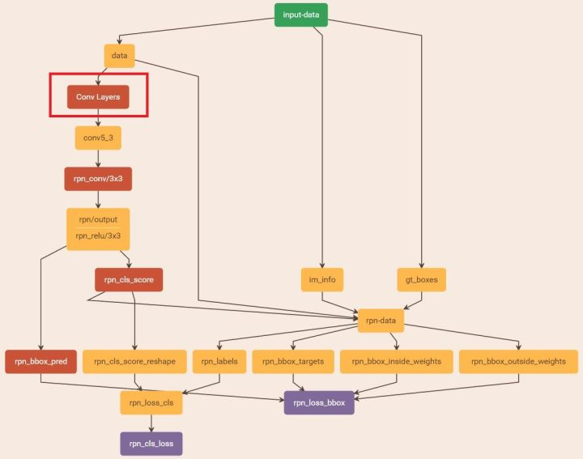

​	图17 stage1_rpn_train.pt（考虑图片大小，Conv Layers中所有的层都画在一起了，如红圈所示，后续图都如此处理）

与检测网络类似的是，依然使用Conv Layers提取feature maps。整个网络使用的Loss如下：

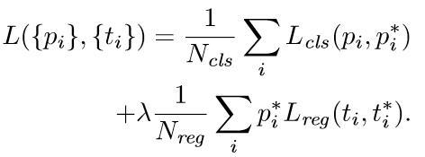

​	上述公式中，i表示anchors index， $p_{i}$ 表示foreground softmax predict概率，$p_{i}^{*}$代表对应的GT predict概率（即当第i个anchor与GT间IoU>0.7，认为是该anchor是foreground，$p_{i}^{*}=1$；反之IoU<0.3时，认为是该anchor是background，$p_{i}^{*}=0$；至于那些0.3<IoU<0.7的anchor则不参与训练）；$t$代表predict bounding box，$t^{*}代$表对应foreground anchor对应的GT box。可以看到，整个Loss分为2部分：

1. cls loss，即rpn_cls_loss层计算的softmax loss，用于分类anchors为forground与background的网络训练
2. reg loss，即rpn_loss_bbox层计算的soomth L1 loss，用于bounding box regression网络训练。注意在该loss中乘了$p_{i}^{*}$，相当于只关心foreground anchors的回归（其实在回归中也完全没必要去关心background）。

  ​由于在实际过程中，$N_{cls}$差距过大，用参数λ平衡二者（如$N_{cls}$=256，$N_{reg}$=2400时设置λ=10），使总的网络Loss计算过程中能够均匀考虑2种Loss。这里比较重要是Lreg使用的soomth L1 loss，计算公式如下：

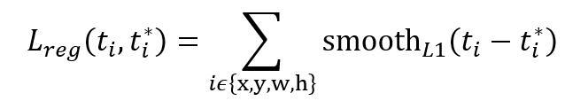

​	了解数学原理后，反过来看图17：

1. 在RPN训练阶段，rpn-data（python AnchorTargetLayer）层会按照和test阶段Proposal层完全一样的方式生成Anchors用于训练

2. 对于rpn_loss_cls，输入的rpn_cls_scors_reshape和rpn_labels分别对应$p$与$p^{*}$ ，Ncls参数隐含在$p$与$p^{*}$的caffe blob的大小中

3. 对于rpn_loss_bbox，输入的rpn_bbox_pred和rpn_bbox_targets分别对应$t$于$t^{*}$，rpn_bbox_inside_weigths对应$p^{*}$，rpn_bbox_outside_weigths未用到（从soomth_L1_Loss layer代码中可以看到），而Nreg同样隐含在caffe blob大小中。

​	这样，公式与代码就完全对应了。特别需要注意的是，在训练和检测阶段生成和存储anchors的顺序完全一样，这样训练结果才能被用于检测！

#### 2 通过训练好的RPN网络收集proposals

​	在该步骤中，利用之前的RPN网络，获取proposal rois，同时获取foreground softmax probability，如图18，然后将获取的信息保存在python pickle文件中。该网络本质上和检测中的RPN网络一样，没有什么区别。

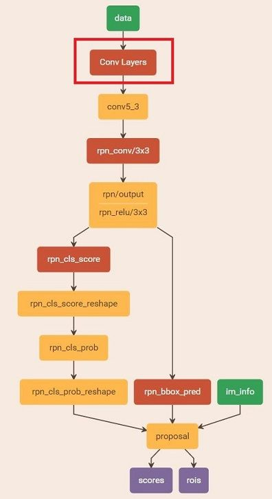

#### 3.训练Faster RCNN网络

读取之前保存的pickle文件，获取proposals与foreground probability。从data层输入网络。然后：

1. 将提取的proposals作为rois传入网络，如图19蓝框
2. 计算bbox_inside_weights+bbox_outside_weights，作用与RPN一样，传入soomth_L1_loss layer，如图19绿框

这样就可以训练最后的识别softmax与最终的bounding box regression了，如图19。

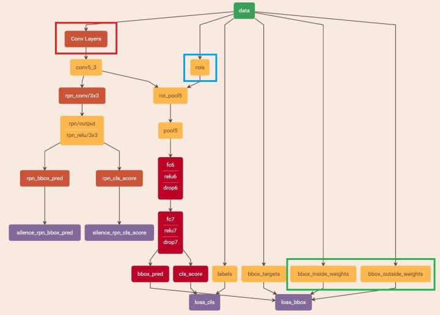

之后的stage2训练都是大同小异，不再赘述了。

Faster R-CNN还有一种end-to-end的训练方式，可以一次完成train，有兴趣请自己看作者GitHub吧。

## 三、YOLO

整个系统如图所示：首先将输入图片resize到448x448，然后送入CNN网络，最后处理网络预测结果得到检测的目标。相比R-CNN算法，其是一个统一的框架，其速度更快，而且Yolo的训练过程也是end-to-end的。

具体来说，Yolo的CNN网络将输入的图片分割成 $S* S$ 网格，然后每个单元格负责去检测那些中心点落在该格子内的目标，如图所示，可以看到狗这个目标的中心落在左下角一个单元格内，那么该单元格负责预测这个狗。

预测分为两部分，bounding box的预测和分类预测。

### I.Bounding box预测

每个单元格会预测 $B$个**边界框**（bounding box）以及**边界框的置信度**（confidence score）。

所谓置信度其实包含两个方面，一是这个边界框含有目标的可能性大小，二是这个边界框的准确度。**前者记为 $Pr(object)$ ，当该边界框是背景时（即不包含目标），此时 $Pr(object)=0$。而当该边界框包含目标时， $Pr(object)=1$。**边界框的准确度可以用预测框与实际框（ground truth）的IOU（intersection over union，交并比）来表征，记为 ${IOU}^{truth}_{pred}$。因此置信度可以定义为 $Pr(object)*\text{IOU}^{truth}_{pred}$ 。很多人可能将Yolo的置信度看成边界框是否含有目标的概率，但是其实它是两个因子的乘积，预测框的准确度也反映在里面。

> **mensaochun注**：加粗部分表述不准确。要分训练和测试两个阶段来看待这个问题。当训练的时候，物体的中心落在该cell，那么此时$Pr(object)$就为1，对应的${IOU}^{truth}_{pred}=1$，此时置信度为1。否则$Pr(object)$就为0，这个时候置信度就为0。这也是训练的时候置信度的label。相反，如果是测试阶段，直接预测得到的实际上只有一个置信度，只是它隐式地包含了$Pr(object)*\text{IOU}^{truth}_{pred}$ 。

边界框的大小与位置可以用4个值来表征： $(x, y,w,h)$，其中 $(x,y)$ 是边界框的中心坐标，而 $w$和 $h $是边界框的宽与高。还有一点要注意，中心坐标的预测值 $(x,y)$ 是相对于每个单元格左上角坐标点的偏移值，并且单位是相对于单元格大小的，单元格的坐标定义如图6所示。而边界框的 $w$和 $h$ 预测值是相对于整个图片的宽与高的比例，这样理论上4个元素的大小应该在 $[0,1]$ 范围。这样，每个边界框的预测值实际上包含5个元素： $(x,y,w,h,c)$，其中前4个表征边界框的大小与位置，而最后一个值是置信度。

> mensaochun注：怎么计算偏移值？按照下图的方式计算。假设原图的大小为`w*h`, grid的size为S*S，某物体中心的坐标为（x,y），且其所在的cell左上角坐标为（a,b），如图箭头指向的cell的坐标为（5,0）。首先，x进行归一化，x/w，即将尺度缩小到[0,1]。然后扩大S倍，xS/w，将尺度扩大到[0,S]。最后，减去cell的横坐标，则得到最终的偏移值。总公式为：(xS/w-a,yS/h-b)。

### II.分类

还有分类问题，对于每一个单元格其还要给出预测出 $C$ 个类别概率值，其表征的是由该单元格负责预测的边界框其目标属于各个类别的概率。**但是这些概率值其实是在各个边界框置信度下的条件概率**（mensaochun注：这个部分表述是不准确的），即 $Pr(class_{i}|object)$ 。值得注意的是，不管一个单元格预测多少个边界框，其只预测一组类别概率值，这是Yolo算法的一个缺点，在后来的改进版本中，Yolo9000是把类别概率预测值与边界框是绑定在一起的。同时，我们可以计算出各个边界框类别置信度（class-specific confidence scores）:$Pr(class_{i}|object)*Pr(object)*\text{IOU}^{truth}_{pred}=Pr(class_{i})*\text{IOU}^{truth}_{pred}$。

> mensaochun注：这里也要分训练阶段和测试阶段来看，如果是训练阶段，首先看cell中是否有物体中心落入，如果有，再看落入的是什么物体，对应的$Pr(class_{i}|object)=1$，否则，相应的$Pr(class_{i}|object)=0$，这里也就体现了条件概率的意义。对于测试阶段， 我们还要将类别概率值乘以置信度。$Pr(class_{i}|object)*Pr(object)*\text{IOU}^{truth}_{pred}=Pr(class_{i})*\text{IOU}^{truth}_{pred}$。which gives us class-specific confidence scores for each box. These scores encode both the probability of that class appearing in the box and how well the predicted box fits the object。个人的理解，公式中应该是联合概率，如：$Pr(class_{i}|object)*Pr(object)*\text{IOU}^{truth}_{pred}=Pr(class_{i}，object)*\text{IOU}^{truth}_{pred}$，表示同时包含物体并且是某一类的可能性。

边界框类别置信度表征的是该边界框中目标属于各个类别的可能性大小以及边界框匹配目标的好坏。后面会说，一般会根据类别置信度来过滤网络的预测框。

总结一下，每个单元格需要预测 $(B*5+C)$个值。如果将输入图片划分为 $S\times S$网格，那么最终预测值为 $S\times S\times (B*5+C)$大小的张量。整个模型的预测值结构如下图所示。对于PASCAL VOC数据，其共有20个类别，如果使用 $S=7,B=2$ ，那么最终的预测结果就是 $7\times 7\times 30$ 大小的张量。在下面的网络结构中我们会详细讲述每个单元格的预测值的分布位置。

### III.网络设计

Yolo采用卷积网络来提取特征，然后使用全连接层来得到预测值。网络结构参考GooLeNet模型，包含24个卷积层和2个全连接层，如图8所示。对于卷积层，主要使用1x1卷积来做channle reduction，然后紧跟3x3卷积。对于卷积层和全连接层，采用Leaky ReLU激活函数： $max(x, 0.1x)$。但是最后一层却采用线性激活函数。

图8 网络结构

可以看到网络的最后输出为 $7\times 7\times 30$ 大小的张量。这和前面的讨论是一致的。这个张量所代表的具体含义如图9所示。对于每一个单元格，前20个元素是类别概率值，然后2个元素是边界框置信度，两者相乘可以得到类别置信度，最后8个元素是边界框的 $(x, y,w,h)$ 。大家可能会感到奇怪，对于边界框为什么把置信度 $c$和 $(x, y,w,h)$ 都分开排列，而不是按照 $(x, y,w,h,c)$这样排列，其实纯粹是为了计算方便，因为实际上这30个元素都是对应一个单元格，其排列是可以任意的。但是分离排布，可以方便地提取每一个部分。这里来解释一下，**首先网络的预测值是一个二维张量 $P$**，其shape为 $[batch, 7\times 7\times 30]$ 。采用切片，那么 $P_{[:,0:7*7*20]}$ 就是类别概率部分，而 $P_{[:,7*7*20:7*7*(20+2)]}$ 是置信度部分，最后剩余部分 $P_{[:,7*7*(20+2):]}$是边界框的预测结果。这样，提取每个部分是非常方便的，这会方面后面的训练及预测时的计算。

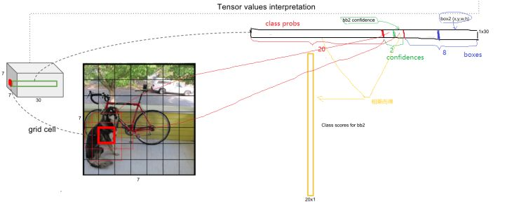

### VI.Loss设计

在训练之前，先在ImageNet上进行了预训练，其预训练的分类模型采用图8中前20个卷积层，然后添加一个average-pool层和全连接层。预训练之后，在预训练得到的20层卷积层之上加上随机初始化的4个卷积层和2个全连接层。由于检测任务一般需要更高清的图片，所以将网络的输入从224x224增加到了448x448。整个网络的流程如下图所示：

图10 Yolo网络流程

下面是训练损失函数的分析，Yolo算法将目标检测看成回归问题，所以采用的是均方差损失函数。但是对不同的部分采用了不同的权重值。首先区分定位误差和分类误差。对于定位误差，即边界框坐标预测误差，采用较大的权重 $\lambda _{coord}=5$。然后其区分不包含目标的边界框与含有目标的边界框的置信度，对于前者，采用较小的权重值 $\lambda _{noobj}=0.5$ 。其它权重值均设为1。然后采用均方误差，其同等对待大小不同的边界框，但是实际上较小的边界框的坐标误差应该要比较大的边界框要更敏感。为了保证这一点，将网络的边界框的宽与高预测改为对其平方根的预测，即预测值变为 $(x,y,\sqrt{w}, \sqrt{h})$。

另外一点时，由于每个单元格预测多个边界框。但是其对应类别只有一个。那么在训练时，如果该单元格内确实存在目标，那么只选择与ground truth的IOU最大的那个边界框来负责预测该目标，而其它边界框认为不存在目标。这样设置的一个结果将会使一个单元格对应的边界框更加专业化，其可以分别适用不同大小，不同高宽比的目标，从而提升模型性能。大家可能会想如果一个单元格内存在多个目标怎么办，其实这时候Yolo算法就只能选择其中一个来训练，这也是Yolo算法的缺点之一。要注意的一点时，对于不存在对应目标的边界框，其误差项就是只有置信度，坐标项误差是没法计算的。而只有当一个单元格内确实存在目标时，才计算分类误差项，否则该项也是无法计算的。

综上讨论，最终的损失函数计算如下：

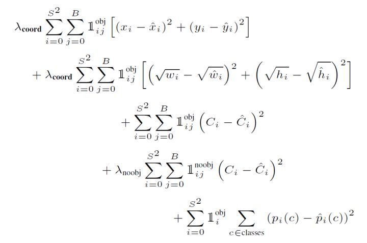

其中第一项是边界框中心坐标的误差项， $1^{obj}_{ij}$指的是第 $i$个单元格存在目标，且该单元格中的第 $j$个边界框负责预测该目标。第二项是边界框的高与宽的误差项。第三项是包含目标的边界框的置信度误差项。第四项是不包含目标的边界框的置信度误差项。而最后一项是包含目标的单元格的分类误差项， $1^{obj}_{i}$ 指的是第$i$个单元格存在目标。

> mensaochun注：
>
> 1.一定要注意一点，就是没有物体的时候，置信度的loss也要算进去。问题是，是否会因为置信度很多都很低，而影响网络呢？
>
> 2.还有另外一点，如果物体都集中在图像的某个部位，其他不出现物体的图像部位，其预测的bounding box的网络就得不到更新，这个会导致问题发生么？

### V.网络预测

下面就来分析Yolo的预测过程，这里我们不考虑batch，认为只是预测一张输入图片。根据前面的分析，最终的网络输出是 $7\times 7 \times 30$ ，但是我们可以将其分割成三个部分：类别概率部分为 $[7, 7, 20]$，置信度部分为 $[7,7,2]$，而边界框部分为 $[7,7,2,4]$（对于这部分不要忘记根据原始图片计算出其真实值）。然后将前两项相乘（矩阵 $[7, 7, 20]$乘以 $[7,7,2]$ 可以各补一个维度来完成 $[7,7,1,20]\times [7,7,2,1]$可以得到类别置信度值为 $[7, 7,2,20]$，这里总共预测了 $7*7*2=98个$边界框。

所有的准备数据已经得到了，那么我们先说第一种策略来得到检测框的结果，我认为这是最正常与自然的处理。首先，对于每个预测框根据类别置信度选取置信度最大的那个类别作为其预测标签，经过这层处理我们得到各个预测框的预测类别及对应的置信度值，其大小都是 ![[7,7,2]](https://www.zhihu.com/equation?tex=%5B7%2C7%2C2%5D) 。一般情况下，会设置置信度阈值，就是将置信度小于该阈值的box过滤掉，所以经过这层处理，剩余的是置信度比较高的预测框。最后再对这些预测框使用NMS算法，最后留下来的就是检测结果。一个值得注意的点是NMS是对所有预测框一视同仁，还是区分每个类别，分别使用NMS。Ng在deeplearning.ai中讲应该区分每个类别分别使用NMS，但是看了很多实现，其实还是同等对待所有的框，我觉得可能是不同类别的目标出现在相同位置这种概率很低吧。

上面的预测方法应该非常简单明了，但是对于Yolo算法，其却采用了另外一个不同的处理思路（至少从C源码看是这样的），其区别就是先使用NMS，然后再确定各个box的类别。其基本过程如图12所示。对于98个boxes，首先将小于置信度阈值的值归0，然后分类别地对置信度值采用NMS，这里NMS处理结果不是剔除，而是将其置信度值归为0。最后才是确定各个box的类别，当其置信度值不为0时才做出检测结果输出。这个策略不是很直接，但是貌似Yolo源码就是这样做的。Yolo论文里面说NMS算法对Yolo的性能是影响很大的，所以可能这种策略对Yolo更好。但是我测试了普通的图片检测，两种策略结果是一样的。

图12 Yolo的预测处理流程

## 四、R2CNN

 