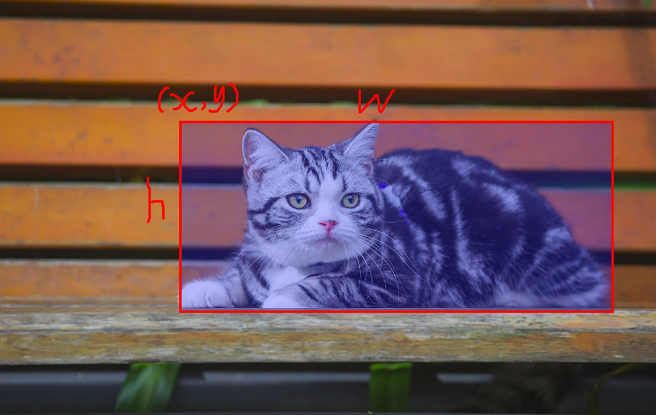

# 一文读懂yolo

yolo算比较旧的算法了，不过近来想整理一下yolo系列算法，所以先从yolo开始整理。本文尽量用最通俗易懂的语言来解释yolo，保证小白也能看得懂。如果有理解不对的地方，欢迎指正。

## 一、yolo思想

其他废话不多少，直接开始讲yolo算法的思想。首先从目标检测的问题开始将起。

### 1. 目标检测存在的问题

首先假设深度学习还没用于目标检测，我们还不知道那么多目标检测算法。

我们先看一下目标检测要做什么事情。目标检测就是要找出图片中物体的边界框（bounding box），比如上图中有一只猫，那我们要将这只猫用一个矩形框(矩形框可以用左上角坐标(x,y)和矩形的宽高(w，h)来表示）标出来。对于这种任务我们要怎么做？一个很自然的想法就是，我把图片喂给深度网络，让网络学习吐出bounding box的xywh四个值以及图片的类别就好了。这么做貌似是可以的，但是深入一想就知道行不通。如果图片上除了一直猫之外还有一只狗，甚至更多的物体，我们都想把它们框出来，那么这时候网络就不仅仅要输出猫的预测，还有输出其他物体的预测。这个时候我们发现，网络的输出的维度是没办法固定的，图片中存在的物体越多，网络输出的维度就越大。所以这种思路行不通。

### 2. yolo的思想

既然网络的输出需要固定维度的，那么我们能不能设计一个固定维度大小的输出，并且输出的维度足够大，足以囊括图像中的所有物体呢？答案是可以的！yolo就是这么做的。yolo固定维度的办法是把网络的输出划分成网络形状，每个网格都可以输出物体的类别和bounding box的坐标，如下图所示（其实可以预测多个bounding box的类别和confidence，这里只讲思想，所以先忽略这个，后面会详细讲到）。

但问题的关键是，我们怎么知道网格内的cell需要预测图片中的哪个物体呢？这个其实取决于你怎么去设置网络的训练目标，说白一点就是，你要教它去预测哪个物体。具体来说，yolo是这么做的：

将输入图像按照网络的输出网格（比如7x7大小）进行划分，划分之后就有很多小cell（格子）了。我们再看图片中物体的中心是落在哪个cell里面，落在哪个cell哪个cell就负责预测这个物体。比如下图中，狗的中心落在了红色cell内，则这个cell负责预测狗。这么说其实不太好理解，甚至吴恩达在他的课上也说它一开始很难理解yolo是怎么work的，可能被卡的地方就是这里。

实际上，“物体落在哪个cell，哪个cell就负责预测这个物体”可以从两个阶段来看。

1. 训练阶段。在训练阶段，如果物体中心落在这个cell，那么这个时候我就给模型输出的网格中对应的cell打上这个物体的label（包括xywh和类别），也就是说我们是通过这种方式来设置网络训练的label的。换言之，我们在训练阶段，就教会模型的输出网格中的cell要预测图像中的哪个物体。
2. 测试阶段。因为你在训练阶段已经教会了cell去预测中心落在该cell中的物体，那么物体中心落在这个cell上，那么它自然而然就会进行预测这个物体对应的输出（包括xywh和类别）。

所以，以上就是yolo最核心的思想。

## 二、模型

讲完了思想，我们来讲具体的流程。

### 1.模型架构

首先讲网络架构。网络架构没什么好讲的，直接看图就好了。

从图中可以看到，yolo网络的输出的网格是7x7大小的，另外，输出的channel数目为30，表示一个cell内，前20个元素是类别概率值，然后2个元素是边界框置信度，两者相乘可以得到类别置信度，最后8个元素是边界框的 $(x, y,w,h)$ 。也就是说，实际上网络预测两个bounding box。每个bounding box对应自己的xywh和confidence，但分类部分是共享的。

### 2.模型输出的意义

**confidence**

首先看cell预测中condifence这个维度。confidence表示：box包含一个物体的置信度有多高并且该box预测准确度有多大，用公式表示为：$Pr(Object) * IOU^{truth}_{pred}$。这个也要分两个阶段来考虑。

1. 对于训练阶段来说，我们要给confidence打label，那么这个label怎么算? 其实很简单，如果一个物体中心没有落在某个cell之内，那么这个confidence直接就设置为0，反之设置为1（实际上可以这么看，由于在训练阶段box就是我们对物体标注的bounding box，那它当然包含物体，所以p(object)=1,而IOU就是box和box自己算的，也是1。相乘的结果就是1）。
2. 对于预测阶段，实际上我们只是得到了一个confidence的值，并没有得到p(object)和IOU这两项。所以实际上confidence隐式地表示了这两项的乘积。为什么可以隐式地表示这两项的乘积，因为你训练的时候就是这么教它的。

**bounding box**

bounding box的预测包括xywh四个值。xy表示bounding box的中心相对于cell的距离，宽高则是相对于整张图片的。为什么要怎么表示呢？实际上经过这么表示之后，xywh都归一化了，它们的值都是在0-1之间，我们通常做回归问题的时候都会将输出进行归一化，否则可能导致各个输出维度的取值范围差别很大，进而导致训练的时候，网络更关注数值大的维度。因为数值大的维度，算loss相应会比较大，为了让这个loss减小，那么网络就会尽量学习让这个维度loss变小，最终导致区别对待。

**类别**

除此之外，还有一个物体类别，物体类别是一个条件概率。这个怎么理解？也可以分两个阶段来看。

1. 对于训练阶段，也就是打label阶段，我们给这个C打上什么label呢？实际上对于一个cell，只有在它存在某个物体的时候（更准确地说物体的中心落在了这个cell，不过为了表达方便后文都按照cell存在某个物体来表达），那么我们才可能给它打上这个物体的类别label，并设置概率为1。换句话说，这个概率是存在一个条件的，这个条件就是存在物体。
2. 对于测试阶段来说，网络直接输出p(class/object)，就已经可以代表有物体存在的条件下类别概率。但是作者还把这个概率乘上了confidence。

论文中的公式是这样的：

也就是说我们预测的条件概率还要乘以confidence。为什么这么做呢？对于某个cell来说，在预测阶段，即使这个cell不存在物体，也存在一种可能，就是输出的条件概率比较大，假设这个时候confidence的值为0，相乘就变成了0。这个时候反而是很合理的，因为你得确保cell中有物体，你才来算概率。

这个结果同时包括了，box中类别概率x有物体的概率xbox预测的准确率。

训练

最后要讲的是训练阶段的loss。

loss分为5个部分。首先看，我们发现没一项loss前面都有一个指示函数，当该cell中有物体的时候，这一项就为0。也就是说，当cell中存在物体的时候，才会算loss，没有物体就不算loss。注意，当cell不存在物体的时候，它也要计算置信度loss。