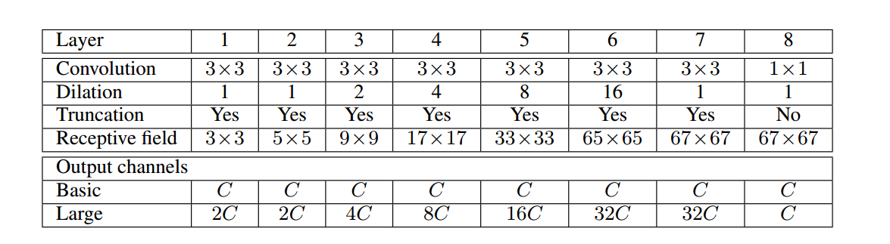
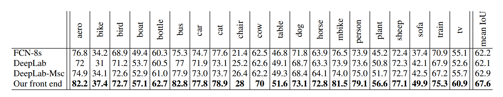

# Multi-Scale Context Aggregation by Dilated Convolutions

## 论文信息

发表时间： 23 Nov 2015

论文地址：[Arxiv Link](https://arxiv.org/abs/1511.07122)

## 创新点

空洞卷积一个很大的优点就是：在指数增长感受野大小的同时还不损失分辨率。因此本文基于空洞卷积，提出了适用于稠密预测（dense prediction）的空洞卷积模块（dilated convolution module），可以系统性地整合上下文信息（context information）同时不损失分辨率。

## 思想

传统的图像分类网络通常通过连续的pooling或其他的下采样层来整合多尺度的上下文信息，这种方式会损失分辨率。而对于稠密预测任务而言，不仅需要多尺度的上下文信息，同时还要求输出具有足够大的分辨率。

为了解决这个问题，过去的论文的做法是：

1. 使用通过反卷积来恢复分辨率，同时通过下采样方法来扩大感受野（感受野越大，所具有的上下文信息越丰富）。对于这种方法，作者提出一个疑问：是否真的需要下采样层？
2. 提供图像的多个重新放缩版本（multiple rescaled verions of the image）作为网络的输入。对于这种方法，作者同样提出一个疑问：对多个重新放缩的图像进行分开分析是否必要？

基于这些疑问，在这篇文章，作者提出了一种新的卷积网络模块，它能够整合多尺度的上下文信息，同时不丧失分辨率，也不需要分析重新放缩的图像。这种模块是为稠密预测专门设计的，没有pooling或其他下采样。它是基于空洞卷积设计的，空洞卷积最大的优点就是可以指数级地扩大感受野，同时还不损失分辨率。

## 基本概念

### 空洞卷积

本文中最核心的概念就是空洞卷积。不过空洞卷积的概念并不是由本文提出的，它最早出现在小波分解算法当中，将空洞卷积应用在卷积网络架构本文也不是最早的。空洞卷积的最大特点就是能够增大感受野，同时还不损失分辨率。

下面看空洞卷积到底是什么。首先看我们都很熟悉的卷积操作，如下动图。

这个卷积操作对原图做了填充（padding=1），卷积核大小为3x3，卷积的步长为2。

下面看空洞卷积：

这个空洞卷积操作的卷积核大小为3x3，空洞率（dilation rate）=2，卷积的步长为1。我们可以看到，标准的卷积操作中，卷积核的元素之间都是相邻的，但是在空洞卷积中，卷积核的元素是间隔的，间隔的大小取决于空洞率。

那为什么空洞卷积能够扩大感受野并且保持分辨率呢？且看下面的这张图。图中红点表示卷积核。蓝色区域表示感受野。

1. 对于a这个feature map而言，它是由卷积核卷积a之前的feature map得来的，这个卷积核大小为3x3，换句话说，卷积核覆盖了卷积之前的feature map区域大小为3x3，因此感受野大小是3x3。
2. 对于b这个feature map而言，b是由a通过空洞卷积而来的，卷积核大小为5x5，因此卷积核覆盖的a区域大小为5x5，但是这个时候感受野大小并不是5x5，因为a中的元素的感受野就已经为3x3了，因此在这个5x5区域要往外多加（3-1）/2=1个像素，如b中红框所示。
3. 同理，对于c而言，卷积核覆盖的b区域大小为9x9，但是由于b中的元素的感受野大小为7x7，如c中红框所示，因此，在这个9x9的区域大小之外还要扩张出（9-1）/2=4个像素。

### 上下文模块（context module）

本文设计了一种基础的上下文模块（basic context module），有7层，每一层都采用具有不同空洞率的3x3空洞卷积，每层的卷积之后跟上relu激活函数。基础的上下文模块根据卷积的通道不同又分为两种形式：basic和large，看下面的表格：

## 网络架构

本文设置了两种网络架构，一种是前端网络，另外一种是前端＋上下文模块网络（如下图）。可见，后者包括了前者。

### 前端（front-end）

上图中fc-final之前的部分称为前端，之后的部分是上下文模块。前端用到的是VGG-16网络，不过将最后两个poooling层移除了，并且随后的卷积层被空洞卷积代替。pool3和pool4之间的空洞卷积的空洞率为2，在pool4之后的空洞卷积的空洞率为4。实际上，只需要前端而不需要前端之后的部分就能够进行稠密预测。下面是前端在VOC-2012数据集与FCN-8s，DeepLab，DeepLab-Msc方法的对比，从下面的表格中可以看出前端网络的效果都比其他几个方法都好。作者认为效果这么好，主要是归因于去除了那些对于分类网络来说是有效设计，但对密集预测算作残留成分（vestigial components ）的部分。

预测效果的可视化：

### 前端模块+上下文模块

除了前端网络，本文还提出前端网络＋上下文模块的架构，也就是网络结构图中的所有部分。由于上下文模块整合了各种不同空洞率的空洞卷积层，因此可以整合各个尺度的上下文信息，预测效果因此得到提升。作者又将前端网络＋上下文模块又分为好几种架构，分别为：

1. Front end+ Basic context module
2. Front end+ large context module
3. Front end+ CRF
4. Front end+ Basic context module+CRF
5. Front end+ large context module+CRF
6. Front end+ CRF-RNN
7. Front end+ Basic context module+CRF-RNN
8. Front end+ large context module+CRF-RNN

CRF和CRF-RNN在本文中并没有详细介绍。只是说用上了它们，效果会更好。各种网络架构在VOC2012上的测试结果如下表格：

另外需要特别注意的是，作者说实验表明，Front end和context module是不能end-to-end训练的，这样训练效果并没有比单单的Front end网络有提升。作者是这样训练的，将Front end训练好了之后，将其输出的feature map喂给context module进行训练。

## 注意点

本文中网络的预测输出是原图大小的1/8，并不是和原图的大小一样。因此需要把网络的预测输出进行插值扩大到和原图的大小一致。据说，这是深度学习图像分割中比较常见的做法。

