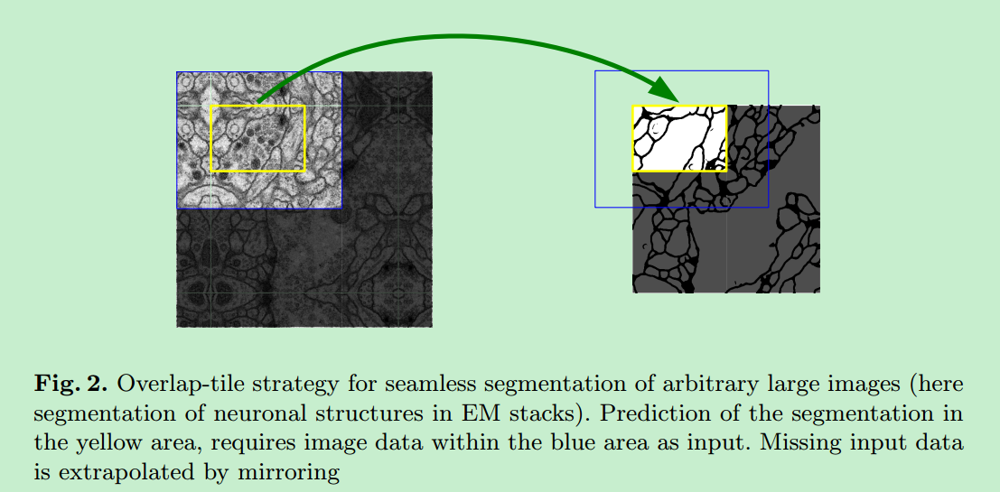

# U-Net

## 论文信息

论文地址：[U-Net: Convolutional Networks for Biomedical Image Segmentation]()

发表时间：18 May 2015

## 创新点

深度网络通常需要大量的数据进行训练，当样本量较少的情况下，深度网络可能表现没那么好。对于这个问题，本文提出了新的网络架构和图像增强策略。网络架构包括encoder和decoder（论文中称为浓缩路径(contracting path)和扩展路径(expanding path)，实际上就是encoder和decoder），encoder可以有效地捕捉上下文信息，而decoder可以较好地预测位置信息。

## 模型

### 1. 模型设计思想

U-net是基于FCN网络的思想设计的，整个网络只有卷积层，而没有全连接层。

在FCN中：网络的浓缩路径，图像分辨率逐渐降低，上下文信息会逐渐增强。在扩展路径中，通过上采样的方式，让特征图的分辨率逐渐增大。同时，为了结合低层feature map的强位置信息，将浓缩路径中的相应部分结合到扩展路径中。这中架构可以较好第进行位置定位。

U-net做的修改有：需要注意的是，这种横向连接是在通道上进行concate。

1. 在上采样部分，feature map的通道数非常大，作者认为这样可以将上下文信息传递到分辨率更高的层当中。这样做的一个结果就是它基本上和浓缩路径对称了，因此看上去像一个U形的结构。
2. 为了预测图像边界区域的像素点，采用overlap-tile策略补全缺失的context。

3. 由于训练数据太少，采用大量弹性形变的方式增强数据。这可以让模型更好学习形变不变性。这种增强方式对于医学图像来说很重要。
4. 在细胞分割任务中的另一个挑战是，如何将同类别的相互接触的目标分开。本文提出了使用一种带权重的损失(weighted loss)。在损失函数中，分割相互接触的细胞像素获得了更大的权重。

### 2. 网络结构

网络结构包括浓缩路径和扩展路径。

浓缩路径：

1. 注意图像输入是经过tile的。因此网络的输出是和图像的输入大小是不一样的。
2. 每经过两个3x3conv（没有padding）之后，会跟上一个2x2的max-pooling进行下采样。

扩展路径：

1. 使用2x2的deconv来进行上采样，上采样的过程中，通道数减半。同时，将上采样的feature map和浓缩路径中相应的feature map进行concatenate（注意：由于浓缩路径中的conv都是没有做padding动作的，这会导致扩展路径中的feature map和浓缩路径中相应位置的feature map大小不一致，这个时候就要将浓缩路径中的feature map进行crop再和扩展路径中的feature map进行concatenate）。
2. **上采样的结果**和**浓缩路径中的相应feature map的裁剪**进行concatenate后，再跟上3x3的卷积。由于浓缩路径中卷积操作是没有padding的，因此feature map在卷积之后会越来越小，之后在扩展路径进行上采样无法恢复相应的分辨率，因此需要裁剪。
3. 最后一层使用1x1的卷积，将通道数map到类别数。

## 训练

### 1. 损失函数计算

网络输出的是pixel-wise的softmax。表达式如下：

其中，$x$为二维平面（$Ω $）上的像素位置，$a_k(x)$表示网络最后输出层中pixel $x$对应的第$k$个通道的值，$K$是类别总数。$p_k(x)$表示像素$x$属于$k$类的概率。

损失函数使用negative cross entropy。cross entropy的数学表达式如下：

其中$p_l(x)$表示$x$在真实label所在通道上的输出概率。需要特别注意的是cross entropy中还添加一个权重项$w(x)$ 。这是因为考虑到物体间的边界需要更多的关注，所对应的损失权重需要更大。

### 2. 像素损失权重计算

在损失函数计算中我们讲到对于边界像素我们给的损失权重要更大，但怎么获取这个权重？

我们得到一张图片的ground truth是一个二值的mask，本文首先采用形态学方法去计算出物体的边界。然后通过以下的表达式去计算权重图。

其中$w_c(x)$是类别权重，需要根据训练数据集中的各类别出现的频率来进行统计，类别出现的频率越高，应该给的权重越低，频率越低则给的权重越高（文章没有详细说是怎么计算的）。$d_1(x)$表示物体像素到最近cell的边界的距离，$d_2(x)$表示物体像素到第二近的cell的边界的距离。在本文中，设置$w_0=10,\sigma=5$。

 ### 3. 图像增强

用到了很多图像增强方法。其中，作者特别强调，在训练数据很少的情况下，任意的弹性形变对网络训练有非常好的帮助。

